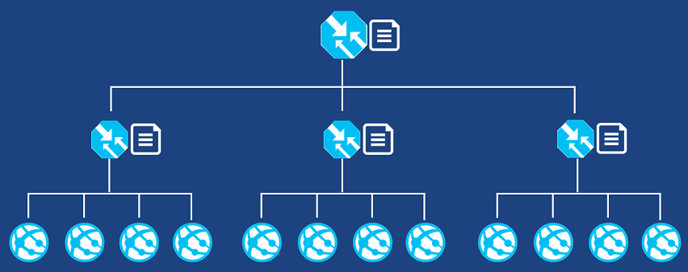

<properties 
   pageTitle="什么是流量管理器 | Windows Azure"
   description="本文将帮助你理解什么是流量管理器及其工作方式。"
   services="traffic-manager"
   documentationCenter=""
   authors="joaoma"
   manager="carmonm"
   editor="tysonn" />
<tags
	ms.service="traffic-manager"
	ms.date="11/12/2015"
	wacn.date="01/21/2016"/>

# 什么是流量管理器？

使用 Windows Azure 流量管理器可以控制向指定的终结点（可能包括 Azure 云服务、 Web 应用和其他终结点）分配用户流量。流量管理器的工作方式是将智能策略引擎应用到对 Internet 资源域名的域名系统 (DNS) 查询。Azure 云服务或 Web 应用可以在世界各地不同的数据中心内运行。

流量管理器可帮助你：

- **提高关键应用程序的可用性** - 使用流量管理器，你可以通过监视 Azure 中的终结点并在某个 Azure 云服务、Azure Web 应用或其他位置出现故障时提供自动故障转移功能来提高关键应用程序的可用性。
- **提高高性能应用程序的响应能力** – Azure 允许你在世界各地的数据中心内运行云服务或 Web 应用。通过将最终用户定向到客户端的网络延迟最低的终结点，流量管理器可以改进你的应用程序的响应能力和内容交付时间。
- **在不停机的情况下执行升级和服务维护** – 流量管理器支持用于混合云和本地部署的扩展方案，包括“迸发到云”、“迁移到云”和“故障转移到云”方案。对于计划内维护，可以在流量管理器中禁用终结点，然后等待终结点完成现有连接服务。当没有更多流量流到终结点时，在该终结点上更新服务并进行测试，然后在流量管理器中重新启用它。这可帮助你在不造成客户端停机的情况下维护和升级服务。
- **大型复杂部署的流量分配** – 使用嵌套的流量管理器配置文件（其中，一个流量管理器配置文件可以将另一个流量管理器配置文件作为终结点），你可以创建配置来优化更大、更复杂部署的性能和分布。有关详细信息，请参阅[嵌套的配置文件](#nested-profiles)。

## 流量管理器的工作方式

在配置流量管理器配置文件时，指定的设置将为流量管理器提供所需的信息来根据 DNS 查询确定应该由哪个终结点为请求提供服务。没有实际的终结点流量会通过流量管理器。

*图 1* 显示了流量管理器如何将用户定向到一组终结点中的一个。图 1 中的数字对应于下面带编号的说明：

**图 1**

1. **指向公司域名的用户流量：**客户端使用公司域名来请求信息。目标是将 DNS 名称解析为 IP 地址。必须通过在流量管理器外部维护的正常 Internet 域名注册保留公司域。在图 1 中，示例公司域为 *www.contoso.com*。
2. **公司域名到流量管理器域名：**公司域的 DNS 资源记录指向在 Azure 流量管理器中维护的流量管理器域名。这是使用一条 CNAME 资源记录来实现的，该记录可将公司域名映射到流量管理器域名。在此示例中，流量管理器域名为 *contoso.trafficmanager.cn*。
3. **流量管理器域名和配置文件：**流量管理器域名是流量管理器配置文件的一部分。用户的 DNS 服务器针对流量管理器域名（在此示例中为 *contoso.trafficmanager.cn*）发送新的 DNS 查询，该查询由流量管理器 DNS 名称服务器接收。
4. **流量管理器配置文件规则已处理：**流量管理器使用指定的流量路由方法和监视状态来确定应该由哪个 Azure 终结点为请求提供服务。
5. **将终结点域名发送给用户：**流量管理器返回一条 CNAME 记录，该记录将流量管理器域名映射到终结点的域名。用户的 DNS 服务器将终结点域名解析为其 IP 地址，并将该地址发送给用户。
6. **用户调用终结点：**用户直接使用返回的终结点的 IP 地址调用该终结点。

由于公司域和解析的 IP 地址已在客户端计算机上缓存，因此，用户将持续与所选终结点交互，直到该终结点的本地 DNS 缓存条目过期。特别要注意的是，DNS 客户端缓存 DNS 主机条目的持续时间就是这些条目的生存时间 (TTL)。从 DNS 客户端缓存中检索主机条目会绕过流量管理器配置文件，如果在 TTL 过期之前终结点变得不可用，则你可能会遇到连接延迟的情况。如果缓存中 DNS 主机条目的 TTL 过期，并且客户端计算机需要再次解析公司域名，则该计算机将发送新的 DNS 查询。根据应用的流量路由方法和请求时终结点的运行状况，客户端计算机可能会收到不同终结点的 IP 地址。

## 如何实施流量管理器

*图 2* 按顺序显示了实施流量管理器所需的步骤。在全面理解流量管理器配置和最佳实践之后，你可以按略有不同的顺序执行这些步骤。图 2 中的数字对应于下面带编号的说明：

**图 2**

1. **将 Azure 云服务、Azure Web 应用或其他终结点部署到生产环境**。在创建流量管理器配置文件时，必须将其与某个订阅关联。然后，在生产环境中为云服务和“标准”层 Web 应用添加属于同一订阅的终结点。如果某一终结点位于过渡环境中而不在 Azure 生产环境中或同一订阅中，则不能将其添加为外部终结点。有关云服务的详细信息，请参阅[云服务](https://msdn.microsoft.com/zh-CN/library/jj155995.aspx)。有关 Web 应用的详细信息，请参阅[ Web 应用](/home/features/web-site/)。
2. **确定流量管理器域的名称**。考虑为域使用带有唯一前缀的名称。域的后半部分（即 trafficmanager.cn）是固定的。有关详细信息，请参阅[最佳实践](#best-practices)。
3. **确定要使用的监视配置**。无论使用哪种流量路由方法，流量管理器都会监视终结点以确保它们联机。在你配置监视设置之后，流量管理器不会将流量定向到监视系统判定为脱机的终结点，除非它检测到所有终结点均已脱机，或无法检测配置文件中包含的任一终结点的状态。有关监视的详细信息，请参阅[流量管理器监视](/documentation/articles/traffic-manager-monitoring)。
4. **确定要使用的流量路由方法**。有三种不同的流量路由方法。请花一些时间了解哪种方法最适合你的要求。如果你以后需要更改方法，随时可以更改。另请注意，每种方法都需要稍微不同的配置步骤。有关流量路由方法的信息，请参阅[关于流量管理器流量路由方法](/documentation/articles/traffic-manager-load-balancing-methods)。
5. **创建配置文件并配置设置**。可以使用 REST API、Windows PowerShell 或管理门户来创建流量管理器配置文件并配置设置。有关详细信息，请参阅[如何配置流量管理器设置](#how-to-configure-traffic-manager-settings)。以下步骤假定你将使用管理门户中的“快速创建”。 
   - **创建流量管理器配置文件** - 若要使用管理门户中的“快速创建”创建配置文件，请参阅[管理流量管理器配置文件](/documentation/articles/traffic-manager-manage-profiles)。
   - **配置流量路由方法设置** – 在“快速创建”期间，你必须为配置文件选择流量路由方法。在完成“快速创建”步骤之后，可以随时更改此设置。有关配置步骤，请参阅与流量路由方法对应的主题：[配置“性能”流量路由方法](/documentation/articles/traffic-manager-configure-performance-load-balancing)、[配置“故障转移”流量路由方法](/documentation/articles/traffic-manager-configure-failover-load-balancing)、[配置“轮循机制”流量路由方法](/documentation/articles/traffic-manager-configure-round-robin-load-balancing)。
   
   >[AZURE.NOTE]“轮循机制”流量路由方法现在支持将网络流量进行加权分布。但是，目前必须使用 REST API 或 Windows PowerShell 配置权重。有关详细信息和示例配置，请参阅 Azure 博客中的 [Azure 流量管理器外部终结点与通过 PowerShell 实施的加权轮循机制](http://azure.microsoft.com/blog/2014/06/26/azure-traffic-manager-external-endpoints-and-weighted-round-robin-via-powershell/)。

   - **配置终结点** – 在“快速创建”期间未配置终结点。在创建配置文件并指定流量路由方法后，必须让流量管理器知道相应的终结点。有关配置终结点的步骤，请参阅[在流量管理器中管理终结点](/documentation/articles/traffic-manager-endpoints)

   - **配置监视设置** – 在“快速创建”期间未配置监视设置。在创建配置文件并指定流量路由方法之后，你必须让流量管理器知道要监视什么。有关配置监视的步骤，请参阅[流量管理器监视](/documentation/articles/traffic-manager-monitoring)。
6. **测试流量管理器配置文件**。测试你的配置文件和域是否按预期工作。有关如何执行此操作的信息，请参阅[测试流量管理器设置](/documentation/articles/traffic-manager-testing-settings)。
7. **将公司域名的 DNS 资源记录指向配置文件以使其生效**。有关详细信息，请参阅[将公司 Internet 域指向流量管理器域](/documentation/articles/traffic-manager-point-internet-domain)。

使用图 1 中的示例，更改服务器上的 DNS 资源记录使其包含以下行，以便将公司域名指向流量管理器域名：
	www.contoso.com IN CNAME contoso.trafficmanager.cn

## 如何配置流量管理器设置

可以使用管理门户、REST API 和 Windows PowerShell cmdlet 来配置流量管理器设置。

虽然并非每个 REST API 元素都在管理门户中可见，但是许多设置使用上述任一方法都可以获得。有关 REST API 用法的详细信息，请参阅[流量管理器上的操作（REST API 参考）](https://msdn.microsoft.com/zh-cn/library/hh758255.aspx)。

有关用于流量管理器的 Windows PowerShell cmdlet 的详细信息，请参阅 [Azure 流量管理器 Cmdlet](https://msdn.microsoft.com/zh-cn/library/dn690250.aspx)。

>[AZURE.NOTE]当前不支持使用管理门户为“轮循机制”流量路由方法和嵌套的配置文件配置外部终结点（类型=“任何”）权重。必须使用 REST（请参阅[创建定义](https://msdn.microsoft.com/zh-cn/library/azure/hh758257.aspx)）或 Windows PowerShell（请参阅 [Add-AzureTrafficManagerEndpoint](https://msdn.microsoft.com/zh-cn/library/azure/dn690257.aspx)）。

### 在管理门户中配置设置

在管理门户中，你可以通过使用“快速创建”创建你的流量管理器配置文件。“快速创建”允许你创建基本的配置文件。在创建配置文件后，可以配置其他设置，或者编辑你以前配置的设置。有关使用“快速创建”来创建你的流量管理器配置文件的详细信息，请参阅[管理流量管理器配置文件](/documentation/articles/traffic-manager-manage-profiles)。

你可以在管理门户中配置以下设置：

- **DNS 前缀** – 你创建的唯一前缀。配置文件按前缀显示在管理门户中。
- **DNS TTL** – DNS 生存时间 (TTL) 值控制客户端本地缓存名称服务器在 Azure 流量管理器 DNS 系统中查询已更新 DNS 条目的频率。
- **订阅** – 选择你的配置文件将对应于的订阅。请注意，仅当你有多个订阅时，才会显示此选项。
- **流量路由方法** – 你希望流量管理器用于处理流量路由的方式。
- **故障转移顺序** – 使用故障转移流量路由方法时终结点的顺序。
- **监视** – 监视设置包含协议（HTTP 或 HTTPS）、端口、相对路径和文件名。

### 通过使用 REST API 配置设置

可以通过使用 REST API 创建和配置流量管理器配置文件。有关详细信息，请参阅[流量管理器上的操作（REST API 参考）](https://msdn.microsoft.com/zh-cn/library/hh758255.aspx)。

- **配置文件** – 配置文件包含你创建的域名前缀。每个配置文件都与你的订阅相对应。你可以为每个订阅创建多个配置文件。配置文件名称在管理门户中是可见的。你所创建的、包含在配置文件中的名称被称为你的“流量管理器域”。
- **定义** – 定义包含策略设置和监视设置。定义与配置文件相对应。每个配置文件只能有一个定义。定义本身在管理门户中不可见，但在管理门户中可以看到定义的许多设置，并可对其进行配置。
- **DNS 选项** – 每个定义都包含 DNS 选项。这是配置 DNS TTL 的位置。
- **监视器** – 每个定义都包含监视设置。这是配置协议、端口、相对路径和文件名的位置。在管理门户中，可以看到监视设置，也可以对其进行配置。有关详细信息，请参阅[流量管理器监视](/documentation/articles/traffic-manager-monitoring)。
- **策略** – 每个定义都包含策略设置。策略是指定流量路由方法和终结点的位置。策略本身在管理门户中不可见，但在管理门户中可以看到策略的某些设置，并可对其进行配置。有关详细信息，请参阅[关于流量管理器流量路由方法](/documentation/articles/traffic-manager-load-balancing-methods)。

## 通过使用 Windows PowerShell 配置设置

可以通过使用 Windows PowerShell 创建和配置流量管理器配置文件。有关详细信息，请参阅 [Azure 流量管理器 Cmdlet](https://msdn.microsoft.com/zh-cn/library/dn690250.aspx)。

## 最佳实践

- **使前缀唯一并易于理解** – 流量管理器配置文件的 DNS 名称必须唯一。你只能控制 DNS 名称的第一部分。流量管理器域名仅用于标识及定向客户端请求。客户端计算机将永远不会向最终用户显示这些名称。但是，配置文件由此域名予以标识，因此，你必须能够快速地将此域名与管理门户中列出的其他域名区分开来。
- **使用点号来增强唯一性或使域名易读** – 也可以使用句点来分隔域名前缀部分。如果计划在流量管理器中创建多个策略，请使用一致的层次结构来区分服务。例如，Contoso 拥有针对 Web、计费和实用工具管理的全局服务。这三个策略应为 *web.contoso.trafficmanager.cn*、*bill.contoso.trafficmanager.cn* 和 *util.contoso.trafficmanager.cn*。设置云服务或 Web 应用时，请使用包含位置的名称。例如，*web-us-contoso.chinacloudapp.cn* 和 *web-asia-contoso.chinacloudapp.cn*。你将受限于 DNS 施加的各种限制。假定一个域名是一个点号分隔的标签序列（“标签.标签.标签.标签.等等”）。截至本文档撰写时，流量管理器中对域名的限制如下：
   - 每个标签最多可以包含 63 个字符。
   - 标签总数不能超过 40 个。因为 trafficmanager.cn 占用两个标签，所以前缀可以使用 38 个。
   - 整个域名最多只能包含 253 个字符。请注意，trafficmanager.cn 占用了这些字符中的 19 个。
- **DNS TTL** – DNS TTL 值控制客户端本地缓存名称服务器在 Azure 流量管理器 DNS 系统中查询已更新 DNS 条目的频率。流量管理器中发生的任何更改（例如，配置文件更改或终结点可用性的更改）都需要经过这么长的时间才能在整个 DNS 服务器全局系统中刷新。建议保持该设置的默认值 300 秒（5 分钟）。指定的数字越大，则 DNS 解析程序和客户端缓存流量管理器 DNS 响应的时间就越长，而这可以减少总体 DNS 查询延迟。但是，如果要求故障转移的速度很快，则最好是配置一个较小的值。
- **终结点应在单个订阅中** – 所有终结点均应在创建配置文件时所在的同一个订阅中。你可以从不同订阅将终结点作为外部终结点添加到配置文件，但当你禁用或删除关联的服务时，Azure 将不会自动删除这些终结点。因此，外部终结点将保留在流量管理器配置文件中，除非你手动删除它们，否则你将继续为它们付费。
- **仅限生产服务** – 只能使用生产环境中的终结点。不能定向到在过渡环境中运行的终结点。请注意，如果你在配置文件定向流量时执行虚拟 IP (VIP) 地址交换，则流量将使用刚刚切换到生产环境中的终结点。
- **为终结点命名时使其能够轻松识别** – 仔细考虑你要使用的 DNS 前缀。之所以使用 DNS 名称，是因为它在订阅中肯定是唯一的，而云服务或 Web 应用的名称不一定唯一。为避免混淆，请为云服务或 Web 应用指定相同或相似的名称和 DNS 前缀。如果云服务和 Web 应用数量超过 20 个，命名不当会导致难以找到正确的终结点。此外，终结点命名不当会导致难以维护配置文件。
- **配置文件中的所有终结点应为相同的操作和端口提供服务** – 如果混用终结点，则客户端调用的终结点将更有可能无法为其请求提供服务。
- **配置文件中的所有云服务都必须使用相同的监视设置** – 只能选择单个路径和文件用于监视给定定义中的所有终结点。可以在“相对路径和文件名”文本框中输入“/”，使监视尝试访问默认路径和文件名。
- **发生临时更改时禁用终结点，而不是更改配置** – 在很多情况下，你可能想要使某个终结点脱机。只需在配置文件中禁用单个终结点，而不必从配置文件中删除相应的终结点。这样，该终结点仍保留在配置文件中，但是，配置文件的行为看起来就像是该终结点不包含在其中一样。这种做法非常适合用于临时删除处于维护模式或者正在重新部署的终结点。在终结点启动并重新运行后，你可以再次启用它。有关详细信息，请参阅[在流量管理器中管理终结点](/documentation/articles/traffic-manager-endpoints)。
- **进行临时更改时禁用配置文件而不删除它** – 你可能希望使整个配置文件脱机，而不是仅使在其中指定的个别终结点脱机。若要做到这一点，请禁用配置文件。禁用某个配置文件时，所有设置都将保留可供你在管理门户中进行编辑，并且当你希望重新使用该配置文件时，可以快速而容易地使其重新联机。有关详细信息，请参阅[在流量管理器中管理终结点](/documentation/articles/traffic-manager-endpoints)。
- **存储** – 使用流量管理器时，需要考虑的一个重要方面是如何设计存储的位置和分布。针对流量管理器设计和部署应用程序时，应考虑端到端事务以及数据将如何流动。
- **SQL Azure** – 与存储设计类似，当你将终结点扩展到多个地理区域时，它可以分析应用程序状态和数据要求。

## 嵌套的配置文件

你可以将另一个流量管理器配置文件的名称指定为终结点，此做法称为嵌套的配置文件。流量管理器配置文件名称是其 DNS 名称，如 contoso-europe.trafficmanager.cn。

这允许你配置流量管理器，使传入的 DNS 名称查询在一组层中进行分析，从而确保将发出请求的客户端定向到正确的终结点集。*图 3* 显示了一个示例。

**图 3**

你最多可以嵌套 10 层，并可以为每个配置文件配置不同的流量路由方法。

例如，你可以为以下内容创建配置：

- 在顶层（映射到外部 DNS 名称的流量管理器配置文件），可以为配置文件配置性能流量路由方法。
- 在中间层，一组流量管理器配置文件表示不同的数据中心，并使用轮循机制流量路由方法。
- 在底层，每个数据中心的一组云服务终结点处理用户的通信请求。

结果就是，在区域范围内根据性能将用户定向到相应的数据中心，并根据相同的或加权的负载分布将用户定向到该数据中心内的云服务。例如，可以使用加权将一小部分流量分配到新部署或试用部署，以便进行测试或获取客户反馈。

*图 4* 显示了该配置。

**图 4**

在*图 4* 中，顶层的流量管理器配置文件是父配置文件，中间层的流量管理器配置文件是子配置文件。

如果流量管理器将用户定向到具有少数正常运行的终结点的子配置文件，则可能会使这些终结点过载，从而导致性能问题。为了防止出现这种情况，可以为父流量管理器配置文件配置正常运行的终结点数的阈值，以确定该父配置文件的子配置文件中的任何终结点是否均可接收流量。例如，如果要确保在子配置文件内至少有三个正常运行的终结点，可将此阈值设为 3。在图 4 的示例中，你将在顶层流量管理器配置文件中配置此阈值。

若要将流量管理器配置文件添加为终结点并配置最小数量的正常运行终结点，必须使用 REST（请参阅[创建定义](https://msdn.microsoft.com/zh-cn/library/azure/hh758257.aspx)）或 Windows PowerShell（请参阅 [Add-AzureTrafficManagerEndpoint](https://msdn.microsoft.com/zh-cn/library/azure/dn690257.aspx)）。而不能使用管理门户。

## 流量管理器图表

如果你需要将本主题中的图表作为自己的流量管理器相关演示文稿的 PowerPoint 内容，或者需要按照自己的意图进行修改，请参阅 [MSDN 文档中的流量管理器图表](http://gallery.technet.microsoft.com/Traffic-Manager-figures-in-887e7c99)。

## 后续步骤

[流量管理器路由方法](/documentation/articles/traffic-manager-routing-methods)

[流量管理器监视](/documentation/articles/traffic-manager-monitoring)

[创建配置文件](/documentation/articles/traffic-manager-manage-profiles)

[Azure 流量管理器 Cmdlet](https://msdn.microsoft.com/zh-cn/library/dn690250.aspx)

<!---HONumber=Mooncake_1221_2015-->