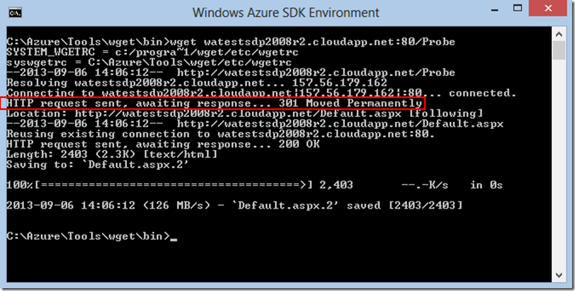

<properties
   pageTitle="Azure 流量管理器上的降级状态故障排除"
   description="如何在流量管理器显示为降级状态时对流量管理器配置文件进行故障排除。"
   services="traffic-manager"
   documentationCenter=""
   authors="kwill-MSFT"
   manager="carmonm"
   editor="joaoma" />

<tags
	ms.service="traffic-manager"
	ms.date="11/12/2015"
	wacn.date="12/31/2015"/>

# Azure 流量管理器上的降级状态故障排除

此页面将介绍如何对显示降级状态的 Azure 流量管理器配置文件进行故障排除，并提供了解流量管理器探测器的一些要点。

你已将流量管理器配置文件配置为指向部分 .chinacloudapp.cn 托管服务，几秒钟后你会看到状态为“已降级”。

如果你访问该配置文件的“终结点”选项卡，会看到一个或多个处于脱机状态的终结点：

## 有关流量管理器探测的重要注意事项

- 如果探测器从探测器路径接收到返回的 200，则流量管理器只会将某个终结点视为联机。
- 30x 重定向（或任何其他非 200 响应）将失败，即使重定向的 URL 返回 200 也是如此。

- 对于 HTTPS 探测器，证书错误将被忽略。
 
- 只要返回 200，就无需在意探测器路径的实际内容。如果实际网站内容没有返回 200（即，如果 ASP 页面重定向到 ACS 登录页面或某些其他 CNAME URL），一种常见的技术是将路径设置为类似于“/favicon.ico”的内容。
 
- 最佳做法是将探测器路径设置为具有足够逻辑来确定站点是启动还是关闭的内容。在上面的示例中，将路径设置为“/favicon.ico”后，只测试 w3wp.exe 是否响应，而不会测试你的网站是否处于正常状态。更好的选择是将路径设置为诸如 “/Probe.aspx” 的内容，且 Probe.aspx 内包含足够的逻辑来确定你的站点是否处于正常状态（即，检查性能计数器以确保你的 CPU 使用率未达到 100%，或确保未在接收大量失败请求，尝试访问诸如数据库或会话状态等资源，以确保应用程序的逻辑正常运行等）。
 
- 如果配置文件中的所有终结点都已降级，流量管理器会将所有终结点视为处于正常状态，并将流量路由到所有终结点。这是为了确保探测机制中导致错误失败探测器的任何潜在问题不会造成服务完全中断。

  

## 故障排除

用于对流量管理器探测器失败进行故障排除的一个工具是 wget。你可以从 [wget](http://gnuwin32.sourceforge.net/packages/wget.htm) 获取二进制文件和依赖项包。请注意，你也可以不使用 wget，而使用 Fiddler 或 curl 等其他程序，总的说来，你只需要显示原始 HTTP 响应的工具。

安装 wget 后，转到命令提示符并对流量管理器中配置的 URL、探测器端口以及路径运行 wget。本例中为 http://watestsdp2008r2.chinacloudapp.cn:80/Probe。

使用 Wget：

 

请注意，wget 显示 URL 返回了到 http://watestsdp2008r2.chinacloudapp.cn/Default.aspx 的 301 重定向。由上述“流量管理器探测的重要注意事项”部分我们可知，流量管理器探测将 30x 重定向视为失败，而这将导致探测器报告脱机状态。此时，很容易检查网站配置并确保从 /Probe 路径返回 200 （或将流量管理器探测器重新配置为指向将返回 200 的路径）。

 

如果你的探测器使用的是 HTTPS 协议，则需要将“--no-check-certificate”参数添加到 wget，以便其忽略 chinacloudapp.cn URL 上的证书不匹配问题。

## 后续步骤

[关于流量管理器流量路由方法](/documentation/articles/traffic-manager-load-balancing-methods)

[什么是流量管理器](/documentation/articles/traffic-manager-overview)

[云服务](https://msdn.microsoft.com/zh-cn/library/jj155995.aspx)

[网站](/home/features/web-site/)

[流量管理器上的操作（REST API 参考）](https://msdn.microsoft.com/zh-cn/library/hh758255.aspx)

[Azure 流量管理器 Cmdlet](https://msdn.microsoft.com/zh-cn/library/dn690250.aspx)
 

<!---HONumber=Mooncake_1221_2015-->