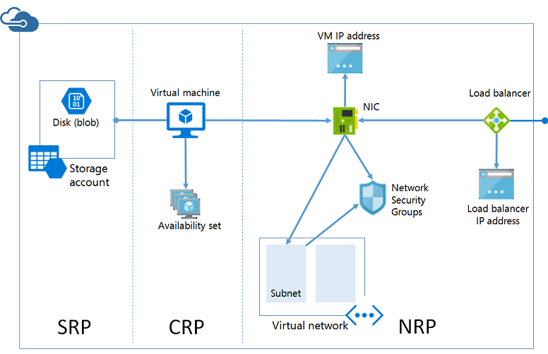
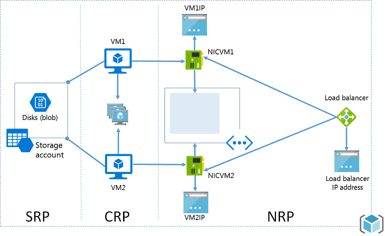

<properties
   pageTitle="Azure 资源管理器体系结构"
   description="了解资源管理器的体系结构和计算、网络、存储资源提供程序之间的关系。"
   services="virtual-machines"
   documentationCenter=""
   authors="davidmu1"
   manager="timlt"
   editor=""
   tags="azure-resource-manager,azure-service-management"/>

<tags
	ms.service="azure-resource-manager"
	ms.date="08/25/2015"
	wacn.date="11/12/2015"/>

# Azure 资源管理器体系结构

[AZURE.INCLUDE [了解部署模型](../includes/learn-about-deployment-models-include.md)]

本文概括介绍了用于创建基于基础结构的应用程序和工作负荷的服务管理和资源管理器体系结构。

## 服务管理的体系结构

在我们讨论 Azure 资源管理器的体系结构和各种资源提供程序之前，让我们回顾一下 Azure 服务管理的当前体系结构。在 Azure 服务管理中，宿主虚拟机的计算、存储或网络资源由以下各项提供：

- 一项必不可少的云服务，用作宿主虚拟机的容器（计算）。虚拟机自动配备一个网络接口卡 (NIC) 并由 Azure 分配的 IP 地址。此外，云服务包含一个外部负载平衡器实例、一个公共 IP 地址以及若干默认终结点，以支持远程桌面、针对 Windows 虚拟机的远程 PowerShell 流量和针对 Linux 虚拟机的 Secure Shell (SSH) 流量。
- 一个必不可少的存储帐户，存储虚拟机的 VHD，包括操作系统、临时文件和附加的数据磁盘（存储）。
- 一个可选的虚拟网络，用作额外的容器，可以在其中创建子网结构并指定虚拟机所在的子网（网络）。

以下是 Azure 服务管理的组件及其关系。

## 资源管理器的体系结构

对于 Azure 资源管理器，资源提供程序对单个资源提供支持，这些资源用于按需要的配置创建正常运行的虚拟机。对于虚拟机，有三个主要的资源提供程序：

- 计算资源提供程序 (CRP)：对虚拟机和可选可用性集的实例提供支持。
- 存储资源提供程序 (SRP)：对所需的存储帐户提供支持，存储帐户存储虚拟机的 VHD，包括其操作系统和其附加的数据磁盘。
- 网络资源提供程序 (NRP)：对所需的 NIC、虚拟机 IP 地址和虚拟网络内的子网及可选的负载平衡器、负载平衡器 IP 地址和网络安全组提供支持。

此外，资源提供程序内各个资源之间还存在相互关系：

- 虚拟机依赖在 SRP 中定义的具体存储帐户，在 Blob 存储中存储其磁盘（必需）。
- 虚拟机引用在 NRP 中定义的具体 NIC（必需）和在 CRP 中定义的可用性集（可选）。
- NIC 引用虚拟机的指定 IP 地址（必需）、虚拟机的虚拟网络的子网（必需）和网络安全组（可选）。
- 虚拟网络内的子网引用网络安全组（可选）。
- 负载平衡器实例引用后端 IP 地址池，包括虚拟机的 NIC（可选），引用负载平衡器的公共或专用 IP 地址（可选）。

资源的组件化为在 Azure 中的 IT 工作负荷配置基础结构时提供了更多的灵活性。Azure 资源管理器模板充分利用此灵活性来创建具体配置所需的从属资源集合。在执行模板时，资源管理器确保以正确的顺序创建某个配置的资源以保证依存关系和引用。例如，资源管理器将不会为某个虚拟机创建 NIC，直到它创建了含有子网和 IP 地址的虚拟网络（网络安全组是可选项）。

资源组是一个容纳某个应用程序的相关资源的逻辑容器，可包括多个虚拟机、NIC、IP 地址、负载平衡器、子网和网络安全组。例如，可以作为一个管理单元来管理应用程序的所有资源。你可以创建、更新和同时删除这些资源。以下是一个在单一资源组中部署的应用程序示例。

此应用程序包括：

- 使用同一存储帐户的两个虚拟机具有相同的可用性集，并且处于虚拟网络的同一子网中。
- 每个虚拟机有单独的 NIC 和虚拟机 IP 地址。
- 一个外部负载平衡器，将 Internet 流量分配到两个虚拟机的 NIC。

此应用程序的所有资源都通过一个包含这些资源的资源组来管理。

在使用 Azure PowerShell 或 Azure CLI 创建基于资源管理器的虚拟机时，你还可以查看组件化和资源之间的依存关系。在你能够运行创建虚拟机的命令之前，必须创建一个资源组、一个存储帐户、一个含有子网的虚拟网络和一个含有 IP 地址的 NIC。<!--有关更多信息，请参阅[使用资源管理器和 Azure PowerShell 创建并配置 Windows 虚拟机](/documentation/articles/virtual-machines-ps-create-preconfigure-windows-resource-manager-vms)。-->

## 其他资源

[Azure 资源管理器概述](/documentation/articles/resource-group-overview)

<!---HONumber=79-->