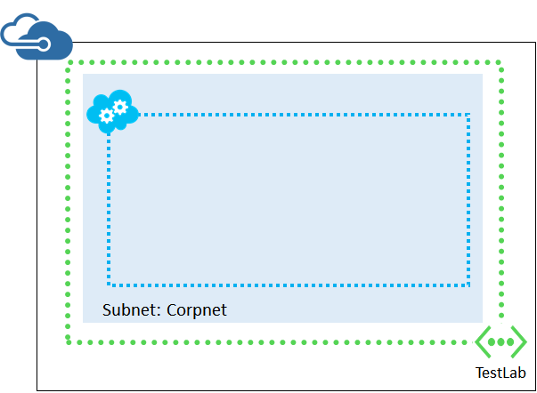

<properties
	pageTitle="基本配置测试环境"
	description="了解如何在 Microsoft Azure 中创建模拟简化 Intranet 的简单开发/测试环境。"
	documentationCenter=""
	services="virtual-machines"
	authors="JoeDavies-MSFT"
	manager="timlt"
	editor=""
	tags="azure-service-management"/>

<tags
	ms.service="virtual-machines"
	ms.date="01/12/2016"
	wacn.date=""/>

# 基本配置测试环境

[AZURE.INCLUDE [了解部署模型](../includes/learn-about-deployment-models-classic-include.md)]

本文为你提供在 Azure 虚拟网络中创建基本配置测试环境的分步说明。

可以使用生成的测试环境：

- 进行应用程序开发和测试。
- 适用于[模拟混合云环境](/documentation/articles/virtual-networks-setup-simulated-hybrid-cloud-environment-testing)。
- 对于你自己设计的测试环境，使用其他虚拟机和 Azure 服务对其进行扩展。

基本配置测试环境由名为 TestLab 的仅限云虚拟网络中的公司网络子网组成，它模拟连接到 Internet 的简化专用 Intranet。

它包含：

- 一个运行 Windows Server 2012 R2 的名为 DC1 的 Azure 虚拟机，它配置为 Intranet 域控制器和域名系统 (DNS) 服务器。
- 一个运行 Windows Server 2012 R2 的名为 APP1 的 Azure 虚拟机，它配置为常规应用程序和 Web 服务器。
- 一个运行 Windows Server 2012 R2 的名为 CLIENT1 的 Azure 虚拟机，它将充当 Intranet 客户端。

此配置允许 DC1、APP1、CLIENT1 及其他公司网络子网计算机执行以下操作：

- 连接到 Internet 安装更新、实时访问 Internet 资源，以及参与公有云技术（如 Microsoft Office 365 及其他 Azure 服务）。
- 从连接到 Internet 或组织网络的计算机使用远程桌面连接进行远程管理。

在 Azure 中设置 Windows Server 2012 R2 基本配置测试环境的公司网络子网分为四个阶段。

1.	创建虚拟网络。
2.	配置 DC1。
3.	配置 APP1。
4.	配置 CLIENT1。

如果你还没有 Azure 帐户，可以在[试用 Azure](/pricing/1rmb-trial) 中注册一个免费试用版。

> [AZURE.NOTE] Azure 中的虚拟机在运行时会持续产生货币成本。此成本是针对你的试用或付费订阅进行计费的。有关正在运行的 Azure 虚拟机的成本的详细信息，请参阅[虚拟机定价详细信息](/home/features/virtual-machines/#price)和 [Azure 定价计算器](/pricing/calculator/)。若要控制成本，请参阅[将 Azure 中的测试环境虚拟机的成本降至最低](#costs)。

## 阶段 1：创建虚拟网络

首先，你可以创建将托管基本配置的公司网络子网的 TestLab 虚拟网络。

1.	在 [Azure 管理门户](https://manage.windowsazure.cn)的任务栏中，单击“新建”>“网络服务”>“虚拟网络”>“自定义创建”。
2.	在“虚拟网络详细信息”页的**“名称”**中键入 **TestLab**。
3.	在**“位置”**中，选择相应的区域。
4.	单击“下一步”箭头。
5.	在“DNS 服务器和 VPN 连接”页的**“DNS 服务器”**中，在**“选择或输入名称”**中键入 **DC1**，在**“IP 地址”**中键入 **10.0.0.4**，然后单击“下一步”箭头。
6.	在“虚拟网络地址空间”页上，在**“子网”**中，单击 **Subnet-1**，并将名称替换为 **Corpnet**。
7.	在 Corpnet 子网的**“CIDR (地址计数)”**列中，单击**“/24 (256)”**。
8.	单击“完成”图标。请等到虚拟网络创建完以后再继续。

接下来，请按[如何安装和配置 Azure PowerShell](/documentation/articles/powershell-install-configure) 中的说明在本地计算机上安装 Azure PowerShell。打开 Azure PowerShell 命令提示符。

首先，使用以下命令选择相应的 Azure 订阅。将引号内的所有内容（包括 < and > 字符）替换为相应的名称。

	$subscr="<Subscription name>"
	Select-AzureSubscription -SubscriptionName $subscr -Current

你可以从 **Get-AzureSubscription** 命令显示的 **SubscriptionName** 属性获取订阅名称。

接下来，你将创建一个 Azure 云服务。云服务充当虚拟网络中放置的虚拟机的安全边界和逻辑容器。它还为你提供了远程连接到 Corpnet 子网中的虚拟机并对其进行管理的方法。

必须为你的云服务选取唯一名称。*云服务名称只能包含字母、数字和连字符。该字段中的第一个和最后一个字符必须是字母或数字。*

例如，你可以将云服务命名为 TestLab-*UniqueSequence*，其中 *UniqueSequence* 是你组织的缩写。例如，如果你的组织名为 Tailspin Toys，则可以将云服务命名为 TestLab-Tailspin。

你可以使用此 Azure PowerShell 命令测试名称的唯一性。

	Test-AzureName -Service <Proposed cloud service name>

如果此命令返回“False”，则你建议的名称是唯一的。然后，使用以下命令创建云服务。

	$loc="<the same location (region) as your TestLab virtual network>"
	New-AzureService -Service <Unique cloud service name> -Location $loc

记录云服务的实际名称。

接下来，你可以配置将包含虚拟机的磁盘和额外的数据磁盘的存储帐户。*必须选择只包含小写字母和数字的唯一名称。* 你可以使用此 Azure PowerShell 命令测试存储帐户名称的唯一性。

	Test-AzureName -Storage <Proposed storage account name>

如果此命令返回“False”，则你建议的名称是唯一的。然后，使用这些命令创建存储帐户并设置订阅以使用它。

	$stAccount="<your storage account name>"
	New-AzureStorageAccount -StorageAccountName $stAccount -Location $loc
	Set-AzureSubscription -Environment AzureChinaCloud -SubscriptionName $subscr -CurrentStorageAccountName $stAccount

这是你当前的配置。

## 阶段 2：配置 DC1

DC1 是 corp.contoso.com Active Directory 域服务 (AD DS) 域的域控制器和 TestLab 虚拟网络虚拟机的 DNS 服务器。

首先，填写云服务的名称，并在本地计算机上的 Azure PowerShell 命令提示符下运行这些命令以为 DC1 创建 Azure 虚拟机。

	$serviceName="<your cloud service name>"
	$cred=Get-Credential -Message "Type the name and password of the local administrator account for DC1."
	$image= Get-AzureVMImage | where { $_.ImageFamily -eq "Windows Server 2012 R2 Datacenter" } | sort PublishedDate -Descending | select -ExpandProperty ImageName -First 1
	$vm1=New-AzureVMConfig -Name DC1 -InstanceSize Small -ImageName $image
	$vm1 | Add-AzureProvisioningConfig -Windows -AdminUsername $cred.GetNetworkCredential().Username -Password $cred.GetNetworkCredential().Password
	$vm1 | Add-AzureDataDisk -CreateNew -DiskSizeInGB 20 -DiskLabel "AD" -LUN 0 -HostCaching None
	$vm1 | Set-AzureSubnet -SubnetNames Corpnet
	$vm1 | Set-AzureStaticVNetIP -IPAddress 10.0.0.4
	New-AzureVM -ServiceName $serviceName -VMs $vm1 -VNetName TestLab

接下来，连接到 DC1 虚拟机。

1.	在 Azure 管理门户中，单击左窗格中的**“虚拟机”**，然后单击 DC1 虚拟机的**“状态”**列中的**“已启动”**。  
2.	在任务栏中，单击**“连接”**。
3.	当系统提示你打开 DC1.rdp 时，单击**“打开”**。
4.	遇到远程桌面连接消息框提示时，单击**“连接”**。
5.	当系统提示你输入凭据时，请使用以下凭据：
- 名称：**DC1\**[本地管理员帐户名称]
- 密码：[本地管理员帐户密码]
6.	当系统使用引用证书的远程桌面连接消息框提示你时，单击**“是”**。

接下来，将额外的数据磁盘添加为驱动器盘符为 F: 的新卷。

1.	在服务器管理器的左窗格中，单击**“文件和存储服务”**，然后单击**“磁盘”**。
2.	在内容窗格的“磁盘”组中，单击“磁盘 2”（其“分区”设置为“未知”）。
3.	单击**“任务”**，然后单击**“新建卷”**。
4.	在新建卷向导的“开始之前”页上，单击**“下一步”**。
5.	在“选择服务器和磁盘”页上，单击“磁盘 2”，然后单击“下一步”。出现提示时，单击“确定”。
6.	在“指定卷的大小”页上，单击**“下一步”**。
7.	在“分配到驱动器号或文件夹”页上，单击**“下一步”**。
8.	在“选择文件系统设置”页上，单击**“下一步”**。
9.	在“确认选择”页上，单击**“创建”**。
10.	完成后，单击**“关闭”**。

接下来，将 DC1 配置为 corp.contoso.com 域的域控制器和 DNS 服务器。在管理员级 Windows PowerShell 命令提示符下运行这些命令。

	Install-WindowsFeature AD-Domain-Services -IncludeManagementTools
	Install-ADDSForest -DomainName corp.contoso.com -DatabasePath "F:\NTDS" -SysvolPath "F:\SYSVOL" -LogPath "F:\Logs"

在 DC1 重启后，重新连接到 DC1 虚拟机。

1.	在 Azure 管理门户的虚拟机页上，单击 DC1 虚拟机**“状态”**列中的**“正在运行”**。
2.	在任务栏中，单击**“连接”**。
3.	当系统提示你打开 DC1.rdp 时，单击**“打开”**。
4.	遇到远程桌面连接消息框提示时，单击**“连接”**。
5.	当系统提示你输入凭据时，请使用以下凭据：
- 名称：**CORP\**[本地管理员帐户名称]
- 密码：[本地管理员帐户密码]
6.	当引用证书的远程桌面连接消息框提示你时，单击**“是”**。

接下来，在 Active Directory 中创建登录到 CORP 域成员计算机时将使用的用户帐户。在管理员级别的 Windows PowerShell 命令提示符下，一次一个地运行这些命令。

	New-ADUser -SamAccountName User1 -AccountPassword (read-host "Set user password" -assecurestring) -name "User1" -enabled $true -PasswordNeverExpires $true -ChangePasswordAtLogon $false
	Add-ADPrincipalGroupMembership -Identity "CN=User1,CN=Users,DC=corp,DC=contoso,DC=com" -MemberOf "CN=Enterprise Admins,CN=Users,DC=corp,DC=contoso,DC=com","CN=Domain Admins,CN=Users,DC=corp,DC=contoso,DC=com"

请注意，第一个命令将产生提供 User1 帐户密码的提示。由于此帐户将用于所有 CORP 域成员计算机的远程桌面连接，请选择一个强密码。若要检查其强度，请参阅[密码检查器：使用强密码](https://www.microsoft.com/security/pc-security/password-checker.aspx)。记录 User1 帐户密码，并将其存储在安全位置。

使用 CORP\\User1 帐户重新连接到 DC1 虚拟机。

接下来，若要允许 Ping 工具的流量，请在管理员级别的 Windows PowerShell 命令提示符下运行此命令。

	Set-NetFirewallRule -DisplayName "File and Printer Sharing (Echo Request - ICMPv4-In)" -enabled True

这是你当前的配置。

## 阶段 3：配置 APP1

APP1 提供 Web 服务和文件共享服务。

首先，填写云服务的名称，并在本地计算机上的 Azure PowerShell 命令提示符下运行这些命令以为 APP1 创建 Azure 虚拟机。

	$serviceName="<your cloud service name>"
	$cred1=Get-Credential -Message "Type the name and password of the local administrator account for APP1."
	$cred2=Get-Credential -UserName "CORP\User1" -Message "Now type the password for the CORP\User1 account."
	$image= Get-AzureVMImage | where { $_.ImageFamily -eq "Windows Server 2012 R2 Datacenter" } | sort PublishedDate -Descending | select -ExpandProperty ImageName -First 1
	$vm1=New-AzureVMConfig -Name APP1 -InstanceSize Small -ImageName $image
	$vm1 | Add-AzureProvisioningConfig -AdminUsername $cred1.GetNetworkCredential().Username -Password $cred1.GetNetworkCredential().Password -WindowsDomain -Domain "CORP" -DomainUserName "User1" -DomainPassword $cred2.GetNetworkCredential().Password -JoinDomain "corp.contoso.com"
	$vm1 | Set-AzureSubnet -SubnetNames Corpnet
	New-AzureVM -ServiceName $serviceName -VMs $vm1 -VNetName TestLab

接下来，使用 CORP\\User1 凭据连接到 APP1 虚拟机，然后打开管理员级别的 Windows PowerShell 命令提示符。

若要检查 APP1 与 DC1 之间的名称解析和网络通信，请运行 **ping dc1.corp.contoso.com** 命令，并验证是否有四条答复。

接下来，在 Windows PowerShell 命令提示符下使用此命令将 APP1 设为 Web 服务器。

	Install-WindowsFeature Web-WebServer -IncludeManagementTools

接下来，使用以下命令在 APP1 上的文件夹中创建共享文件夹和文本文件。

	New-Item -path c:\files -type directory
	Write-Output "This is a shared file." | out-file c:\files\example.txt
	New-SmbShare -name files -path c:\files -changeaccess CORP\User1

这是你当前的配置。

## 阶段 4：配置 CLIENT1

CLIENT1 在 Contoso Intranet 中充当典型笔记本电脑、平板电脑或台式计算机。

首先，填写云服务的名称，并在本地计算机上的 Azure PowerShell 命令提示符下运行这些命令以为 CLIENT1 创建 Azure 虚拟机。

	$serviceName="<your cloud service name>"
	$cred1=Get-Credential -Message "Type the name and password of the local administrator account for CLIENT1."
	$cred2=Get-Credential -UserName "CORP\User1" -Message "Now type the password for the CORP\User1 account."
	$image= Get-AzureVMImage | where { $_.ImageFamily -eq "Windows Server 2012 R2 Datacenter" } | sort PublishedDate -Descending | select -ExpandProperty ImageName -First 1
	$vm1=New-AzureVMConfig -Name CLIENT1 -InstanceSize Small -ImageName $image
	$vm1 | Add-AzureProvisioningConfig -AdminUsername $cred1.GetNetworkCredential().Username -Password $cred1.GetNetworkCredential().Password -WindowsDomain -Domain "CORP" -DomainUserName "User1" -DomainPassword $cred2.GetNetworkCredential().Password -JoinDomain "corp.contoso.com"
	$vm1 | Set-AzureSubnet -SubnetNames Corpnet
	New-AzureVM -ServiceName $serviceName -VMs $vm1 -VNetName TestLab

接下来，使用 CORP\\User1 凭据连接到 CLIENT1 虚拟机。

若要检查 CLIENT1 与 DC1 之间的名称解析和网络通信，请在 Windows PowerShell 命令提示符下运行 **ping dc1.corp.contoso.com** 命令，并验证是否有四条答复。

接下来，验证是否可以从 CLIENT1 访问 APP1 上的 Web 资源和文件共享资源。

1.	在服务器管理器的树窗格中，单击**“本地服务器”**。
2.	在**“CLIENT1 的属性”**中，单击**“IE 增强的安全配置”**旁边的**“启用”**。
3.	在**“Internet Explorer 增强的安全配置”**中，对**“管理员”**和**“用户”**单击**“关闭”**，然后单击**“确定”**。
4.	在“开始”屏幕中，单击**“Internet Explorer”**，然后单击**“确定”**。
5.	在地址栏中，键入 **http://app1.corp.contoso.com/**，然后按 Enter。你应看到 APP1 的默认 Internet 信息服务网页。
6.	在桌面任务栏上，单击“文件资源管理器”图标。
7.	在地址栏中，键入 **\\\app1\\Files**，然后按 Enter。
8.	你应看到显示文件共享文件夹的内容的文件夹窗口。
9.	在**“文件”**共享文件夹窗口中，双击 **Example.txt** 文件。你应看到 Example.txt 文件的内容。
10.	关闭**“example.txt - 记事本”**和**“文件”**共享文件夹窗口。

这是你的最后配置。

Azure 中的基本配置现已可用于应用程序开发和测试或其他测试环境。

## 后续步骤

- 设置[模拟的混合云环境](/documentation/articles/virtual-networks-setup-simulated-hybrid-cloud-environment-testing)以测试混合配置。

## 将 Azure 中的测试环境虚拟机的成本降至最低

若要将运行测试环境虚拟机的开销降至最低，可以执行以下操作之一：

- 创建测试环境，并尽可能快地执行所需的测试和演示。完成后，删除测试环境虚拟机。
- 关闭测试环境虚拟机，使其处于释放状态。

若要使用 Azure PowerShell 关闭虚拟机，请填写云服务名称，并运行这些命令。

	$serviceName="<your cloud service name>"
	Stop-AzureVM -ServiceName $serviceName -Name "CLIENT1"
	Stop-AzureVM -ServiceName $serviceName -Name "APP1"
	Stop-AzureVM -ServiceName $serviceName -Name "DC1" -Force -StayProvisioned

若要确保从已停止（释放）状态启动所有虚拟机时这些虚拟机正常工作，应按以下顺序启动它们：

1.	DC1
2.	APP1
3.	CLIENT1

若要使用 Azure PowerShell 按顺序启动虚拟机，请填写云服务名称，并运行这些命令。

	$serviceName="<your cloud service name>"
	Start-AzureVM -ServiceName $serviceName -Name "DC1"
	Start-AzureVM -ServiceName $serviceName -Name "APP1"
	Start-AzureVM -ServiceName $serviceName -Name "CLIENT1"

<!---HONumber=Mooncake_0215_2016-->