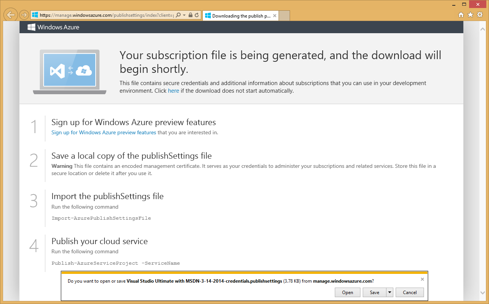
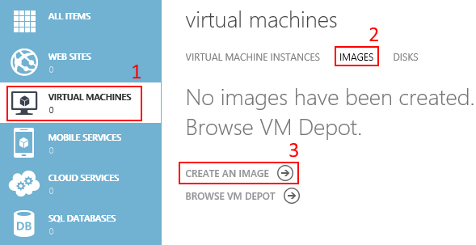

<properties
	pageTitle="创建 Windows Server VHD 并将其上载到 Azure"
	description="了解如何在 Azure 中创建和上载包含 Windows Server 操作系统的虚拟硬盘 (VHD)。"
	services="virtual-machines"
	documentationCenter=""
	authors="KBDAzure"
	manager="timlt"
	editor="tysonn"
	tags="azure-service-management"/>

<tags
	ms.service="virtual-machines"
	ms.date="04/29/2015"
	wacn.date="09/15/2015"/>

# 创建 Windows Server VHD 并将其上载到 Azure#

本文介绍如何上载包含操作系统的虚拟硬盘 (VHD)，以便可以使用它作为映像来基于该映像创建虚拟机。有关 Windows Azure 中的磁盘和 VHD 的更多详细信息，请参阅[关于虚拟机的磁盘和 VHD](http://msdn.microsoft.com/zh-cn/library/windowsazure/jj672979.aspx)。

> [AZURE.NOTE]当基于映像创建虚拟机时，可以根据计划在虚拟机上运行的应用程序的需要自定义操作系统设置。将为该虚拟机保存此配置，并且不会影响映像。

## 先决条件##

本文假定你具备以下条件：

1. **Azure 订阅** - 如果你还没有，可以[建立一个 1 RMB 的 Azure 帐户](/pricing/1rmb-trial/?WT.mc_id=A261C142F)：获取可用来试用付费版 Azure 服务的信用额度，甚至在用完信用额度后，你仍可以保留帐户和使用 1 RMB 的 Azure 服务（如网站）。你的信用卡将永远不会付费，除非你显式更改设置并要求付费。<!--你还可以[激活 MSDN 订户权益](/pricing/member-offers/msdn-benefits-details/?WT.mc_id=A261C142F)：MSDN 订阅每月为你提供可用来试用付费版 Azure 服务的信用额度。-->

2. **Microsoft Azure PowerShell** - 已安装 Windows Azure PowerShell 模块并将其配置为使用你的订阅。若要下载该模块，请参阅 [Microsoft Azure 下载](/downloads/)。可在[此处](/documentation/articles/powershell-install-configure)获取安装和配置该模块的教程。可使用 [Add-AzureVHD](http://msdn.microsoft.com/zn-ch/library/azure/dn495173.aspx) cmdlet 上载 VHD。

3. **存储在 .vhd 文件中的受支持的 Windows 操作系统** - 你已将受支持的 Windows Server 操作系统安装到虚拟硬盘。可使用多个工具创建 .vhd 文件。可使用虚拟化解决方案（例如 Hyper-V）创建虚拟机并安装操作系统。有关说明，请参阅[安装 Hyper-V 角色和配置虚拟机](http://technet.microsoft.com/zn-ch/library/hh846766.aspx)。

> [AZURE.NOTE]Windows Azure 不支持 VHDX 格式。可使用 Hyper-V 管理器或 [Convert-VHD cmdlet](http://technet.microsoft.com/zn-ch/library/hh848454.aspx) 将磁盘转换为 VHD 格式。在[此处](http://blogs.msdn.com/b/virtual_pc_guy/archive/2012/10/03/using-powershell-to-convert-a-vhd-to-a-vhdx.aspx)可找到教程。

 支持以下版本的 Windows Server：

操作系统|SKU|Service Pack|体系结构
---|---|---|---
Windows Server 2012 R2|所有版本|不适用|x64
Windows Server 2012|所有版本|不适用|x64
Windows Server 2008 R2|所有版本|SP1|x64

## 步骤 1：准备要上载的映像 ##

在将映像上载到 Azure 之前，需要使用 Sysprep 命令使其具有通用性。有关 Sysprep 的详细信息，请参阅[如何使用 Sysprep：简介](http://technet.microsoft.com/zn-ch/library/bb457073.aspx)。

在操作系统已安装到的虚拟机中，完成以下过程：

1. 登录到操作系统。

2. 以管理员身份打开“命令提示符”窗口。将目录更改为 **%windir%\\system32\\sysprep**，然后运行 `sysprep.exe`。

	

3.	此时会显示**“系统准备工具”**对话框。

	

4.  在**“系统准备工具”**中，选择**“进入系统全新体验(OOBE)”**并确保选中**“一般化”**。

5.  在**“关机选项”**中选择**“关机”**。
6.  单击**“确定”**。 

## 步骤 2：在 Azure 中创建存储帐户 ##

你需要在 Azure 中具有存储帐户才能上载 .vhd 文件，以便可以在 Azure 中使用它创建虚拟机。可使用 Azure 门户创建存储帐户。

1. 登录到[门户](http://manage.windowsazure.cn)。

2. 在命令栏上，单击**“新建”**。

3. 依次单击**“数据服务”**>**“存储”**>**“快速创建”**。

	

4. 如下所示填写字段：

	- 在 **URL** 下，键入要在存储帐户的 URL 中使用的子域名称。该条目可能包含 3 到 24 个小写字母和数字。此名称将成为用于对订阅的 Blob、队列或表资源进行寻址的 URL 中的主机名。

	- 为存储帐户选择**位置或地缘组**。地缘组让你能够将你的云服务和存储放在同一数据中心。

	- 决定是否对存储帐户使用**异地复制**。默认情况下启用地域复制。此选项会将你的数据免费复制到辅助位置，以便在主位置发生严重故障时将你的存储故障转移到该位置。将自动分配辅助位置，并且无法对其进行更改。如果你因法律要求或组织策略需要更好地控制基于云的存储的位置，可以关闭地域复制。但是，请注意，如果稍后您打开地域复制，则将现有数据复制到辅助位置时将向您收取一次性数据传输费用。不具有地域复制的存储服务将以优惠价提供。有关管理存储帐户的异地复制的更多详细信息，请参阅：[创建、管理或删除存储帐户](/documentation/articles/storage-create-storage-account#replication-options)。

	

5. 单击“创建存储帐户”。该帐户现在会出现在**“存储”**下。

	

6. 接下来，为上载的 VHD 创建容器。单击存储帐户名称，然后单击**“容器”**。

	

7. 单击**“创建容器”**。

	

8. 为容器键入**名称**，并选择**“访问”**策略。

	

	> [AZURE.NOTE]默认情况下，该容器是专用容器，只能由帐户所有者访问。若要允许对容器中的 Blob 进行公共读取访问，但不允许对容器属性和元数据进行公共读取访问，请使用“公共 Blob”选项。若要允许对容器和 Blob 进行完全公共读取访问，请使用“公共容器”选项。

## 步骤 3：准备连接到 Windows Azure ##

您首先需要在计算机和 Windows Azure 中的订阅之间建立一个安全连接，然后才能上载 .vhd 文件。你可以使用 Windows Azure Active Directory 方法或证书方法来执行此操作。

> [AZURE.TIP]若要开始使用 Azure PowerShell，请参阅[如何安装和配置 Windows Azure PowerShell](/documentation/articles/install-configure-powershell)。有关常规信息，请参阅 [Microsoft Azure Cmdlet 入门](https://msdn.microsoft.com/zn-ch/library/azure/jj554332.aspx)。

### 使用 Microsoft Azure AD 方法

1. 打开 Azure PowerShell 控制台。

2. 键入：`Add-AzureAccount`
	
	此命令将打开一个登录窗口，以便你可以使用工作或学校帐户登录。

	

3. Windows Azure 将对凭据信息进行身份验证和保存，然后关闭该窗口。

### 使用证书方法

1. 打开 Azure PowerShell 控制台。

2.	键入：`Get-AzurePublishSettingsFile`。

3. 此时将打开一个浏览器窗口，并提示你下载 .publishsettings 文件。它包含 Windows Azure 订阅的信息和证书。

	

3. 保存 .publishsettings 文件。

4. 键入：`Import-AzurePublishSettingsFile <PathToFile>`

	其中 `<PathToFile>` 是 .publishsettings 文件的完整路径。

## 步骤 4：上载 .vhd 文件

在上载 .vhd 文件时，您可以将 .vhd 文件放置在 Blob 存储中的任何位置。在以下命令示例中，**BlobStorageURL** 是你在步骤 2 中创建的存储帐户的 URL，**YourImagesFolder** 是要在其中存储映像的 Blob 存储中的容器。**VHDName** 是显示在管理门户中用于标识虚拟硬盘的标签。**PathToVHDFile** 是 .vhd 文件的完整路径和名称。

1. 从您在上一步中使用的 Windows Azure PowerShell 窗口中，键入：

	`Add-AzureVhd -Destination "<BlobStorageURL>/<YourImagesFolder>/<VHDName>.vhd" -LocalFilePath <PathToVHDFile>`
	
	

	有关 Add-AzureVhd cmdlet 的详细信息，请参阅 [Add-AzureVhd](http://msdn.microsoft.com/zh-cn/library/dn495173.aspx)。

## 步骤 5：将映像添加到自定义映像列表 ##

上载 .vhd 后，将其作为映像添加到与订阅关联的自定义映像列表。

1. 在门户中的**“所有项目”**下单击**“虚拟机”**。

2. 在“虚拟机”下，单击**“映像”**。

3. 单击**“创建映像”**。

	

4. 在**“从 VHD 创建映像”**中，执行以下操作：
 	
	- 指定**名称**
	- 指定**说明**
	- 若要指定**“VHD 的 URL”**，请单击文件夹按钮以打开以下窗口：

	

	- 选择你的 VHD 所在的存储帐户并单击**“打开”**。此操作会将你返回到**“从 VHD 创建映像”**窗口。
	- 返回到**“从 VHD 创建映像”**窗口后，请选择“操作系统系列”。
	- 选中**“我已在与此 VHD 关联的虚拟机上运行 Sysprep”**，确认你在第 1 步中已通用化了操作系统，然后单击**“确定”**。 

	

5. **可选：**你可以使用 Add-AzureVMImage cmdlet（而不是门户）来将你的 VHD 添加为映像。在 Azure PowerShell 控制台中，键入：

	`Add-AzureVMImage -ImageName <Your Image's Name> -MediaLocation <location of the VHD> -OS <Type of the OS on the VHD>`
	
	

6. 完成前面的步骤后，当你选择**“映像”**选项卡时，将列出新映像。

	

	现在，当你创建虚拟机时，此新映像将在**“我的映像”**下提供。有关说明，请参阅[如何创建运行 Windows 的自定义虚拟机](/documentation/articles/virtual-machines-windows-create-custom)。

	

	> [AZURE.TIP]如果在你尝试创建 VM 时，收到带有此错误消息的错误：“VHD https://XXXXX.. 具有不支持的虚拟大小(YYYY 字节)。大小必须是整数(以 MB 为单位)”，这意味着你的 VHD 不是整数个 MB，需要为固定大小的 VHD。请尝试使用 Add-AzureVMImage PowerShell cmdlet（而不管理门户）来添加映像（请参见上面的步骤 5）。Azure cmdlet 可确保 VHD 满足 Azure 要求。

## 后续步骤 ##

创建虚拟机后，尝试创建 SQL Server 虚拟机。有关说明，请参阅[在 Windows Azure 上预配 SQL Server 虚拟机](/documentation/articles/virtual-machines-provision-sql-server)。

[Step 1: Prepare the image to be uploaded]: #prepimage
[Step 2: Create a storage account in Azure]: #createstorage
[Step 3: Prepare the connection to Azure]: #prepAzure
[Step 4: Upload the .vhd file]: #upload

<!---HONumber=69-->