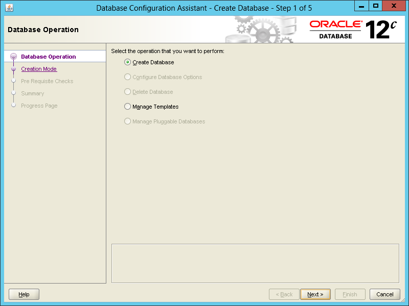
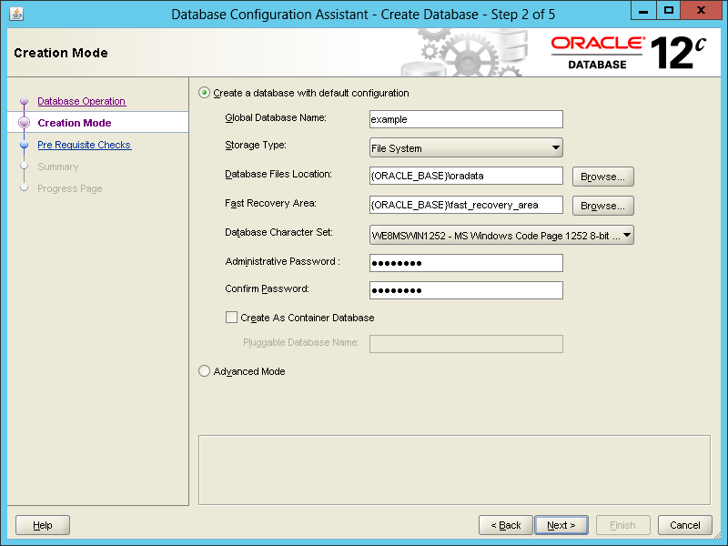
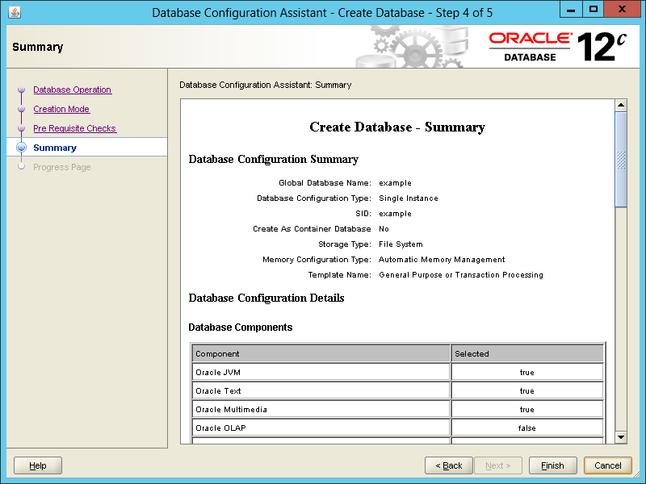
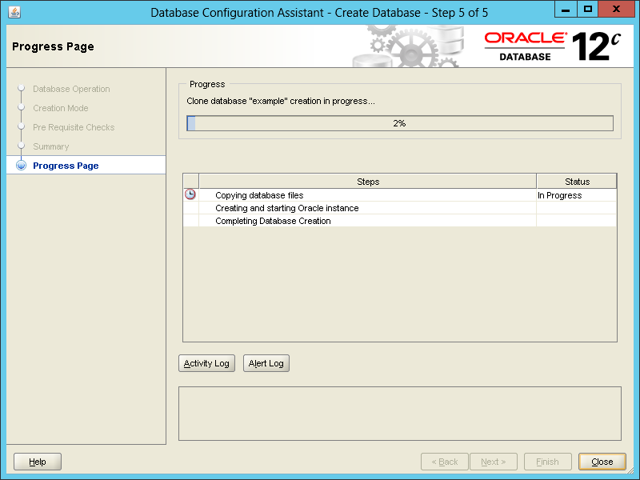
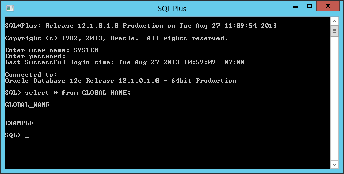

<properties 
	pageTitle="使用 Azure 门户创建 Oracle Database VM | Windows Azure" 
	description="了解如何使用经典部署模型和 Azure 预览门户创建虚拟机，并在虚拟机中创建 Oracle Database。" 
	services="virtual-machines" 
	authors="bbenz" 
	documentationCenter=""
	tags="azure-service-management"/>
	
<tags 
	ms.service="virtual-machines" 
	ms.date="06/22/2015" 
	wacn.date="11/12/2015" />
	
#在 Azure 中创建 Oracle Database 虚拟机

[AZURE.INCLUDE [了解部署模型](../includes/learn-about-deployment-models-include.md)]本文介绍如何使用经典部署模型创建资源。

以下示例演示了如何在 Azure 中，基于 Windows Server 2012 上运行的、由 Microsoft 提供的 Oracle Database 映像创建一个虚拟机 (VM)。执行以下两个步骤。首先，创建 VM，然后在 VM 中创建 Oracle Database。所示的示例采用 Oracle Database 版本 12c，但在 11g 中的步骤几乎相同。

##在 Azure 中创建 Oracle Database 虚拟机

1.	登录到 [Azure 门户](https://manage.windowsazure.cn)。

2.	单击“应用商店”，单击“计算”，然后在搜索框中键入 **Oracle**。

3.	选择一个可用的 Oracle Database 映像 **- 版本 11g、版本 12c、标准版、企业版，或者常用选项或高级选项套装之一**。 检查有关所选映像的信息（例如最小建议大小），然后单击“下一步”。

4.	指定 VM 的“主机名”。

5.	指定 VM 的**“用户名”**。请注意，此用户用于远程登录 VM；这不是 Oracle 数据库用户名。

6.	指定并确认 VM 的密码，或提供 SSH 公钥。

7.	选择一个**定价层**。请注意，默认情况下会显示建议的定价层，若要查看所有配置选项，请单击右上角的“全部查看”。

8.	根据需要设置“可选配置”，但请注意以下事项：

	1. 将“存储帐户”保持不变，以使用 VM 名称创建新的存储帐户。

	2. 将“可用性集”保留为“未配置”。

	3. 此时请不要添加任何**终结点**。

9.	选择或创建资源组

10. 选择一个**订阅**

11. 选择一个**位置**

12. 单击“创建”，创建虚拟机的过程随即将会开始。在虚拟机的状态变为“正在运行”后，继续执行下一步。

##在 Azure 中使用 Oracle Database 虚拟机创建数据库

1.	登录到 [Azure 门户](https://manage.windowsazure.cn)。

2.	单击“虚拟机”。

3.	单击你要登录的虚拟机名称。

4.	单击“连接”。

5.	根据需要响应提示以连接到虚拟机。提示需要管理员名称和密码时，请使用你创建虚拟机时提供的值。

6.	创建名为 **ORACLE_HOSTNAME** 的环境变量，其值设置为虚拟机的计算机名称。可以使用以下步骤创建环境变量：

	1.	单击 Windows“开始”菜单，键入“控制面板”，然后依次单击“控制面板”图标、“系统和安全性”、“系统”、“高级系统设置”。

	2.	单击“高级”选项卡，然后单击“环境变量”。

	3.	在“系统变量”部分下，单击“新建”以创建变量。

	4.	在“新建系统变量”对话框中，输入 **ORACLE_HOSTNAME** 作为变量名称，并输入虚拟机的计算机名称作为值。若要确定计算机名称，请打开命令提示符并运行 **SET COMPUTERNAME**（该命令的输出将包含计算机名称）。
	
	5.	单击“确定”保存新环境变量并关闭“新建系统变量”对话框。

	6.	关闭控制面板打开的其他对话框。

7.	单击 Windows“开始”菜单，然后键入“数据库配置助手”。单击“数据库配置助手”图标。

8.	在“数据库配置助手”向导中，根据需要为每个对话框步骤提供值：

	1.	**步骤 1：**单击“创建数据库”，然后单击“下一步”。

		

	2. **步骤 2：**输入“全局数据库名称”的值。输入并确认“管理密码”的值；此密码将用于 Oracle 数据库 **SYSTEM** 用户。取消选中“创建为容器数据库”。单击**“下一步”**。

		

	3. **步骤 3：**此时将自动进行“必备组件”检查，然后转到**步骤 4**。
	
	4. **步骤 4：**查看“创建数据库 - 摘要”选项，然后单击“完成”。

		
	5. **步骤 5：**“进度页”将报告数据库创建状态。

		
	6. 创建数据库后，你可以选择使用“密码管理”对话框。根据需要修改密码设置，然后关闭对话框以退出“数据库配置助手”向导。

##确认已安装数据库

1.	在保持登录到虚拟机的情况下，启动 SQL Plus 命令提示符：单击 Windows“开始”菜单，然后键入 **SQL Plus**。单击 **SQL Plus** 图标。

2.	出现提示时，使用用户名 **SYSTEM** 以及你在创建 Oracle 数据库时指定的密码登录。

3.	在 SQL Plus 命令提示符下运行以下命令：

		select * from GLOBAL_NAME;

	结果应是你创建的数据库的全局名称。

	

##允许远程访问数据库
若要允许远程访问你的数据库（例如，从运行 Java 代码的客户端计算机），你需要启动数据库侦听器，在虚拟机防火墙中打开端口 1521，并为端口 1521 创建一个公共终结点。

### 启动数据库侦听器
1.	登录到虚拟机。

2.	打开命令提示符。

3.	在命令提示符下运行以下命令：

		lsnrctl start

（可以运行 `lsnrctl status` 检查侦听器的状态。如果你想要停止侦听器，可以运行 `lsnrctl stop`。）

### 在虚拟机的防火墙中打开端口 1521

1.	在保持登录到虚拟机的情况下，单击 Windows“开始”菜单，键入“高级安全 Windows 防火墙”，然后单击“高级安全 Windows 防火墙”图标。这将打开“高级安全 Windows 防火墙”管理控制台。

2.	在防火墙管理控制台中，单击左窗格中的“入站规则”（如果未看到“入站规则”，请展开左窗格中的顶级节点），然后单击右窗格中的“新建规则”。

3.	对于“规则类型”，请选择“端口”，然后单击“下一步”。

4.	对于“协议和端口”，请选择“TCP”，选择“特定本地端口”，为端口输入 **1521**，然后单击“下一步”。

5.	选择“允许连接”，然后单击“下一步”。

6.	接受要应用该规则的配置文件的默认值，然后单击“下一步”。

7.	指定规则的名称，并选择性地输入说明，然后单击“完成”。

### 为端口 1521 创建公共终结点

1.	登录到 [Azure 门户](https://manage.windowsazure.cn)。

2.	单击**“浏览”**

3.    单击“虚拟机”

4.	选择虚拟机

5.	单击“设置”

6.	单击“终结点”。

7.	单击**“添加”**。

8.	指定终结点的名称

	1. 使用 **TCP** 作为协议
	
	2. 使用 **1521** 作为公用端口
	
	3. 使用 **1521** 作为专用端口。

9.	将其余的选项保留原样

10. 单击**“确定”**

##启用 Oracle Database Enterprise Manager 远程访问
如果你想要启用对 Oracle Database Enterprise Manager 的远程访问，请在防火墙中打开端口 5500，并在 Azure 管理门户中为端口 5500 创建一个虚拟机终结点（使用上述步骤打开端口 1521，并为端口 1521 创建终结点）。然后，打开一个浏览器并导航到采用 `http://<<unique_domain_name>>:5500/em` 格式的 URL，以从远程计算机运行 Oracle Enterprise Manager。（可以通过以下方式确定 *<<unique\_domain_name>>* 的值：在 [Azure 门户](https://manage.windowsazure.cn)中单击“虚拟机”，然后选择你要用于运行 Oracle 数据库的虚拟机）。

##配置常用选项和高级选项套装
如果选择“包含常用选项的 Oracle Database”或“包含高级选项套装的 Oracle Database”，则下一步是在 Oracle 安装中配置附加功能。由于配置可能会根据你对每个组件的需求而有很大的不同，因此，请参阅 Oracle 文档，以获取有关在 Windows 上设置这些产品的说明。

**包含常用选项套装的 Oracle Database** 包括 Oracle Database Enterprise Edition，以及按许可证提供的 [Partitioning](http://www.oracle.com/us/products/database/options/partitioning/overview/index.html)、[Active Data Guard](http://www.oracle.com/us/products/database/options/active-data-guard/overview/index.html)、[Oracle Tuning Pack for Database](http://docs.oracle.com/html/A86647_01/tun_ovw.htm)、[Oracle Diagnostics Pack for Database](http://docs.oracle.com/cd/B28359_01/license.111/b28287/options.htm#CIHIHDDJ) 和 [Oracle Lifecycle Management Pack for Database](http://www.oracle.com/technetwork/oem/lifecycle-mgmt-495331.html) 实例。

**包含高级选项套装的 Oracle Database** 包括常用选项套装中所有选项的按许可证提供的实例，以及[高级压缩](http://www.oracle.com/us/products/database/options/advanced-compression/overview/index.html)、[高级安全性](http://www.oracle.com/us/products/database/options/advanced-security/overview/index.html)、[标签安全性](http://www.oracle.com/us/products/database/options/label-security/overview/index.html)、[数据库保管库](http://www.oracle.com/us/products/database/options/database-vault/overview/index.html)、[高级分析](http://www.oracle.com/us/products/database/options/advanced-analytics/overview/index.html)、[OLAP](http://docs.oracle.com/cd/E11882_01/license.112/e47877/options.htm#CIHGDEEF)、[Spatial and Graph](http://docs.oracle.com/cd/E11882_01/license.112/e47877/options.htm#CIHGDEEF)、[内存中数据库缓存](http://www.oracle.com/technetwork/products/timesten/overview/timesten-imdb-cache-101293.html)、[数据屏蔽套件](http://docs.oracle.com/cd/E11882_01/license.112/e47877/options.htm#CHDGEEBB)，以及 Oracle 测试数据管理套件（作为数据屏蔽套件的一部分）。

##其他资源
在设置虚拟机并创建数据库后，请参阅以下主题以了解更多信息。

-	[Oracle 虚拟机映像 - 其他注意事项](/documentation/articles/virtual-machines-miscellaneous-considerations-oracle-virtual-machine-images)

-	[Oracle Database 12c 文档库](http://www.oracle.com/pls/db1211/homepage)

-	[从 Java 应用程序连接到 Oracle 数据库](http://docs.oracle.com/cd/E11882_01/appdev.112/e12137/getconn.htm#TDPJD136)

-	[Oracle Database 2 Day DBA 12c 发行版 1](http://docs.oracle.com/cd/E16655_01/server.121/e17643/toc.htm)

<!---HONumber=79-->