<properties title="Creating an Oracle WebLogic Server 12c cluster in Azure" pageTitle="在 Azure 中创建 Oracle WebLogic Server 12c 群集" description="逐步演示了一个在 Windows Azure 中创建 Oracle WebLogic Server 12c 群集的示例。" services="virtual-machines" authors="bbenz" documentationCenter=""/>
<tags ms.service="virtual-machines"  ms.date="06/22/2015" wacn.date="08/29/2015" />
#在 Azure 中创建 Oracle WebLogic Server 12c 群集
以下示例演示了如何在 Azure 中，基于 Windows Server 2012 上运行的、由 Microsoft 提供的 Oracle WebLogic Server 12c 映像创建 Oracle WebLogic Server 群集。

WebLogic Server 群集中的每个实例必须运行相同版本的 Oracle WebLogic Server。本示例使用 WebLogic Server 12c Enterprise Edition。

##创建要在群集中使用的虚拟机
你将要创建一个虚拟机以用作群集管理服务器，并创建更多的虚拟机以用作该群集的一部分。

### 创建要用作管理服务器的虚拟机

使用 Azure 中提供的 **Oracle WebLogic Server 12c Enterprise Edition on Windows Server 2012** 映像创建虚拟机。[在 Azure 中创建 Oracle WebLogic Server 12c 虚拟机](#creating-an-oracle-weblogic-server-12c-virtual-machine-in-azure-new-article)中提供了有关创建此虚拟机的步骤。对于本教程，请将该虚拟机命名为 **MYVM1-ADMIN**。记下你创建的 VM 的虚拟网络名称，当你创建要添加到群集中的其他 VM 时，将用到该值。（你可以根据需要指定任何 VM 名称和虚拟网络名称，不过，它在 Azure 中必须是唯一的。）

### 创建要在群集中使用的托管虚拟机

使用 Azure 中提供的 Oracle WebLogic Server 12c 映像创建要由管理服务器管理的其他虚拟机。对于本教程，请将这些附加的虚拟机命名为 **MYVM2-MANAGED** 和 **MYVM3-MANAGED**。可以遵循[在 Azure 中创建 Oracle WebLogic Server 12c 虚拟机](#creating-an-oracle-weblogic-server-12c-virtual-machine-in-azure-new-article)中的步骤创建这些虚拟机，*不过*，需要进行以下更改：

-  在创建虚拟机时，请不要创建新的虚拟网络。具体来说，在“可选配置”>“虚拟网络”对话框中，请不要选择默认的“创建新的虚拟网络”，而要选择为管理服务器虚拟机创建的虚拟网络。例如，如果你在创建管理服务器的过程中创建了名为 **EXAMPLE** 的虚拟网络，请在创建托管群集 VM 时选择 **EXAMPLE**。

##创建域

1. 登录到 [Azure 门户](https://manage.windowsazure.cn)。

2. 单击“虚拟机”。

3. 单击创建为群集管理服务器的虚拟机的名称（例如 **MYVM1-ADMIN**）。

4. 单击“连接”。

5. 根据需要响应提示以连接到虚拟机。提示需要管理员名称和密码时，请使用你创建虚拟机时提供的值。

6. 在“Fusion Middleware 配置向导”对话框的“第 1 页”中，单击“创建新域”，然后单击“下一步”。（如果尚未打开“Fusion Middleware 配置向导”对话框，请单击 Windows“开始”菜单，键入“配置向导”，然后单击“配置向导”图标打开该对话框。）

	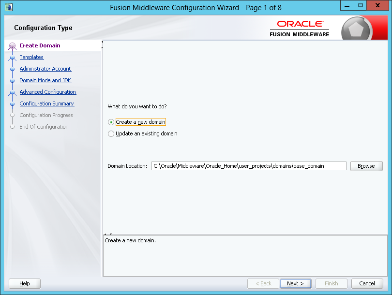

7. 在“Fusion Middleware 配置向导”对话框的“第 2 页”中，选择“基本 WebLogic Server 域”模板，然后单击“下一步”。

	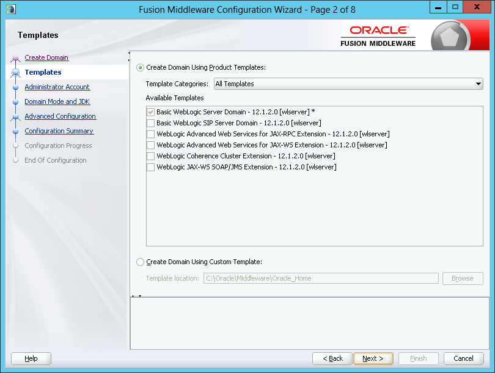

8. 在“Fusion Middleware 配置向导”对话框的“第 3 页”中：

	1. [可选] 将用户名从 **weblogic** 更改为选择的值。
	
	2. 指定并确认 WebLogic 服务器管理员的密码。
	
	3. 单击**“下一步”**。

	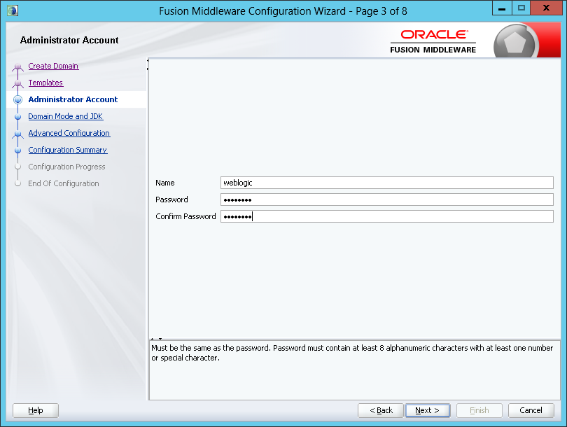

9. 在“Fusion Middleware 配置向导”对话框的“第 4 页”中，选择“生产”作为域模式，选择可用的 JDK（或根据需要浏览到某个 JDK），然后单击“下一步”。

	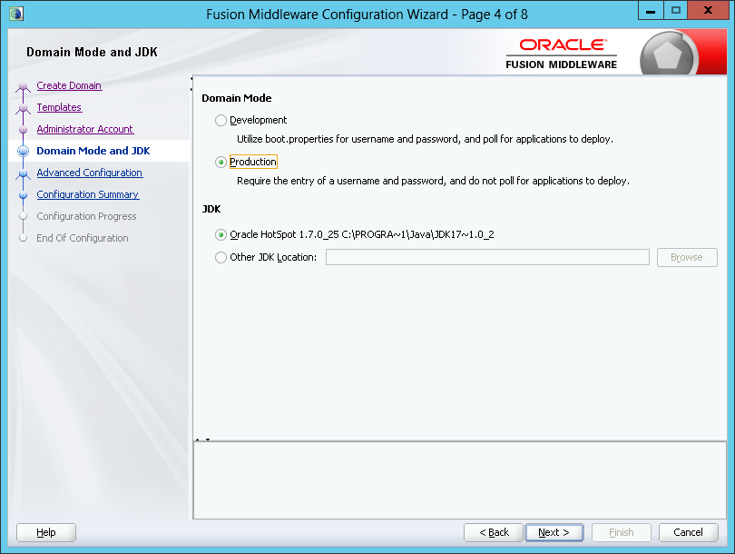

10.  在“Fusion Middleware 配置向导”对话框的“第 5 页”中，不要选择任何选项，而是直接单击“下一步”。

	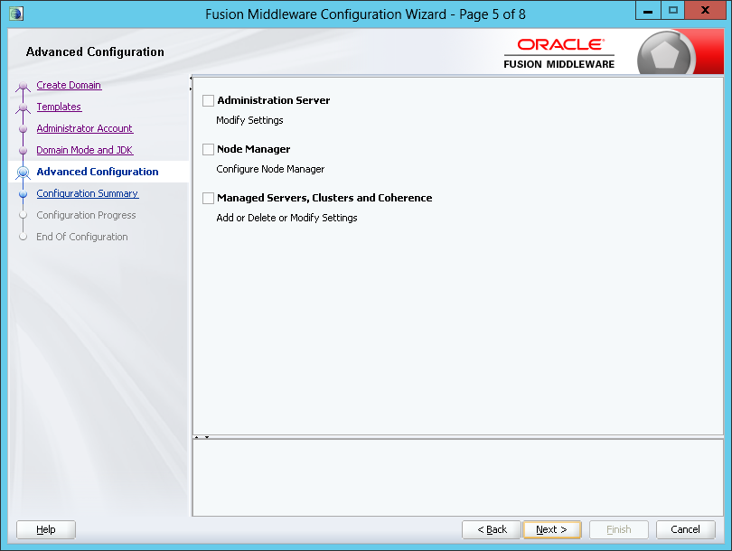

11.  在“Fusion Middleware 配置向导”对话框的“第 6 页”中，单击“创建”。

	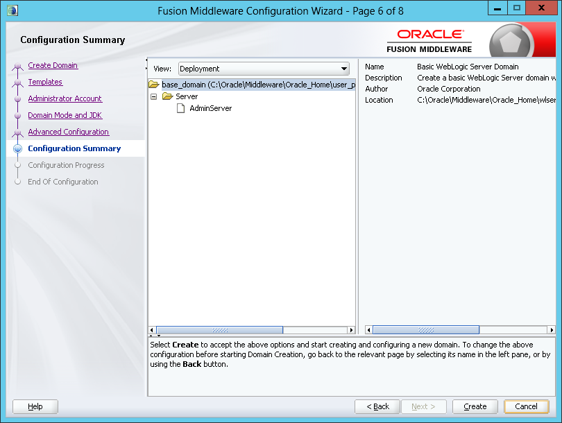

12.  在“Fusion Middleware 配置向导”对话框的“第 7 页”中，在创建域后单击“下一步”。

	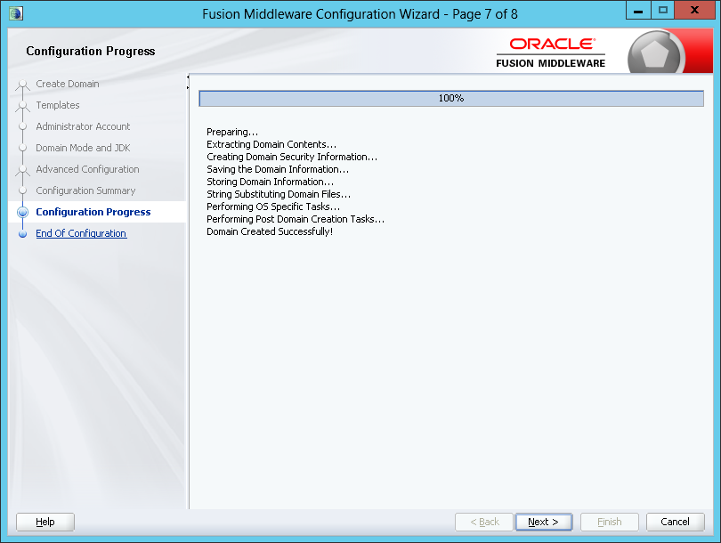

13.  在“Fusion Middleware 配置向导”对话框的“第 8 页”中，选中“启动管理服务器”，然后单击“完成”。

	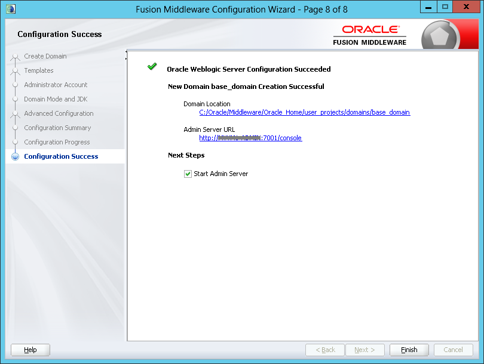

14.  此时将启动 **startWebLogic.cmd** 命令提示符。根据提示提供你的 WebLogic 用户名和密码。

##设置群集

1. 在保持登录到管理虚拟机的情况下，运行 **WebLogic Server 管理控制台** (<http://localhost:7001/console>)。根据提示提供你的 WebLogic Server 用户名和密码。

2. 在“WebLogic Server 管理控制台”中，单击“锁定和编辑”。

3. 在“域结构”窗格中，展开“环境”，然后单击“群集”。

4. 在“群集摘要”对话框中，单击“新建”，然后单击“群集”。

5. 在“群集属性”对话框中：

	1. 输入群集的名称。

	2. 选择“单播”作为“消息传送模式”。

		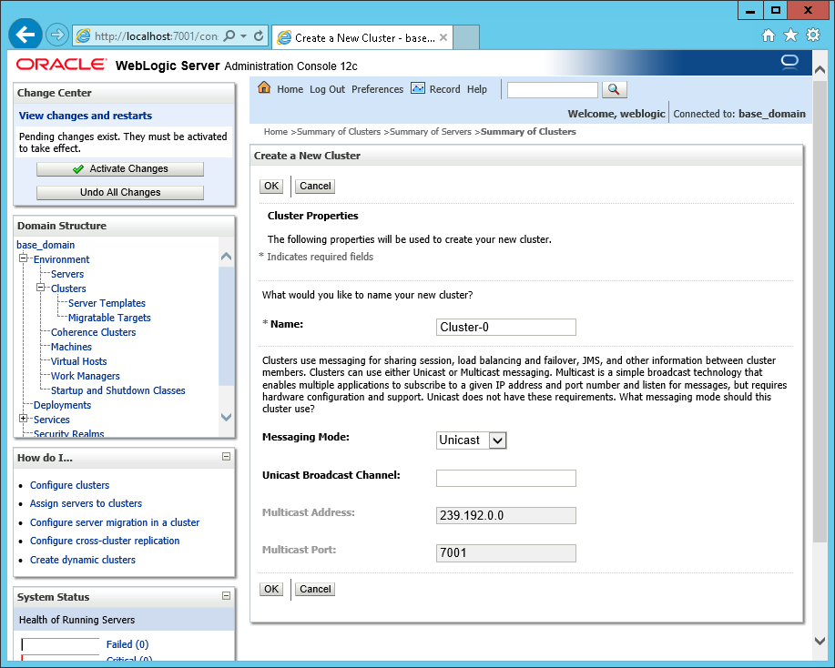

	
	3. 单击**“确定”**。

6. 在“域结构”窗格中，展开“环境”，然后单击“服务器”。

7. 将第一个托管服务器添加到群集。

	1. 单击“新建”。

	2. 在“创建新服务器”对话框中：

		1. 对于“服务器名称”，请输入第一个托管服务器的名称。例如“MYVM2-MANAGED”。

		2. 对于“服务器侦听地址”，请再次输入名称。

		3. 对于“侦听端口”，请键入 **7008**。

		4. 选中“是，将此服务器设为现有群集的成员”。

		5. 在“选择群集”下拉列表中，选择前面创建的群集。

			34d27e82-bb2e-4f9c-aaad-ca3e28c0f5fc

		6. 单击**“下一步”**。

		7. 单击“完成”。

8. 使用上述步骤将第二个托管服务器添加到群集。对于“服务器名称”和“服务器侦听地址”，请使用第二个托管计算机的名称。对于“侦听端口”，请使用 **7008**。

9. 在 WebLogic Server 管理控制台中，单击“激活更改”。

10. 在管理虚拟机上，创建一个名为 **SERVER_HOME**、值为 C:**\\Oracle\\Middleware\\Oracle_Home\\wlserver** 的环境变量。 可以使用以下步骤创建环境变量：

	1. 单击 Windows“开始”菜单，键入“控制面板”，然后依次单击“控制面板”图标、“系统和安全性”、“系统”、“高级系统设置”。

	2. 单击“高级”选项卡，然后单击“环境变量”。

	3. 在“系统变量”部分下，单击“新建”以创建变量。

	4. 在“新建系统变量”对话框中，输入 **SERVER_HOME** 作为变量名称，并输入 **C:\\Oracle\\Middleware\\Oracle_Home\\wlserver** 作为值。

	5. 单击“确定”保存新环境变量并关闭“新建系统变量”对话框。

	6. 关闭控制面板打开的其他对话框。

11. 打开新的命令提示符（使 **SERVER_HOME** 环境变量生效）。

	>[AZURE.NOTE]剩余的某些步骤需要你在登录虚拟机后使用命令提示符。若要轻松识别你登录到的虚拟机，请在打开命令提示符后运行 **title %COMPUTERNAME%**。
	>
	>（**%COMPUTERNAME%** 是一个系统定义的环境变量，将自动设置为计算机名称。运行 **title** **%COMPUTERNAME%** 命令可在命令提示符标题栏中显示计算机的名称。）

12. 运行以下命令：

		%SERVER_HOME%\\common\\bin\\pack.cmd -managed=true -domain=C:\\Oracle\\Middleware\\Oracle_Home\\user_projects\\domains\\base_domain -template=c:\\mytestdomain.jar -template_name="mytestdomain" 

	此命令将创建名为 **c:\\mytestdomain.jar** 的 jar。 稍后你要将此 jar 复制到群集中的托管虚拟机。

13. 允许通过防火墙与端口 7001 建立入站连接。

	1. 在保持登录到虚拟机的情况下，单击 Windows“开始”菜单，键入“高级安全 Windows 防火墙”，然后单击“高级安全 Windows 防火墙”图标。这将打开“高级安全 Windows 防火墙”管理控制台。

	2. 在防火墙管理控制台中，单击左窗格中的“入站规则”（如果未看到“入站规则”，请展开左窗格中的顶级节点），然后单击右窗格中的“新建规则”。

	3. 对于“规则类型”，请选择“端口”，然后单击“下一步”。

	4. 对于“协议和端口”，请选择“TCP”，选择“特定本地端口”，为端口输入 **7001**，然后单击“下一步”。

	5. 选择“允许连接”，然后单击“下一步”。

	6. 接受要应用该规则的配置文件的默认值，然后单击“下一步”。

	7. 指定规则的名称，并选择性地输入说明，然后单击“完成”。

14. 对于每个托管虚拟机：

	1. 登录到虚拟机。

	2. 创建名为 **SERVER_HOME**、值设置为 **C:\\Oracle\\Middleware\\Oracle_Home\\wlserver** 的环境变量。

	3. 将管理虚拟机中的 c:\\mytestdomain.jar 复制到托管虚拟机上的 c:\\mytestdomain.jar 中。

	4. 打开命令提示符（记得在命令提示符下运行 **title %COMPUTERNAME%**，以便清楚地知道你正在访问哪台计算机）。

	5. 运行以下命令：

			%SERVER_HOME%\\common\\bin\\unpack.cmd -domain=C:\\Oracle\\Middleware\\Oracle_Home\\user_projects\\domains\\base_domain -template=c:\\mytestdomain.jar

	6. 将命令提示符的当前目录切换到 **C:\\Oracle\\Middleware\\Oracle_Home\\user_projects\\domains\\base_domain\\bin**。

	7. 运行 start<<*MACHINENAME*>>.cmd，其中，<<*MACHINENAME*>> 是托管计算机的名称。例如 **startMYVM2-MANAGED**。

	8. 根据提示提供 WebLogic Server 用户名和密码。

	9. 允许通过防火墙与端口 7008 建立入站连接。（遵循用于在管理服务器上打开端口 7001 的步骤，但此时要为托管服务器改用 7008。）

15. 在管理虚拟机上，打开 **WebLogic Server 管理控制台** (<http://localhost:7001/console>)，并查看服务器是否正在运行。

	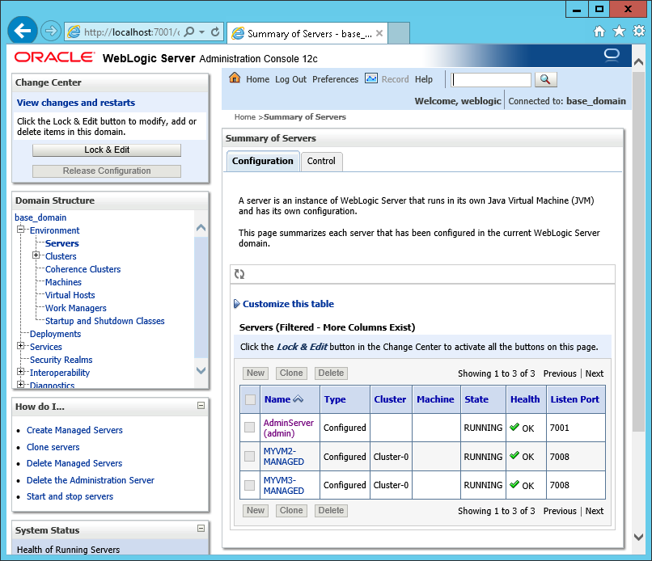

16. 为托管虚拟机创建负载平衡的终结点集：

	1. 在 [Azure 门户](https://manage.windowsazure.cn)上的“虚拟机”部分中，选择第一个托管虚拟机（例如 **MYVM2-MANAGED**）。

	2. 依次单击“设置”、“终结点”、“添加”。

	3. 指定终结点的名称，指定“TCP”作为协议，然后指定公用端口 **80** 和专用端口 **7008**。 将其余的选项保留原样。

	4. 选中“创建负载平衡集”，然后单击“完成”。

	5. 指定负载平衡集的名称，接受其他参数的默认值，然后单击“完成”。

17. 为虚拟机创建终结点

	1. 登录到 [Azure 门户](https://manage.windowsazure.cn)。

	2. 单击“浏览”

	3. 单击“虚拟机”

	4. 选择虚拟机

	5. 单击“设置”

	6. 单击“负载平衡集”

	7. 单击“加入”。

	8. 将负载平衡集类型设置为“内部”

	9. 指定终结点的名称

		1. 使用 **TCP** 作为协议

		2. 使用 **80** 作为公用端口

		3. 使用 **7008** 作为探测端口

	10. 将其余的选项保留原样

	11. 单击**“确定”**

	12. 等待此虚拟机加入负载平衡集，然后继续下一步。

18. 在 [Azure 门户](https://manage.windowsazure.cn)上的“虚拟机”部分中，选择第二个托管虚拟机（例如 **MYVM3-MANAGED**）。遵照上述步骤加入到你为第一个托管虚拟机创建的负载平衡集。

##将应用程序部署到群集

此时，你可以使用以下步骤部署应用程序。假设你要部署可从 <http://www.oracle.com/webfolder/technetwork/tutorials/obe/fmw/wls/12c/12-ManageSessions--4478/files/shoppingcart.war> 下载的 Oracle 购物车应用程序。

1. 登录到 WebLogic Server 群集的管理虚拟机（例如 **MYVM1-ADMIN**）。 

2. 在本地复制 shoppingcart.war。例如，创建名为 **c:\\mywar** 的文件夹，并将 <http://www.oracle.com/webfolder/technetwork/tutorials/obe/fmw/wls/12c/12-ManageSessions--4478/files/shoppingcart.war> 中的 WAR 保存到 **c:\\mywar**。

3. 打开 **WebLogic Server 管理控制台** (<http://localhost:7001/console>)。根据提示提供你的 WebLogic 用户名和密码。

4. 在“WebLogic Server 管理控制台”中，依次单击“锁定和编辑”、“部署”、“安装”。

5. 对于“路径”，请键入 **c:\\myway\\shoppingcart.war**。

	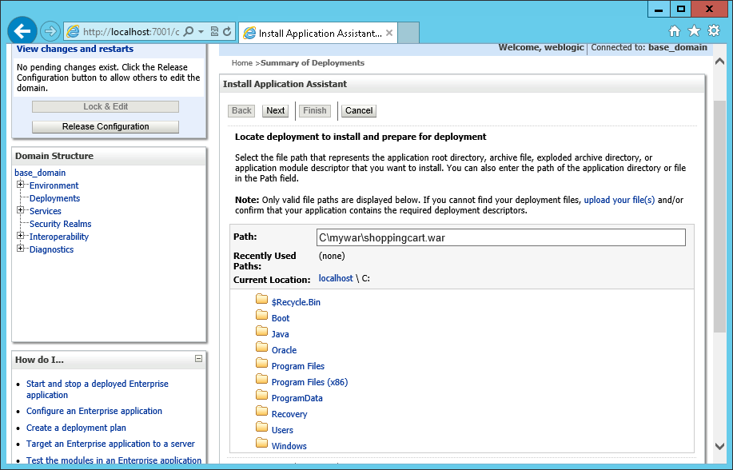

	单击**“下一步”**。

6. 选择“将此部署安装为应用程序”，然后单击“下一步”。

7. 单击“完成”。

8. 对于“可用目标”，请选择前面创建的群集，并确保已选中“群集中的所有服务器”，然后单击“下一步”。

9. 在“源可访问性”下，选择“将此应用程序复制到每个目标”，然后单击“完成”。

10.  在“WebLogic Server 管理控制台”中，单击“保存”，然后单击“激活更改”。

11.  单击“部署”，选择“shoppingcart”，单击“启动”，然后单击“为所有请求提供服务”。出现确认提示时，单击“是”。

12.  若要查看在 Internet 上运行的购物车应用程序，请在浏览器中打开 `http://<<unique_domain_name>>/shoppingcart` 格式的 URL。（可以通过以下方式确定 `<<unique_domain_name>>` 的值：在 [Azure 门户](https://manage.windowsazure.cn)中单击“虚拟机”，然后选择你要用于运行 Oracle WebLogic Server 的虚拟机）。

## 后续步骤

若要进一步查看你的群集是否按预期运行，你可以修改 shoppingcart.war 项目以显示为浏览器会话提供服务的计算机名称，启动浏览器会话，停止为浏览器会话提供服务的计算机，然后刷新浏览器会话，以查看是否有另一台计算机继续为浏览器会话提供服务。

例如：

1. 修改 **DWRHeader1.jspf** 文件，以在该文件的顶部包含以下代码：

		<table>
		
		<tr><td>
<b><h3><% out.println("Your request is served from " + System.getenv("computername") ); %></h3></b>
</td></tr>
		
		</table>             

2. 修改 **weblogic.xml** 文件，以在注释行 `Insert session descriptor element here` 的后面包含以下代码。

		<session-descriptor>
			<persistent-store-type>replicated_if_clustered</persistent-store-type>
		</session-descriptor>

3. 重新编译并重新部署更新的 shoppingcart.war。

4. 打开浏览器会话并运行购物车应用程序。将一些商品添加到购物车，然后观察哪台计算机正在为浏览器会话提供服务。

5. 在 Azure 门户中的“虚拟机”用户界面上，选择为浏览器会话提供服务的虚拟机，然后单击“关闭”。等到 VM 状态变为“已停止(已释放)”，然后继续下一步。

6. 刷新运行购物车应用程序的浏览器会话，然后查看是否有另一台计算机正在为浏览器会话提供服务。

7. 单击购物车链接，然后查看以前添加的商品是否仍在购物车中。

## 其他资源

现在，你已设置了运行 Oracle WebLogic Server 的群集，接下来请参阅以下主题以了解更多信息。

- [Oracle 虚拟机映像 - 其他注意事项](/documentation/articles/virtual-machines-miscellaneous-considerations-oracle-virtual-machine-images)

- [Oracle WebLogic Server 产品文档](http://www.oracle.com/technetwork/middleware/weblogic/documentation/index.html)

- [Windows Azure 上使用 Linux 的 Oracle WebLogic Server 12c](http://www.oracle.com/technetwork/middleware/weblogic/learnmore/oracle-weblogic-on-azure-wp-2020930.pdf)

<!---HONumber=67-->