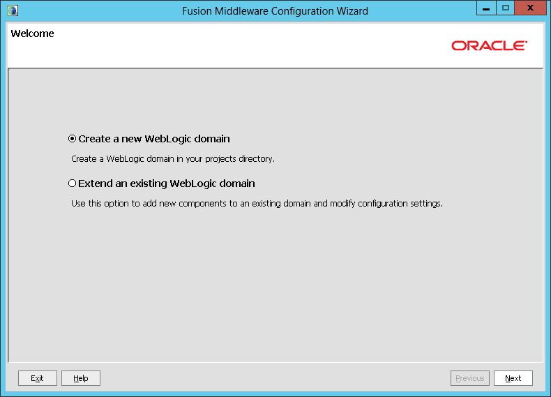
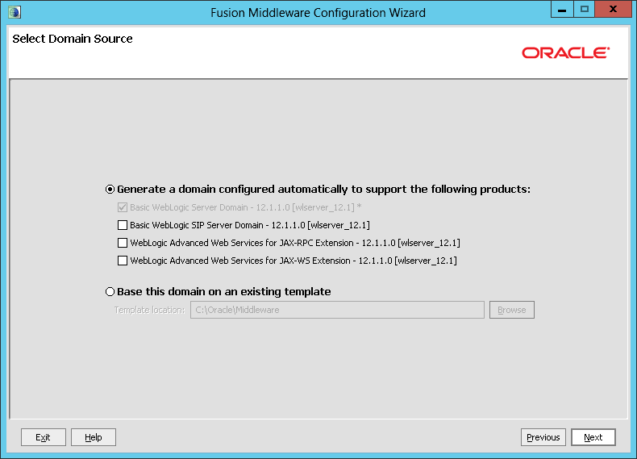
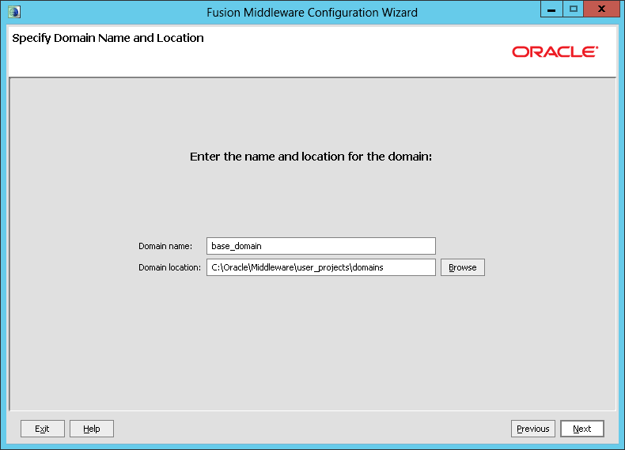
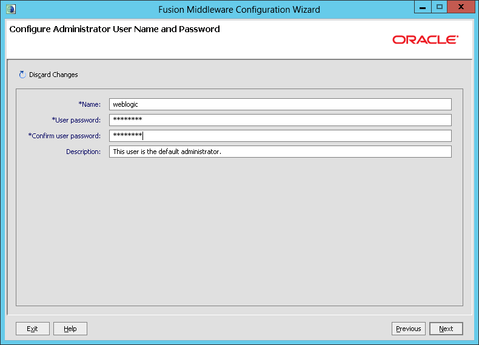
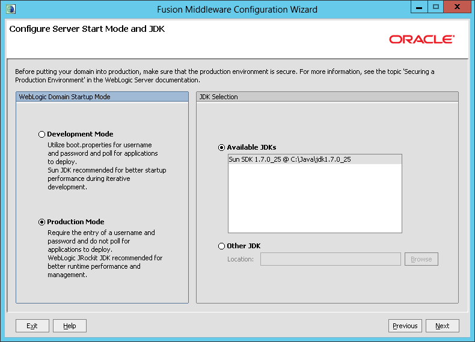
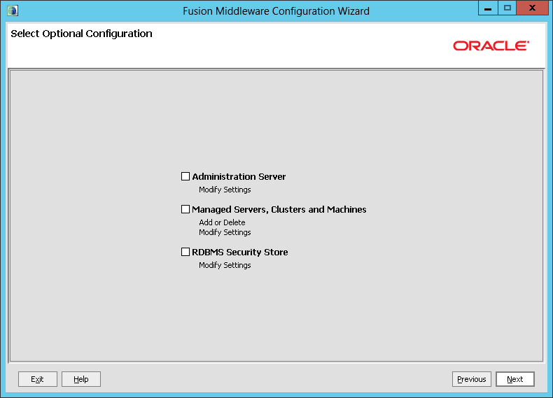
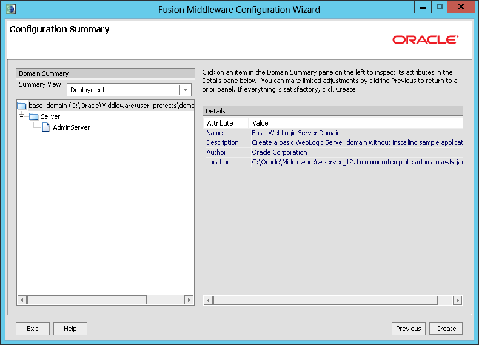
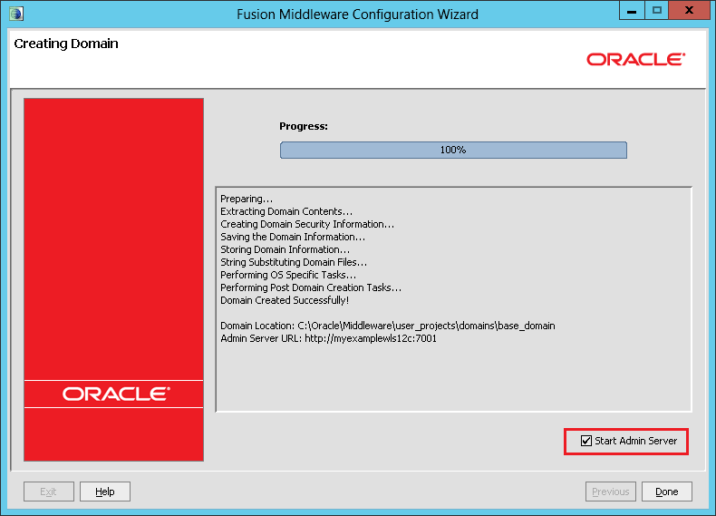
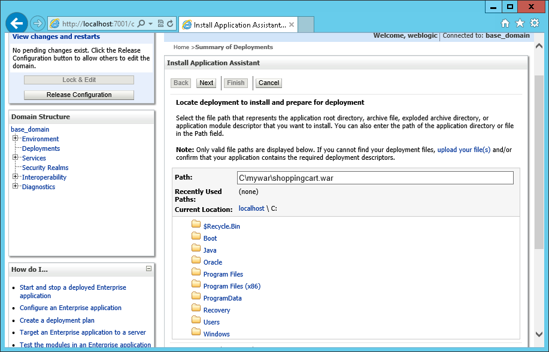

<properties title="Creating an Oracle WebLogic Server 12c Virtual Machine in Azure" pageTitle="在 Azure 中创建 Oracle WebLogic Server 12c 虚拟机" description="逐步演示在 Windows Azure 中创建运行在 Windows Server 2012 上的 Oracle WebLogic Server 12c 虚拟机的示例。" services="virtual-machines" authors="bbenz" documentationCenter=""/>
<tags ms.service="virtual-machines" ms.date="06/22/2015" wacn.date="08/29/2015"/>
#在 Azure 中创建 Oracle WebLogic Server 12c 虚拟机
以下示例演示了如何在 Azure 中，基于 Windows Server 2012 上运行的由 Microsoft 提供的 Oracle WebLogic Server 12c 映像创建一个虚拟机。

##在 Azure 中创建 Oracle WebLogic Server 12c 虚拟机

1. 登录到 [Azure 门户](https://manage.windowsazure.cn)。

2. 单击“应用商店”，单击“计算”，然后在搜索框中键入 **Oracle**。

3.	选择“Windows Server 2012 上的 Oracle WebLogic Server 12c Standard Edition”或“Windows Server 2012 上的 Oracle WebLogic Server 12c Enterprise Edition”映像。检查有关此映像的信息（如最小建议大小），然后单击“下一步”。

4.	指定 VM 的“主机名”。

5.	指定 VM 的“用户名”。请注意，此用户用于远程登录 VM；这不是 Oracle 数据库用户名。

6.	指定并确认 VM 的密码，或提供 SSH 公钥。

7.	选择一个**定价层**。请注意，默认情况下会显示建议的定价层，若要查看所有配置选项，请单击右上角的“全部查看”。

8.	根据需要设置[“可选配置”](https://msdn.microsoft.com/zh-cn/library/azure/dn763935.aspx)，但请注意以下事项：
	1. 将“存储帐户”保持不变，以使用 VM 名称创建新的存储帐户。
	2. 将“可用性集”保留为“未配置”。
	3. 此时请不要添加任何**终结点**。

9.	选择或创建<!--[-->资源组<!--](/documentation/articles/resource-group-portal)-->

10. 选择一个**订阅**

11. 选择一个**位置**

##在 Azure 中配置 Oracle WebLogic Server 12c 虚拟机

1. 登录到 [Azure 门户](https://manage.windowsazure.cn)。

2.	单击“虚拟机”。

3.	单击你要登录到的虚拟机名称。

4.	单击“连接”。

5.	根据需要响应提示以连接到虚拟机。提示需要管理员名称和密码时，请使用你创建虚拟机时提供的值。

6.	在“WebLogic 平台快速入门”对话框中，单击“WebLogic Server 入门”。（如果“WebLogic 平台快速入门”对话框尚未打开，请单击 Windows“开始”菜单，键入“启动 WebLogic Server 域的管理服务器”，然后单击“启动 WebLogic Server 域的管理服务器”图标以打开该对话框。）

7.	在“欢迎”对话框中，选择“创建新的 WebLogic 域”，然后单击“下一步”。

	

8.	在“选择域源”对话框中接受默认值，然后单击“下一步”。

	

9.	在“指定域名和位置”对话框中接受默认值，然后单击“下一步”。

	

10.	在“配置管理员用户名和密码”对话框中：

	1.	[可选] 将用户名从 **weblogic** 更改为选择的值。

	2.	指定并确认 WebLogic 服务器管理员的密码。

	3.	单击**“下一步”**。

	

11.	在“配置服务器启动模式和 JDK”对话框中，选择“生产模式”，选择可用的 JDK（或根据需要浏览到某个 JDK），然后单击“下一步”。

	

12.	在“选择可选配置”对话框中，请不要选择任何选项，而是直接单击“下一步”。

	

13.	在“配置摘要”对话框中，单击“创建”。

	

14.	在“创建域”对话框中，选中“启动管理服务器”，然后单击“完成”。

	

15.	此时将启动 **startWebLogic.cmd** 命令提示符。根据提示提供你的 WebLogic 用户名和密码。

##在 Azure 中的 Oracle WebLogic Server 12c 虚拟机上安装应用程序
1.	在保持登录到虚拟机的情况下，将可从 http://www.oracle.com/webfolder/technetwork/tutorials/obe/fmw/wls/12c/12-ManageSessions--4478/files/shoppingcart.war 下载的 shoppingcart.war 示例复制到本地。例如，创建名为 **c:\mywar** 的文件夹，并将 http://www.oracle.com/webfolder/technetwork/tutorials/obe/fmw/wls/12c/12-ManageSessions--4478/files/shoppingcart.war 中的 WAR 保存到 **c:\mywar**。

2.	打开 **WebLogic Server 管理控制台** (http://localhost:7001/console)。根据提示提供你的 WebLogic 用户名和密码。

3.	在“WebLogic Server 管理控制台”中，依次单击“锁定和编辑”、“部署”、“安装”。

4.	对于“路径”，请键入 **c:\mywar\shoppingcart.war**。

	

	单击**“下一步”**。

5.	选择“将此部署安装为应用程序”，然后单击“下一步”。

6.	单击“完成”。

7.	在“WebLogic Server 管理控制台”中，单击“保存”，然后单击“激活更改”。

8.	单击“部署”，选择“shoppingcart”，单击“启动”，然后单击“为所有请求提供服务”。出现确认提示时，单击“是”。

9.	若要查看在本地运行的购物车应用程序，请在浏览器中打开 <http://localhost:7001/shoppingcart>

10.	为虚拟机创建终结点

	1. 登录到 [Azure 门户](hhttps://manage.windowsazure.cn)。

	2.	单击“浏览”

	3.	单击“虚拟机”

	4.	选择虚拟机

	5.	单击“设置”

	6.	单击“终结点”。

	7.	单击**“添加”**。

	8.	指定终结点的名称

		1. 使用 **TCP** 作为协议

		2. 使用 **80** 作为公用端口

		3. 使用 **7001** 作为专用端口。

	9.	将其余的选项保留原样

	10. 单击**“确定”**

11.	允许通过防火墙与端口 7001 建立入站连接。

	1.	登录到虚拟机。

	2.	单击 Windows“开始”菜单，键入“高级安全 Windows 防火墙”，然后单击“高级安全 Windows 防火墙”图标。这将打开“高级安全 Windows 防火墙”管理控制台。

	3.	在防火墙管理控制台中，单击左窗格中的“入站规则”（如果未看到“入站规则”，请展开左窗格中的顶级节点），然后单击右窗格中的“新建规则”。

	4.	对于“规则类型”，请选择“端口”，然后单击“下一步”。

	5.	对于“协议和端口”，请选择“TCP”，选择“特定本地端口”，为端口输入 **7001**，然后单击“下一步”。

	6.	选择“允许连接”，然后单击“下一步”。

	7.	接受要应用该规则的配置文件的默认值，然后单击“下一步”。

	8.	指定规则的名称，并选择性地输入说明，然后单击“完成”。

12.	若要查看在 Internet 上运行的购物车应用程序，请在浏览器中打开 `http://<<unique_domain_name>>/shoppingcart` 格式的 URL。（可以通过以下方式确定 <<*unique_domain_name*>> 的值：在 [Azure 门户](https://manage.windowsazure.cn)中单击“虚拟机”，然后选择你要用于运行 Oracle WebLogic Server 的虚拟机）。

##其他资源
现在，你已设置了运行 Oracle WebLogic Server 的虚拟机，接下来请参阅以下主题以了解更多信息。

-	[Oracle 虚拟机映像 - 其他注意事项](/documentation/articles/virtual-machines-miscellaneous-considerations-oracle-virtual-machine-images)

-	[Oracle WebLogic Server 产品文档](http://www.oracle.com/technetwork/middleware/weblogic/documentation/index.html)

-	[Windows Azure 上使用 Linux 的 Oracle WebLogic Server 12c](http://www.oracle.com/technetwork/middleware/weblogic/learnmore/oracle-weblogic-on-azure-wp-2020930.pdf)

<!---HONumber=67-->