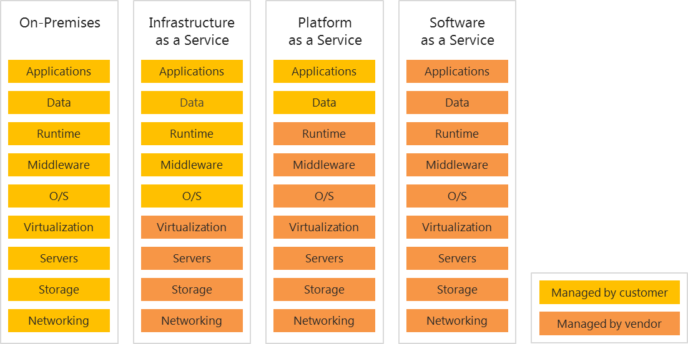
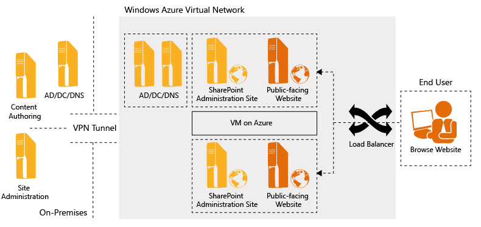

<properties linkid="manage-windows-other-resource-sharepoint-wp" urlDisplayName="SharePoint on Azure" pageTitle="Azure 虚拟机上的 SharePoint 2010 部署" metaKeywords="" description="了解用于在 Azure 虚拟机上使用 SharePoint 2010 的支持的方案。" metaCanonical="" services="virtual-machines" documentationCenter="" title="SharePoint Deployment on Azure Virtual Machines" authors="" solutions="" manager="" editor="" />
<tags ms.service="virtual-machines"
    ms.date="01/16/2015"
    wacn.date="04/11/2015"
    />

<h1>Azure 虚拟机上的 SharePoint 2010 部署</h1>
<h2>执行摘要</h2>

Microsoft SharePoint Server 2010 提供了丰富的部署灵活性，可帮助组织确定正确的部署方案，以便符合其业务需求和目标。Azure 虚拟机产品/服务通过云进行托管和管理，它提供了完整、可靠且可用的基础结构，以便支持各种按需应用程序和数据库工作负载（如 Microsoft SQL Server 和 SharePoint 部署）。

虽然 Azure 虚拟机支持多种工作负载，但是本文重点介绍 SharePoint 部署。利用 Azure 虚拟机，组织可以快速创建和管理其 SharePoint 基础结构，从而能够全局设置和访问几乎所有主机。这样，便可以完全控制和管理处理器、RAM、CPU 范围以及 SharePoint 虚拟机 (VM) 的其他资源。

Azure 虚拟机减少了对硬件的需求，从而使组织能够将工作重心从处理较高的前期成本和复杂性转移到大规模构建和管理基础结构上。这意味着，组织只需几个小时的时间即可实现创新、试验和迭代，而通过传统部署做到这一点则需几天和几个星期的时间。

<h3>本文的目标读者</h3>

本文专为 IT 专业人员撰写。此外，技术决策者（如架构师和系统管理员）可使用此信息和提供的方案来在 Azure 上计划和设计虚拟化 SharePoint 基础结构。

<h3>阅读本文的理由</h3>

本文介绍了组织如何在 Azure 虚拟机中设置和部署 SharePoint。还讨论了各种规模的组织可通过此类部署受益的理由。

<h2>转换到云计算</h2>

根据 Gartner 的说法，云计算的定义为："一种利用 Internet 技术将高度可缩放的基于 IT 的能力'以服务的形式'提供给外部客户的计算方式。"此定义中的关键词为"可伸缩的"、"服务"和"Internet"。简而言之，云计算可定义为<stong>通过 Internet 部署和传送<stong>并<stong>可按需缩放<stong>的 IT 服务。

不可否认的是，云计算意味着当今 IT 行业正在发生重大的转变。昨天我们谈论的话题与整合和成本有关。而今天我们谈论的话题将与云计算可提供的一类新的好处有关。这一切都与借助一类新的功能来改变 IT 为组织提供服务的方式有关。云计算从根本上改变了 IT 行业，并影响了每个角色 - 从服务提供商和系统架构师到开发人员和最终用户。

研究表明，灵活性、集中性和经济性是推动云的采用的三大因素：

<ul>
<li>
<stong>灵活性<stong>：云计算可以增强组织利用新机遇并对业务需求中的变化作出响应的能力。
</li>
<li>
<stong>集中性<stong>：云计算使 IT 部门能够大大降低基础结构成本。由于实现了基础结构的抽象化和资源共享，使得 IT 更像一个实用工具而非一组复杂的服务和系统那样运营。此外，IT 现在可转变为更具创新性和战略性的角色。
</li>
<li>
<stong>经济性<stong>：云计算可降低交付 IT 的成本并提高数据中心的使用率和效率。借助云计算降低了交付成本，应用程序和资源将变为自助服务，而对这些资源的使用将可通过新的精确方法进行度量。由于实现了基础结构资源（存储、计算和网络）的抽象化和共享，因此使硬件使用率也得到了提高。
</li>
</ul>

<h2>云服务的交付模型</h2>

简单来说，云计算是 IT 服务的抽象。这些服务的范围可从基本的基础结构到完整的应用程序。最终用户请求和使用抽象服务，而无需管理（或甚至完全了解）这些服务的构成元素。目前，行业承认云服务的三种交付模型，每种模型均通过不同方式实现了控制/灵活性和总成本之间的平衡：

<ul>
<li>
<stong>基础结构即服务<stong> (IaaS)：托管虚拟机和大多数现有应用程序的虚拟基础结构。
</li>
<li>
<stong>平台即服务<stong> (PaaS)：提供按需应用程序托管环境的云应用程序基础结构。
</li>
<li>
<stong>软件即服务<stong> (PaaS)：云服务模型，其中应用程序通过 Internet 交付且客户按使用量（例如，Microsoft Office 365 或 Microsoft CRM Online）付费。
</li>
</ul>

图 1 描述了云服务分类及其映射到 IT 基础结构中的各个组件的方式。通过使用本地模型，客户负责管理整个堆栈 - 从网络连接到应用程序。通过使用 IaaS，较低级别的堆栈由供应商管理，而客户负责通过应用程序管理操作系统。通过使用 PaaS，平台供应商提供从网络连接直至运行所需的一切内容以及相应的管理工作。客户只需管理应用程序和数据。（Azure 产品/服务最适合此模型。）最后，通过使用 SaaS，供应商可提供应用程序并从所有基础组件中提取所有服务。

图 1：云服务分类

<h2>Azure 虚拟机</h2>

Azure 虚拟机引入了可完全控制和管理 VM 以及大量虚拟网络的功能。此产品/服务可使组织获得许多可靠的好处，例如：

<ul>
<li>
<stong>管理<stong>：在云中集中管理 VM 并可完全控制对基础结构的配置和维护。
</li>
<li>
<stong>应用程序移动性<stong>：在本地环境和基于云的环境之间来回移动虚拟硬盘 (VHD)。无需重新生成在云中运行的应用程序。
</li>
<li>
<stong>访问 Microsoft 服务器应用程序<stong>：在云中运行相同的本地应用程序和基础结构，包括 Microsoft SQL Server、SharePoint Server、Windows Server 和 Active Directory。
</li>
</ul>

Azure 虚拟机是一个简单的、开放而灵活的且功能强大的平台，组织可利用它在几分钟内部署和运行 Windows Server 和 Linux VM：

<ul>
<li>
<stong>简单<stong>：利用 Azure 虚拟机，可轻松地在云中构建、迁移、部署和管理 VM。组织可将工作负载迁移到 Azure 而无需更改现有代码，也可以仅通过几次单击在 Azure 中设置新的 VM。此外，此产品/服务通过集成 Azure 的 IaaS 和 PaaS 功能来帮助开发新的云应用程序。
</li>

<li>
<stong>开放而灵活<stong>：Azure 是一个开放平台，它为组织提供了灵活性。组织首先可从映像库预构建映像，也可以创建和使用自定义的 VHD 和本地 VHD 并将其上载到映像库。还提供了 Linux 的社区版和商业版。
</li>

<li>
<stong>功能强大<stong>：Azure 是一个企业级云平台，可用于在云中运行 SQL Server、SharePoint Server 或 Active Directory 等应用程序。组织可利用 Azure 数据中心及其自己的网络之间的 VPN 连接来创建混合本地解决方案和云解决方案。
</li>
</ul>

<h2>Azure 虚拟机上的 SharePoint</h2>

SharePoint 2010 灵活地支持 Azure 虚拟机部署中的大部分工作负载。Azure 虚拟机最适用于 FIS（针对 Internet 站点的 SharePoint Server）和开发方案。同样，也支持内核 SharePoint 工作负载。如果组织希望在云中利用虚拟化选项时管理和控制其自己的 SharePoint 2010 实现，则 Azure 虚拟机最适用于部署。

Azure 虚拟机产品/服务在云中进行托管和管理。它提供了部署灵活性，并减少了因硬件采购产生的资本支出，从而降低了成本。借助增强的基础结构灵活性，组织可在几小时（而不是几天或几个星期）内部署 SharePoint Server。此外，利用 Azure 虚拟机，组织可使用"现用现付"模型在云中部署 SharePoint 工作负载。随着 SharePoint 工作负载的增长，组织可以快速扩展基础结构；然后，当计算机需求下降时，它可以返回不再需要的资源，从而只为使用的资源付费。

<h3>IT 重心发生改变</h3>

许多组织都将其 IT 基础结构和管理的常见组件（如硬件、操作系统、安全性、数据存储和备份）转包，而保留了对关键业务应用程序（如 SharePoint Server ）的控制。通过将其 IT 平台的所有非关键业务服务层委派给虚拟提供程序，组织可将其 IT 重心转换为内核关键业务 SharePoint 服务并交付与 SharePoint 项目相关的业务价值，而不是将更多的时间花在设置基础结构上。

<h3>更快的部署</h3>

部署大型 SharePoint 基础结构并为其提供支持会限制 IT 快速做出改变以支持业务需求的能力。构建、测试和准备 SharePoint Server 和场并将其部署到生产环境所需的时间为几个星期甚至几个月，这取决于组织的流程和限制。利用 Azure 虚拟机，组织可快速部署其 SharePoint 工作负载，而不会产生硬件资本支出。这样一来，组织便能利用基础结构灵活性在几小时（而不是几天或几个星期）内完成部署。

<h3>可伸缩性</h3>

组织无需部署、测试和准备物理 SharePoint Server 和场，即可随时按需扩展和缩小计算容量。当 SharePoint 工作负载需求增加时，组织可在云中快速扩展其基础结构。同样地，当计算需求减少时，组织可减少资源，并且只需为使用的资源付费。Azure 虚拟机减少了前期费用和长期承诺，从而使组织能够大规模构建和管理 SharePoint 基础结构。同样，这意味着这些组织只需几个小时的时间即可实现创新、试验和迭代，而通过传统部署做到这一点则需几天和几个星期的时间。

<h3>计量使用</h3>

Azure 虚拟机为 SharePoint 方案提供了计算能力、内存和存储，其价格通常基于资源消耗量。组织只需为其使用的资源付费，并且服务将提供运行 SharePoint 基础结构所需的所有容量。有关定价和计费的详细信息，请转到 <a href="/zh-cn/pricing/details/">Azure 定价详细信息</a>。请注意，对于从本地网络移出 Azure 云的存储和数据，只收取极少的费用。但是，Azure 不对上载数据进行收费。

<h3>灵活性</h3>

Azure 虚拟机使开发人员能够灵活选取其所需的语言或运行时环境，并提供了对 .NET、Node.js、Java 和 PHP 的正式支持。利用对 Microsoft Visual Studio、WebMatrix、Eclipse 和文本编辑器的支持，开发人员还可选择其工具。此外，Microsoft 提供了一种用于访问云的成本和风险较低的方法，并提供了经济实用的简单设置和部署以满足云报告需求 - 这将提供对商业智能 (BI) 的跨设备和位置的访问。最后，使用 Azure 产品/服务，用户不仅可以将 VHD 移动到云中，还可以将 VHD 复制下来并在本地或其他云提供程序中运行该 VHD（前提是他们具有适当的许可）。

<h2>设置过程</h2>

本小节讨论了 Azure 中的基本优点。Azure 中的<stong>映像库<stong>提供可用的预配置虚拟机的列表。用户可将 SharePoint Server、SQL Server、Windows Server 和其他 ISO/VHD 发布到映像库。若要简化虚拟机的创建，可创建基本映像并将这些映像发布到该库。授权用户可使用这些映像来生成所需的虚拟机。有关详细信息，请转到 Azure 站点上的<a href="/documentation/articles/virtual-machines-windows-tutorial/">创建运行 Windows Server 2008 R2 的虚拟机</a>。图 2 演示了使用 Azure 管理门户创建 VM 的基本步骤：

图 2：创建 VM 的步骤概述

用户还可将进行 sysprep 的映像上载到 Azure 管理门户。有关详细信息，请转到<a href="/zh-cn/documentation/articles/virtual-machines-create-upload-vhd-windows-server/">创建并上载虚拟硬盘</a>。图 3 演示了上载映像以创建 VM 的基本步骤：

图 3：上载映像的步骤概述

<h3>在 Azure 上部署 SharePoint 2010</h3>

通过执行下列步骤可在 Azure 上部署 SharePoint 2010：

<ol>
<li>Log on to the <a href="http://manage.windowsazure.cn/">通过您的帐户登录 Azure 管理门户</a>。
<ul>

<li>如果您没有 Azure 帐户，请<a href="http://www.windowsazure.cn/pricing/1rmb-trial">注册 Azure 免费试用版</a>。</li>
</ul>

<li>若要使用基本操作系统创建 VM，请在 Azure 管理门户上，依次单击<stong>"新建"<stong>、<stong>"计算"<stong>、<stong>"虚拟机"<stong>和<stong>"从库中"<stong>。</li>

<li>将显示<stong>"选择映像"<stong>对话框。单击<stong>"Windows Server 2008 R2 SP1"<stong>平台映像，然后单击向右箭头。</li>

<li>将显示<stong><em>"VM 配置" </em><stong>对话框。提供以下信息：

<ul>
<li>输入<stong>"虚拟机名称"<stong>。
</li>
<li>选择适当的<stong>"大小"<stong>。
<ul>
<li>对于生产环境（SharePoint 应用程序服务器和数据库），建议使用 A3 <em>（4 核，7GB 内存）</em>。</li>
</ul>
</li>
<li>在<stong>"新用户名"<stong>中，键入本地管理员帐户名称。</li>
<li>在<stong>"新密码"<stong>框中，键入强密码。</li>
<li>在<stong>"确认"<stong>框中，重新键入该密码，然后单击向右箭头。</li>
</ul>
<li>将显示第二个<stong>"虚拟机配置"<stong>对话框。提供以下信息：
<ul>
<li>在<stong>"云服务"<stong>框中，选择下列选项之一：
<ul>
<li><stong>"创建新的云服务"<stong>，在此情况下您还必须提供云服务 DNS 名称。</li>
<li>选择现有云服务。</li>
</ul>
<li>在<stong>"区域/地缘组/虚拟网络"<stong>框中，选择将托管虚拟映像的区域。</li>
<li>在<stong>"存储帐户"<stong>框中，选择下列选项之一：
<ul>
<li><stong>"使用自动生成的存储帐户"<stong>。</li>
<li>选择现有存储帐户名称。</li>
<ul>
<li>每个区域只能自动创建一个存储帐户。使用此设置创建的所有其他 VM 也位于该存储帐户中。</li>
<li>您最多只能创建 20 个存储帐户。</li>
<li>有关详细信息，请转到<a href="/zh-cn/documentation/articles/virtual-machines-create-upload-vhd-windows-server//#createstorage">在 Azure 中创建存储帐户</a>。</li>
</ul>
</li>
<li>在<stong>"可用性集"<stong>框中，选择<stong>"(无)"<stong>，然后单击向右箭头。</li>
</ul>
</li>
</ul>
</li>
<li>在第三个<stong>"虚拟机配置"<stong>对话框中，单击复选标记以创建 VM。</li>

<li>若要连接到 VM：
<ul>
<li>使用远程桌面打开虚拟机。</li>
<li>在 Azure 管理门户上，选择您的 VM，然后选择<stong>"仪表板"<stong>页。</li>
<li>单击<stong>"连接"<stong>。</li>
</ul>
</li>
<li>使用下列任一选项构建 SQL Server VM：
<ul>
<li>按照上述的步骤 1 到步骤 7（<stong>步骤 3<stong> 除外）创建 SQL Server 2012 VM，使用 SQL Server 2012 映像，而不是 Windows Server 2008 R2 SP1 映像。有关详细信息，请转到<a href="/zh-cn/manage/windows/common-tasks/install-sql-server/">在 Azure 上设置 SQL Server 虚拟机</a>。
<ul>
<li>当您选择此选项时，设置过程会在 <em>C:\SQLServer_11.0_Full</em> 目录路径中保留 SQL Server 2012 设置文件的副本，以便您可以自定义安装。例如，您可通过使用许可证密钥将 SQL Server 2012 的评估版安装转换为许可版本。</li>
</ul>
</li>
<li>使用 SQL Server System Preparation (SysPrep) 工具以在 VM 上利用基本操作系统安装 SQL Server（如上面的步骤 1 到步骤 7 中所述）。有关详细信息，请转到<a href="http://msdn.microsoft.com/zh-cn/library/ee210664.aspx">使用 SysPrep 安装 SQL Server 2012</a>。</li>
<li>使用命令提示符安装 SQL Server。有关详细信息，请转到<a href="http://msdn.microsoft.com/zh-cn/library/ms144259.aspx#SysPrep">从命令提示符安装 SQL Server 2012</a>。</li>
<li>使用支持的 SQL Server 介质和许可证密钥以在虚拟机上利用基本操作系统安装 SQL Server（如上面的步骤 1 到步骤 7 中所述）。</li>
</ul>
</li>
<li>使用下列子步骤构建 SharePoint 场：
<ul>
<li>子步骤 1：使用脚本文件配置 Azure 订阅。</li>
<li>子步骤 2：通过使用基本操作系统创建其他虚拟机（如上面的步骤 1 到步骤 7 中所述）来设置 SharePoint Server。若要在此虚拟机上构建 SharePoint Server，请选择下列选项之一：
<ul>
<li>使用 SharePoint GUI 进行设置：
<ul>
<li>若要创建和设置 SharePoint 场，请转到<a href="http://technet.microsoft.com/zh-cn/library/ee805948.aspx#CreateConfigure">创建 Microsoft SharePoint Server 场</a>。</li>
<li>若要将 Web 或应用程序服务器添加到场，请转到<a href="http://technet.microsoft.com/zh-cn/library/cc261752.aspx">将 Web 或应用程序服务器添加到场 (SharePoint Server 2013)</a>。</li>
<li>

若要将数据库服务器添加到现有场，请转到<a href="http://technet.microsoft.com/zh-cn/library/cc262781">将数据库服务器添加到现有场</a>。

<ul>
<li>若要将 SQL Server 2012 用于 SharePoint 场，您必须在安装应用程序并选择不配置服务器之后，下载并安装 SharePoint Server 2010 Service Pack 1。有关详细信息，请转到 <a href="http://www.microsoft.com/zh-cn/download/details.aspx?id=26623">SharePoint Server 2010 Service Pack 1</a>。</li>
<li>若要使用 SQL Server BI 功能，建议您将 SharePoint Server 安装为服务器场而不是独立服务器。有关详细信息，请转到<a href="http://technet.microsoft.com/zh-cn/library/hh231681(v=sql.110).aspx">安装 SQL Server 2012 商业智能功能</a>。</li>
</ul>
</li>
</ul>
</li>
<li>使用 Microsoft Windows PowerShell 进行设置：可使用 Psconfig 命令行工具作为替代接口来执行多个操作以便控制设置 SharePoint 2010 产品的方式。有关详细信息，请转到 <a href="http://technet.microsoft.com/zh-cn/library/cc263093.aspx">Psconfig 命令行参考</a>。</li>
</ul>
</li>
<li>子步骤 3：配置 SharePoint。在每台 SharePoint 虚拟机就绪后，可使用下列选项之一在每台服务器上配置 SharePoint Server：
<ul>
<li>从 GUI 配置 SharePoint。</li>
<li>使用 Windows PowerShell 配置 SharePoint。有关详细信息，请转到<a href="http://technet.microsoft.com/zh-cn/library/cc262839.aspx">使用 Windows PowerShell 安装 SharePoint Server 2010</a>。
<ul>
<li>还可使用 CodePlex 项目的 AutoSPInstaller，其中包含 Windows PowerShell 脚本、一个 XML 输入文件和一个标准 Microsoft Windows 批处理文件。AutoSPInstaller 提供了一个基于 Windows PowerShell 的针对 SharePoint 2010 安装脚本的框架。有关详细信息，请转到 <a href="http://autospinstaller.codeplex.com/">CodePlex：AutoSPInstaller</a>。

<stong>请注意<stong>：请务必在管理门户终结点上配置安全性，并在 VM 的 Windows 防火墙中设置入站端口。然后，确认您可以通过使用管理员凭据打开 Windows PowerShell 会话来开始与某个 SharePoint 应用程序服务器的远程 Windows PowerShell 会话。
</li>
</ul>
</li>
</ul>
</li>
</ul>
</li>
<li>完成脚本后，使用虚拟机仪表板连接到虚拟机。</li>
<li>验证 SharePoint 配置：登录到 SharePoint Server，然后使用管理中心来验证配置。</li>
</ol>

<h3>创建并上载虚拟硬盘</h3>

还可创建您自己的映像并将其作为 VHD 文件上载到 Azure。若要在 Azure 上创建并上载 VHD 文件，请按照以下步骤操作：

<ol>
<li>创建支持 Hyper-V 的映像：使用 Hyper-V 管理器创建支持 Hyper-V 的 VHD。有关详细信息，请转到 <a href="http://technet.microsoft.com/zh-cn/library/cc742509">创建虚拟硬盘</a>。</li>
<li>在 Azure 中创建存储帐户：需要 Azure 中的存储帐户才能上载可用于创建 VM 的 VHD 文件。可使用 Azure 管理门户创建此帐户。有关详细信息，请转到<a href="/documentation/articles/virtual-machines-create-upload-vhd-windows-server/">在 Azure 中创建存储帐户</a>。</li>
<li>准备要上载的映像：在将映像上载到 Azure 之前，必须使用 SysPrep 命令将映像一般化。有关详细信息，请转到<a href="http://technet.microsoft.com/zh-cn/library/bb457073.aspx">如何使用 SysPrep：简介</a>。</li>
<li>向 Azure 上载映像：若要上载 VHD 文件中包含的映像，您必须创建并安装管理证书。获取证书的指纹和订阅 ID。使用 CSUpload 命令行工具设置连接并上载 VHD 文件。有关详细信息，请转到<a href="/documentation/articles/virtual-machines-create-upload-vhd-windows-server/">将映像上载到 Azure</a>。</li>
</ol>

<h2>使用方案</h2>

本节讨论了使用 Azure 虚拟机的 SharePoint 部署的一些主要客户方案。每个方案均划分为两个部分，依次为有关方案的简要描述和入门步骤。

<h3>方案 1：简单 SharePoint 开发和测试环境</h3>

<h4>说明</h4>

组织正在寻求通过更灵活的方法创建 SharePoint 应用程序和设置 SharePoint 环境以进行国内和国外开发和测试。他们希望从根本上缩短设置 SharePoint 应用程序开发项目所需的时间，并通过提高其测试环境的使用率来降低成本。例如，组织可能希望在 SharePoint Server 上执行按需负载测试，并通过不同地理位置的更多的并发用户执行用户验收测试 (UAT)。同样，对于当今的许多组织而言，整合国内/国外团队是一项越来越重要的业务需求。

此方案介绍了组织如何使用预配置的 SharePoint 场来进行开发和测试工作负载。SharePoint 部署拓扑的外观与其在本地虚拟化部署中的外观完全一样。现有 IT 技术将按 1:1 的比例转换到 Azure 虚拟机部署中，所获得的主要好处是全部成本几乎都从资本支出转变为运营支出，并且前期无需采购物理服务器。组织可消除服务器硬件的资本成本，并通过大幅度减少创建、设置或扩展用于测试和开发环境的 SharePoint 场所需的设置时间来实现灵活性。IT 可动态添加和删除容量以支持不断变化的测试和开发需求。此外，IT 可将更多精力花在交付与 SharePoint 项目相关的业务价值上，而将更少的精力用在管理基础结构上。

若要完全使用负载测试计算机，组织可在 Azure 上使用支持 Windows Sever 2008 R2 的操作系统配置 SharePoint 虚拟化开发和测试计算机。这使开发团队能够创建和测试应用程序，并轻松迁移到本地或云生产环境，而无需更改代码。可在本地或云中使用相同的框架和工具集，并允许分布式团队访问同一环境。用户还可通过建立直接的 VPN 连接来访问本地数据和应用程序。

<h4>入门</h4>

图 4 演示了 Azure VM 中的 SharePoint 开发和测试环境。若要构建该部署，请先使用用于开发应用程序的本地 SharePoint 开发和测试环境。然后，将应用程序上载并部署到 Azure VM 以进行测试和开发。如果您的组织决定将应用程序移回本地，则其无需修改应用程序即可执行此操作。

图 4：Azure 虚拟机中的 SharePoint 开发和测试环境

<h4>设置方案环境</h4>

若要在 Azure 上实现 SharePoint 开发和测试环境，请按照以下步骤操作：

<ol>
<li><em>设置</em>：首先，使用 Azure 虚拟网络在本地和 Azure 之间设置 VPN 连接。（由于此处未使用 Active Directory，因此需要 VPN 隧道。）有关详细信息，请转到 <a href="http://msdn.microsoft.com/zh-cn/library/azure/jj156007.aspx">Azure 虚拟网络（设计注意事项和安全连接方案）</a>。然后，使用映像库中的储备映像通过管理门户设置新的虚拟机。
<ul>
<li>您可以将本地 SharePoint 开发和测试 VM 上载到 Azure 存储帐户，并通过映像库引用这些 VM 来构建所需的环境。</li>
<li>可以使用 SQL Server 2012 映像来替代 Windows Server 2008 R2 SP1 映像。有关详细信息，请转到<a href="/zh-cn/documentation/articles/virtual-machines-provision-sql-server//">在 Azure 上设置 SQL Server 虚拟机</a>。</li>
</ul>
</li>
<li><em>安装</em>：使用远程桌面连接在虚拟机上安装 SharePoint Server、Visual Studio 和 SQL Server。
<ul>
<li>选择用于安装 SharePoint Server 的选项：
<ul>
<li>使用 SharePoint 2010 Easy Setup Script 构建 SharePoint 开发人员计算机。有关详细信息，请转到 <a href="http://www.microsoft.com/zh-cn/download/details.aspx?id=23415">SharePoint 2010 Easy Setup Script</a>。</li>
<li>使用 Windows PowerShell。有关详细信息，请转到<a href="http://technet.microsoft.com/zh-cn/library/cc262839.aspx">使用 Windows PowerShell 安装 SharePoint Server 2010</a>。</li>
<li>使用 CodePlex 项目的 AutoSPInstaller。有关详细信息，请转到 <a href="http://autospinstaller.codeplex.com/">CodePlex：AutoSPInstaller</a>。</li>
</ul>
</li>
<li>安装 Visual Studio。有关详细信息，请转到 <a href="http://msdn.microsoft.com/zh-cn/library/e2h7fzkw.aspx">Visual Studio 安装</a>。</li>
<li>安装 SQL Server。有关详细信息，请转到<a href="http://msdn.microsoft.com/zh-cn/library/ee210664.aspx">使用 SysPrep 安装 SQL Server</a>。
<ul>
<li>请参阅有关为 SharePoint 场部署创建和配置 SQL Server 2012 的动手实验：<a href="https://github.com/WindowsAzure-TrainingKit/HOL-DeployingSQLServerForSharePoint">在 Azure 中为 SharePoint 配置 SQL Server 2012</a>。</li>
<li>请参阅有关通过配置 Active Directory 并使用单个 SQL Server 数据库来创建 SharePoint 场的动手实验：<a href="https://github.com/WindowsAzure-TrainingKit/HOL-DeploySharePointVMs">使用 Azure 虚拟机部署 SharePoint 场</a>。</li>
</ul>
</li>
</ul>
</li>
<li><em>为应用程序和数据库开发部署包和脚本</em>：如果您计划从映像库中使用可用的 VM，则可在 Azure 虚拟机上部署所需的本地应用程序和数据库：
<ul>
<li>使用 SQL Server Data Tools 和 Visual Studio 为现有的本地应用程序和数据库创建部署包。</li>
<li>使用这些包在 Azure 虚拟机上部署应用程序和数据库。</li>
</ul>
</li>
<li><em>部署 SharePoint 应用程序和数据库</em>：
<ul>
<li>在管理门户终结点上配置安全性，并在 VM 的 Windows 防火墙中设置入站端口。</li>
<li>使用步骤 3 中创建的部署包和脚本将 SharePoint 应用程序和数据库部署到 Azure 虚拟机。</li>
<li>测试部署的应用程序和数据库。</li>
</ul>
</li>
<li><em>管理 VM</em>：
<ul>
<li>使用管理门户监视 VM。</li>
<li>使用 Visual Studio 和 SQL Server Management Studio 监视应用程序。</li>
<li>还可使用本地管理软件（如 Microsoft System Center - Operations Manager）监视和管理 VM。</li>
</ul>
</li>
</ol>
<h3>方案 2：带自定义项的面向公众的 SharePoint 场</h3>

<h4>说明</h4>

组织希望创建一个托管于云中并可基于需求和要求轻松缩放的 Internet 展示。他们还希望创建一个合作伙伴 Extranet 网站用于协作，并为网站内容的分布式创作和批准实现一个简单的过程。最后，为了处理不断增加的负载，这些组织希望按需对他们的网站提供容量。

在此方案中，SharePoint Server 用作托管面向公众的网站的基础。它使组织可以在安全、可伸缩的云基础结构上快速部署、自定义和托管他们的业务网站。借助 Azure 上的 SharePoint 面向公共的网站，组织可在流量增加时进行扩展，并且只需为其使用的部分付费。常用工具（类似于本地使用的工具）可用于在 Azure 上使用 SharePoint 进行的内容创作、工作流和审批。

此外，通过使用 Azure 虚拟机，组织可轻松配置在虚拟机上运行的过渡和生产环境。可在虚拟存储中备份在 Azure 中创建的 SharePoint 的面向公众的 VM。另外，若要进行灾难恢复，组织可使用"持续地域复制"功能将在某个数据中心操作的虚拟机自动备份到千里之外的其他数据中心。（有关地域复制的详细信息，请转到 <a href="http://blogs.msdn.com/b/windowsazurestorage/archive/2011/09/15/introducing-geo-replication-for-windows-azure-storage.aspx">Azure 存储的地域复制简介</a>）。

Azure 基础结构中的 VM 将进行验证，并能够与其他 Microsoft 产品（如 SQL Server 和 SharePoint Server）配合使用。将 Azure 和 SharePoint Server 结合使用的效果更佳：二者都属于 Microsoft 系列产品/服务，并且已共同进行完全的集成、支持和测试以提供最佳体验。二者都提供对 SharePoint 应用程序和 Azure 基础结构的单点支持。

<h4>入门</h4>

在此方案中，必须添加 SharePoint Server 的多个前端 Web 服务器以支持额外流量。这些服务器需要增强的安全性和 Active Directory 域服务域控制器以支持用户身份验证和授权。图 5 演示了此方案的布局。

图 5：带自定义项的面向公众的 SharePoint 场

<h4>设置方案环境</h4>

若要在 Azure 上实现面向公众的 SharePoint 场，请按照以下步骤操作：

<ol>
<li><em>部署 Active Directory</em>：在 Azure 虚拟机上部署 Active Directory 的基本要求与在本地 VM 上（在某种程度上为物理计算机）进行此部署的基本要求类似，但并不完全相同。有关不同点的详细信息以及指南和其他注意事项，请转到 <a href="http://msdn.microsoft.com/zh-cn/library/azure/jj156090">在 Azure 虚拟机上部署 Active Directory 的指南</a>。在 Azure 中部署 Active Directory：
<ul>
<li>定义和创建可在其中将 VM 分配给特定子网的虚拟网络。有关详细信息，请转到<a href="https://github.com/WindowsAzure-TrainingKit/HOL-DeployingActiveDirectory/blob/master/HOL.md">配置虚拟网络</a>。</li>
<li>使用管理门户在 Azure 上的新 VM 上创建和部署域控制器。有关详细信息，请转到<a href="https://github.com/WindowsAzure-TrainingKit/HOL-DeployingActiveDirectory/blob/master/HOL.md">部署和创建域控制器</a>。
<ul>
<li>还可参考 Windows PowerShell 脚本使用 Azure 虚拟机和虚拟网络在云中部署独立域。有关详细信息，请转到<a href="https://github.com/WindowsAzure-TrainingKit/HOL-DeployingActiveDirectoryPS">在 Azure 中部署 Active Directory (Windows PowerShell)</a>。</li>
<li>有关在 Azure 虚拟网络上的 VM 上创建新的 Active Directory 林的详细信息，请转到<a href="/zh-cn/documentation/articles/active-directory-new-forest-virtual-machine//">在 Azure 中安装新的 Active Directory 林</a>。</li>
</ul>
</li>
</ul>
</li>
<li><em>设置 VM</em>：使用管理门户从映像库中的储备映像设置新的 VM。</li>
<li><em>部署 SharePoint 场</em>：
<ul>
<li>使用新设置的 VM 安装 SharePoint 并生成可重用映像。有关安装 SharePoint Server 的详细信息，请转到<a href="http://technet.microsoft.com/zh-cn/library/cc262839.aspx">使用 Windows PowerShell 安装和配置 SharePoint Server 2010</a> 或 <a href="http://autospinstaller.codeplex.com/">CodePlex：AutoSPInstaller</a>。</li>
<li>配置 SharePoint VM 以创建 SharePoint 场并连接到该场。</li>
<li>使用管理门户配置负载平衡。
<ul>
<li>配置 VM 终结点，选择用于对现有终结点上的流量进行负载平衡的选项，然后指定负载平衡的 VM 的名称。</li>
<li>将其他前端 Web VM 添加到现有 SharePoint 场以处理额外流量。</li>
</ul>
</li>
</ul>
</li>
<li><em>管理 VM</em>：
<ul>
<li>使用管理门户监视 VM。</li>
<li>使用管理中心监视 SharePoint 场。</li>
</ul>
</li>
</ol>

<h3>方案 3：针对其他 BI 服务的向外扩展的场</h3>

<h4>说明</h4>

对于获得重要见解并快速做出合理的决策而言，商业智能非常重要。由于组织是从本地进行转换，因此他们并不希望在将现有商业智能应用程序部署到云时改变商业智能环境。他们希望在长期持久和可用的环境下托管来自 SQL Server Analysis Services (SSAS) 或 SQL Server Reporting Services (SSRS) 的报告，同时保持 BI 应用程序的完全控制，所有这些都无需在维护上花费很多时间和预算。

此方案介绍组织如何使用 Azure 虚拟机来托管关键业务 BI 应用程序。组织可在 Azure 虚拟机中部署 SharePoint 场，并向外扩展应用程序服务器 VM 的 BI 组件，如 SSRS 或 Excel Services。通过在云中缩放资源密集型组件，组织可以更轻松地为专用工作负载提供更佳支持。请注意，Azure 虚拟机中的 SQL Server 可正常运行，因为可轻松缩放 SQL Server 实例（范围从小型安装到超大型安装）。这将为组织提供灵活性，使其能够基于即时工作负载要求动态设置（扩展）或取消设置（缩小）BI 实例。

将现有 BI 应用程序迁移到 Azure 可提供更佳的缩放能力。借助 SSAS、SSRS 和 SharePoint Server 的功能，组织可创建可向上或向下扩展的且功能强大的商业智能应用程序、报告应用程序和仪表板。这些应用程序和仪表板还可与本地数据和应用程序更安全地集成。Azure 确保数据中心符合对 ISO 27001 的支持。有关详细信息，请转到 <a href="/zh-cn/support/trust-center/compliance/">Azure 信任中心</a>。

<h4>入门</h4>

若要向外扩展 BI 组件的部署，则必须安装带服务（如 PowerPivot、Power View、Excel Services 或 PerformancePoint Services）的新应用程序服务器。或者，必须将 SQL Server BI 实例（如 SSAS 或 SSRS）添加到现有场以支持其他查询处理。此服务器可作为安装了 SharePoint 2010 Server 或 SQL Server 的新 Azure VM 添加。然后，可在该服务器上安装、部署和配置 BI 组件（图 6）。

图 6：针对其他 BI 服务的向外扩展的 SharePoint 场

<h4>设置方案环境</h4>

若要在 Azure 上向外扩展 BI 环境，请按照以下步骤进行操作：

<ol>
<li><em>设置</em>:
<ul>
<li>使用 Azure 虚拟网络在本地和 Azure 之间设置 VPN 连接。有关详细信息，请转到 <a href="http://msdn.microsoft.com/zh-cn/library/azure/jj156007.aspx">Azure 虚拟网络（设计注意事项和安全连接方案）</a>。</li>
<li>使用管理门户从映像库中的储备映像设置新的 VM。
<ul>
<li>您可以将 SharePoint Server 或 SQL Server 商业智能工作负载映像上载到映像库，并且任何授权用户均可选择这些商业智能组件虚拟机来构建向外扩展的环境。</li>
</ul>
</li>
</ul>
</li>
<li><em>安装</em>：如果您的组织没有 SharePoint Server 或 SQL Server 商业智能组件的预构建映像，请使用远程桌面连接在虚拟机上安装 SharePoint Server 和 SQL Server。
<ul>
<li>有关安装 SharePoint 的详细信息，请转到<a href="http://technet.microsoft.com/zh-cn/library/cc262839.aspx">使用 Windows PowerShell 安装 SharePoint Server 2010</a> 或 <a href="http://autospinstaller.codeplex.com/">CodePlex：AutoSPInstaller</a>。</li>
<li>有关安装 SQL Server 的详细信息，请转到<a href="http://msdn.microsoft.com/zh-cn/library/ee210664.aspx">使用 SysPrep 安装 SQL Server</a>。</li>
<li>请参阅有关为 SharePoint 场部署创建和配置 SQL Server 2012 的动手实验：<a href="https://github.com/WindowsAzure-TrainingKit/HOL-DeployingSQLServerForSharePoint">在 Azure 中为 SharePoint 配置 SQL Server 2012</a>。</li>
<li>请参阅有关通过配置 Active Directory 并使用单个 SQL Server 数据库来创建 SharePoint 场的动手实验：<a href="https://github.com/WindowsAzure-TrainingKit/HOL-DeploySharePointVMs">使用 Azure 虚拟机部署 SharePoint 场</a>。</li>
</ul>
</li>
<li><em>添加 BI VM</em>：
<ul>
<li>在管理门户终结点上配置安全性，并在 VM 的 Windows 防火墙中设置入站端口。</li>
<li>将新创建的 BI VM 添加到现有 SharePoint 或 SQL Server 场。</li>
</ul>
</li>
<li><em>管理 VM</em>：
<ul>
<li>使用管理门户监视 VM。</li>
<li>使用管理中心监视 SharePoint 场。</li>
<li>使用本地管理软件（如 Microsoft System Center - Operations Manager）监视和管理 VM。</li>
</ul>
</li>
</ol>
<h3>方案 4：完全自定义的基于 SharePoint 的网站</h3>

<h4>说明</h4>

越来越多的组织希望在云中创建完全自定义的 SharePoint 网站。这些组织需要一个长期持久的可用环境来完全控制对云中运行的复杂应用程序的维护，但他们不希望花费太多的时间和资金。

在此方案中，组织可在云中部署其整个 SharePoint 场，并动态缩放所有组件以获取额外容量，也可以在需要时将其本地部署扩展到云中来增加容量并提高性能。此方案侧重于希望获得应用程序开发和企业内容管理的完全"SharePoint 体验"的组织。更为复杂的网站还可包含增强的报告、Power View、PerformancePoint、PowerPivot、详细图表和大多数其他 SharePoint 网站功能以实现端到端的完整功能。

组织可使用 Azure 虚拟机在经济实用且高度安全的云基础结构上托管自定义应用程序和关联组件。他们还可将本地 Microsoft System Center 用作本地和云应用程序的常见管理工具。

<h4>入门</h4>

若要在 Azure 上实现完全自定义的 SharePoint 网站，组织必须在云中部署 Active Directory 域，并将新的 VM 设置到此域中。然后，必须创建运行 SQL Server 2012 的 VM 并将其配置为 SharePoint 场的一部分。最后，必须创建 SharePoint 场，对该场进行负载平衡并将其连接到 Active Directory 和 SQL Server（图 7）。

图 7：完全自定义的基于 SharePoint 的网站

<h4>设置方案环境</h4>

下列步骤演示了如何从映像库中的可用的预构建映像创建自定义的 SharePoint 场环境。但请注意，您还可将 SharePoint 场 VM 上载到映像库，并且授权用户可选择这些 VM 以在 Azure 上构建所需的 SharePoint 场。

<ol>
<li>部署 Active Directory<em>：在 Azure 虚拟机上部署 Active Directory 的基本要求与在本地 VM 上（在某种程度上为物理计算机）进行此部署的基本要求类似，但并不完全相同。有关不同点的详细信息以及指南和其他注意事项，请转到 <a href="http://msdn.microsoft.com/zh-cn/library/windowsazure/jj156090">在 Azure 虚拟机上部署 Active Directory 的指南</a>。在 Azure 中部署 Active Directory：</em>
<ul>
<li>定义和创建可在其中将 VM 分配给特定子网的虚拟网络。有关详细信息，请转到<a href="https://github.com/WindowsAzure-TrainingKit/HOL-DeployingActiveDirectory/blob/master/HOL.md">配置虚拟网络</a>。</li>
<li>使用管理门户在 Azure 上的新 VM 上创建和部署域控制器。有关详细信息，请转到<a href="https://github.com/WindowsAzure-TrainingKit/HOL-DeployingActiveDirectory/blob/master/HOL.md">部署和创建域控制器</a>。
<ul>
<li>还可参考 Windows PowerShell 脚本使用 Azure 虚拟机和虚拟网络在云中部署独立域。有关详细信息，请转到<a href="https://github.com/WindowsAzure-TrainingKit/HOL-DeployingActiveDirectoryPS">在 Azure 中部署 Active Directory (Windows PowerShell)</a>。</li>
<li>有关在 Azure 虚拟网络上的 VM 上创建新的 Active Directory 林的详细信息，请转到<a href="/zh-cn/documentation/articles/active-directory-new-forest-virtual-machine//">在 Azure 中安装新的 Active Directory 林</a>。</li>
</ul>
</li>
</ul>
</li>
<li><em>部署 SQL Server</em>：
<ul>
<li>使用管理门户从映像库中的储备映像设置新的 VM。</li>
<li>在 VM 上配置 SQL Server。有关详细信息，请转到<a href="http://msdn.microsoft.com/zh-cn/library/ee210664.aspx">使用 SysPrep 安装 SQL Server</a>。</li>
<li>将 VM 加入新创建的 Active Directory 域。</li>
</ul>
</li>
<li><em>部署多服务器 SharePoint 场</em>：
<ul>
<li>创建虚拟网络。有关详细信息，请转到 <a href="http://msdn.microsoft.com/zh-cn/library/windowsazure/jj156007.aspx">Azure 虚拟网络（设计注意事项和安全连接方案）</a>。
<ul>
<li>在部署 SharePoint VM 时，您需要为 SharePoint Server 提供的子网，以便在设置过程中可使用本地 Active Directory 框中的 DNS 地址。</li>
</ul>
</li>
<li>使用管理门户创建 VM。</li>
<li>在该 VM 上安装 SharePoint Server 并生成可重用映像。有关安装 SharePoint Server 的详细信息，请转到<a href="http://technet.microsoft.com/zh-cn/library/cc262839.aspx">使用 Windows PowerShell 安装和配置 SharePoint Server 2010</a> 或 <a href="http://autospinstaller.codeplex.com/">CodePlex：AutoSPInstaller</a>。</li>
<li>使用 <a href="http://technet.microsoft.com/zh-cn/library/ff607979.aspx">Join-SharePointFarm</a> 命令配置 SharePoint VM 以创建并连接到 SharePoint 场。</li>
<li>使用管理门户配置负载平衡：
<ul>
<li>配置 VM 终结点，选择用于对现有终结点上的流量进行负载平衡的选项，然后指定负载平衡的 VM 的名称。
<ul>
<li>有关在 Azure 虚拟机上部署 SharePoint 场的详细信息，请查看此 <a href="http://channel9.msdn.com/Events/TechEd/NorthAmerica/2012/AZR327">TechEd 北美 2012 视频</a>。</li>
</ul>
</li>
</ul>
</li>
</ul>
</li>
<li><em>通过系统中心管理 SharePoint 场</em>：
<ul>
<li>使用 Operations Manager 代理和新的 Azure 集成包将本地系统中心连接到 Azure 虚拟机。</li>
<li>使用本地 App Controller 和 Orchestrator 进行管理。</li>
</ul>
</li>
</ol>

<h2>结束语</h2>
云计算正在改变 IT 为组织提供服务的方式。这是因为云计算可提供一类新的优势，包括显著降低的成本与提高的 IT 集中性、敏捷性和灵活性的结合。通过提供简单、开放、灵活且功能强大的虚拟基础结构，Azure 在云计算方面处于领先地位。Azure 虚拟机减少了对硬件的需求，从而使组织能够通过大规模构建基础结构来降低成本和复杂性，并提供完全控制和简化管理。

Azure 虚拟机提供了 SharePoint 部署的完整连续。它完全受支持且已经过测试，可与其他 Microsoft 应用程序一起提供最佳体验。同样地，组织可在 Azure 中轻松设置和部署 SharePoint Server，以便为新的 SharePoint 部署设置基础结构或扩展现有基础结构。当工作负载增多时，组织可快速扩展其 SharePoint 基础结构。同样地，如果工作负载需求减少，则组织可按需缩减资源，并且只需为使用的部分付费。Azure 虚拟机提供了特定的基础结构以满足各种业务需求，如本文中讨论的四种基于 SharePoint 的方案中所示。

在 Azure 虚拟机上成功部署 SharePoint Server 需要可靠的计划，尤其要考虑关键场体系结构和部署选项的范围。本文中概述的见解和最佳实践可帮助指导您做出用于实现明智的 SharePoint 部署的决策。

<h2>其他资源</h2>

<ul>
<li>

Azure 培训工具包：动手实验和演示

<a href="http://windowsazure-trainingkit.github.com/labs.htm">http://windowsazure-trainingkit.github.com/labs.htm</a>

</li>
<li>

Azure PowerShell 入门

<a href="http://msdn.microsoft.com/zh-cn/library/windowsazure/jj156055">http://msdn.microsoft.com/zh-cn/library/windowsazure/jj156055</a>

</li>
<li>

Azure 管理 Cmdlet

<a href="http://msdn.microsoft.com/zh-cn/library/windowsazure/jj152841">http://msdn.microsoft.com/zh-cn/library/windowsazure/jj152841</a>

</li>
<li>

针对不同的操作系统的命令行工具和 PowerShell Cmdlet

<a href="/zh-cn/downloads/">https://www.windowsazure.cn/zh-cn/downloads/</a>

</li>
</ul>

