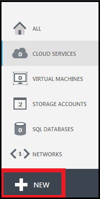
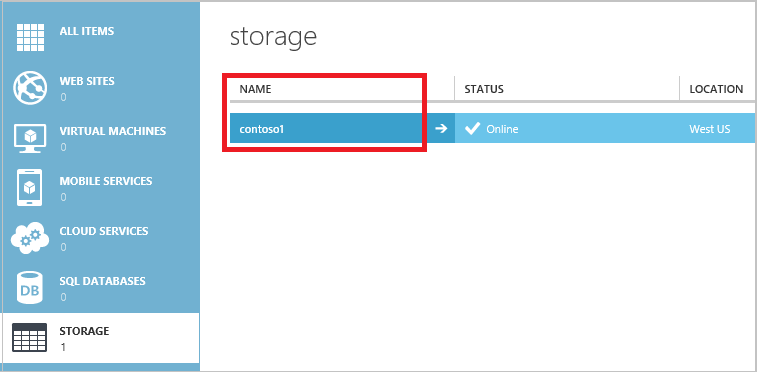

<properties linkid="manage-linux-common-task-upload-vhd" urlDisplayName="Upload a VHD" pageTitle="在 Azure 中创建和上载 Linux VHD - Azure 微软云" metaKeywords="Azure VHD, uploading Linux VHD, 创建和上载 Linux VHD, 虚拟硬盘" description="了解如何创建和上载具有 Linux 操作系统的 Azure 虚拟硬盘 (VHD)。本文演示了如何创建并上载虚拟硬盘 (VHD)，以便您可以将其用作您自己的映像以在 Azure 中创建虚拟机。您将了解如何准备操作系统，以便您可以使用它创建多个基于该映像的虚拟机。" metaCanonical="" services="virtual-machines" documentationCenter="" title="Creating and Uploading a Virtual Hard Disk that Contains the Linux Operating System" authors="kathydav" solutions="" manager="jeffreyg" editor="tysonn" />
<tags ms.service="virtual-machines"
    ms.date=""
    wacn.date=""
    />

# 创建并上传包含 Linux 操作系统的虚拟硬盘 

本文演示了如何创建并上载虚拟硬盘 (VHD)，以便您可以将其用作您自己的映像以在 Azure 中创建虚拟机。您将了解如何准备操作系统，以便您可以使用它创建多个基于该映像的虚拟机。  

> [WACOM.NOTE] 您不需要任何 Azure VM 的相关经验便可完成本文中的步骤。但是，您需要一个 Azure 帐户。只需几分钟即可创建一个免费的试用帐户。有关详细信息，请参阅[创建 Azure 帐户](/develop/php/tutorials/create-a-windows-azure-account/)。 

Azure 中的虚拟机运行基于您在创建虚拟机时选择的映像的操作系统。您的映像以 VHD 格式存储在存储帐户的 .vhd 文件中。有关 Azure 中的磁盘和映像的详细信息，请参阅[管理磁盘和映像](http://msdn.microsoft.com/zh-cn/library/windowsazure/jj672979.aspx)。

**注意**：创建虚拟机时，您可以自定义操作系统设置以快速运行您的应用程序。您设置的配置存储在该虚拟机的磁盘上。有关说明，请参阅[如何创建自定义虚拟机](/zh-cn/documentation/articles/virtual-machines-create-custom/)。

**重要说明**：只有在使用某个认可的分发的时候也使用[本文](http://support.microsoft.com/kb/2805216)中指定的配置详细信息时，Azure 平台 SLA 才适用于运行 Linux 操作系统的虚拟机。在 Azure 平台映像库中提供的所有 Linux 分发都是具有所需配置的认可的分发。

##先决条件##
本文假定您拥有以下项目：

- **管理证书** - 您已为要为其上载 VHD 的订阅创建一个管理证书，并且已将该证书导出到 .cer 文件。有关创建证书的详细信息，请参阅[为 Azure 创建管理证书](http://msdn.microsoft.com/library/windowsazure/gg551722.aspx)。 

- **安装在 .vhd 文件中的 Linux 操作系统** - 您已将受支持的 Linux 操作系统安装到虚拟硬盘。存在多种工具用于创建 .vhd 文件，例如您可以使用虚拟化解决方案（例如 Hyper-V）创建 .vhd 文件并安装操作系统。有关说明，请参阅[安装 Hyper-V 角色和配置虚拟机](http://technet.microsoft.com/library/hh846766.aspx)。 

	**重要说明**：Azure 不支持更新的 VHDX 格式。可使用 Hyper-V 管理器或 convert-vhd cmdlet 将磁盘转换为 VHD 格式。

	有关认可分发的列表，请参阅 [Azure 认可的分发上的 Linux](../linux-endorsed-distributions).或者，请参阅本文末尾的部分中的[非认可分发的信息](../virtual-machines-linux-create-upload-vhd-generic)。

- **Linux Azure 命令行工具。**如果您使用 Linux 操作系统创建映像，则使用此工具上载 VHD 文件。若要下载该工具，请参阅[适用于 Mac 和 Linux 的 Azure 命令行工具](http://go.microsoft.com/fwlink/?LinkID=253691&clcid=0x409)。

- **Add-AzureVhd cmdlet**，是 Azure PowerShell 模块的一部分。若要下载该模块，请参阅 [Azure 下载](/develop/downloads/)。有关参考信息，请参阅 [Add-AzureVhd](http://msdn.microsoft.com/zh-cn/library/azure/dn495173.aspx)。

此任务包括以下步骤：

- [步骤 1：准备要上载的映像] []
- [步骤 2：在 Azure 中创建存储帐户] []
- [步骤 3：准备连接到 Azure] []
- [步骤 4：向 Azure 上载映像] []

## 步骤 1：准备要上载的映像 ##

Windows Azure 支持多种 Linux 分发（请参阅[认可分发](../linux-endorsed-distributions)）。以下文章将指导您如何准备 Azure 上受支持的各种 Linux 分发：

- **[基于 CentOS 的分发](../virtual-machines-linux-create-upload-vhd-centos)**
- **[Oracle Linux](../virtual-machines-linux-create-upload-vhd-oracle)**
- **[SLES 和 openSUSE](../virtual-machines-linux-create-upload-vhd-suse)**
- **[Ubuntu](../virtual-machines-linux-create-upload-vhd-ubuntu)**
- **[其他 - 非认可分发](../virtual-machines-linux-create-upload-vhd-generic)**

完成上述指南中的步骤之后，您应该有一个可以上载到 Azure 中的 VHD 文件。

## 步骤 2：在 Azure 中创建存储帐户 ##

存储帐户表示用于访问存储服务的最高级别的命名空间，并且与您的 Azure 订阅相关联。您需要在 Azure 中具有存储帐户才能将 .vhd 文件上载到可用于创建虚拟机的 Azure。可使用 Azure 管理门户创建存储帐户。

1. 登录到 Azure 管理门户。

2. 在命令栏上，单击"新建"****。

	

3. 单击"存储帐户"****，然后单击"快速创建"****。

	

4. 如下所示填写字段：

	

- 在"URL"****下，键入要在存储帐户的 URL 中使用的子域名称。输入的名称可包含 3-24 个小写字母和数字。此名称将成为用于对订阅的 Blob、队列或表资源进行寻址的 URL 中的主机名。
	
- 选择存储帐户的位置或地缘组。通过指定地缘组，可将同一数据中心内的云服务与您的存储放置在一起。
 
- 决定是否使用存储帐户的地域复制。默认情况下启用地域复制。此选项会将您的数据免费复制到辅助位置，以便在发生无法在主要位置进行处理的严重故障时将您的存储故障转移到辅助位置。将自动分配辅助位置，并且无法对其进行更改。如果法律要求或组织政策要求更加严格地控制基于云的存储的位置，则您可以关闭地域复制。但是，请注意，如果稍后您打开地域复制，则将现有数据复制到辅助位置时将向您收取一次性数据传输费用。不具有地域复制的存储服务将以优惠价提供。

5. 单击"创建存储帐户"****。

	帐户现在列在"存储帐户"****下。

	

## 步骤 3：准备连接到 Azure ##

您首先需要在计算机和 Azure 中的订阅之间建立一个安全连接，然后才能上载 .vhd 文件。 

1. 打开 Azure PowerShell 窗口。

2. 类型： 

	`Get-AzurePublishSettingsFile`

	此命令将打开浏览器窗口，并自动下载包含信息的 .publishsettings 文件和 Azure 订阅的证书。 

3. 保存 .publishsettings 文件。 

4. 类型：

	`Import-AzurePublishSettingsFile <PathToFile>`

	其中"<PathToFile>"是.publishsettings 文件的完整路径。 

	有关详细信息，请参阅 [Azure Cmdlet 入门](http://msdn.microsoft.com/zh-cn/library/azure/jj554332.aspx) 

## 步骤 4：向 Azure 上载映像 ##

在上载 .vhd 文件时，您可以将 .vhd 文件放置在 Blob 存储中的任何位置。在以下命令示例中，**BlobStorageURL** 是您在步骤 2 中创建的存储帐户的 URL，**YourImagesFolder** 是要在其中存储映像的 Blob 存储中的容器。**VHDName** 是显示在管理门户中用于标识虚拟硬盘的标签。**PathToVHDFile** 是 .vhd 文件的完整路径和名称。 

执行下列操作之一：

- 从您在上一步中使用的 Azure PowerShell 窗口中，键入：

	`Add-AzureVhd -Destination <BlobStorageURL>/<YourImagesFolder>/<VHDName> -LocalFilePath <PathToVHDFile>`

	有关详细信息，请参阅 [Add-AzureVhd](http://msdn.microsoft.com/zh-cn/library/windowsazure/dn205185.aspx)。

- 使用 Linux 命令行工具上载映像。可使用以下命令上载映像：

		# azure vm image create <image-name> --location <location-of-the-data-center> --OS Linux <source-path-to the vhd>

[步骤 1：准备要上载的映像]: #prepimage
[步骤 2：在 Azure 中创建存储帐户]: #createstorage
[步骤 3：准备连接到 Azure]: #connect
[步骤 4：向 Azure 上载映像]: #upload

