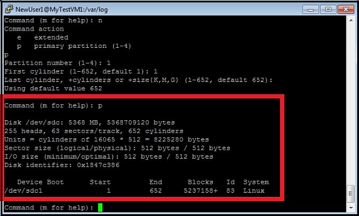

<properties linkid="manage-linux-howto-attach-a-disk" urlDisplayName="Attach a disk" pageTitle="在 Azure 中将磁盘附加到运行 Linux 的虚拟机" metaKeywords="disk VM Azure, initialize new disk Azure, initialize disk Azure Linux, attaching empty disk Azure" description="了解如何在 Azure 中将磁盘附加到虚拟机。" metaCanonical="/manage/windows/how-to-guides/attach-a-disk/" services="virtual-machines" documentationCenter="" title="" authors="" solutions="" manager="" editor="" />
<tags ms.service="virtual-machines"
    ms.date="01/26/2015"
    wacn.date="04/11/2015"
    />

#如何将数据磁盘附加到 Linux 虚拟机

您可以附加空磁盘和包含数据的磁盘。在这两种情况下，这些磁盘实际上是位于 Azure 存储帐户中的 .vhd 文件。此外在这两种情况下，在您附加磁盘后，您将需要初始化磁盘以使其可供使用。 

> [WACOM.NOTE] 它是使用一个或多个独立的磁盘来存储虚拟机的数据的最佳做法。当您创建 Azure 虚拟机时，它有一个操作系统和一个临时磁盘。**请不要使用临时磁盘存储数据。**顾名思义，它仅提供临时存储。它不提供冗余或备份，因为它不位于 Azure 存储中。 
> 临时磁盘通常由 Azure Linux 代理管理并自动装载到 **/mnt/resource**（或 Ubuntu 映像上的 **/mnt**）。另一方面，在 Linux 上，数据磁盘可能由内核命名为 `/dev/sdc`。如果是这种情况，您将需要对该资源进行分区、格式化和装载。请参阅 [Azure Linux 代理用户指南](/zh-cn/documentation/articles/virtual-machines-linux-agent-user-guide/) 有关详细信息。

- [如何：附加空磁盘](#attachempty)
- [如何：附加现有磁盘](#attachexisting)
- [如何：在 Linux 中初始化新的数据磁盘](#initializeinlinux)

[WACOM.INCLUDE [howto-attach-disk-windows-linux](../includes/howto-attach-disk-windows-linux.md)]

##如何：在 Linux 中初始化新的数据磁盘

1. 使用[如何登录到运行 Linux 的虚拟机][logonlinux]中列出的步骤连接到虚拟机。

2. 在 SSH 窗口中，键入下面的命令，然后输入为管理虚拟机而创建的帐户的密码：

		# sudo grep SCSI /var/log/messages

	您可以在所示消息中找到最后添加的数据磁盘的标识符。

	

3. 在 SSH 窗口中，键入下面的命令以新建设备，然后输入帐户密码：

		# sudo fdisk /dev/sdc

	>[WACOM.NOTE] 在此示例中，如果 /sbin 或 /usr/sbin 不在您的 `$PATH` 中，您在某些分发上可能需要使用 `sudo -i`。

4. 键入 **n** 以新建一个分区。

	

5. 键入 **p** 以将该分区设置为主分区，键入 **1** 以将其设置为第一分区，然后键入 Enter 以接受柱面的默认值。

	

6. 键入 **p** 以查看有关分区磁盘的详细信息。

	

7. 键入 **w** 以写入磁盘的设置。

	

8. 在新分区上创建文件系统。例如，键入以下命令，然后输入帐户密码：

		# sudo mkfs -t ext4 /dev/sdc1

	

	>[WACOM.NOTE] 注意，SUSE Linux Enterprise 11 系统对于 ext4 文件系统仅支持只读访问权限。对于这些系统，建议将新文件系统格式化为 ext3 而非 ext4。

9. 创建一个目录以装载新的文件系统。例如，键入以下命令，然后输入帐户密码：

		# sudo mkdir /datadrive

10. 键入下面的命令以安装驱动器：

		# sudo mount /dev/sdc1 /datadrive

	数据磁盘现在可以作为 **/datadrive** 使用。

11. 将新驱动器添加到 /etc/fstab：

	若要确保在重新引导后自动重新装载驱动器，必须将其添加到 /etc/fstab 文件。此外，强烈建议在 /etc/fstab 中使用 UUID（全局唯一标识符）来引用驱动器而不是只使用设备名称（即 /dev/sdc1）。若要查找新设备的 UUID，可以使用 **blkid** 实用程序：
	
		# sudo -i blkid

	输出与以下内容类似：

		/dev/sda1: UUID="11111111-1b1b-1c1c-1d1d-1e1e1e1e1e1e" TYPE="ext4"
		/dev/sdb1: UUID="22222222-2b2b-2c2c-2d2d-2e2e2e2e2e2e" TYPE="ext4"
		/dev/sdc1: UUID="33333333-3b3b-3c3c-3d3d-3e3e3e3e3e3e" TYPE="ext4"

	>[WACOM.NOTE] 错误地编辑 **/etc/fstab** 文件可能会导致系统无法引导。如果没有把握，请参考分发的文档来获取有关如何正确编辑该文件的信息。另外，建议在编辑之前创建 /etc/fstab 文件的备份。

	接下来，在文本编辑器中打开 **/etc/fstab** 文件。请注意，/etc/fstab 是系统文件，因此您将需要使用"sudo"编辑此文件，例如：

		# sudo vi /etc/fstab

	在此示例中，我们将使用在之前的步骤中创建的新 **/dev/sdc1** 设备的 UUID 值并使用装载点 **/datadrive**：将以下行添加到 **/etc/fstab** 文件的末尾：

		UUID=33333333-3b3b-3c3c-3d3d-3e3e3e3e3e3e   /datadrive   ext4   defaults   1   2

	另外，在基于 SUSE Linux 的系统上，您可能需要使用稍微不同的格式：

		/dev/disk/by-uuid/33333333-3b3b-3c3c-3d3d-3e3e3e3e3e3e   /   ext3   defaults   1   2

	现在，您可以通过简单地卸载并重新装载文件系统（即使用在之前的步骤中创建的示例装载点 `/datadrive`）来测试文件系统是否已正确装载： 

		# sudo umount /datadrive
		# sudo mount /datadrive

	如果 `mount` 命令产生错误，请检查 /etc/fstab 文件的语法是否正确。如果还创建了其他数据驱动器或分区，您同样也需要分别将其输入到 /etc/fstab 中。

	>[WACOM.NOTE] 之后，在不编辑 fstab 的情况下删除数据磁盘可能会导致 VM 无法引导。如果这是一种常见情况，则大部分分发都提供了 `nofail` 和/或 `nobootwait` fstab 选项，这些选项使系统在磁盘在启动时间装载失败时也能引导。有关这些参数的详细信息，请查阅分发的文档。

[logonlinux]: ../virtual-machines-linux-how-to-log-on/
