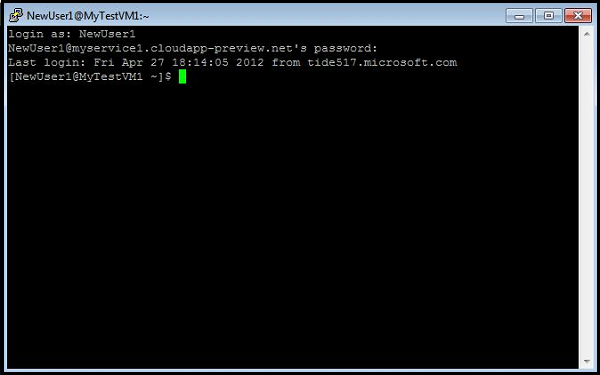

<properties linkid="manage-linux-howto-logon-linux-vm" urlDisplayName="Log on to a VM" pageTitle="在 Azure 中登录到运行 Linux 的虚拟机" metaKeywords="Azure Linux vm, Linux SSH" description="了解如何使用安全外壳 (SSH) 客户端登录到运行 Linux 的 Azure 虚拟机。" metaCanonical="" services="virtual-machines" documentationCenter="" title="How to Log on to a Virtual Machine Running Linux" authors="" solutions="" manager="" editor="" />
<tags ms.service="virtual-machines"
    ms.date="03/16/2015"
    wacn.date="04/11/2015"
    />

#如何登录到运行 Linux 的虚拟机 #

对于运行 Linux 操作系统的虚拟机，您可以使用安全外壳 (SSH) 客户端进行登录。

需要在用于登录到虚拟机的计算机上安装 SSH 客户端。您可以选择很多 SSH 客户端程序。以下是可能的选项：

- 在运行 Windows 操作系统的计算机上，您可能希望使用 PuTTY 之类的 SSH 客户端。有关详细信息，请参阅 [PuTTY 下载页](http://www.chiark.greenend.org.uk/~sgtatham/putty/download.html)。
- 在运行 Linux 操作系统的计算机上，您可能希望使用 OpenSSH 之类的 SSH 客户端。有关详细信息，请参阅 [OpenSSH](http://www.openssh.org)。

>[WACOM.NOTE] 有关更多要求和疑难解答提示，请参阅[使用 RDP 或 SSH 连接到 Azure 虚拟机](http://go.microsoft.com/fwlink/p/?LinkId=398294)。 

此过程将向您演示如何使用 PuTTY 程序访问虚拟机。

1. 从[管理门户](http://manage.windowsazure.cn)中查找**主机名**和**端口信息**。您可以从虚拟机的仪表板中找到所需信息。单击虚拟机名称并查看仪表板"速览"****部分中的"SSH 详细信息"****。

	

2. 打开 PuTTY 程序。

3. 输入您从仪表板中收集到的主机名和端口信息，然后单击"打开"****。

	

4. 使用您在创建虚拟机时指定的帐户登录到虚拟机。默认用户名为 azureuser。

	

>[WACOM.NOTE] VMAccess 扩展可帮助您重置 SSH 密钥或密码（如果您忘记了它）。如果您忘记了用户名，可以使用该扩展和 sudo 颁发机构创建新的用户名。有关说明，请参阅[如何重置 Linux 虚拟机的密码或 SSH]。 
	
您现在可以像使用任何其他服务器一样使用该虚拟机。

<!-- LINKS -->
[如何重置 Linux 虚拟机的密码或 SSH]: http://go.microsoft.com/fwlink/p/?LinkId=512138
