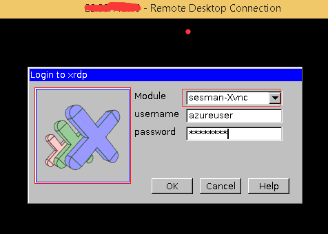

<properties
	pageTitle="远程桌面到 Linux VM | Windows Azure"
	description="了解如何安装和配置远程桌面以连接到 Windows Azure Linux VM"
	services="virtual-machines"
	documentationCenter=""
	authors="SuperScottz"
	manager="timlt"
	editor=""
	tags="azure-service-management"/>

<tags
	ms.service="virtual-machines"
	ms.date="09/14/2015"
	wacn.date="11/12/2015"/>

#使用远程桌面连接到 Windows Azure Linux VM

[AZURE.INCLUDE [了解部署模型](../includes/learn-about-deployment-models-include.md)]本文介绍如何使用经典部署模型管理资源。

##概述

RDP（远程桌面协议）是用于 Windows 的专用协议。我们如何使用 RDP 远程连接至 Linux VM（虚拟机）？

此指南将为你提供答案！ 它将帮助你在 Windows Azure Linux VM 上安装和配置 xrdp，并且你能够从一台 Windows 计算机通过远程桌面连接与其连接。在本指南中，我们将使用运行 Ubuntu 或 OpenSUSE 的 Linux VM 作为示例。

Xrdp 是一个开源 RDP 服务器，支持你从 Windows 计算机通过远程桌面连接连接到 Linux 服务器。它比 VNC（虚拟网络计算）表现得更好。VNC 具有“JPEG”质量和行为慢的特征，而 RDP 则快速清晰。

> [AZURE.NOTE]你必须已有运行 Linux 的 Windows Azure VM。

##为远程桌面创建终结点
在本文档中，我们将使用默认终结点 3389 进行远程连接。因此，将 Linux VM 的 3389 终结点设置为远程桌面，如下所示：

如果你不知道如何设置 VM 的终结点，请参阅[指南](/documentation/articles/virtual-machines-set-up-endpoints)。

##安装 Gnome 桌面

通过 putty 连接至你的 Linux VM，并安装 `Gnome Desktop`。

对于 Ubuntu，使用：

	#sudo apt-get update
	#sudo apt-get install ubuntu-desktop

对于 OpenSUSE，使用：

	#sudo zypper install gnome-session

##安装 xrdp

对于 Ubuntu，使用：

	#sudo apt-get install xrdp

对于 OpenSUSE，使用：

> [AZURE.NOTE]在下面的命令中，使用你正在使用的版本更新 OpenSUSE 版本，下面是 `OpenSUSE 13.2` 的一个示例命令。

	#sudo zypper in http://download.opensuse.org/repositories/X11:/RemoteDesktop/openSUSE_13.2/x86_64/xrdp-0.9.0git.1401423964-2.1.x86_64.rpm
    #sudo zypper install tigervnc xorg-x11-Xvnc xterm remmina-plugin-vnc

##启动时启动 xrdp 并设置 xdrp 服务

对于 OpenSUSE，使用：

	#sudo systemctl start xrdp
	#sudo systemctl enable xrdp

对于 Ubuntu，安装后，在启动时会自动启动并启用 xrdp。

##如果你使用的是比 Ubuntu 12.04LTS 更高的 Ubuntu 版本，请使用 xfce

因为当前 xrdp 可能不支持比 Ubuntu 12.04LTS 更高的 Ubuntu 版本的 Gnome 桌面，我们将使用 `xfce` 桌面。

安装 `xfce`，使用：

    #sudo apt-get install xubuntu-desktop

然后启用 `xfce`，使用：

    #echo xfce4-session >~/.xsession

编辑配置文件 `/etc/xrdp/startwm.sh`，使用：

    #sudo vi /etc/xrdp/startwm.sh   

在 `/etc/X11/Xsession` 行之前添加 `xfce4-session` 行。

重新启动 xrdp 服务，使用：

    #sudo service xrdp restart

##从 Windows 计算机连接 Linux VM
在 Windows 计算机中，启动远程桌面客户端，输入 Linux VM DNS 名称，或转到 Azure 门户的 VM 的 `Dashboard`，单击 `Connect` 以连接 Linux VM，你将看到下面的登录窗口：

使用你的 Linux VM 的 `user` 和 `password` 登录，立即从你的 Windows Azure Linux VM 使用远程桌面！

##下一步
有关使用 xrdp 的详细信息，请参考[此处](http://www.xrdp.org/)。

<!---HONumber=79-->