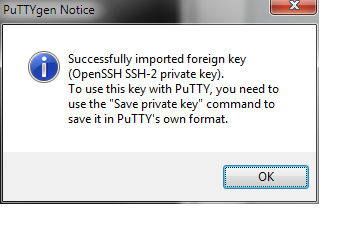
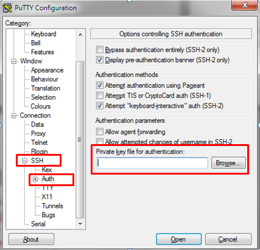

<properties 
	pageTitle="在 Windows 上使用 SSH 连接到 Linux 虚拟机 | Azure" 
	description="了解如何在 Windows 计算机上生成和使用 SSH 密钥连接到 Azure 上的 Linux 虚拟机。" 
	services="virtual-machines" 
	documentationCenter="" 
	authors="squillace" 
	manager="timlt" 
	editor=""
	tags="azure-service-management,azure-resource-manager" />

<tags
	ms.service="virtual-machines"
	ms.date="01/04/2016"
	wacn.date="02/26/2016"/>

#如何在 Azure 上结合使用 SSH 和 Windows

> [AZURE.SELECTOR]
- [Windows](/documentation/articles/virtual-machines-linux-ssh-from-windows)
- [Linux/Mac](/documentation/articles/virtual-machines-linux-ssh-from-linux)

本主题介绍了如何在 Windows 上创建和使用 **ssh-rsa** 与 **.pem** 格式的公钥和私钥文件，并且你可以使用这些文件通过 **ssh** 命令连接到 Azure 上的 Linux VM。如果你已经创建了 **.pem** 文件，则可以使用那些文件创建 Linux VM，并且可以使用 **ssh** 连接到这些 VM。其他几个命令使用 **SSH** 协议和密钥文件来安全地执行工作。其中值得注意的是 **scp** 或 [安全复制](https://en.wikipedia.org/wiki/Secure_copy)，通过这两个命令可以安全地将文件复制到支持 **SSH** 连接的计算机或从该计算机中复制文件。

## 你需要哪些 SSH 和密钥创建计划？

**SSH** &#8212; 或 [secure shell](https://en.wikipedia.org/wiki/Secure_Shell) &#8212; 是一种加密的连接协议，利用该协议可以通过未受保护的连接进行安全登录。它是适用于 Azure 中托管的 Linux VM 的默认连接协议，除非你配置自己的 Linux VM 来启用其他一些连接机制。Windows 用户还可以使用 **ssh** 客户端实现连接到 Azure 中的 Linux VM 并对其进行管理，但 Windows 计算机通常不会附带 **ssh** 客户端，因此你需要选择一个。

可以安装的常见客户端包括：

- [puTTY 和 puTTYgen](http://www.chiark.greenend.org.uk/~sgtatham/putty/)
- [MobaXterm](http://mobaxterm.mobatek.net/)
- [Cygwin](https://cygwin.com/)
- [Git For Windows](https://git-for-windows.github.io/)，其中附带了环境和工具

如果你特别技术狂，则还可以尝试使用 [用于 Windows 的 **OpenSSH** 工具集新端口](http://blogs.msdn.com/b/powershell/archive/2015/10/19/openssh-for-windows-update.aspx)。但是，请注意这是当前处于开发阶段的代码，用于生产系统之前，你应该查看代码库。

> [AZURE.INCLUDE [了解部署模型](../includes/learn-about-deployment-models-both-include.md)]

## 你需要创建哪些密钥文件？

Azure 的基本 SSH 设置包括从 **id\_rsa** 私钥文件生成的 `.pem` 文件，以供与经典门户的经典部署模型一起使用。

使用[管理门户](https://manage.windowsazure.cn)创建 VM 时必需使用 .pem 文件。使用 [Azure CLI](/documentation/articles/xplat-cli-install) 的经典部署中也支持.pem 文件。

> [AZURE.NOTE] 如果你计划管理使用经典部署模型部署的服务，则可能还要创建 **.cer** 格式的文件来上载到门户，尽管这不涉及 **ssh** 或连接到 Linux VM，但这是本文的主题。若要在 Linux 或 Mac 上创建那些文件，请键入

## 获得适用于Windows的ssh-keygen和openssl工具 ##

[本部分](#What-SSH-and-key-creation-programs-do-you-need)的上述内容列出了多个包括适用于 Windows 的 `ssh-keygen` 和 `openssl` 的实用工具。下面列出了几个示例：

### 使用 Msysgit ###

1.	从以下位置下载并安装 msysgit：[http://msysgit.github.com/](http://msysgit.github.com/)
2.	从安装目录运行 `msys`（示例：c:\\msysgit\\msys.exe）
3.	通过键入 `cd bin` 更改为 `bin` 目录

### 使用针对 Windows 的 GitHub ###

1.	从以下位置下载并安装 GitHub for Windows：[http://windows.github.com/](http://windows.github.com/)
2.	从“开始”菜单 >“所有程序”>“GitHub, Inc”运行 Git Shell

> [AZURE.NOTE] 在运行上述 `openssl` 命令时，可能会遇到以下错误：

        Unable to load config info from /usr/local/ssl/openssl.cnf

解决此问题的最简单方法是设置 `OPENSSL_CONF` 环境变量。此变量的设置过程将因已在 Github 中配置的 shell 而异：

**Powershell：**

        $Env:OPENSSL_CONF="$Env:GITHUB_GIT\ssl\openssl.cnf"

**CMD：**

        set OPENSSL_CONF=%GITHUB_GIT%\ssl\openssl.cnf

**Git Bash：**

        export OPENSSL_CONF=$GITHUB_GIT/ssl/openssl.cnf
	

###使用 Cygwin###

1.	从以下位置下载并安装 Cygwin：[http://cygwin.com/](http://cygwin.com/)
2.	确保安装了 OpenSSL 包及其所有依赖项。
3.	运行 `cygwin`

## 创建私钥##

1.	按照上述某组说明进行操作，以便能够运行 `openssl.exe`
2.	键入以下命令：

		# openssl.exe req -x509 -nodes -days 365 -newkey rsa:2048 -keyout myPrivateKey.key -out myCert.pem

3.	您的屏幕应与下图中所示类似：

	

4.	回答询问的问题。
5.	应已创建两个文件：`myPrivateKey.key` 和 `myCert.pem`。
6.	如果你要直接使用 API，而不使用管理门户，请使用以下命令将 `myCert.pem` 转换为 `myCert.cer`（DER 编码的 X509 证书）：

		# openssl.exe  x509 -outform der -in myCert.pem -out myCert.cer

## 为 Putty 创建 PPK ##

1. 从以下位置下载并安装 Puttygen：[http://www.chiark.greenend.org.uk/~sgtatham/putty/download.html](http://www.chiark.greenend.org.uk/~sgtatham/putty/download.html)

2. Puttygen 可能不能读取先前创建的私钥 (`myPrivateKey.key`)。运行以下命令以将其转换为 Puttygen 可以识别的 RSA 私钥：

		# openssl rsa -in ./myPrivateKey.key -out myPrivateKey_rsa
		# chmod 600 ./myPrivateKey_rsa

	上面的命令应生成名为 myPrivateKey\_rsa 的新私钥。

3. 运行 `puttygen.exe`

4. 单击菜单：“文件”>“加载私钥”

5. 查找上述名为 `myPrivateKey_rsa` 的私钥。你将需要更改文件筛选器以显示**“所有文件 (\*.\*)”**

6. 单击**“打开”**。您将收到与如下所示的提示：

	

7. 单击**“确定”**

8. 单击在下面的屏幕截图中突出显示的**“保存私钥”**：

	

9. 将文件另存为 PPK

## 使用 Putty 连接到 Linux 计算机 ##

1.	从以下位置下载并安装 putty：[http://www.chiark.greenend.org.uk/~sgtatham/putty/download.html](http://www.chiark.greenend.org.uk/~sgtatham/putty/download.html)
2.	运行 putty.exe
3.	从管理门户使用 IP 填充主机名：

	

4.	在选择**“打开”**之前，依次单击“连接”>“SSH”>“身份验证”选项卡以选择你的密钥。在下面的屏幕截图中查看要填充的字段：

	

5.	单击**“打开”**以连接到你的虚拟机
 

<!---HONumber=Mooncake_0215_2016-->