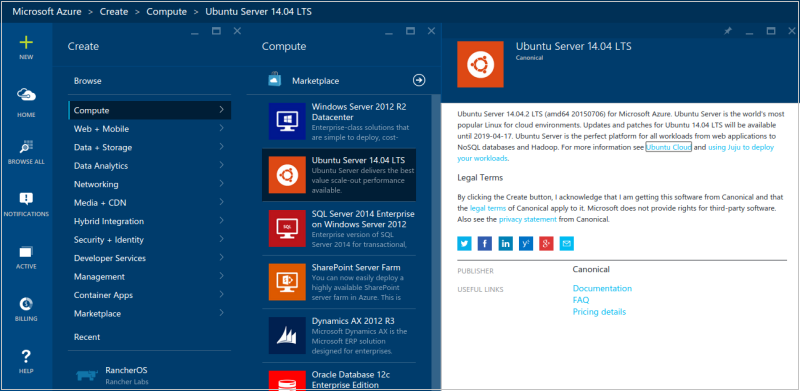
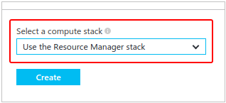
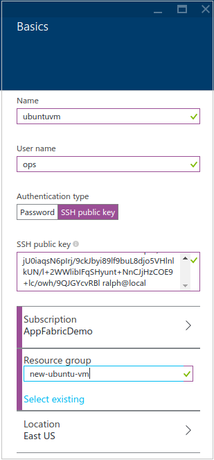
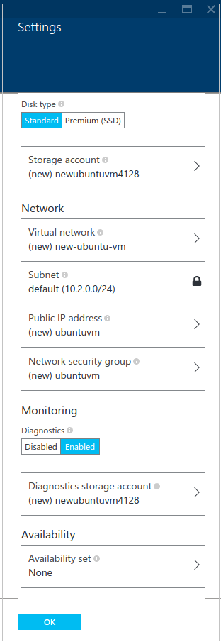
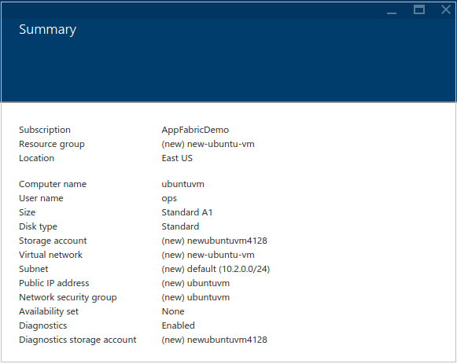
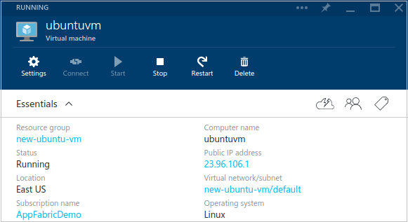

<properties
	pageTitle="在 Azure 门户中创建运行 Linux 的 Azure 虚拟机 | Microsoft Azure"
	description="在 Azure 门户中使用 Azure 资源组创建运行 Linux 的 Azure 虚拟机 (VM)。"
	services="virtual-machines"
	documentationCenter=""
	authors="squillace"
	manager="timlt"
	editor="tysonn"
	tags="azure-resource-manager"/>

<tags
	ms.service="virtual-machines-linux"
	ms.date="10/21/2015"
	wacn.date="06/07/2016"/>

# 使用 Azure 预览门户创建运行 Linux 的虚拟机

> [AZURE.SELECTOR]
- [Azure CLI](/documentation/articles/virtual-machines-linux-tutorial)
- [Azure Preview Portal](/documentation/articles/virtual-machines-linux-portal-create)

 [AZURE.INCLUDE [了解部署模型](../includes/learn-about-deployment-models-rm-include.md)]经典部署模型。

创建运行 Linux 的 Azure 虚拟机 (VM) 是一项很简单的操作。本教程演示如何使用 Azure 预览门户快速创建一个虚拟机，并使用 `~/.ssh/id_rsa.pub` 公钥文件来保护到 VM 的 **SSH** 连接。你也可以[将自己的映像作为模板](/documentation/articles/virtual-machines-linux-create-upload-vhd)来创建 Linux VM。

> [AZURE.NOTE]本教程创建的 Azure 虚拟机将由 Azure 资源组 API 管理。有关详细信息，请参阅 [Azure 资源组概述](/documentation/articles/resource-group-overview)。

[AZURE.INCLUDE [free-trial-note](../includes/free-trial-note.md)]

## 选择映像

前往预览门户中的 Azure 应用商店，找到所需的 Windows Server VM 映像。

1. 登录[预览门户](https://manage.windowsazure.cn)。

2. 在“中心”菜单上，单击“新建”>“计算”>“Ubuntu Server 14.04 LTS”。

	

	> [AZURE.TIP]若要查找其他映像，请单击“应用商店”，然后搜索或筛选可用的项。

3. 在“Ubuntu Server 14.04 LTS”页面的底部，选择“使用资源管理器堆栈”以便在 Azure 资源管理器中创建 VM。请注意，对于大多数新的工作负荷，建议使用资源管理器堆栈。有关注意事项，请参阅 [Azure 资源管理器下的 Azure 计算、网络和存储提供程序](/documentation/articles/virtual-machines-azurerm-versus-azuresm)。

4. 接下来，单击 。

	

## 创建虚拟机

选择映像后，可以对大多数配置使用 Azure 的默认设置并快速创建 VM。

1. 在“创建虚拟机”边栏选项卡上，单击“基本信息”。输入要用于 VM 的“名称”和公钥文件（在本例中，该文件来自 `~/.ssh/id_rsa.pub` 文件并采用 **ssh-rsa** 格式）。如果有多个订阅，请为新 VM 指定一个订阅，并指定一个新的或现有的**资源组**以及 Azure 数据中心的**位置**。

	

	> [AZURE.NOTE]如果不想使用公钥和私钥交换来保护 **ssh** 会话的安全，你还可以在此处选择用户名/密码身份验证并输入该信息。

2. 单击“大小”并选择适合你需要的 VM 大小。每种大小都指定了计算核心的数量、内存以及其他功能，比如对高级存储的支持，这将对价格产生影响。根据所选的映像，Azure 将自动推荐特定的大小。完成后，单击 。

	>[AZURE.NOTE]某些地区的 DS 系列虚拟机提供高级存储。高级存储是数据密集型工作负荷（如数据库）的最佳存储选项。有关详细信息，请参阅[高级存储：适用于 Azure 虚拟机工作负荷的高性能存储](/documentation/articles/storage-premium-storage-preview-portal)。

3. 单击“设置”以查看新 VM 的存储和网络设置。对于第一个 VM，一般可以接受默认设置。如果选择了支持它的 VM 大小，则可以通过选择“磁盘类型”下的“高级(SSD)”来试用高级存储。完成后，单击 。

	

6. 单击“摘要”以查看你的配置选择。查看或更新完设置后，单击 。

	

8. 当 Azure 创建 VM 时，你可以在“中心”菜单中的“通知”中跟踪进度。当 Azure 创建 VM 后，你将在启动板上看到它，除非你清除了“创建虚拟机”边栏选项卡中的“固定到启动板”。

	> [AZURE.NOTE]请注意，与使用服务管理计算堆栈在云服务内创建 VM 不同的是，这种情况下的摘要不包含公共 DNS 名称。

## 使用 **ssh** 连接到你的 Azure Linux VM

现在可以使用 **ssh** 以标准方式连接到 Ubuntu VM。但是，你将需要通过打开 Azure VM 及其资源的相应磁贴来发现分配给该 VM 的 IP 地址。你可以通过以下方式打开磁贴：单击“浏览”，然后选择“最近”并查找你创建的 VM，或者在启动板上单击为你创建的磁贴。在任一情况下，都要找到并复制下图所示的“公共 IP 地址”的值。

现在一切准备就绪，你可以使用 **ssh** 连接到你的 Azure VM 了。

	ssh ops@23.96.106.1 -p 22
	The authenticity of host '23.96.106.1 (23.96.106.1)' can't be established.
	ECDSA key fingerprint is bc:ee:50:2b:ca:67:b0:1a:24:2f:8a:cb:42:00:42:55.
	Are you sure you want to continue connecting (yes/no)? yes
	Warning: Permanently added '23.96.106.1' (ECDSA) to the list of known hosts.
	Welcome to Ubuntu 14.04.2 LTS (GNU/Linux 3.16.0-43-generic x86_64)

	 * Documentation:  https://help.ubuntu.com/

	  System information as of Mon Jul 13 21:36:28 UTC 2015

	  System load: 0.31              Memory usage: 5%   Processes:       208
	  Usage of /:  42.1% of 1.94GB   Swap usage:   0%   Users logged in: 0

	  Graph this data and manage this system at:
	    https://landscape.canonical.com/

	  Get cloud support with Ubuntu Advantage Cloud Guest:
	    http://www.ubuntu.com/business/services/cloud

	0 packages can be updated.
	0 updates are security updates.

	The programs included with the Ubuntu system are free software;
	the exact distribution terms for each program are described in the
	individual files in /usr/share/doc/*/copyright.

	Ubuntu comes with ABSOLUTELY NO WARRANTY, to the extent permitted by
	applicable law.

	ops@ubuntuvm:~$

> [AZURE.NOTE]此外，还可以在门户中为虚拟机配置完全限定域名 (FQDN)。在[此处](/documentation/articles/virtual-machines-create-fqdn-on-portal)阅读有关 FQDN 的详细信息。

## 后续步骤

若要了解有关 Azure 上的 Linux 的详细信息，请参阅：

- [Azure 上的 Linux 和开源计算](/documentation/articles/virtual-machines-linux-opensource)

- [如何使用针对 Mac 和 Linux 的 Azure 命令行工具](/documentation/articles/virtual-machines-command-line-tools)

- [使用适用于 Linux 的 Azure CustomScript 扩展部署 LAMP 应用程序](/documentation/articles/virtual-machines-linux-script-lamp)

- [Azure 上用于 Linux 的 Docker 虚拟机扩展](/documentation/articles/virtual-machines-docker-vm-extension)

<!---HONumber=Mooncake_1221_2015-->
