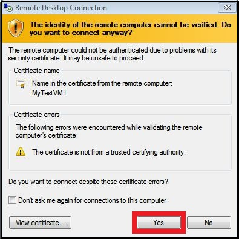

<properties linkid="manage-windows-howto-logon" urlDisplayName="Log on to a VM" pageTitle="登录到运行 Windows Server 的虚拟机" metaKeywords="Azure logging on vm, vm portal" description="了解如何在登录到运行 Windows Server 2008 R2，通过使用 Azure 管理门户的虚拟机。" metaCanonical="" services="virtual-machines" documentationCenter="" title="How to Log on to a Virtual Machine Running Windows Server" authors="kathydav" solutions="" manager="jeffreyg" editor="tysonn" />
<tags ms.service="virtual-machines"
    ms.date="03/23/2015"
    wacn.date=""
    />

#如何登录到运行 Windows Server # 的虚拟机

对于运行 Windows Server 操作系统的虚拟机，您使用连接按钮在管理门户中启动远程桌面连接。 

>[WACOM.NOTE] 如果您需要重置用户名或密码时，或在虚拟机中启用 RDP，则可以使用 [VMAccess](http://msdn.microsoft.com/library/azure/dn606308.aspx) 扩展插件以执行此操作。有关要求和故障排除提示，请参阅[连接到 Azure 虚拟机使用 RDP 或 SSH](http://msdn.microsoft.com/library/azure/dn535788.aspx)。

1. 如果尚未这样做，登录到[Azure 管理门户](http://manage.windowsazure.cn)。

2. 单击**虚拟机**，然后选择相应的虚拟机。

3. 在命令栏中，单击**连接**。

	

4. 单击**打开**要用于虚拟机自动创建的远程桌面协议文件。
	
5. 单击**连接**以继续。

	

6. 在虚拟机中，键入用户名称和管理帐户的密码，然后单击**确定**。这是用户名和密码，则当您创建指定虚拟机，除非虚拟机现在是一个域控制器。在这种情况下，键入用户名和域的域管理员帐户的密码。
	
	
7. 单击**是**若要验证虚拟机的标识。

	

	你现在可以像使用任何其他服务器一样使用该虚拟机。

