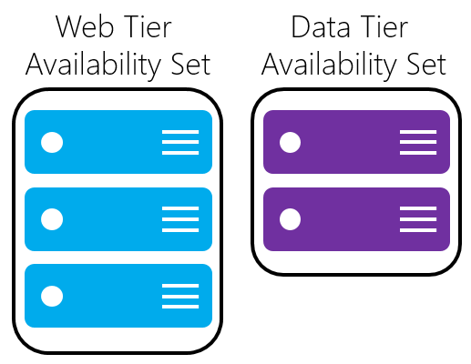

<properties linkid="manage-windows-common-tasks-vm-availability" urlDisplayName="Manage Availability of VMs" pageTitle="管理虚拟机的可用性 - Azure 微软云" metaKeywords="Azure,Virtual Machine,虚拟机,冗余,高可用性,负载平衡,高可用性最佳实践,负载平衡器" description="本文首先概览了计划的和计划外的维护事件，然后介绍了多种应用程序实现高可靠性的最佳做法，包括：配置多个虚拟机中的冗余的可用性集、将多个应用层配置到不同的可用性集中、合并负载均衡器使用可用性集及避免单一实例中的可用性集中的虚拟机。" metaCanonical="" services="virtual-machines" documentationCenter="" title="" authors="kenazk" solutions="" manager="dongill" editor="tysonn" />
<tags ms.service="virtual-machines"
    ms.date=""
    wacn.date=""
    />

#管理虚拟机的可用性

## 了解计划而不是计划外维护
有两种类型的可能会影响您的虚拟机的可用性的 Azure 平台事件： 计划的维护和计划外的维护。

- **计划的维护事件**是由 microsoft 开发对底层 Azure 平台以提高总体可靠性、 性能和安全性的虚拟机运行的平台基础结构的定期更新。而不影响您的虚拟机或云服务执行的大部分这些更新。但是，有一些的实例，这些更新需要重新启动到虚拟机将所需的更新应用于平台基础结构。 

- **计划外的维护事件**时的硬件或物理基础结构基础虚拟机出现故障以某种方式发生。这可能包括本地网络故障、 本地磁盘故障或其他机架级故障。检测到此类故障时，Azure 平台从状态不良的物理计算机承载的运行状况良好的物理机到虚拟机将自动迁移虚拟机。此类事件很少见，但也可能会导致您的虚拟机重新启动。 

## 在设计您的应用程序以实现高可用性时遵循的最佳做法
若要减少由于一个或多个事件而导致的停机时间的影响，我们建议以下高可用性虚拟机的最佳实践：

* [配置多个虚拟机中的冗余的可用性集]
* [将每个应用层配置到不同的可用性集中]
* [合并负载平衡器使用可用性集]
* [避免单一实例中的可用性集中的虚拟机]

### 配置多个虚拟机中的冗余的可用性集 
若要提供给您的应用程序的冗余，我们建议您在一个可用性集的两个或多个虚拟机进行分组。此配置可以确保在计划内或计划外维护事件期间至少一台虚拟机将可用并满足 99.95%Azure SLA。有关服务级别协议的详细信息，请参阅中的"云服务、 虚拟机和虚拟网络"部分[服务级别协议](/support/legal/sla/). 

在您的可用性集的每个虚拟机分配更新域 (UD) 和容错域 (FD) 由基础的 Azure 平台。为给定可用性集时，五个非用户配置 Ud 分配以指示虚拟机和在同一时间就会重新引导的底层物理硬件的组。当在单个可用性集内配置时超过五个虚拟机时，第六个虚拟机将放入同一 UD 作为第一个虚拟机与第二个虚拟机，相同的 UD 中的第七个，依此类推。计划维护期间不能按顺序继续 Ud 正在重新启动的顺序，但只有一个 UD 将重新启动一次。

Fd 定义共享常见的电源源与网络交换机的虚拟机的组。默认情况下，在您的可用性集内配置虚拟机跨两个 Fd 分隔。虽然将虚拟机放入一个可用性集不会从操作系统，也不特定于应用程序故障中保护您的应用程序，它却限制潜在的物理硬件故障、 网络中断或电源中断的影响。   

<!--Image reference-->
   

### 将每个应用层配置到单独的可用性集
如果可用性组中的虚拟机都几乎完全相同，并且用于您的应用程序相同的目的，我们建议您将配置您的应用程序的每个层的可用性集。如果在同一可用性集中放置两个不同的层，可以一次重新启动在相同的应用程序层的所有虚拟机。通过配置在至少两台虚拟机中的每个层的可用性集，您保证至少一个在每个虚拟机层将可用。   

例如，您可以将所有虚拟机放在运行 IIS、 Apache、 Nginx 等一单个可用性组中的应用程序的前端。请确保仅前端的虚拟机将放置在同一个可用性集中。同样，请确保 SQL Server 虚拟机或您 MySQL 的虚拟机仅数据层的虚拟机将放置在他们自己可用性集时，像您复制中。

<!--Image reference-->
   

 
### 合并负载平衡器使用可用性集
结合使用可用性集以获取最大应用程序复原 Azure 负载平衡器。Azure 负载平衡器分配多个虚拟机之间的流量。对于我们的标准层虚拟机，则包含 Azure 负载平衡器。请注意并非所有虚拟机层都包括 Azure 负载平衡器。有关虚拟机进行负载平衡的详细信息，请阅读[虚拟机进行负载平衡](/documentation/articles/load-balance-virtual-machines/)。 

如果未配置负载平衡器来平衡跨多个虚拟机的通信，任何计划内的维护事件将会影响仅流量提供虚拟机导致到应用层服务中断。放置在同一个负载平衡器和可用性集下，在同一层的多个虚拟机可以使流量可以不断地提供至少一个实例。 

### 避免单一实例中的可用性集中的虚拟机
避免在可用性集中的单个实例的虚拟机保留具体本身。在此配置中的虚拟机 SLA 保证不符合条件，并将在 Azure 的计划内的维护事件过程中遇到的停机时间。此外，如果部署在可用性集中的单个虚拟机实例时，您会收到任何高级的警告或平台维护的通知。单个虚拟机实例可以在此配置中，并且将重新启动不出现任何高级警告平台维护发生时。

[配置多个虚拟机中的冗余的可用性集]: #configure-multiple-virtual-machines-in-an-availability-set-for-redundancy 
[将每个应用层配置到单独的可用性集]: #configure-each-application-tier-into-separate-availability-sets 
[合并负载平衡器使用可用性集]: #combine-the-load-balancer-with-availability-sets 
[避免单一实例中的可用性集中的虚拟机]: #avoid-single-instance-virtual-machines-in-availability-sets 

 

