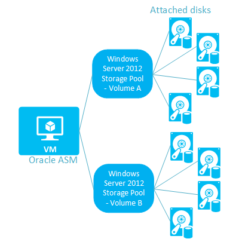

<properties pageTitle="Oracle 虚拟机映像的其他相关注意事项" description="在 Windows Azure 中部署 Oracle 虚拟机之前了解其他注意事项。" services="virtual-machines" authors="bbenz" documentationCenter=""/>
<tags ms.service="virtual-machines"  ms.date="06/22/2015" wacn.date="08/29/2015" />
#Oracle 虚拟机映像的其他相关注意事项
本文介绍了 Azure 上的 Oracle 虚拟机的相关注意事项，Oracle 虚拟机基于 Microsoft 提供的、以 Windows Server 为操作系统的 Oracle 软件映像。

-  Oracle 数据库虚拟机映像
-  Oracle WebLogic Server 虚拟机映像
-  Oracle JDK 虚拟机映像

##Oracle 数据库虚拟机映像
### 不支持群集 (RAC)

Azure 当前不支持 Oracle 数据库群集。只允许出现独立的 Oracle 数据库实例。这是因为 Azure 当前不支持在多个 VM 实例之间以读/写方式进行虚拟磁盘共享。此外，也不支持 UDP 多播。

### 无静态内部 IP

Azure 向每个虚拟机分配一个内部 IP 地址。除非 VM 是虚拟网络的一部分，否则，该 VM 的 IP 地址将为动态地址，可能会在 VM 重新启动后发生改变。这会导致某些问题，因为 Oracle 数据库要求 IP 地址是静态地址。若要避免此问题，请考虑将该 VM 添加到 Azure 虚拟网络中。有关详细信息，请参阅[虚拟网络](http://www.windowsazure.cn/home/features/networking/)和[在 Azure 中创建虚拟网络](/documentation/articles/create-virtual-network)。

### 附加磁盘配置选项

你可以将数据文件放在 VM 的操作系统 (OS) 磁盘或附加磁盘（也称为数据磁盘）上。相比 OS 磁盘，附加磁盘可能会提供更出色的性能和大小灵活性。OS 磁盘仅对 10 GB 以下的数据库更具优势。

附加磁盘依赖于 Azure Blob 存储服务。理论上，每个磁盘的每秒最大输入/输出操作次数 (IOPS) 都可以达到 500 次左右。附加磁盘的初始性能可能未达到最佳状态，但在经过一个“烧机”周期的连续操作（约 60-90 分钟）后，其 IOPS 性能可能会显著提高。如果磁盘随后保持空闲状态，其 IOPS 性能可能会降低，直至开始另一个烧机周期的连续操作。简而言之，磁盘越活跃，达到最佳 IOPS 性能的可能性就越大。

最简单的方法是向 VM 附加单个磁盘并将数据库文件放在该磁盘上，但这种方法在性能上也最受限制。相反，如果使用多个附加磁盘并将数据库数据分散到这些磁盘上，然后使用 Oracle 自动存储管理 (ASM)，通常可以提高有效的 IOPS 性能。有关详细信息，请参阅 [Oracle 自动存储概述](http://www.oracle.com/technetwork/database/index-100339.html)。虽然可以使用多个磁盘的 OS 级别条带化，但不建议采用这种方法，因为尚不清楚它能否提高 IOPS 性能。

请考虑采用以下两种不同的方法来附加多个磁盘，具体取决于你是优先考虑数据库的读取操作性能还是写入操作性能：

- **Oracle ASM 自身**可能会带来更好的写入操作性能，但相比使用 Windows Server 2012 存储池的方法，其读取操作 IOPS 性能更差。下图从逻辑上描绘了这种排列方式。

- **使用 Windows Server 2012 存储池的 Oracle ASM** 在数据库主要执行读取操作或者你更重视读取操作性能而非写入操作性能的情况下，可能会带来更好的读取操作 IOPS 性能。这种方法需要基于 Windows Server 2012 操作系统的映像。有关存储池的详细信息，请参阅[在独立服务器上部署存储空间](http://technet.microsoft.com/zh-cn/library/jj822938.aspx)。在这种排列方式中，首先在两个存储池卷中将两个同等的附加磁盘子集一起“条带化”为物理磁盘，然后将这两个卷添加到一个 ASM 磁盘组中。下图从逻辑上描绘了这种排列方式。

	

>[AZURE.IMPORTANT]写入性能和读取性能孰轻孰重，应具体情况具体分析。使用这些方法时的实际结果可能会有所不同。

### 高可用性和灾难恢复注意事项

在 Azure 虚拟机中使用 Oracle 数据库时，需实施高可用性和灾难恢复解决方案，以免出现任何停机的情况。另外，还需备份自己的数据和应用程序。

通过使用 [Data Guard、Active Data Guard](http://www.oracle.com/technetwork/articles/oem/dataguardoverview-083155.html) 或 [Oracle Golden Gate](http://www.oracle.com/technetwork/middleware/goldengate) 并将两个数据库放在两个不同的虚拟机 (VM) 中，可在 Azure 上对 Oracle Database Enterprise Edition（不带 RAC）实现高可用性和灾难恢复。这两个虚拟机应在相同的[云服务](/documentation/articles/cloud-services-connect-virtual-machine)和相同的[虚拟网络](http://www.windowsazure.cn/home/features/networking/)中，以确保它们可以通过永久性的专用 IP 地址相互进行访问。此外，建议将 VM 放在相同的[可用性集](/documentation/articles/manage-availability-virtual-machines)中，以便允许 Azure 将它们放入不同的容错域和升级域中。请注意，只有相同云服务中的 VM 才能加入相同的可用性集。每个 VM 必须具有至少 2 GB 的内存和 5 GB 的磁盘空间。

可通过以下方式实现高可用性：借助 Oracle Data Guard，并在一个 VM 上放置主数据库，在另一个 VM 上放置辅助（备用）数据库，然后在这两个数据库之间建立单向复制。通过这种方式，可对数据库的副本进行读取访问。借助 Oracle GoldenGate，可以在两个数据库之间配置双向复制。若要了解如何使用这些工具为数据库设置高可用性解决方案，请参阅 Oracle 网站上的 [Active Data Guard](http://www.oracle.com/technetwork/database/features/availability/data-guard-documentation-152848.html) 和 [GoldenGate](http://docs.oracle.com/goldengate/1212/gg-winux/index.html) 文档。如果需要对数据库的副本进行读写访问，可以使用 [Oracle Active Data Guard](http://www.oracle.com/uk/products/database/options/active-data-guard/overview/index.html)。

##Oracle WebLogic Server 虚拟机映像

-  **仅 Enterprise Edition 支持群集。** 如果使用 Microsoft 许可的 WebLogic Server 映像（具体而言，就是那些以 Windows Server 为操作系统的映像），则仅当使用 WebLogic Server Enterprise Edition 时，才有权使用 WebLogic 群集。请勿将群集与 WebLogic Server Standard Edition 结合使用。

-  **连接超时：**如果你的应用程序依赖于与另一个 Azure 云服务（例如，数据库层服务）的公共终结点的连接，那么，在这些已打开的连接处于非活动状态 4 分钟后，Azure 可能会关闭它们。这可能会影响依赖于连接池的功能和应用程序，因为非活动时间超过该限制的连接可能不再有效。如果这会影响你的应用程序，请考虑对连接池启用“保持连接”逻辑。

	请注意，如果终结点是 Azure 云服务部署的*内部*终结点（比如与 WebLogic 虚拟机位于*同一*云服务中的独立数据库虚拟机），则该连接属于直接连接，不依赖于 Azure 负载平衡器，因此不受连接超时的影响。

-  **不支持 UDP 多播。** Azure 支持 UDP 单播，但不支持多播和广播。WebLogic Server 可以依赖于 Azure 的 UDP 单播功能。为了在依赖 UDP 单播时获得最好的结果，建议让 WebLogic 群集大小保持静态，或者让群集包含的托管服务器不超过 10 个。

-  **对于 T3 访问（例如，当使用 Enterprise JavaBeans 时），WebLogic Server 要求公共和专用端口必须相同。** 请考虑采用多层方案：服务层 (EJB) 应用程序在名为 **SLWLS** 的云服务中的 WebLogic Server 群集（包含两个或更多托管服务器）上运行。客户端层位于不同的云服务中，并运行一个简单的 Java 程序来尝试调用服务层中的 EJB。由于必须对服务层进行负载平衡，因此，需要为 WebLogic Server 群集中的虚拟机创建一个公共负载平衡终结点。如果为该终结点指定的专用端口与公共端口不同（例如，7006:7008），则将发生下面这样的错误：

		[java] javax.naming.CommunicationException [Root exception is java.net.ConnectException: t3://example.chinacloudapp.cn:7006:

		Bootstrap to: example.chinacloudapp.cn/138.91.142.178:7006' over: 't3' got an error or timed out]

	这是因为，对于任何远程 T3 访问，WebLogic Server 都要求负载平衡器端口和 WebLogic 托管服务器端口必须相同。在上述情况中，客户端访问的是端口 7006（负载平衡器端口），而托管服务器侦听的是 7008（专用端口）。请注意，此限制仅适用于 T3 访问，而不适用于 HTTP。

	若要避免此问题，请使用以下解决方法之一：

	-  对专用于 T3 访问的负载平衡终结点使用相同的专用和公共端口号。

	-  在启动 WebLogic Server 时包括下面的 JVM 参数：

			-Dweblogic.rjvm.enableprotocolswitch=true

有关相关信息，请参阅 <http://support.oracle.com> 上的 KB 文章 **860340.1**。

-  **动态群集和负载平衡限制。** 假设你想在 WebLogic Server 中使用动态群集，并在 Azure 中通过单一的公共负载平衡终结点暴露该群集。可通过以下方法实现：对每个托管服务器使用固定的端口号（而不是从某个范围中动态分配），并且启动的托管服务器数不超过管理服务器正在跟踪的虚拟机数（即，每个虚拟机不超过一台托管服务器）。如果你的配置导致启动的 WebLogic Server 数超过现有的 VM 数（即，多个 WebLogic Server 实例将共享同一个 VM），那么，这些 WebLogic Server 实例服务器中的多个服务器将无法绑定到给定的端口号 — 该 VM 上的其余服务器将出现故障。 

	另一方面，如果将管理服务器配置为向其托管服务器自动分配唯一的端口号，则无法实现负载平衡，因为 Azure 不支持从单个公共端口映射到多个专用端口，而这正是此配置所必需的。

-  **单个 VM 上的多个 WebLogic 实例。** 视部署要求而定，你可以考虑在同一个虚拟机上运行多个 WebLogic Server 实例（如果 VM 够大）。例如，在一个包含 2 个核心的中等大小的 VM 上，可以选择运行两个 WebLogic Server 实例。但是请注意，仍建议不要在体系结构中引入单一故障点，也就是只使用一个运行多个 WebLogic Server 实例的 VM。使用至少两个 VM 会更好：每个 VM 可以运行多个 WebLogic Server 实例。每个 WebLogic Server 实例仍然可以属于同一个群集。但是请注意，当前无法使用 Azure 对同一 VM 中的这类 WebLogic Server 部署所暴露的终结点进行负载平衡，因为 Azure 负载平衡器要求在唯一的 VM 之间分布负载平衡服务器。

##Oracle JDK 虚拟机映像

-  **JDK 6 和 7 的最新更新。** 虽然建议使用 Java 最新的公开支持版本（当前为 Java 8），但 Azure 也提供 JDK 6 和 7 映像。这两个版本主要面向尚未准备升级到 JDK 8 的旧应用程序。虽然可能不再向公众提供对 JDK 早期版本的更新，但考虑到 Microsoft 与 Oracle 的合作关系，Azure 提供的 JDK 6 和 7 映像将包含一项由 Oracle 提供的较新的非公开性更新，Oracle 一般只向其精选的一部分受支持客户提供该更新。随着时间推移，新版本的 JDK 映像将集成到 JDK 6 和 7 的更新版本中。

	请注意，此 JDK 6 和 7 映像中提供的 JDK 以及从其派生的虚拟机和映像只能在 Azure 中使用。

-  **64 位 JDK。** Azure 提供的 Oracle WebLogic Server 虚拟机映像和 Oracle JDK 虚拟机映像同时包含 64 位版本的 Windows Server 和 JDK。

<!---HONumber=67-->