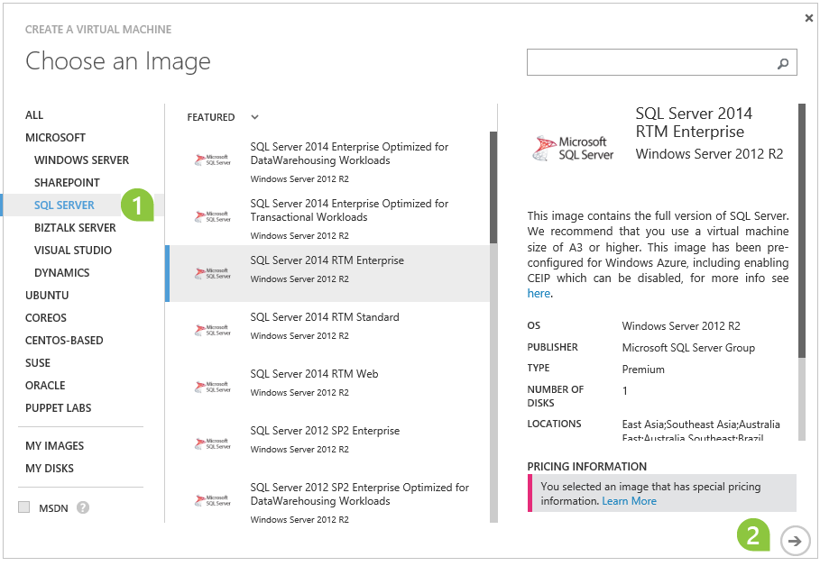
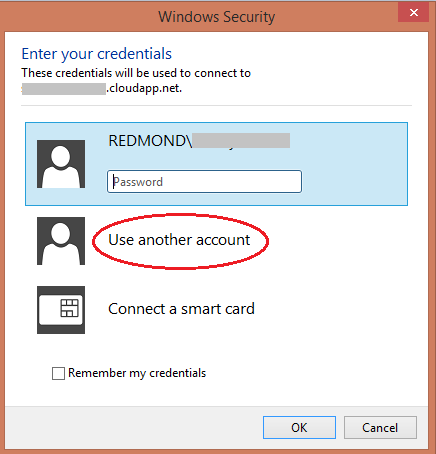
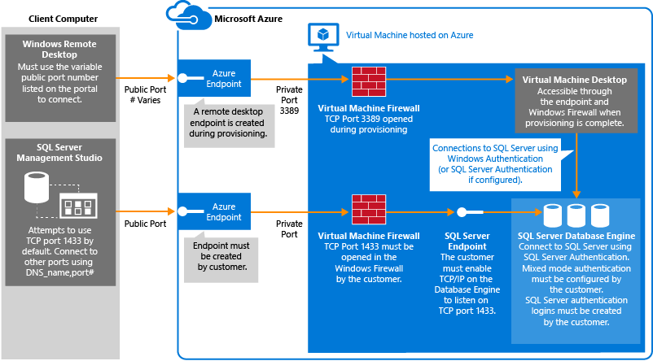

<properties
	pageTitle="预配 SQL Server 虚拟机 | Microsoft Azure"
	description="本教程教你如何在 Azure 上创建和配置 SQL Server VM。"
	services="virtual-machines"
	documentationCenter=""
	authors="rothja"
	manager="jeffreyg"
	editor="monicar"
	tags="azure-service-management"	/>

<tags
	ms.service="virtual-machines"
	ms.date="12/22/2015"
	wacn.date="02/26/2016"/>

# 在 Azure 中预配 SQL Server 虚拟机

> [AZURE.SELECTOR]
- [Management Portal](/documentation/articles/virtual-machines-provision-sql-server)
- [PowerShell](/documentation/articles/virtual-machines-sql-server-create-vm-with-powershell)

## 概述

[AZURE.INCLUDE [了解部署模型](../includes/learn-about-deployment-models-classic-include.md)]

Azure 虚拟机库包括几种内含 Microsoft SQL Server 的映像。你可以从库中选择虚拟机映像之一，只需要单击几次，即可将虚拟机设置到你的 Azure 环境。

在本教程中，您将：

* [从库连接到 Azure 管理门户并预配虚拟机](#Provision)
* [使用远程桌面和完整安装打开虚拟机](#RemoteDesktop)
* [完成配置步骤以便在另一台计算机上使用 SQL Server Management Studio 连接到虚拟机](#SSMS)
* [后续步骤](#Optional)

##从库预配 SQL Server 虚拟机

1. 使用你的帐户登录到 [Azure 管理门户](http://manage.windowsazure.cn)。如果你没有 Azure 帐户，请访问 [Azure 试用](/pricing/1rmb-trial/)。

2. 在 Azure 管理门户中网页的左下角，依次单击“+新建”、“计算”、“虚拟机”、“从库中”。

3. 在“选择映像”页上，单击 **SQL SERVER**。然后，选择 SQL Server 映像。单击页面右下角的“下一步”箭头。

	

有关在 Azure 上支持的 SQL Server 映像的最新信息，请参阅 [Azure 虚拟机中的 SQL Server 概述](/documentation/articles/virtual-machines-sql-server-infrastructure-services)。

>[AZURE.NOTE] 如果虚拟机是通过使用平台映像 SQL Server 评估版创建的，则无法将其升级到库中按分钟付费版本的映像。可以选择以下两个选项之一：
>
> - 你可以通过使用库中按分钟付费 SQL Server 版本创建一个新虚拟机，并按[将数据库迁移到 Azure VM 上的 SQL Server](/documentation/articles/virtual-machines-migrate-onpremises-database) 中所述步骤将数据库文件迁移到这个新虚拟机。
> - 或者，你可以根据[在 Azure 上通过软件保证实现许可迁移](/pricing/license-mobility/)协议，通过执行[升级到 SQL Server 的不同版本](https://msdn.microsoft.com/zh-cn/library/cc707783.aspx)中所述的步骤，将 SQL Server 评估版的现有实例升级到 SQL Server 的另一版本。有关如何购买 SQL Server 的许可副本的信息，请参阅[如何购买 SQL Server](http://www.microsoft.com/sqlserver/get-sql-server/how-to-buy.aspx)。

4. 在第一个**“虚拟机配置”**页上，提供下列信息：
	- **版本发布日期**。如果有多个映像可用，请选择最新的。
	- 唯一的“虚拟机名称”。
	- 在“新用户名”框中，键入计算机本地管理员帐户的唯一用户名。
	- 在“新密码”框中，键入一个强密码。
	- 在“确认密码”框中，再次键入该密码。
	- 从下拉列表中选择适当的“大小”。

	

	>[AZURE.NOTE] 在设置期间指定虚拟机的大小：
 	>
	> - 对于生产工作负荷，建议使用以下最小建议大小的高级存储：**DS3**（适用于 SQL Server Enterprise 版）和 **DS2**（适用于 SQL Server Standard 版）。有关详细信息，请参阅 [Azure 虚拟机中 SQL Server 的性能最佳实践](/documentation/articles/virtual-machines-sql-server-performance-best-practices)。
	> - 所选大小会限制你可以配置的数据磁盘数量。有关可用虚拟机大小和可附加到虚拟机的数据磁盘数目的最新信息，请参阅[用于 Azure 的虚拟机大小](/documentation/articles/virtual-machines-size-specs)。

5. 输入 VM 配置详细信息后，单击右下角的“下一步”箭头以继续。

5. 在第二个“虚拟机配置”页上，配置网络、存储和可用性的资源：
	- 在“云服务”框中，选择“创建新云服务”。
	- 在“云服务 DNS 名称”框中，提供所选 DNS 名称的第一部分，使它完成名称时的格式是 **TESTNAME.chinacloudapp.cn**
	- 如果有多个订阅可供选择，请选择一个**订阅**。此选择确定哪些 **存储帐户** 可用。
	- 在“区域/地缘组/虚拟网络”框中，选择将托管此虚拟映像的区域。
	- 在“存储帐户”中，自动生成一个帐户，或从列表中选择一个帐户。更改**订阅**可查看更多帐户。
	- 在“可用性集”框中，选择“(无)”。
	- 阅读并接受法律条款。

6. 单击下一步箭头以继续。

7. 单击右下角的对号标记以继续。

8. 请等候 Azure 准备您的虚拟机。预计虚拟机的状态将出现如下变化：

	- **正在启动（正在配置）**
	- **已停止**
	- **正在启动（正在配置）**
	- **正在运行（正在配置）**
	- **正在运行**

##使用远程桌面打开 VM 以完成设置

1. 当设置完成时，单击你的虚拟机的名称，以转到“仪表板”页面。在页面底部，单击**“连接”**。

2. 单击**“打开”**按钮。

	

3. 在**“Windows 安全性”**对话框中，单击**“使用另一帐户”**。

	

4. 在此格式中使用计算机名称作为域名，后跟管理员名称：`machinename\username`。键入你的密码并连接到计算机。

4. 首次登录时，将完成若干过程，包括设置桌面、更新 Windows 和完成 Windows 初始配置任务 (sysprep)。Windows sysprep 完成后，SQL Server 安装程序将完成配置任务。这些任务可能会导致在完成时延迟了几分钟。在 SQL Server 安装完成前，`SELECT @@SERVERNAME` 可能不会返回正确的名称，并且 SQL Server Management Studio 可能在起始页上不可见。

用 Windows 远程桌面连接到该虚拟机后，该虚拟机即可像任何其他计算机一样工作。以正常方式通过 SQL Server Management Studio（在虚拟机上运行）连接到 SQL Server 的默认实例。

##从另一台计算机上的 SSMS 连接到 SQL Server VM 实例

以下步骤演示如何使用 SQL Server Management Studio (SSMS) 通过 Internet 连接到 SQL Server 实例。但是，这些步骤同样适用于使你的 SQL Server 虚拟机可以通过本地和 Azure 经典部署模型中运行的应用程序访问。

你必须先完成下列各部分中描述的下列任务，然后才能从其他 VM 或 Internet 连接到 SQL Server 的实例：

- [为虚拟机创建 TCP 终结点](#create-a-tcp-endpoint-for-the-virtual-machine)
- [在 Windows 防火墙中打开 TCP 端口](#open-tcp-ports-in-the-windows-firewall-for-the-default-instance-of-the-database-engine)
- [将 SQL Server 配置为侦听 TCP 协议](#configure-sql-server-to-listen-on-the-tcp-protocol)
- [配置混合模式的 SQL Server 身份验证](#configure-sql-server-for-mixed-mode-authentication)
- [创建 SQL Server 身份验证登录名](#create-sql-server-authentication-logins)
- [确定虚拟机的 DNS 名称](#determine-the-dns-name-of-the-virtual-machine)
- [从其他计算机连接到数据库引擎](#connect-to-the-database-engine-from-another-computer)

下图中概述了此连接路径：

[AZURE.INCLUDE [连接到 VM 中的 SQL Server（经典 TCP 终结点）](../includes/virtual-machines-sql-server-connection-steps-classic-tcp-endpoint.md)]

[AZURE.INCLUDE [连接到 VM 中的 SQL Server](../includes/virtual-machines-sql-server-connection-steps.md)]

[AZURE.INCLUDE [连接到 VM 中的 SQL Server（经典步骤）](../includes/virtual-machines-sql-server-connection-steps-classic.md)]

## 从应用程序连接到数据库引擎

如果你可以使用 Management Studio 连接到 Azure 虚拟机上运行的 SQL Server 的实例，就应该能够使用类似于下面这样的连接字符串来连接。

	connectionString = "Server=tutorialtestVM.chinacloudapp.cn,57500;Integrated Security=false;User ID=<login_name>;Password=<your_password>"

有关详细信息，请参阅[如何解决 SQL Server 数据库引擎的连接问题](http://social.technet.microsoft.com/wiki/contents/articles/how-to-troubleshoot-connecting-to-the-sql-server-database-engine.aspx)。

##后续步骤

你已经看到了如何使用平台映像在 Azure 虚拟机上创建和配置 SQL Server。在许多情况下，下一步是将数据库迁移到这个新 SQL Server VM。有关数据库迁移指南，请参阅[将数据库迁移到 Azure VM 上的 SQL Server](/documentation/articles/virtual-machines-migrate-onpremises-database)。

下面的列表提供了有关 Azure 虚拟机中的 SQL Server 的其他资源。

### 针对 Azure VM 上的 SQL Server 建议的资源：
- [Azure 虚拟机中的 SQL Server 概述](/documentation/articles/virtual-machines-sql-server-infrastructure-services)

- [连接到 Azure 上的 SQL Server 虚拟机](/documentation/articles/virtual-machines-sql-server-connectivity)

- [Azure 虚拟机中的 SQL Server 的性能最佳实践](/documentation/articles/virtual-machines-sql-server-performance-best-practices)

- [Azure 虚拟机中的 SQL Server 的安全注意事项](/documentation/articles/virtual-machines-sql-server-security-considerations)

### 高可用性和灾难恢复：
- [Azure 虚拟机中 SQL Server 的高可用性和灾难恢复](/documentation/articles/virtual-machines-sql-server-high-availability-and-disaster-recovery-solutions)

- [Azure 虚拟机中 SQL Server 的备份和还原](/documentation/articles/virtual-machines-sql-server-backup-and-restore)

### Azure 中的 SQL Server 工作负荷：
- [Azure 虚拟机中的 SQL Server Business Intelligence](/documentation/articles/virtual-machines-sql-server-business-intelligence)

### 白皮书：
- [了解 Azure 虚拟机中的 Azure SQL 数据库和 SQL Server](/documentation/articles/data-management-azure-sql-database-and-sql-server-iaas)

- [Azure 虚拟机中的 SQL Server 的应用程序模式和开发策略](/documentation/articles/virtual-machines-sql-server-application-patterns-and-development-strategies)

<!---HONumber=Mooncake_0215_2016-->