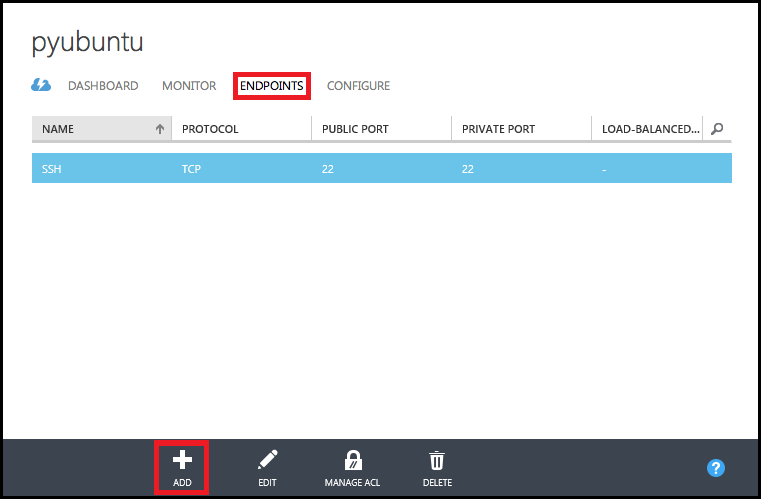

<properties 
	pageTitle="在 Mac 上使用 Django 的 Python Web 应用| Windows Azure" 
	description="本教程演示如何在 Azure 中使用 Linux 虚拟机托管基于 Django 的 Web 应用。" 
	services="virtual-machines" 
	documentationCenter="python" 
	authors="huguesv" 
	manager="wpickett" 
	editor=""/>

<tags 
	ms.service="virtual-machines" 
	ms.date="05/20/2015" 
	wacn.date="01/21/2016"/>

# Django Hello World Web 应用(mac-linux)

> [AZURE.SELECTOR]
- [Windows](/documentation/articles/web-app-with-django)
- [Mac/Linux](/documentation/articles/django-hello-world-(maclinux))

本教程介绍如何在 Windows Azure 中使用 Linux 虚拟机托管基于 Django 的 Web 应用。本教程假定您之前未使用过 Azure。完成本指南之后，你将能够在云中启动和运行基于 Django 的应用程序。

你将了解如何执行以下操作：

* 设置 Azure 虚拟机以托管 Django。虽然本教程介绍如何在 **Linux** 下实现此目的，但也可以使用托管在 Azure 中的 Windows Server VM 实现相同目的。 
* 从 Linux 创建新的 Django 应用程序。

通过按照本教程中的说明进行操作，您将构建一个简单的 Hello World Web 应用。该应用程序将托管在 Azure 虚拟机中。

以下是已完成应用程序的屏幕快照：

[AZURE.INCLUDE [create-account-and-vms-note](../includes/create-account-and-vms-note.md)]

## 创建并配置 Azure 虚拟机以托管 Django

1. 按照[此处][portal-vm]提供的说明可创建 *Ubuntu Server 14.04 LTS* 分发的 Azure 虚拟机。

  **注意：**你*只*需创建虚拟机。停在标题为*创建虚拟机后如何登录该虚拟机*的一节。

1. 指示 Azure 将来自 Web 的端口 **80** 通信定向到虚拟机上的端口 **80**：
	* 在 Azure 门户中导航到你新创建的虚拟机，然后单击“终结点”选项卡。
	* 单击屏幕底部的“添加”按钮。
	
	
	
	* 打开 *TCP* 协议的*公用端口 80* 作为*专用端口 80*。
	
	

## 设置开发环境

**注意：**如果你需要安装 Python 或希望使用客户端库，请参阅 [Python 安装指南](/documentation/articles/python-how-to-install)。

Ubuntu Linux VM 已预安装了 Python 2.7，但它没有安装 Apache 或 Django。按照以下步骤可连接到你的 VM 并安装 Apache 和 Django。

1.  启动新的**终端**窗口。
    
1.  输入以下命令来连接到 Azure VM。

		$ ssh yourusername@yourVmUrl

1.  输入以下命令来安装 Django：

		$ sudo apt-get install python-setuptools
		$ sudo easy_install django

1.  输入以下带 mod-wsgi 的命令来安装 Apache：

		$ sudo apt-get install apache2 libapache2-mod-wsgi

## 创建新的 Django 应用程序

1.  打开你在上一节中使用的**终端**窗口，通过 ssh 进入你的 VM。
    
1.  输入以下命令来创建新的 Django 项目：

		$ cd /var/www
		$ sudo django-admin.py startproject helloworld

    **django-admin.py** 脚本为基于 Django 的 Web 应用生成基本结构：
    -   **helloworld/manage.py** 可帮助你启动托管和停止托管基于 Django 的 Web 应用；
    -   **helloworld/helloworld/settings.py** 包含应用程序的 Django 设置；
    -   **helloworld/helloworld/urls.py** 包含每个 url 及其视图之间的映射代码。

1.  在 **/var/www/helloworld/helloworld** 目录中创建一个名为 **views.py** 的新文件。这会包含呈现“hello world”页面的视图。启动编辑器并输入以下代码：
		
		from django.http import HttpResponse
		def home(request):
    		html = "<html><body>Hello World!</body></html>"
    		return HttpResponse(html)

1.  现在，将 **urls.py** 文件的内容替换为以下代码：

		from django.conf.urls import patterns, url
		urlpatterns = patterns('',
			url(r'^$', 'helloworld.views.home', name='home'),
		)

## 设置 Apache

1.  创建 Apache 虚拟主机配置文件 **/etc/apache2/sites-available/helloworld.conf**。将内容设置为以下项，并确保将 *yourVmUrl* 替换为你所使用的计算机的实际 URL（例如 *pyubuntu.cloudapp.net*）。

		<VirtualHost *:80>
		ServerName yourVmUrl
		</VirtualHost>
		WSGIScriptAlias / /var/www/helloworld/helloworld/wsgi.py
		WSGIPythonPath /var/www/helloworld

1.  使用以下命令启用该站点：

        $ sudo a2ensite helloworld

1.  使用以下命令重新启动 Apache：

        $ sudo service apache2 reload

1.  最后，在你的浏览器中加载网页：

	

## 关闭你的 Azure 虚拟机

在你完成本教程后，关闭并/或删除你新创建的 Azure 虚拟机以为其他教程释放资源并避免产生 Azure 使用费。

[portal-vm]: /documentation/articles/virtual-machines-linux-tutorial-portal-rm
<!---HONumber=70-->