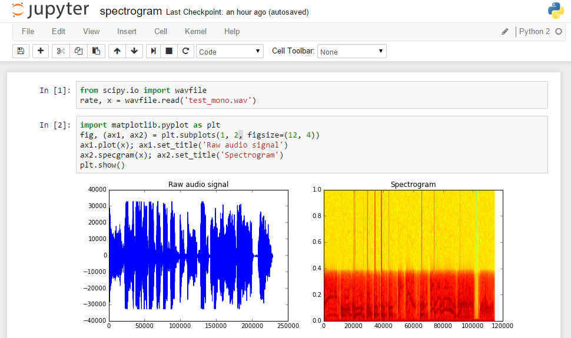

<properties linkid="develop-python-ipython-notebook" urlDisplayName="IPython Notebook" pageTitle="IPython Notebook-Azure 教程" metaKeywords="" description="本教程演示如何使用 Linux 或 Windows 虚拟机 (Vm) 进行部署在 Azure 上，IPython Notebook。" metaCanonical="" services="virtual-machines" documentationCenter="Python" title="IPython Notebook on Azure" authors="" solutions="" manager="" editor="" />
<tags ms.service="virtual-machines"
    ms.date="02/05/2015"
    wacn.date=""
    />

# Azure 上的 IPython Notebook

将显示 <a href="http://ipython.org">IPython 项目 </a > 提供了一套用于科学计算的工具，其中包括强大的交互式外壳、 高性能且易于使用的并行库以及称为 IPython Notebook 的基于 web 的环境。Notebook 为将代码执行与实时计算文档的创建组合起来的交互式计算提供了工作环境。这些 Notebook 文件可以包含任意文本、数学公式、输入代码、结果、图形、视频以及新型 Web 浏览器能够显示的任何其他种类的媒体。

< href ="http://go.microsoft.com/fwlink/?LinkID=254535 & a m p; clcid = 0x409"目标 ="_blank"class ="标签"> 观看教程 </a >< 样式 ="背景图像： url('/media/devcenter/python/ipy-youtube2.png')! 重要 ；"href ="http://go.microsoft.com/fwlink/?LinkID=254535 & a m p; clcid = 0x409"目标 ="_blank"class ="开发人员 onpage 视频">播放视频</a > 5:22

是否是绝对新手 Python，并且想要了解在有趣的交互式环境中或执行一些严重的并行/技术计算，IPython Notebook 都是个不错的选择。举例说明了它的功能，如下面的屏幕快照所示使用量以与 SciPy 和 matplotlib 包结合使用来分析录音结构的 IPython Notebook：

本文档将介绍如何部署 IPython Notebook，在 Microsoft Azure 上使用 Linux 或 Windows 虚拟机 (Vm)。通过在 Azure 上使用 IPython Notebook，您可以轻松地提供可缩放计算资源的 web 访问界面，使用 Python 的所有功能和及其许多库。由于所有安装都是在云中，用户可以访问这些资源，而无需任何其他本地配置超出现代 web 浏览器。

[WACOM.INCLUDE [create-account-and-vms-note](../includes/create-account-and-vms-note.md)]

## 在 Azure 上创建并配置 VM

第一步是创建虚拟机 (VM) 在 Azure 上运行。
此 VM 是云中的完整操作系统，它将用于运行 IPython Notebook。Azure 是能够运行 Linux 和 Windows 虚拟机，我们将介绍这两种类型的虚拟机上的 IPython 的安装程序。

### Linux VM

请按照提供的说明[此处][门户 vm linux]若要创建的虚拟机 *OpenSUSE*或 *Ubuntu*分发。本教程使用 OpenSUSE 13.1 和 Ubuntu Server 14.04 LTS。我们将假定默认用户名 * azureuser *。

### Windows VM

请按照提供的说明[此处][门户 vm windows]若要创建的虚拟机 *Windows Server 2012 R2 Datacenter*分发。在本教程中，我们将假定用户名是*azureuser*。

## 为 IPython Notebook 创建终结点

此步骤同时适用于 Linux 和 Windows VM。稍后我们将配置 IPython 以在端口 9999 上运行其 notebook 服务器。若要使此端口向公众提供的情况下，我们必须在 Azure 管理门户中创建一个终结点。此终结点打开 Azure 防火墙中的一个端口，并将公用端口 （HTTPS，443） 映射到虚拟机 (9999) 上的专用端口。

若要创建一个终结点，请转到 VM 仪表板单击"终结点"，然后"添加终结点"，创建新的终结点 （在此示例中称为 ipython_nb）。对于协议，443 （对于公共端口和专用端口 9999 选取 TCP:

此步骤之后，"终结点"仪表板选项卡将如下所示：

## 在 VM 上安装必需软件

若要在我们的 VM 上运行 IPython Notebook，必须首先安装 IPython 及其依赖项。

### Linux (OpenSUSE)

若要安装 IPython 及其依赖项，请通过 SSH 进入 Linux VM 并执行以下步骤。

安装[NumPy][numpy]， [Matplotlib][matplotlib]， [Tornado][tornado]和通过这样做，IPython 的其他依赖项：

    sudo zypper install python-matplotlib
    sudo zypper install python-tornado
    sudo zypper install python-jinja2
    sudo zypper install ipython

### Linux (Ubuntu)

若要安装 IPython 及其依赖项，请通过 SSH 进入 Linux VM 并执行以下步骤。

安装[NumPy][numpy]， [Matplotlib][matplotlib]， [Tornado][tornado]和通过这样做，IPython 的其他依赖项：

    sudo apt-get install python-matplotlib
    sudo apt-get install python-tornado
    sudo apt-get install ipython
    sudo apt-get install ipython-notebook

### Windows

若要在 Windows 虚拟机，远程桌面来连接到虚拟机上安装 IPython 及其依赖项。然后执行以下步骤中，使用 Windows PowerShell 来运行所有命令行操作。

**请注意**：若要下载任何内容使用 Internet Explorer，您需要更改某些安全设置。从**服务器管理器**，请单击**本地服务器**，然后在**IE 增强的安全配置**和管理员将其关闭。一旦您完成了 IPython 的安装，您可以从再次启用它。

1.  从安装 Python 2.7.8 （32 位） [python.org](http://www.python.org/download)。 
    您还需要将 C:\Python27' 和 'C:\Python27\Scripts' 添加到您的 PATH 环境变量。
 1.  通过下载该文件中安装 pip 和组 setuptools **get pip.py**从 https://pip.pypa.io/en/latest/installing.html (https://pip.pypa.io/en/latest/installing.html)，然后运行以下命令：

        python get-pip.py
 1.安装 [Tornado] [tornado] 和 [PyZMQ] [pyzmq] 和通过这样做，IPython 的其他依赖项：

        easy_install tornado
        easy_install pyzmq
        easy_install jinja2
        easy_install six
        easy_install python-dateutil
        easy_install pyparsing
 1.下载并安装 [NumPy] [numpy] 使用.exe 二进制安装程序可在其网站上。在撰写本文时，最新版本是**numpy-1.9.0-win32-撰写-python2.7.exe**。

1.  下载并安装[Matplotlib][matplotlib]使用.exe 二进制安装程序可在其网站上。在撰写本文时，最新版本是**matplotlib-1.4.0.win32 py2.7.exe**。

1.  下载并安装 OpenSSL。您可以找到在 OpenSSL 的 Windows 的版本 [http://slproweb.com/products/Win32OpenSSL.html](http://slproweb.com/products/Win32OpenSSL.html).

	* 如果您在安装**Light**版本中，您还必须安装**Visual c + + 2008 Redistributable** （也可从本页。）

	* 您需要将 C:\OpenSSL-Win32\bin' 添加到您的 PATH 环境变量。

	> [WACOM.NOTE] 在安装 OpenSSL 时，使用版本 1.0.1g 或因为这些工具包括 Heartbleed 安全漏洞的修补更高版本。
 1.  安装 IPython 使用命令：

        easy_install ipython
 1.  在 Windows 防火墙中打开一个端口。在 Windows Server 2012 上，防火墙默认将阻止传入连接。若要打开端口 9999，请按照下列步骤操作：

    - 启动**具有高级安全性的 Windows 防火墙**从开始屏幕。

    - 单击**入站规则**在左面板中。

	- 单击**新建规则...**操作面板中。

	- 在新建入站规则向导中，选择**端口**。

	- 在下一步的屏幕中，选择**TCP**并输入**9999**中**特定本地端口**。

	- 接受默认值，为规则赋予一个名称并单击完成。

### 配置 IPython Notebook

接下来，我们配置 IPython Notebook。第一步是创建自定义 IPython 配置文件以封装配置信息：

    ipython profile create nbserver

接下来我们 cd 到配置文件目录，若要创建我们的 SSL 证书并编辑配置文件配置文件。

在 Linux (OpenSUSE)：

    cd ~/.config/ipython/profile_nbserver/

在 Linux (Ubuntu)：

    cd ~/.ipython/profile_nbserver/

在 Windows 上：

    cd \users\azureuser\.ipython\profile_nbserver

在这两个平台上创建的 SSL 证书，如下所示：

    openssl req -x509 -nodes -days 365 -newkey rsa:1024 -keyout mycert.pem -out mycert.pem

请注意，由于我们创建自签名的 SSL 证书，当连接到 notebook 时您的浏览器将为您提供一条安全警告。若要进行长期生产使用，您将需要使用与您的组织关联的正确签名的证书。由于证书管理超出了本演示的范围，我们将只讨论自签名证书现在。

除了使用证书时，还必须提供密码来保护您的 notebook 免遭未经授权的使用。出于安全原因，IPython 在其配置文件中使用加密密码，因此您将首先需要加密您的密码。IPython 提供了一个实用工具来执行此操作；在命令提示符处，运行：

    python -c "import IPython;print IPython.lib.passwd()"

这会提示您提供密码并确认，然后将输出密码，如下所示：

    Enter password: 
    Verify password: 
    sha1:b86e933199ad:a02e9592e59723da722.. (elided the rest for security)
    
接下来，我们将编辑该配置文件的配置文件中，这是
要在配置文件目录中的 ipython_notebook_config.py 文件。请注意此文件可能不存在-只需创建它。此文件具有多个字段，默认情况下注释掉所有。您可以使用您的喜好，任何文本编辑器打开此文件，并且您应确保它至少具有以下内容：

    c = get_config()
    
    # This starts plotting support always with matplotlib
    c.IPKernelApp.pylab = 'inline'
    
    # You must give the path to the certificate file.
    
    # If using a Linux VM (OpenSUSE):
    c.NotebookApp.certfile = u'/home/azureuser/.config/ipython/profile_nbserver/mycert.pem'

    # If using a Linux VM (Ubuntu):
    c.NotebookApp.certfile = u'/home/azureuser/.ipython/profile_nbserver/mycert.pem'
    
    # And if using a Windows VM:
    c.NotebookApp.certfile = r'C:\Users\azureuser\.ipython\profile_nbserver\mycert.pem'
    
    # Create your own password as indicated above
    c.NotebookApp.password = u'sha1:b86e933199ad:a02e9592e5 etc... '
    
    # Network and browser details. We use a fixed port (9999) so it matches
    # our Azure setup, where we've allowed traffic on that port
    
    c.NotebookApp.ip = '*'
    c.NotebookApp.port = 9999
    c.NotebookApp.open_browser = False

### 运行 IPython Notebook

此时，我们已做好启动 IPython Notebook。若要执行此操作，导航到您想要在其中存储 notebook，并启动 IPython Notebook 服务器的目录：

    ipython notebook --profile=nbserver

您现在应能够访问您的地址的 IPython Notebook
https://[你所选择的名称 （此处]。 cloudapp.net。

当您首次访问您的 notebook 时，登录页会询问您的密码：

和后登录时，您会看到"IPython Notebook 仪表板"，这是所有 notebook 操作的控制中心。从此页可以创建新 notebook，打开现有的等：

如果单击"新建 Notebook"按钮，您将看到一个打开页，如下所示：

标记有 [] 中： 提示符则是输入的区域中，您可以在此处键入任何有效的 Python 代码和它将在您按 Enter Shift 时执行或单击"播放"图标 （右指三角形在工具栏中）。

由于我们已将 Notebook 配置为使用 NumPy 和 matplotlib 支持自动启动，因此您甚至可以生成图形，例如：

## 强大的范例： 实时计算文档具有丰富媒体

Notebook 本身应感觉任何人使用过 Python 和字处理器，如非常自然，因为它是在某种程度上这两者的混合： 您可以执行 Python 代码块，但也可以将保留笔记及其他文本通过更改为"Markdown"从"代码"的单元格的样式使用工具栏中的下拉菜单中:

但这并不仅仅是字处理器，因为 IPython notebook 允许混合计算和丰富媒体 （文本、 图形、 视频和现代 web 浏览器可以显示几乎所有任务）。例如，可以使用计算出于教育目的混合说明性视频：

 或嵌入始终有效且可用的在 notebook 文件的外部网站：

利用 Python 的许多用于科技计算的优秀库的功能，可以比进行复杂网络分析更轻松地执行简单计算，且全部操作都在一个环境中完成：

将最新 Web 的功能与实时计算混合的此范例提供了许多可能性，并且非常适合云；Notebook 可以：

* 用作计算暂存器以记录对问题进行的探索工作，

* 用于以"实时"计算形式或以硬拷贝格式（HTML、PDF）与同事共享结果，

* 用于分发并显示涉及计算的实时教学材料，以便学生可以立即交互地试用真实代码，修改它，然后重新执行它，

* 用于提供以可由其他人立即重现、验证和扩展的方式显示研究结果的"可执行论文"，

* 用作协作计算的平台： 多个用户可以登录到同一 notebook 服务器来共享实时计算会话，

* 等等...

如果您转到 IPython 源代码存储库，您会发现与整个目录[notebook 示例](https://github.com/ipython/ipython/tree/master/examples/notebooks)其中您可以下载，然后在您自己的 Azure IPython VM 上试用。
只需从网站下载.ipynb 文件和将其上载到您的 notebook 的 Azure 虚拟机仪表板上 （或将它们下载直接到虚拟机）。

## 结束语

IPython Notebook 提供功能强大的界面，用于以交互方式访问在 Azure 上的 Python 生态系统的强大功能。它涵盖范围广泛的用例，包括简单的探索和学习 Python、数据分析和可视化、模拟和并行计算。生成的 Notebook 文档包含所执行的可与其他 IPython 用户共享的计算的完整记录。IPython Notebook 可用作本地应用程序，但它非常适合在 Azure 上的云部署

IPython 的核心功能也是在通过 Visual Studio 中可用 
[Python Tools for Visual Studio](http://pytools.codeplex.com) (PTVS)。PTVS 是一种免费和开放源代码插件，microsoft 将 Visual Studio 转变为一个高级 Python 开发环境，其中包含一个高级的编辑器 （含 IntelliSense、 调试、 分析和并行计算集成。

[tornado]:      http://www.tornadoweb.org/          "Tornado"
[PyZMQ]:        https://github.com/zeromq/pyzmq     "PyZMQ"
[NumPy]:        http://www.numpy.org/               "NumPy"
[Matplotlib]:   http://matplotlib.sourceforge.net/  "Matplotlib"

[portal-vm-windows]: /zh-cn/documentation/articles/virtual-machines-windows-tutorial/
[portal-vm-linux]: /zh-cn/documentation/articles/virtual-machines-linux-tutorial/
