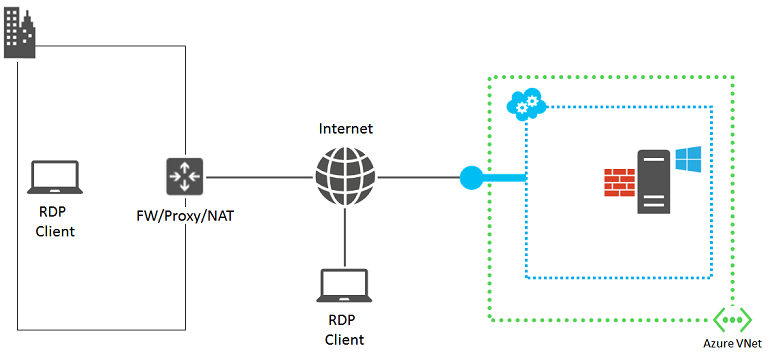
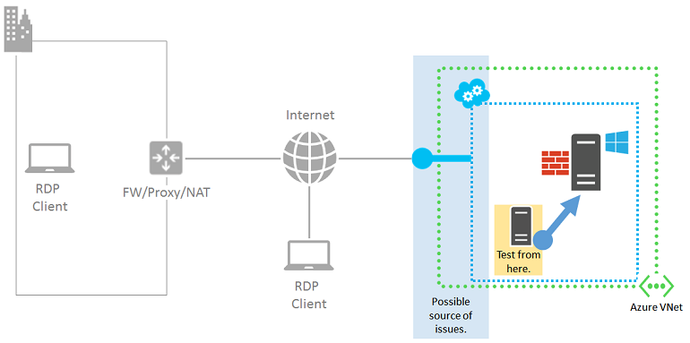
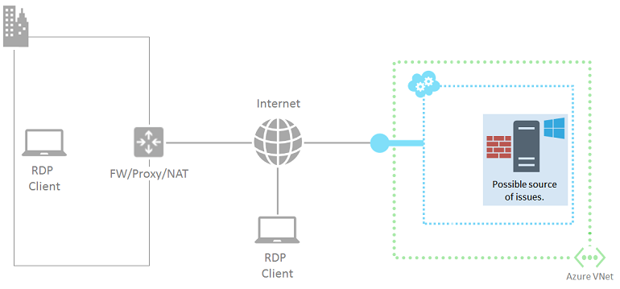

<properties
	pageTitle="对远程桌面进行详细故障排除 | Windows Azure"
	description="对运行 Windows 的 Azure 虚拟机的 RDP 连接进行详细故障排除的步骤。"
	services="virtual-machines"
	documentationCenter=""
	authors="dsk-2015"
	manager="timlt"
	editor=""
	tags="azure-service-management,azure-resource-manager"/>

<tags
	ms.service="virtual-machines"
	ms.date="09/16/2015"
	wacn.date="11/12/2015"/>

# 对与基于 Windows 的 Azure 虚拟机的远程桌面连接进行详细故障排除

本文提供复杂远程桌面错误的详细故障排除步骤。

> [AZURE.IMPORTANT]若要消除更常见的远程桌面错误，请务必首先阅读[远程桌面的基本故障排除](/documentation/articles/virtual-machines-troubleshoot-remote-desktop-connections)，然后再继续。

## 与 Azure 客户支持联系

如果你对本文中的任何点需要更多帮助，可以联系 [MSDN Azure 和CSDN论坛](/support/forums/)上的 Azure 专家。

或者，你也可以提出 Azure 支持事件。转至 [Azure 支持站点](/support/contact/)并单击“获取支持”。有关使用 Azure 支持的信息，请阅读 [Windows Azure 支持常见问题](/support/faq/)。

## 一般远程桌面错误消息

有时，你可能在远程桌面连接消息窗口中看到此错误消息：_由于以下原因之一，远程桌面无法连接到远程计算机..._

远程桌面客户端无法访问虚拟机上的“远程桌面”服务时会发生此错误。发生此错误可能有各种原因。

以下是所涉及的组件集。

在深入了解逐序渐进的故障排除过程之前，先回顾在上次成功创建远程桌面连接之后曾经做过的更改，再使用这些更改作为修复问题的基础将很有帮助。例如：

- 如果你以前可以建立远程桌面连接，并且你更改了虚拟机或包含虚拟机的云服务的公共 IP 地址（也称为虚拟 IP 地址 [VIP]），则 DNS 客户端缓存可能包含 DNS 名称和*旧 IP 地址*的条目。请清除 DNS 客户端缓存，然后重试。或者，尝试使用新的 VIP 建立连接。
- 如果你从使用 Azure 门户或 Azure 预览门户更改为使用应用程序来管理远程桌面连接，请确保应用程序配置包含用于远程桌面流量的随机确定 TCP 端口。

以下各节将单步执行隔离并确定此问题的各种根本原因的步骤并提供解决方案和解决方法。

## 预备步骤

在继续进行详细故障排除之前，请执行以下步骤。

- 在 Azure 门户或 Azure 预览门户中检查虚拟机的状态
- 重启虚拟机
- [调整虚拟机的大小](/documentation/articles/virtual-machines-size-specs)

在执行这些步骤之后，重试该远程桌面连接。

## 详细的疑难解答

远程桌面客户端可能由于以下的问题或配置错误导致无法访问 Azure 虚拟机上的“远程桌面”服务：

- 远程桌面客户端计算机
- 组织 Intranet 边缘设备
- 云服务终结点和访问控制列表 (ACL)
- 网络安全组
- 基于 Windows 的 Azure 虚拟机

### 来源 1：远程桌面客户端计算机

要使你的计算机不会成为问题或配置错误的源，请验证你的计算机是否可以与另一台基于 Windows 的本地计算机建立远程桌面连接。

如果不能，请检查你的计算机上是否有以下项：

- 阻止远程桌面流量的本地防火墙设置
- 本地安装的阻止远程桌面连接的客户端代理软件
- 本地安装的阻止远程桌面连接的网络监视软件
- 其他类型的阻止远程桌面连接的安全软件，该软件监视流量或允许/禁止特定类型的流量

对于所有这些情况，请尝试暂时禁用该软件，然后尝试与本地计算机建立远程桌面连接以找出根本原因。然后，与网络管理员协作，更正软件设置，以允许远程桌面连接。

### 来源 2：组织 Intranet 边缘设备

要使组织 Intranet 边缘设备不会成为问题或配置错误的源，请验证直接连接到 Internet 的计算机是否可以与 Azure 虚拟机建立远程桌面连接。

如果没有直接连接到 Internet 的计算机，可以轻松地在其自己的资源组或云服务中创建新的 Azure 虚拟机，然后进行使用。有关详细信息，请参阅[在 Azure 中创建运行 Windows 的虚拟机](/documentation/articles/virtual-machines-windows-tutorial)。测试完成后，请删除资源组或虚拟机以及云服务。

如果你可以创建与直接连接到 Internet 的计算机的远程桌面连接，请检查你组织的 Intranet 边缘设备中是否有以下项：

- 阻止与 Internet 的 HTTPS 连接的内部防火墙
- 阻止远程桌面连接的代理服务器
- 边界网络中的设备上运行的阻止远程桌面连接的入侵检测或网络监视软件

与网络管理员协作，更正组织 Intranet 边缘设备的设置，以允许与 Internet 建立基于 HTTPS 的远程桌面连接。

### 来源 3：云服务终结点和 ACL

要使云服务终结点和 ACL 不会成为使用服务管理 API 创建的虚拟机的问题或配置错误来源，请验证同一云服务或虚拟网络中的其他 Azure 虚拟机是否可以与你的 Azure 虚拟机建立远程桌面连接。

> [AZURE.NOTE]对于在资源管理器中创建的虚拟机，请跳转到[来源 4：网络安全组](/documentation/articles/#nsgs)。

如果同一云服务或虚拟网络中没有其他虚拟机，可以轻松创建一个新虚拟机。有关详细信息，请参阅[在 Azure 中创建运行 Windows 的虚拟机](virtual-machines-windows-tutorial)。测试完成后，请删除多余的虚拟机。

如果可以创建与同一云服务或虚拟网络中的虚拟机的远程桌面连接，请检查以下项：

- 目标虚拟机上的远程桌面通信的终结点配置。终结点的专用 TCP 端口必须与虚拟机上“远程桌面服务”服务侦听的 TCP 端口（默认为 3389）匹配。
- 目标虚拟机上的远程桌面通信终结点的 ACL。ACL 允许你指定基于源 IP 地址允许或拒绝从 Internet 传入的流量。错误配置 ACL 可能会阻止传入远程桌面流量到达终结点。检查你的 ACL 以确保允许从你的代理服务器或其他边缘服务器的公共 IP 地址传入的流量。有关详细信息，请参阅[什么是网络访问控制列表 (ACL)？](/documentation/articles/virtual-networks-acl)。

要使终结点不会成为问题的源，请删除当前终结点，然后创建一个新终结点，并选择范围 49152–65535 中的随机端口作为外部端口号。有关详细信息，请参阅[如何对虚拟机设置终结点](/documentation/articles/virtual-machines-set-up-endpoints)。

### 来源 4：网络安全组

使用网络安全组可以对允许的入站和出站流量进行更精细的控制。你可以创建跨 Azure 虚拟网络中的子网和云服务的规则。检查你的网络安全组规则，以确保允许来自 Internet 的远程桌面流量。

有关详细信息，请参阅[什么是网络安全组 (NSG)？](/documentation/articles/virtual-networks-nsg)。

### 来源 5：基于 Windows 的 Azure 虚拟机

最后一组可能的问题是在 Azure 虚拟机本身上。

[远程桌面基本故障排除文章](/documentation/articles/virtual-machines-troubleshoot-remote-desktop-connections)介绍如何使用 [Azure IaaS (Windows) 诊断程序包](https://home.diagnostics.support.microsoft.com/SelfHelp?knowledgebaseArticleFilter=2976864)。如果此诊断程序包无法解决针对**与 Azure VM 的 RDP 连接（需要重启）**问题，请按照[本文](/documentation/articles/virtual-machines-windows-reset-password)中的说明在虚拟机上重置“远程桌面服务”服务。这将：

- 启用“远程桌面”Windows 防火墙默认规则（TCP 端口 3389）。
- 通过将 HKLM\\System\\CurrentControlSet\\Control\\Terminal Server\\fDenyTSConnections 注册表值设置为 0，启用远程桌面连接。

从你的计算机重试连接。如果不成功，以下是一些可能的问题：

- “远程桌面服务”服务未在目标虚拟机上运行。
- “远程桌面服务”服务不侦听 TCP 端口 3389。
- Windows 防火墙或其他本地防火墙使用阻止远程桌面通信的出站规则。
- Azure 虚拟机上运行的入侵检测或网络监视软件正在阻止远程桌面连接。

若要更正使用服务管理 API 创建的虚拟机可能存在的这些问题，可以使用 Azure 虚拟机的远程 Azure PowerShell 会话。首先，需要安装虚拟机托管云服务的证书。转到[为 Azure 虚拟机配置安全远程 PowerShell 访问](http://gallery.technet.microsoft.com/scriptcenter/Configures-Secure-Remote-b137f2fe)，并将 **InstallWinRMCertAzureVM.ps1** 脚本文件下载到本地计算机上的文件夹中。

接下来，安装 Azure PowerShell（如果尚未安装）。请参阅[如何安装和配置 Azure PowerShell](/documentation/articles/install-configure-powershell)。

接下来，打开 Azure PowerShell 命令提示符，并将当前文件夹更改为 **InstallWinRMCertAzureVM.ps1** 脚本文件所在的位置。若要运行 Azure PowerShell 脚本，必须设置正确的执行策略。运行 **Get-ExecutionPolicy** 命令，以确定当前的策略级别。有关设置相应级别的信息，请参阅 [Set-ExecutionPolicy](https://technet.microsoft.com/library/hh849812.aspx)。

接下来，填写你的 Azure 订阅名称、云服务名称和虚拟机名称（删除 < and > 字符），然后运行这些命令。

	$subscr="<Name of your Azure subscription>"
	$serviceName="<Name of the cloud service that contains the target virtual machine>"
	$vmName="<Name of the target virtual machine>"
	.\InstallWinRMCertAzureVM.ps1 -SubscriptionName $subscr -ServiceName $serviceName -Name $vmName

你可以从 **Get-AzureSubscription** 命令显示的 _SubscriptionName_ 属性获取正确的订阅名称。可以从 **Get-AzureVM** 命令显示的 _ServiceName_ 列中获取虚拟机的云服务名称。

为了证明你拥有此新证书，请打开当前用户的“证书”管理单元，然后在“受信任的根证书颁发机构\\证书”文件夹中查找。你应看到在“颁发给”列中具有你的云服务的 DNS 名称的证书（示例：cloudservice4testing.chinacloudapp.cn）。

接下来，使用以下命令启动远程 Azure PowerShell 会话。

	$uri = Get-AzureWinRMUri -ServiceName $serviceName -Name $vmName
	$creds = Get-Credential
	Enter-PSSession -ConnectionUri $uri -Credential $creds

输入有效的管理员凭据之后，你应看到如下内容作为 Azure PowerShell 提示符：

	[cloudservice4testing.chinacloudapp.cn]: PS C:\Users\User1\Documents>

提示符的第一部分指示你现在正在对包含目标虚拟机的云服务发出 Azure PowerShell 命令。你的云服务名称将是不同于“cloudservice4testing.chinacloudapp.cn”的内容。

现在，你可以发出 Azure PowerShell 命令，以调查上面提到的其他问题，并进行配置更正。

### 手动更正远程桌面服务侦听 TCP 端口

如果你无法针对“与 Azure VM 的 RDP 连接(需要重启)”问题运行 [Azure IaaS (Windows) 诊断程序包](https://home.diagnostics.support.microsoft.com/SelfHelp?knowledgebaseArticleFilter=2976864)，请在远程 Azure PowerShell 会话提示符下，运行此命令。

	Get-ItemProperty -Path "HKLM:\System\CurrentControlSet\Control\Terminal Server\WinStations\RDP-Tcp" -Name "PortNumber"

PortNumber 属性显示当前端口号。如果需要，可使用此命令将远程桌面端口号更改回其默认值 (3389)。

	Set-ItemProperty -Path "HKLM:\System\CurrentControlSet\Control\Terminal Server\WinStations\RDP-Tcp" -Name "PortNumber" -Value 3389

使用此命令验证是否已将端口更改为 3389。

	Get-ItemProperty -Path "HKLM:\System\CurrentControlSet\Control\Terminal Server\WinStations\RDP-Tcp" -Name "PortNumber"

使用此命令退出远程 Azure PowerShell 会话。

	Exit-PSSession

验证 Azure 虚拟机的远程桌面终结点是否也使用 TCP 端口 3398 作为其内部端口。然后，重启 Azure 虚拟机，并重试远程桌面连接。

## 其他资源

[Azure IaaS (Windows) 诊断程序包](https://home.diagnostics.support.microsoft.com/SelfHelp?knowledgebaseArticleFilter=2976864)

[如何为 Windows 虚拟机重置密码或远程桌面服务](/documentation/articles/virtual-machines-windows-reset-password)

[如何安装和配置 Azure PowerShell](/documentation/articles/install-configure-powershell)

[对于基于 Linux 的 Azure 虚拟机的 Secure Shell (SSH) 连接进行故障排除](/documentation/articles/virtual-machines-troubleshoot-ssh-connections)

[对在 Azure 虚拟机上运行的应用程序的访问进行故障排除](/documentation/articles/virtual-machines-troubleshoot-access-application)

<!---HONumber=79-->