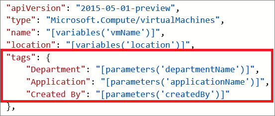
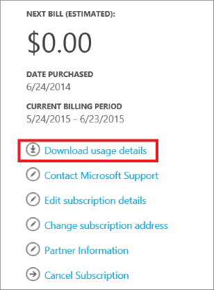

<properties
   pageTitle="如何在 Azure 中标记虚拟机"
   description="了解如何在 Azure 中标记虚拟机"
   services="virtual-machines"
   documentationCenter=""
   authors="dsk-2015"
   manager="timlt"
   editor="tysonn"
   tags="azure-resource-manager"/>

<tags 
	ms.service="virtual-machines"
    ms.date="07/23/2015" 
    wacn.date="08/29/2015"/>

# 如何在 Azure 中标记虚拟机

本文章介绍了在 Azure 中标记虚拟机的不同方式。标记是用户定义的键/值对，可直接放置在资源或资源组中。针对每个资源和资源组，Azure 当前支持最多 15 个标记。标记可以在创建时放置在资源中或添加到现有资源中。

## 通过模板标记虚拟机

首先，让我们看一下通过模板进行标记。[此模板](https://github.com/Azure/azure-quickstart-templates/tree/master/101-tags-vm)将标记放置在以下资源中：计算（虚拟机）、存储（存储帐户）和网络（公共 IP 地址、虚拟网络和网络接口）。

单击“模板链接”中的“部署至 Azure”按钮。此操作将导航到[Azure 预览门户](http://manage.windowsazure.cn/)，可在其中部署此模板。

此模板包括以下标记：*Department*、*Application* 和 *Created By*。如果想要不同的标记名称，则可以直接在模板中添加/编辑这些标记。

如你所见，标记定义为键/值对，用冒号 (:) 分隔。必须按以下格式定义标记：

        “tags”: {
            “Key1” : ”Value1”,
            “Key2” : “Value2”
        }

完成编辑后，使用选择的标记保存模板文件。

接下来，在“编辑参数”部分中，可以填写标记的值。

单击“创建”使用标记值部署此模板。

## 使用 PowerShell 进行标记

若要通过 PowerShell 创建、添加和删除标记，首先需要设置[将 PowerShell 环境用于 Azure 资源管理器][]。一旦完成安装后，可以在创建时或创建资源之后通过 PowerShell 将标记放置在计算、网络和存储资源中。本文章将重点说明查看/编辑虚拟机上放置的标记。

首先，通过 `Get-AzureVM`cmdlet 导航到虚拟机。

        PS C:\> Get-AzureVM -ResourceGroupName "MyResourceGroup" -Name "MyWindowsVM"

如果虚拟机已包含标记，那么将在资源中看到所有标记：

        Tags : {
                "Application": "MyApp1",
                "Created By": "MyName",
                "Department": "MyDepartment",
                "Environment": "Production"
               }

如果想要通过 PowerShell 添加标记，则可以使用 `Set-AzureResource` 命令。请注意，通过 PowerShell 更新时，标记会作为整体进行更新。因此，如果要向已具有标记的资源添加标记，则需要包括想要在资源中放置的所有标记。下面是如何通过 PowerShell Cmdlet 将其他标记添加到资源的示例。

第一个 cmdlet 使用 `Get-AzureResource` 和 `Tags` 函数将 *MyWindowsVM* 中放置的所有标记放置到 *tags* 变量中。

        PS C:\> $tags = (Get-AzureResource -Name MyWindowsVM -ResourceGroupName MyResourceGroup -ResourceType "Microsoft.Compute/virtualmachines" -ApiVersion 2015-05-01-preview).Tags

第二个命令显示给定变量的标记。

        PS C:\> $tags

        Name		Value
        ----                           -----
        Value		MyDepartment
        Name		Department
        Value		MyApp1
        Name		Application
        Value		MyName
        Name		Created By
        Value		Production
        Name		Environment

第三个命令将其他标记添加到 *tags* 变量。请注意，使用 **+=** 将新的键/值对追加到 *tags* 列表。

        PS C:\> $tags +=@{Name="Location";Value="MyLocation"}

第四个命令将 *tags* 变量中定义的标记放置到给定资源中。在这种情况下，它是 MyWindowsVM。

        PS C:\> Set-AzureResource -Name MyWindowsVM -ResourceGroupName MyResourceGroup -ResourceType "Microsoft.Compute/VirtualMachines" -ApiVersion 2015-05-01-preview -Tag $tags

第五个命令显示资源上的所有标记。如你所见，*Location* 现在定义为值为 *MyLocation* 的标记。

        PS C:\> (Get-AzureResource -ResourceName "MyWindowsVM" -ResourceGroupName "MyResourceGroup" -ResourceType "Microsoft.Compute/VirtualMachines" -ApiVersion 2015-05-01-preview).Tags

        Name		Value
        ----                           -----
        Value		MyDepartment
        Name		Department
        Value		MyApp1
        Name		Application
        Value		MyName
        Name		Created By
        Value		Production
        Name		Environment
        Value		MyLocation
        Name		Location

若要了解有关通过 PowerShell 标记的详细信息，请查看 [Azure 资源 Cmdlet][]。

## 在使用情况详细信息中查看标记

通过 Azure 资源管理器放置在计算、网络和存储资源中的标记将在计费门户中的使用情况详细信息中填充。

单击“下载使用情况详细信息”，以查看订阅中的使用情况详细信息。

选择帐单和**版本 2** 使用情况详细信息：

在使用情况详细信息中，可以在“标记”列中看到所有标记：

通过分析这些标记以及使用情况，组织将能够获得对消耗数据的全新见解。

## 其他资源

* <!--[-->Azure 资源管理器概述<!--][]-->
* <!--[-->使用标记组织 Azure 资源<!--][]-->
* <!--[-->了解 Azure 帐单<!--][]-->
* <!--[-->深入了解 Windows Azure 资源消耗<!--][]-->

[将 PowerShell 环境用于 Azure 资源管理器]: /documentation/articles/powershell-azure-resource-manager
[Azure 资源 Cmdlet]: https://msdn.microsoft.com/zh-cn/library/azure/dn757692.aspx
[Azure CLI 环境]: /documentation/articles/xplat-cli-azure-resource-manager
[Azure 资源管理器概述]: /documentation/articles/resource-group-overview
[使用标记组织 Azure 资源]: /documentation/articles/resource-group-using-tags
[了解 Azure 帐单]: /documentation/articles/billing-understand-your-bill
[深入了解 Windows Azure 资源消耗]: /documentation/articles/billing-usage-rate-card-overview
<!---HONumber=67-->