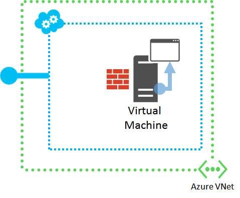
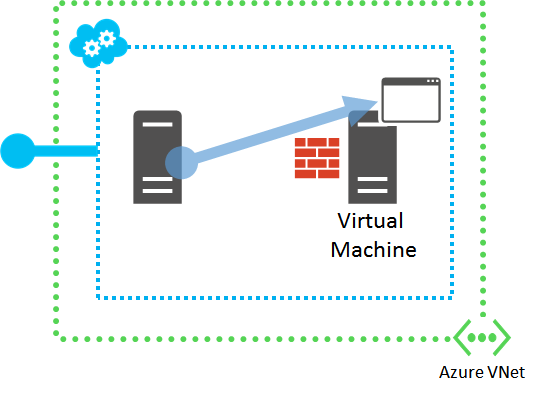

<properties
	pageTitle="排查 VM 上的应用程序访问问题 | Windows Azure"
	description="如果无法访问 Azure 虚拟机上运行的应用程序，则可以按照这些步骤来隔离问题来源。"
	services="virtual-machines"
	documentationCenter=""
	authors="dsk-2015"
	manager="timlt"
	editor=""
	tags="top-support-issue,azure-service-management,azure-resource-manager"/>

<tags 
	ms.service="virtual-machines" 
	ms.date="07/01/2015" 
	wacn.date="11/27/2015"/> 

# 对在 Azure 虚拟机上运行的应用程序的访问进行故障排除

[AZURE.INCLUDE [了解部署模型](../includes/learn-about-deployment-models-both-include.md)]

如果无法访问 Azure 虚拟机上运行的应用程序，本文章将介绍有关隔离问题根源并进行纠正的妥善方法。

> [AZURE.NOTE]如需连接到 Azure 虚拟机的帮助，请参阅[对基于 Windows 的 Azure 虚拟机的远程桌面连接进行故障排除](/documentation/articles/virtual-machines-troubleshoot-remote-desktop-connections)或[对基于 Linux 的 Azure 虚拟机的 Secure Shell (SSH) 连接进行故障排除](/documentation/articles/virtual-machines-troubleshoot-ssh-connections)。

有四个主要区域需要对 Azure 虚拟机上运行的应用程序的访问进行故障排除。

1.	在 Azure 虚拟机上运行的应用程序。
2.	Azure 虚拟机。
3.	包含虚拟机（针对使用服务管理 API 创建的虚拟机）、入站 NAT 规则（针对资源管理器中创建的虚拟机）和网络安全组的云服务的 Azure 终结点。
4.	Internet 边缘设备。

对于通过站点到站点 VPN 或 ExpressRoute 连接访问应用程序的客户端计算机，可能会导致问题的主要区域是应用程序和 Azure 虚拟机。
若要确定问题并进行更正，请遵循下列步骤。

## 步骤 1：是否可以访问目标虚拟机中的应用程序？

尝试通过应用程序运行的虚拟机访问具有相应客户端程序的应用程序，请使用本地主机名、本地 IP 地址或环回地址 (127.0.0.1)。

例如，如果应用程序是 Web 服务器，则在虚拟机上运行浏览器，并尝试访问虚拟机上托管的网页。

如果可以访问应用程序，请转到[步骤 2](#step2)。

如果不能访问应用程序，请验证以下各项：

- 应用程序是否在目标虚拟机上运行。
- 应用程序是否在预期 TCP 和 UDP 端口侦听。

在基于 Windows 和基于 Linux 的虚拟机上，使用 **netstat -a** 命令显示活动的侦听端口。检查应用程序应侦听的预期端口的输出。重新启动应用程序或将其配置为根据需要使用预期端口。

## 步骤 2：是否可以通过相同虚拟网络中的另一台虚拟机访问应用程序？

尝试通过相同虚拟网络中的不同虚拟机，作为应用程序运行的虚拟机访问应用程序，并使用虚拟机的主机名或其 Azure 分配的公钥、私钥或提供程序 IP 地址。对于使用服务管理 API 创建的虚拟机，请勿使用云服务的公共 IP 地址。

例如，如果应用程序是Web 服务器，则尝试在相同虚拟网络中的不同虚拟机上使用浏览器访问网页。

如果可以访问应用程序，请转到[步骤 3](#step3)。

如果不能访问应用程序，请验证以下各项：

- 目标虚拟机上的主机防火墙允许入站请求和出站响应流量。
- Azure 虚拟机上运行的入侵检测或网络监视软件允许流量。
- 网络安全组允许流量。
- 虚拟网络中在测试虚拟机和虚拟机之间的路径运行的单独组件（例如负载平衡器或防火墙）允许流量。

在基于 Windows 的虚拟机上，使用具有高级安全性的 Windows 防火墙确定防火墙规则是否排除应用程序的入站和出站流量。

## 步骤 3：是否可以通过虚拟网络之外但未连接到你的计算机所在的相同网络的计算机访问应用程序？

尝试通过虚拟网络之外的计算机访问应用程序，作为应用程序运行但与原始客户端计算机不在相同的网络的虚拟机。

例如，如果应用程序是Web 服务器，则尝试通过不在虚拟网络中的虚拟机使用浏览器访问网页。

如果不能访问应用程序，请验证以下各项：

- 对于使用服务管理 API 创建的虚拟机，虚拟机的终结点配置允许传入流量，尤其是协议（TCP 或 UDP）和公用和专用端口号。有关详细信息，请参阅[如何对虚拟机设置终结点](/documentation/articles/virtual-machines-set-up-endpoints)。
- 对于使用服务管理 API 创建的虚拟机，终结点上的访问控制列表 (ACL) 不会阻止来自 Internet 的传入流量。有关详细信息，请参阅[如何对虚拟机设置终结点](/documentation/articles/virtual-machines-set-up-endpoints)。
- 对于在资源管理器中创建的虚拟机，虚拟机的入站 NAT 规则允许传入流量，尤其是协议（TCP 或 UDP）和公用和专用端口号。
- 网络安全组允许入站请求和出站响应流量。有关详细信息，请参阅[什么是网络安全组 (NSG)？](/documentation/articles/virtual-networks-nsg)。

如果虚拟机或终结点是负载平衡集的成员，则：

- 验证探测协议（TCP 或 UDP）和端口号是否正确。
- 如果探测协议和端口与负载平衡集协议和端口不同，则：
	- 验证应用程序是否在探测协议（TCP 或 UDP）和端口号（在目标虚拟机上使用 **netstat –a**）上侦听。
	- 目标虚拟机上的主机防火墙允许入站探测请求和出站探测响应流量。

如果可以访问应用程序，请确保 Internet 边缘设备允许：

- 从客户端计算机到 Azure 虚拟机的出站应用程序请求流量。
- 来自 Azure 虚拟机的入站应用程序响应流量。

## 后续步骤

如果已完成本文章中的步骤 1 至 3，并且需要更多帮助更正问题，则可以：

- 从世界各地的 Azure 专家那里获取帮助。向 MSDN Azure 或 CSDN 论坛提交问题。有关详细信息，请参阅 [Windows Azure 论坛](http://www.windowsazure.cn/support/forums/)。
- 提出 Azure 支持事件。转到“Azure 支持站点”，单击“技术和帐单支持”下的“获得支持”。

## 其他资源

[对与基于 Windows 的 Azure 虚拟机的远程桌面连接进行故障排除](/documentation/articles/virtual-machines-troubleshoot-remote-desktop-connections)

[对于基于 Linux 的 Azure 虚拟机的 Secure Shell (SSH) 连接进行故障排除](/documentation/articles/virtual-machines-troubleshoot-ssh-connections)

<!---HONumber=82-->