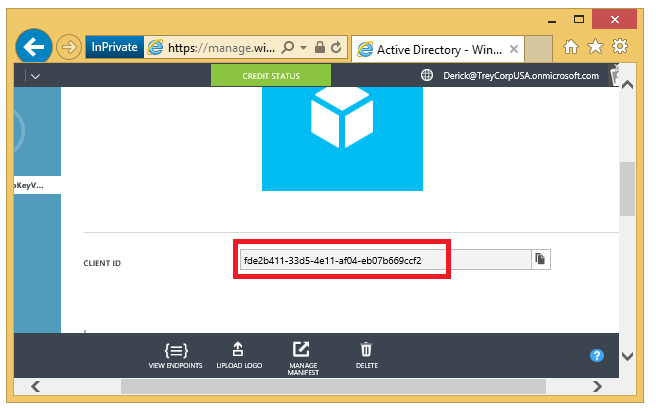
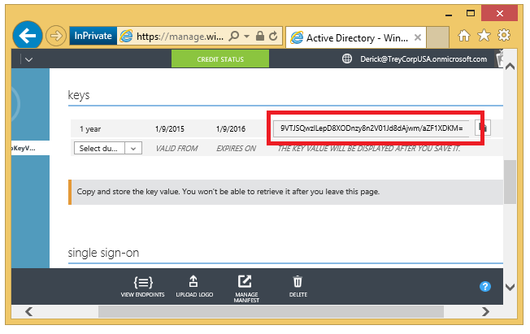

<properties 
	pageTitle="为 Azure VM 上的 SQL Serve 配置 Azure 密钥保管库集成（经典）"
	description="了解如何自动配置用于 Azure 密钥保管库的 SQL Server 加密。本主题说明如何将 Azure 密钥保管库集成用于 SQL Server 虚拟机。" 
	services="virtual-machines-windows" 
	documentationCenter="" 
	authors="rothja" 
	manager="jhubbard"
	editor=""
	tags="azure-service-management"/>

<tags
	ms.service="virtual-machines-windows"
	ms.date="04/08/2016"
	wacn.date="06/07/2016"/>

# 为 Azure VM 上的 SQL Serve 配置 Azure 密钥保管库集成

## 概述
SQL Server 加密功能多种多样，包括[透明数据加密 (TDE)](https://msdn.microsoft.com/zh-cn/library/bb934049.aspx)、[列级加密 (CLE)](https://msdn.microsoft.com/zh-cn/library/ms173744.aspx) 和[备份加密](https://msdn.microsoft.com/zh-cn/library/dn449489.aspx)。这些加密形式要求你管理和存储用于加密的加密密钥。Azure 密钥保管库 (AKV) 服务专用于在一个高度可用的安全位置改进这些密钥的安全性和管理。[SQL Server 连接器](http://www.microsoft.com/download/details.aspx?id=45344)使 SQL Server 能够使用 Azure 密钥保管库中的这些密钥。

> [AZURE.IMPORTANT]Azure 具有用于创建和处理资源的两个不同的部署模型：[资源管理器和经典](/documentation/articles/resource-manager-deployment-model)。本文介绍使用经典部署模型。Azure 建议大多数新部署使用资源管理器模型。

如果在本地计算机上运行 SQL Server，请[按照此处的步骤从本地 SQL Server 计算机访问 Azure 密钥保管库](https://msdn.microsoft.com/zh-cn/library/dn198405.aspx)。但对于 Azure VM 中的 SQL Server，你可以通过使用 *Azure 密钥保管库集成*功能节省时间。通过使用几个 Azure PowerShell cmdlet 来启用此功能，可以自动为 SQL VM 进行必要的配置以便访问密钥保管库。

启用此功能后，它会自动安装 SQL Server 连接器、配置 EKM 提供程序以访问 Azure 密钥保管库，并创建凭据以使你能够访问保管库。在前面提到的本地文档列出的步骤中，你可以看到此功能自动完成步骤 2 和步骤 3。你仍需手动执行的唯一操作是创建密钥保管库和密钥。之后，将自动进行 SQL VM 的整个设置。在此功能完成设置后，你可以执行 T-SQL 语句，以按照通常的方式加密你的数据库或备份。

## 准备 AKV 集成
若要使用 Azure 密钥保管库集成来配置 SQL Server VM，有以下几个先决条件：

1.	[安装 Azure Powershell](#install-azure-powershell)
2.	[创建 Azure Active Directory](#create-an-azure-active-directory)
3.	[创建密钥保管库](#create-a-key-vault)

以下各节描述了这些先决条件，以及稍后运行 PowerShell cmdlet 需要收集的信息。

### 安装 Azure PowerShell
请确保已安装最新的 Azure PowerShell SDK。有关详细信息，请参阅[如何安装和配置 Azure PowerShell](/documentation/articles/powershell-install-configure)。

### 创建 Azure Active Directory
首先，你的订阅中需要具有 Azure Active Directory(AAD)。其优点之一是允许你为特定用户和应用程序授予对密钥保管库的权限。

然后，将应用程序注册到 Azure AAD。这将为你提供一个服务主体帐户，使你有权访问 VM 所需的密钥保管库。在 Azure 密钥保管库文章中，你可以在[将应用程序注册到 Azure Active Directory]/documentation/articles/key-vault-get-started#register) 部分中找到这些步骤，或者可以在[此博客文章](http://blogs.technet.com/b/kv/archive/2015/01/09/azure-key-vault-step-by-step.aspx)的**获取应用程序的标识**部分中看到这些步骤以及屏幕截图。请注意，在完成这些步骤之前，你需要在注册期间收集以下信息，之后在 SQL VM 上启用 Azure 密钥保管库集成时需要这些信息。

- 添加应用程序后，在“配置”选项卡上找到**客户端 ID**。 
	
	
	稍后会将该客户端 ID 分配给 PowerShell 脚本中的 **$spName**（服务主体名称）参数，以启用 Azure 密钥保管库集成。 
- 此外，在执行这些步骤期间，请在创建密钥时复制密钥的密码，如下面的屏幕截图中所示。稍后会将此密钥密码分配给 PowerShell 脚本中的 **$spSecret**（服务主体机密码）参数。  
	
- 必须为此新的客户端 ID 授予以下访问权限：**加密**、**解密**、**密钥换行**、**取消密钥换行**、**签名**和**验证**。可通过 [Set-AzureKeyVaultAccessPolicy](https://msdn.microsoft.com/zh-cn/library/azure/dn903607%28v=azure.98%29.aspx) cmdlet 实现此操作。有关详细信息，请参阅[授权应用程序使用密钥或密码](/documentation/articles/key-vault-get-started#authorize)。

### 创建密钥保管库
若要使用 Azure 密钥保管库来存储将用于在 VM 中加密的密钥，你将需要对密钥保管库的访问权限。如果你尚未设置密钥保管库，请按照[开始使用 Azure 密钥保管库](/documentation/articles/key-vault-get-started)主题中的步骤进行创建。请注意，在完成这些步骤之前，你需要在设置期间收集一些信息，之后在 SQL VM 上启用 Azure 密钥保管库集成时需要这些信息。

进行创建密钥保管库的步骤时，请注意返回的 **vaultUri** 属性，它是密钥保管库 URL。下面显示了该步骤中提供的示例，其中的密钥保管库名称是 ContosoKeyVault，因此密钥保管库 URL 将为 https://contosokeyvault.vault.chinacloudapi.cn/。

 
稍后会将该密钥保管库 URL 分配给 PowerShell 脚本中的 **$akvURL** 参数，以启用 Azure 密钥保管库集成。

## 配置 AKV 集成
使用 PowerShell 来配置 Azure 密钥保管库集成。以下各节概述了所需的参数，然后提供了一个示例 PowerShell 脚本。

### 输入参数
下表列出在下一节中运行 PowerShell 脚本所需的参数。

|参数|说明|示例|
|---|---|---|
|**$akvURL**|**密钥保管库 URL**|“https://contosokeyvault.vault.chinacloudapi.cn/”|
|**$spName**|**服务主体名称**|“fde2b411-33d5-4e11-af04eb07b669ccf2”|
|**$spSecret**|**服务主体密码**|“9VTJSQwzlFepD8XODnzy8n2V01Jd8dAjwm/azF1XDKM =”|
|**$credName**|**凭据名称**：AKV 集成在 SQL Server 内创建一个凭据，使 VM 具有对密钥保管库的访问权限。为此凭据选择一个名称。|“mycred1”|
|**$vmName**|**虚拟机名称**：以前创建的 SQL VM 的名称。|“myvmname”|
|**$serviceName**|**服务名称**：与 SQL VM 关联的云服务名称。|“mycloudservicename”|

### 使用 PowerShell 启用 AKV 集成
**New-AzureVMSqlServerKeyVaultCredentialConfig** cmdlet 为 Azure 密钥保管库集成功能创建配置对象。**Set-AzureVMSqlServerExtension** 通过 **KeyVaultCredentialSettings** 参数配置此集成。以下步骤显示如何使用这些命令。

1. 在 Azure PowerShell 中，首先使用特定的值配置输入参数，如本主题前面各节中所述。下面的脚本就是一个示例。
	
		$akvURL = "https://contosokeyvault.vault.chinacloudapi.cn/"
		$spName = "fde2b411-33d5-4e11-af04eb07b669ccf2"
		$spSecret = "9VTJSQwzlFepD8XODnzy8n2V01Jd8dAjwm/azF1XDKM="
		$credName = "mycred1"
		$vmName = "myvmname"
		$serviceName = "mycloudservicename"
2.	然后使用以下脚本来配置和启用 AKV 集成。
	
		$secureakv =  $spSecret | ConvertTo-SecureString -AsPlainText -Force
		$akvs = New-AzureVMSqlServerKeyVaultCredentialConfig -Enable -CredentialName $credname -AzureKeyVaultUrl $akvURL -ServicePrincipalName $spName -ServicePrincipalSecret $secureakv
		Get-AzureVM –ServiceName $serviceName –Name $vmName | Set-AzureVMSqlServerExtension –KeyVaultCredentialSettings $akvs | Update-AzureVM

SQL IaaS 代理扩展将使用此新配置来更新 SQL VM。

## 后续步骤
启用 Azure 密钥保管库集成之后，可以在 SQL VM 上启用 SQL Server 加密。首先，需要在密钥保管库内创建一个非对称密钥，并在 VM 上的 SQL Server 中创建一个对称密钥。然后，你将能够执行的 T-SQL 语句，以启用对数据库和备份的加密。

可以利用以下几种形式的加密：

- [透明数据加密 (TDE)](https://msdn.microsoft.com/zh-cn/library/bb934049.aspx)
- [加密备份](https://msdn.microsoft.com/zh-cn/library/dn449489.aspx)
- [列级加密 (CLE)](https://msdn.microsoft.com/zh-cn/library/ms173744.aspx)

以下 Transact-SQL 脚本提供针对每种形式的示例。

>[AZURE.NOTE]每个示例基于两个先决条件：密钥保管库中名为 **CONTOSO\_KEY** 的非对称密钥，以及 AKV 集成功能创建的名为 **Azure\_EKM\_TDE\_cred** 的凭据。

### 透明数据加密 (TDE)
1. 创建数据库引擎将用于 TDE 的 SQL Server 登录名，然后向其添加凭据。
	
		USE master;
		-- Create a SQL Server login associated with the asymmetric key 
		-- for the Database engine to use when it loads a database 
		-- encrypted by TDE.
		CREATE LOGIN TDE_Login 
		FROM ASYMMETRIC KEY CONTOSO_KEY;
		GO
		
		-- Alter the TDE Login to add the credential for use by the 
		-- Database Engine to access the key vault
		ALTER LOGIN TDE_Login 
		ADD CREDENTIAL Azure_EKM_TDE_cred;
		GO
	
2. 创建将用于 TDE 的数据库加密密钥。
	
		USE ContosoDatabase;
		GO
		
		CREATE DATABASE ENCRYPTION KEY 
		WITH ALGORITHM = AES_128 
		ENCRYPTION BY SERVER ASYMMETRIC KEY CONTOSO_KEY;
		GO
		
		-- Alter the database to enable transparent data encryption.
		ALTER DATABASE ContosoDatabase 
		SET ENCRYPTION ON;
		GO

### 加密备份
1. 创建数据库引擎将用于加密备份的 SQL Server 登录名，然后向其添加凭据。
	
		USE master;
		-- Create a SQL Server login associated with the asymmetric key 
		-- for the Database engine to use when it is encrypting the backup.
		CREATE LOGIN Backup_Login 
		FROM ASYMMETRIC KEY CONTOSO_KEY;
		GO 
		
		-- Alter the Encrypted Backup Login to add the credential for use by 
		-- the Database Engine to access the key vault
		ALTER LOGIN Backup_Login 
		ADD CREDENTIAL Azure_EKM_Backup_cred ;
		GO
	
2. 备份数据库，同时使用密钥保管库中存储的非对称密钥指定加密。
	
		USE master;
		BACKUP DATABASE [DATABASE_TO_BACKUP]
		TO DISK = N'[PATH TO BACKUP FILE]' 
		WITH FORMAT, INIT, SKIP, NOREWIND, NOUNLOAD, 
		ENCRYPTION(ALGORITHM = AES_256, SERVER ASYMMETRIC KEY = [CONTOSO_KEY]);
		GO

### 列级加密 (CLE)
此脚本创建一个受密钥保管库中的非对称密钥保护的对称密钥，然后使用该对称密钥对数据库中的数据进行加密。

	CREATE SYMMETRIC KEY DATA_ENCRYPTION_KEY
	WITH ALGORITHM=AES_256
	ENCRYPTION BY ASYMMETRIC KEY CONTOSO_KEY;
	
	DECLARE @DATA VARBINARY(MAX);
	
	--Open the symmetric key for use in this session
	OPEN SYMMETRIC KEY DATA_ENCRYPTION_KEY 
	DECRYPTION BY ASYMMETRIC KEY CONTOSO_KEY;
	
	--Encrypt syntax
	SELECT @DATA = ENCRYPTBYKEY(KEY_GUID('DATA_ENCRYPTION_KEY'), CONVERT(VARBINARY,'Plain text data to encrypt'));
	
	-- Decrypt syntax
	SELECT CONVERT(VARCHAR, DECRYPTBYKEY(@DATA));
	
	--Close the symmetric key
	CLOSE SYMMETRIC KEY DATA_ENCRYPTION_KEY;

## 其他资源
有关如何使用这些加密功能的详细信息，请参阅[将 EKM 用于 SQL Server 加密功能](https://msdn.microsoft.com/zh-cn/library/dn198405.aspx#UsesOfEKM)。

请注意，本文中的步骤假定你已经具有在 Azure 虚拟机上运行的 SQL Server。如果还没有，请参阅[在 Azure 中预配 SQL Server 虚拟机](/documentation/articles/virtual-machines-windows-classic-ps-sql-create)。有关在 Azure VM 中运行 SQL Server 的其他指南，请参阅 [Azure 虚拟机上的 SQL Server 概述](/documentation/articles/virtual-machines-windows-sql-server-iaas-overview)。

<!---HONumber=Mooncake_1207_2015-->