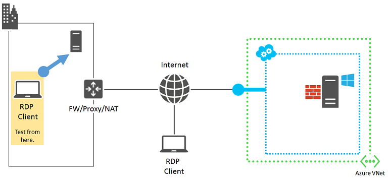
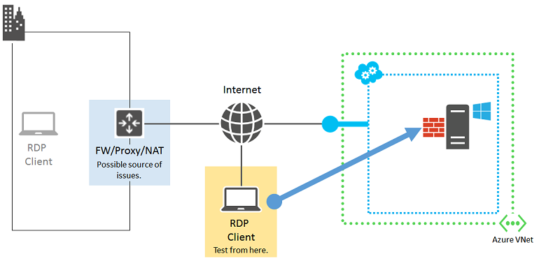

<properties
	pageTitle="对远程桌面进行详细故障排除 | Azure"
	description="对运行 Windows 的 Azure 虚拟机的 RDP 连接进行详细故障排除的步骤。"
	services="virtual-machines-windows"
	documentationCenter=""
	authors="iainfoulds"
	manager="timlt"
	editor=""
	tags="top-support-issue,azure-service-management,azure-resource-manager"/>

<tags
	ms.service="virtual-machines-windows"
	ms.date="04/06/2016"
	wacn.date="05/25/2016"/>

# 对 Windows Azure 虚拟机的远程桌面连接进行详细故障排除

本文提供详细的故障排除步骤，用于为基于 Windows 的 Azure 虚拟机诊断和修复复杂的远程桌面错误。

> [AZURE.IMPORTANT] 若要消除更常见的远程桌面错误，请务必先阅读[远程桌面的基本故障排除文章](/documentation/articles/virtual-machines-windows-troubleshoot-rdp-connection)，然后再继续。

如果你收到的远程桌面错误消息与[基本远程桌面故障排除指南](/documentation/articles/virtual-machines-windows-troubleshoot-rdp-connection)中所述的任何特定错误消息都不相似，可以按照这些步骤操作并尝试找出远程桌面（或 RDP）客户端无法连接到 Azure VM 上的 RDP 服务的原因。

[AZURE.INCLUDE [了解部署模型](../includes/learn-about-deployment-models-both-include.md)]

如果你对本文中的任何点需要更多帮助，可以联系 [MSDN Azure 和 CSDN 论坛](/support/forums/)上的 Azure 专家。或者，你也可以提出 Azure 支持事件。请转到 [Azure 支持站点](/support/contact/)并单击“获取支持”。有关使用 Azure 支持的信息，请阅读 [Azure 支持常见问题](/support/faq/)。

## 远程桌面连接的组件

以下是 RDP 连接所涉及的组件：

在继续之前，在脑海中回想一下自上次远程桌面成功连接到 VM 后更改的内容可能会有帮助。例如：

- 如果 VM 或包含 VM 的云服务的公共 IP 地址（也称为虚拟 IP 地址 [VIP](https://en.wikipedia.org/wiki/Virtual_IP_address)）已更改，则 RDP 失败可能是因为 DNS 客户端缓存仍具有为 DNS 名称注册的*旧 IP 地址*。请刷新 DNS 客户端缓存，并重新尝试连接 VM。或者尝试直接使用新 VIP 进行连接。
- 如果使用第三方应用程序来管理远程桌面连接，而不是使用任何 Azure 经典管理门户，请验证应用程序配置是否包括远程桌面通信的正确 TCP 端口。可以通过在 [Azure 经典管理门户](https://manage.windowsazure.cn/)中单击 VM 的“设置”>“终结点”来检查经典虚拟机的此端口。

## 预备步骤

在继续进行详细故障排除之前，

- 检查 Azure 经典管理门户中虚拟机的状态，或者检查 Azure 经典管理门户中是否存在任何明显问题
- 按照[基本故障排除指南中常见 RDP 错误的快速修复步骤](/documentation/articles/virtual-machines-windows-troubleshoot-rdp-connection)操作

在执行这些步骤后，尝试通过远程桌面重新连接到 VM。

## 详细的疑难解答

由于以下源出现问题，远程桌面客户端可能无法访问 Azure VM 上的远程桌面服务：

- 远程桌面客户端计算机
- 组织 Intranet 边缘设备
- 云服务终结点和访问控制列表 (ACL)
- 网络安全组
- 基于 Windows 的 Azure 虚拟机

### 来源 1：远程桌面客户端计算机

验证你的计算机是否可以与本地另一台基于 Windows 的计算机建立远程桌面连接。

如果不能，请检查你的计算机上是否有以下项：

- 阻止远程桌面流量的本地防火墙设置
- 本地安装的阻止远程桌面连接的客户端代理软件
- 本地安装的阻止远程桌面连接的网络监视软件
- 其他类型的阻止远程桌面连接的安全软件，该软件监视流量或允许/禁止特定类型的流量

对于所有这些情况，请暂时禁用可疑软件，然后尝试通过远程桌面连接到本地计算机。如果你可以通过这种方式找出实际原因，请与网络管理员协作，更正软件设置，以允许远程桌面连接。

### 来源 2：组织 Intranet 边缘设备

验证直接连接到 Internet 的计算机是否可以与 Azure 虚拟机建立远程桌面连接。

如果没有直接连接到 Internet 的计算机，则可以在云服务中创建新的 Azure 虚拟机并使用它进行测试。有关详细信息，请参阅[在 Azure 经典管理门户中创建运行 Windows 的虚拟机](/documentation/articles/virtual-machines-windows-classic-tutorial)。在测试后，可以删除该虚拟机和云服务。

如果你可以创建与直接连接到 Internet 的计算机的远程桌面连接，请检查你组织的 Intranet 边缘设备中是否有以下项：

- 阻止与 Internet 的 HTTPS 连接的内部防火墙
- 阻止远程桌面连接的代理服务器
- 边界网络中的设备上运行的阻止远程桌面连接的入侵检测或网络监视软件

与网络管理员协作，更正组织 Intranet 边缘设备的设置，以允许与 Internet 建立基于 HTTPS 的远程桌面连接。

### 来源 3：云服务终结点和 ACL

对于使用经典部署模型创建的虚拟机，请验证位于同一云服务或虚拟网络中的另一个 Azure 虚拟机是否可以与 Azure 虚拟机建立远程桌面连接。

如果在同一云服务或虚拟网络中没有另一个虚拟机，可以按照[在 Azure 中创建运行 Windows 的虚拟机](/documentation/articles/virtual-machines-windows-classic-tutorial)中的步骤创建一个新的虚拟机。测试完成后，请删除额外的虚拟机。

如果可以通过远程桌面连接到同一云服务或虚拟网络中的虚拟机，请检查以下项：

- 目标 VM 上远程桌面通信的终结点配置：终结点的专用 TCP 端口必须与 VM 的远程桌面服务正在侦听的 TCP 端口（默认值为 3389）匹配。
- 目标 VM 上远程桌面通信终结点的 ACL：ACL 允许你指定基于源 IP 地址允许或拒绝从 Internet 传入的流量。错误配置 ACL 可能会阻止传入远程桌面流量到达终结点。检查你的 ACL 以确保允许从你的代理服务器或其他边缘服务器的公共 IP 地址传入的流量。有关详细信息，请参阅[什么是网络访问控制列表 (ACL)？](/documentation/articles/virtual-networks-acl)。

要检查终结点是否是问题的源，请删除当前终结点，然后创建一个新终结点，并选择范围 49152-65535 中的随机端口作为外部端口号。有关详细信息，请参阅[如何对虚拟机设置终结点](/documentation/articles/virtual-machines-windows-classic-setup-endpoints)。

### 来源 4：网络安全组

使用网络安全组可以对允许的入站和出站流量进行更精细的控制。你可以创建跨 Azure 虚拟网络中的子网和云服务的规则。检查你的网络安全组规则，以确保允许来自 Internet 的远程桌面流量。

有关详细信息，请参阅[什么是网络安全组 (NSG)？](/documentation/articles/virtual-networks-nsg)。

### 来源 5：基于 Windows 的 Azure 虚拟机

使用 [Azure IaaS (Windows) 诊断程序包](https://home.diagnostics.support.microsoft.com/SelfHelp?knowledgebaseArticleFilter=2976864)查看失败是否是由于 Azure 虚拟机本身导致的。如果此诊断程序包无法解决**与 Azure VM 的 RDP 连接（需要重启）**问题，请按照[如何为 Windows 虚拟机重置密码或远程桌面服务](/documentation/articles/virtual-machines-windows-reset-rdp)中的说明在虚拟机上重置“远程桌面”服务。这将：

- 启用“远程桌面”Windows 防火墙默认规则（TCP 端口 3389）。
- 通过将 HKLM\\System\\CurrentControlSet\\Control\\Terminal Server\\fDenyTSConnections 注册表值设置为 0，启用远程桌面连接。

从你的计算机重试连接。如果仍无法通过远程桌面连接，请检查是否存在以下可能问题：

- “远程桌面”服务未在目标 VM 上运行。
- “远程桌面”服务未侦听 TCP 端口 3389。
- Windows 防火墙或其他本地防火墙使用阻止远程桌面通信的出站规则。
- Azure 虚拟机上运行的入侵检测或网络监视软件正在阻止远程桌面连接。

对于使用经典部署模型创建的 VM，可以使用与 Azure 虚拟机的远程 Azure PowerShell 会话。首先，需要安装虚拟机托管云服务的证书。转到[为 Azure 虚拟机配置安全远程 PowerShell 访问](http://gallery.technet.microsoft.com/scriptcenter/Configures-Secure-Remote-b137f2fe)，并将 **InstallWinRMCertAzureVM.ps1** 脚本文件下载到本地计算机。

接下来，安装 Azure PowerShell（如果尚未安装）。请参阅[如何安装和配置 Azure PowerShell](/documentation/articles/powershell-install-configure)。

接下来，打开 Azure PowerShell 命令提示符，并将当前文件夹更改为 **InstallWinRMCertAzureVM.ps1** 脚本文件所在的位置。若要运行 Azure PowerShell 脚本，必须设置正确的执行策略。运行 **Get-ExecutionPolicy** 命令，以确定当前的策略级别。有关设置相应级别的信息，请参阅 [Set-ExecutionPolicy](https://technet.microsoft.com/zh-cn/library/hh849812.aspx)。

接下来，填写你的 Azure 订阅名称、云服务名称和虚拟机名称（删除 < and > 字符），然后运行这些命令。

	$subscr="<Name of your Azure subscription>"
	$serviceName="<Name of the cloud service that contains the target virtual machine>"
	$vmName="<Name of the target virtual machine>"
	.\InstallWinRMCertAzureVM.ps1 -SubscriptionName $subscr -ServiceName $serviceName -Name $vmName

你可以从 **Get-AzureSubscription** 命令显示的 _SubscriptionName_ 属性获取正确的订阅名称。可以从 **Get-AzureVM** 命令显示的 _ServiceName_ 列中获取虚拟机的云服务名称。

检查你是否拥有新证书，请打开当前用户的“证书”管理单元，然后在“受信任的根证书颁发机构\\证书”文件夹中查找。你应看到在“颁发给”列中具有你的云服务的 DNS 名称的证书（示例：cloudservice4testing.chinacloudapp.cn）。

接下来，使用以下命令启动远程 Azure PowerShell 会话。

	$uri = Get-AzureWinRMUri -ServiceName $serviceName -Name $vmName
	$creds = Get-Credential
	Enter-PSSession -ConnectionUri $uri -Credential $creds

输入有效的管理员凭据之后，你应看到如下内容作为 Azure PowerShell 提示符：

	[cloudservice4testing.chinacloudapp.cn]: PS C:\Users\User1\Documents>

此提示的第一部分是你的云服务名称（其中包含目标 VM），这可能不同于“cloudservice4testing.chinacloudapp.cn”。现在，你可以对此云服务发出 Azure PowerShell 命令，以调查上面提到的其他问题，并更正配置。

### 手动更正远程桌面服务侦听 TCP 端口

如果你无法针对“与 Azure VM 的 RDP 连接(需要重启)”问题运行 [Azure IaaS (Windows) 诊断程序包](https://home.diagnostics.support.microsoft.com/SelfHelp?knowledgebaseArticleFilter=2976864)，请在远程 Azure PowerShell 会话提示符下，运行此命令。

	Get-ItemProperty -Path "HKLM:\System\CurrentControlSet\Control\Terminal Server\WinStations\RDP-Tcp" -Name "PortNumber"

PortNumber 属性显示当前端口号。如果需要，可使用此命令将远程桌面端口号更改回其默认值 (3389)。

	Set-ItemProperty -Path "HKLM:\System\CurrentControlSet\Control\Terminal Server\WinStations\RDP-Tcp" -Name "PortNumber" -Value 3389

使用此命令验证是否已将端口更改为 3389。

	Get-ItemProperty -Path "HKLM:\System\CurrentControlSet\Control\Terminal Server\WinStations\RDP-Tcp" -Name "PortNumber"

使用此命令退出远程 Azure PowerShell 会话。

	Exit-PSSession

验证 Azure VM 的远程桌面终结点是否也使用 TCP 端口 3398 作为其内部端口。重启 Azure VM，并重新尝试远程桌面连接。

## 其他资源

[Azure IaaS (Windows) 诊断程序包](https://home.diagnostics.support.microsoft.com/SelfHelp?knowledgebaseArticleFilter=2976864)

[如何为 Windows 虚拟机重置密码或远程桌面服务](/documentation/articles/virtual-machines-windows-reset-rdp)

[如何安装和配置 Azure PowerShell](/documentation/articles/powershell-install-configure)

[对于基于 Linux 的 Azure 虚拟机的 Secure Shell (SSH) 连接进行故障排除](/documentation/articles/virtual-machines-linux-troubleshoot-ssh-connection)

[对在 Azure 虚拟机上运行的应用程序的访问进行故障排除](/documentation/articles/virtual-machines-windows-troubleshoot-app-connection)

<!---HONumber=Mooncake_0215_2016-->