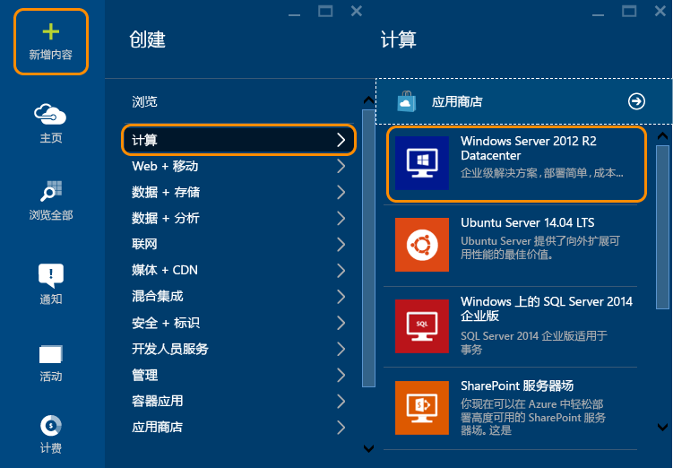
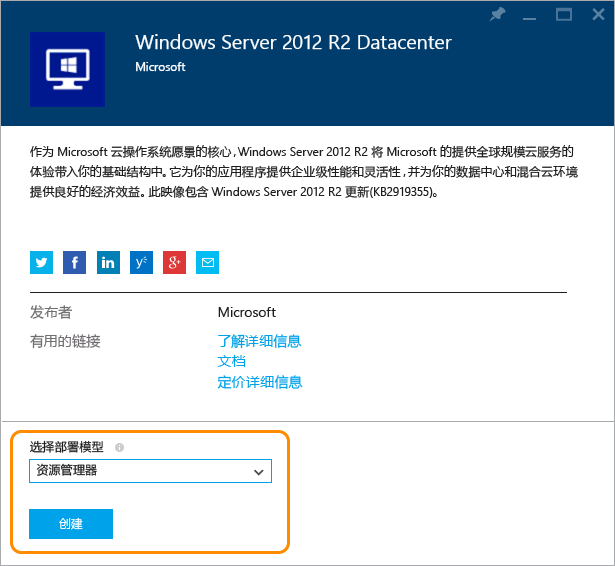
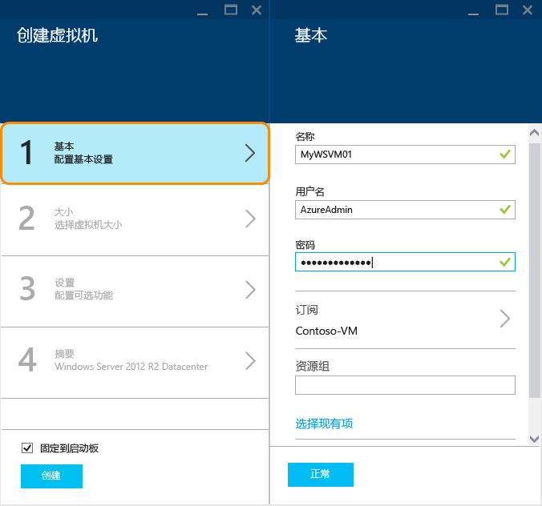
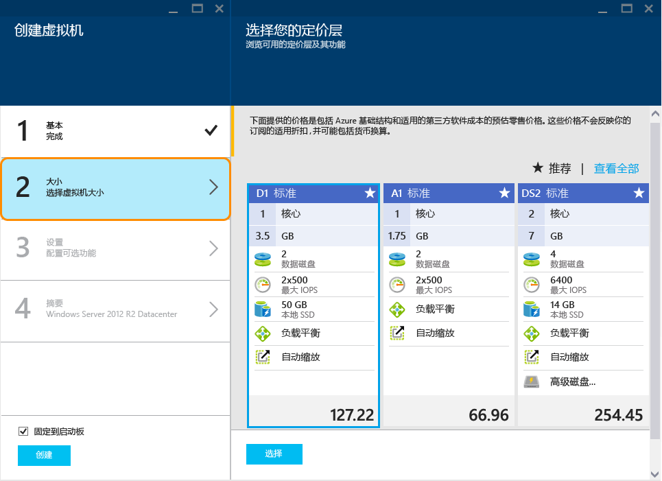
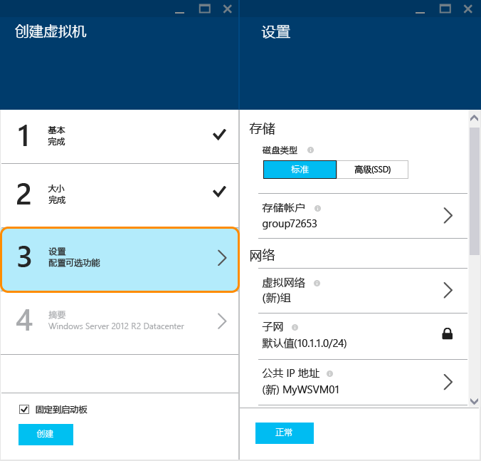
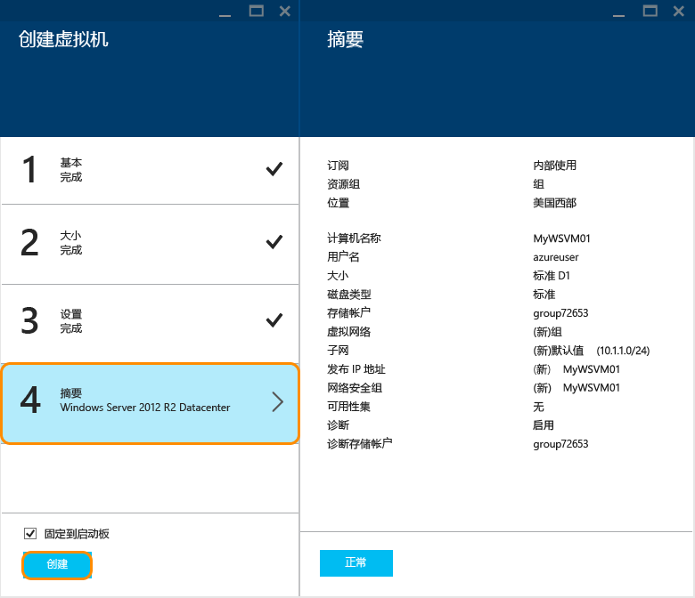

<!-- not suitable for Mooncake -->

<properties
	pageTitle="在 Azure 门户中创建 Windows 虚拟机 | Azure"
	description="了解如何使用 Azure 门户中的 Azure 库创建 Windows 虚拟机或虚拟计算机"
	keywords="Windows 虚拟机,创建虚拟机,虚拟计算机,设置虚拟机"
	services="virtual-machines-windows"
	documentationCenter=""
	authors="cynthn"
	manager="timlt"
	editor=""
	tags="azure-resource-manager"/>
<tags 
	ms.service="virtual-machines-windows"
	ms.date="01/07/2016"
	wacn.date="06/07/2016"/>

# 在 Azure 门户中创建 Windows 虚拟机#

> [AZURE.SELECTOR]
- [门户](/documentation/articles/virtual-machines-windows-hero-tutorial)
- [PowerShell](/documentation/articles/virtual-machines-windows-create-powershell)
- [模板](/documentation/articles/virtual-machines-windows-ps-template)

本教程演示在 Azure 门户中只需几分钟即可创建 Windows 虚拟机，是多么容易。我们将使用 Windows Server 2012 R2 数据中心映像作为示例来创建虚拟机，但这只是 Azure 提供的众多映像的其中一个。映像选择取决于订阅。例如，桌面映像可能适用于 MSDN 订户。

[AZURE.INCLUDE [free-trial-note](../includes/free-trial-note.md)]
 

> [AZURE.NOTE]Azure 具有用于创建和处理资源的两个不同的部署模型：[资源管理器和经典](/documentation/articles/resource-manager-deployment-model)。这篇文章介绍如何使用资源管理器部署模型，Microsoft 建议大多数新部署使用资源管理器模型替代经典部署模型。

>[AZURE.TIP] 使用门户时，如果你希望 VM 属于某个可用性集时，则需要在创建集中的第一个 VM 之前或其期间创建该可用性集。有关创建和使用可用性集的详细信息，请参阅[管理虚拟机的可用性](/documentation/articles/virtual-machines-manage-availability)。

## 选择 Windows 虚拟机映像

1. 登录到 Azure 门户。

2. 在“中心”菜单上，单击“新建”>“计算”>“Windows Server 2012 R2 数据中心”。

	

	>[AZURE.TIP] 若要查找其他映像，请单击“应用商店”，然后搜索或筛选可用的项。

3. 在“Windows Server 2012 R2 数据中心”页上，在“选择部署模型”下选择“资源管理器”。单击“创建”。

	

## 创建 Windows 虚拟机

选择映像后，可以对大多数配置使用 Azure 的默认设置并快速创建虚拟机。

1. 在“创建虚拟机”边栏选项卡上，单击“基本信息”。

2. 输入你想要为虚拟机起的“名称”。该名称不能包含特殊字符。

3. 输入管理“用户名”和强“密码”。密码的长度必须是 8 到 123 个字符，并且必须至少包含 3 个以下字符：1 个小写字符、1 个大写字符、1 个数字和 1 个特殊字符。“你需要使用用户名和密码登录到虚拟机”。

4. 如果有多个订阅，请为新虚拟机指定一个订阅，并指定一个新的或现有的“资源组”以及 Azure 数据中心的“位置”。

	

	
2. 单击“大小”并选择适合你需要的虚拟机大小。每种大小都指定了计算核心的数量、内存以及其他功能，比如对高级存储的支持，这将对价格产生影响。根据所选的映像，Azure 将自动推荐特定的大小。

	

	>[AZURE.NOTE] 某些地区的 DS 系列虚拟机提供高级存储。高级存储是数据密集型工作负荷（如数据库）的最佳存储选项。有关详细信息，请参阅[高级存储：适用于 Azure 虚拟机工作负荷的高性能存储](/documentation/articles/storage-premium-storage)。

3. 单击“设置”以查看新虚拟机的存储和网络设置。对于第一个虚拟机，一般可以接受默认设置。如果选择了支持它的虚拟机大小，则可以通过选择“磁盘类型”下的“高级(SSD)”来试用高级存储。

	

6. 单击“摘要”以查看你的配置选择。查看或更新完设置后，单击“创建”。

	

8. 当 Azure 创建虚拟机时，你可以在“中心”菜单中的“虚拟机”下跟踪进度。

## 登录到 Windows 虚拟机

创建虚拟机后，你需要登录其中，以便可以管理其设置以及要在其上运行的应用程序。

>[AZURE.NOTE] 如需了解相关要求和疑难解答提示，请参阅[使用 RDP 或 SSH 连接到 Azure 虚拟机](https://msdn.microsoft.com/zh-cn/library/azure/dn535788.aspx)。

1. 如果你尚未登录 Azure 门户，请先登录。

2. 单击仪表板上的虚拟机，或者单击“虚拟机”并从列表中选择它。

3. 在虚拟机边栏选项卡上，单击“连接”。

	

4. 单击“打开”以使用自动为 Windows Server 虚拟机创建的远程桌面协议文件。

5. 单击“连接”。

6. 键入你在创建虚拟机时指定的用户名和密码，然后单击“确定”。

7. 单击“是”以验证虚拟机的标识。

你现在可以像使用任何其他服务器一样使用该虚拟机。

## 后续步骤

* 使用 Azure PowerShell 和 Azure CLI 来[查找和选择虚拟机映像](/documentation/articles/resource-groups-vm-searching)。
* 使用 [Azure Resource Manager 模板](https://azure.microsoft.com/documentation/templates/)自动部署和管理虚拟机和工作负荷。
* 你也可以使用 Azure CLI 快速[创建 Linux 虚拟机](/documentation/articles/virtual-machines-linux-quick-create-cli)。

<!---HONumber=Mooncake_0411_2016-->