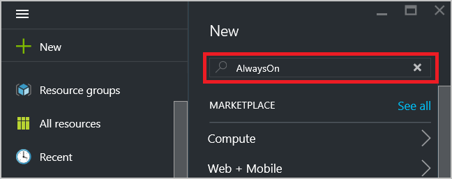
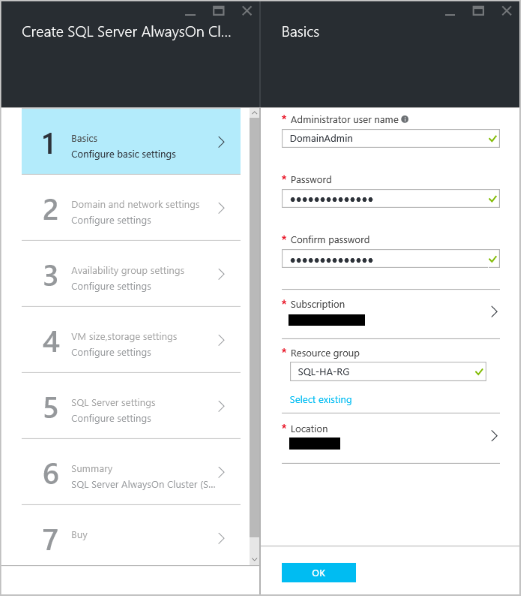
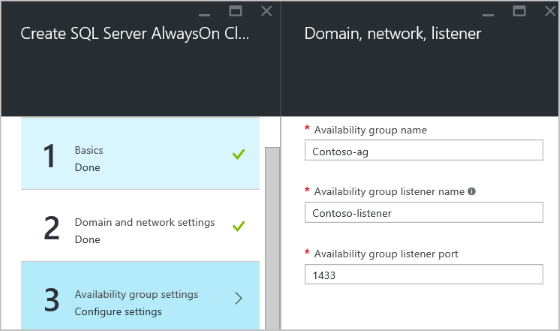
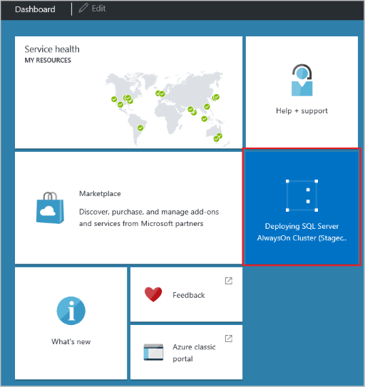
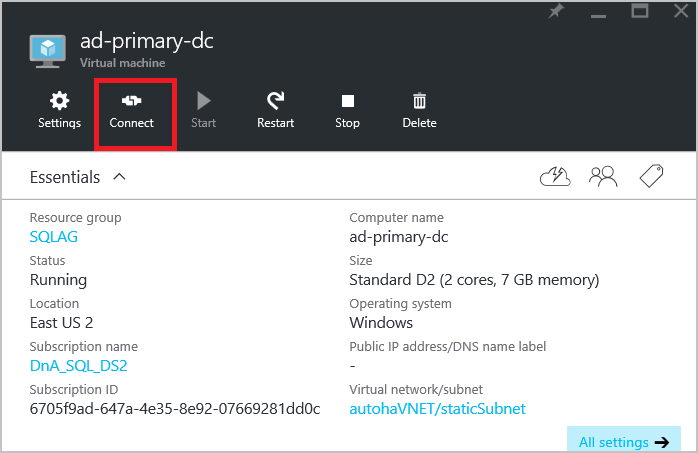

<!-- not suitable for Mooncake -->

<properties
	pageTitle="配置 AlwaysOn 可用性组 Azure Resource Manager | Azure"
	description="在 Azure Resource Manager 模式下使用 Azure 虚拟机创建 AlwaysOn 可用性组。本教程主要使用用户界面来自动创建整个解决方案。"
	services="virtual-machines"
	documentationCenter="na"
	authors="MikeRayMSFT"
	manager="jeffreyg"
	editor="monicar"
	tags="azure-resource-manager" />
<tags 
	ms.service="virtual-machines-windows"
	ms.date="02/04/2016"
	wacn.date="06/07/2016"/>

# 在 Azure Resource Manager 虚拟机 (GUI) 中配置 AlwaysOn 可用性组

> [AZURE.NOTE]Azure 具有用于创建和处理资源的两个不同的部署模型：[资源管理器和经典](/documentation/articles/resource-manager-deployment-model)。这篇文章介绍如何使用资源管理器部署模型，Microsoft 建议大多数新部署使用资源管理器模型替代经典模型。

本端到端教程介绍如何使用 Azure Resource Manager 虚拟机创建 SQL Server 可用性组。本教程将使用 Azure 边栏选项卡配置模板。当你完成本教程时，你将查看门户中的默认设置，键入所需设置，以及更新边栏选项卡。

>[AZURE.NOTE] 在 Azure 经典门户中，为 AlwaysOn 可用性组设置了一个包含侦听器的新库。该库可自动配置 AlwaysOn 可用性组所需的所有设置。有关详细信息，请参阅 [SQL Server AlwaysOn Offering in Azure classic portal Gallery](http://blogs.technet.com/b/dataplatforminsider/archive/2014/08/25/sql-server-alwayson-offering-in-microsoft-azure-portal-gallery.aspx)（Azure 经典门户库中的 SQL Server AlwaysOn 产品）。

完成本教程后，Azure 中的 SQL Server AlwaysOn 解决方案将包括以下要素：

- 一个包含多个子网（包括前端子网和后端子网）的虚拟网络

- 包含 Active Directory (AD) 域的两个域控制器

- 部署到后端子网并加入 AD 域的两个 SQL Server VM

- 具有节点多数仲裁模型的 3 节点 WSFC 群集

- 具有可用性数据库的两个同步提交副本的可用性组

下图显示了该解决方案的示意图。

本解决方案中的所有资源均属于单个资源组。

本教程的假设条件如下：

- 你已有一个 Azure 帐户。如果没有，请[注册试用帐户](/pricing/1rmb-trial/)。

- 你已经知道如何使用 GUI 从虚拟机库预配 SQL Server VM。有关详细信息，请参阅[在 Azure 上预配 SQL Server 虚拟机](/documentation/articles/virtual-machines-windows-portal-sql-server-provision)

- 你已经深入了解 AlwaysOn 可用性组。有关详细信息，请参阅 [AlwaysOn 可用性组 (SQL Server)](http://msdn.microsoft.com/zh-cn/library/hh510230.aspx)。

>[AZURE.NOTE] 如果你想将 AlwaysOn 可用性组与 SharePoint 结合使用，另请参阅[为 SharePoint 2013 配置 SQL Server 2012 AlwaysOn 可用性组](http://technet.microsoft.com/zh-cn/library/jj715261.aspx)。

在本教程中，你将使用 Azure 门户执行以下操作︰

- 从门户中选择新的 AlwaysOn 可用性组模板

- 查看该模板设置并针对你的环境更新几个配置设置

- 在 Azure 创建整个环境时监视 Azure

- 连接到其中一个域控制器，然后连接到其中一个 SQL Server

## 从库使用资源管理器部署模型预配 AlwaysOn 可用性组

Azure 为整个解决方案提供库映像。若要查找模板，请执行以下操作：

1. 	使用你的帐户登录到 Azure 门户。
1.	在 Azure 门户中，单击“+新建”。 该门户将打开新的边栏选项卡。 
1.	在“新建”边栏选项卡中搜索“AlwaysOn”。
1.	在搜索结果中找到“SQL Server AlwaysOn 群集”。
1.	在“选择部署模型”中选择“Resource Manager”。

### 基础知识

单击“基本信息”，并配置以下各项：

- “管理员用户名”是具有域管理员权限的用户帐户，并且是两个 SQL Server 实例上 SQL Server sysadmin 固定服务器角色的成员。对于本教程，请使用“DomainAdmin”。 

- “密码”是域管理员帐户的密码。请使用复杂密码。确认该密码。

- “订阅”是指向 Azure 付费，以便运行为 AlwaysOn 可用性组部署的所有资源。如果你的帐户具有多个订阅，可以指定不同订阅。
 
- “资源组”是本教程创建的所有 Azure 资源所属的组的名称。对于本教程，请使用“SQL-HA-RG”。有关详细信息，请参阅（Azure Resource Manager 概述）[resource-group-overview.md/#resource-groups]。

- “位置”是将在其中创建本教程的资源的 Azure 区域。请选择要托管基础结构的 Azure 区域。

下面是“基本信息”边栏选项卡的外观：

- 单击“确定”。 

### 域和网络设置

此 Azure 库模板将使用新的域控制器创建新域。它还将创建一个新的网络和两个子网。该模板不允许在现有域或虚拟网络中创建服务器。下一步是配置域和网络设置。

在“域和网络设置”边栏选项卡中查看有关域和网络设置的预设值：

- “林根域名”是将用于托管群集的 AD 域的域名。对于本教程，请使用“contoso.com”。 

- “虚拟网络名称”是 Azure 虚拟网络的网络名称。对于本教程，请使用“autohaVNET”。

- “域控制器子网名称”是托管域控制器的一部分虚拟网络的名称。对于本教程，请使用“subnet-1”。此子网将使用地址前缀“10.0.0.0/24”。

- “SQL Server 子网名称”是托管 SQL Server 和文件共享见证的一部分虚拟网络的名称。对于本教程，请使用“subnet-2”。此子网将使用地址前缀“10.0.1.0/26”。

若要了解有关 Azure 中虚拟网络的详细信息，请参阅[虚拟网络概述](/documentation/articles/virtual-networks-overview)。

“域和网络设置”应如下所示：

 
如有必要，你可能会更改这些值。对于本教程，我们使用预设值。
 
- 查看设置，然后单击“确定”。 

###可用性组设置

在“可用性组设置”中查看可用性组和侦听器的预设值。

- “可用性组名称”是可用性组的群集资源名称。对于本教程，请使用 “Contoso-ag”。 

- “可用性组侦听器名称”由群集和内部负载平衡器使用。连接到 SQL Server 的客户端可以使用此名称来连接到数据库的相应副本。对于本教程，请使用“Contoso-listener”。

-  “可用性组侦听器端口”指定 SQL Server 侦听器将使用的 TCP 端口。对于本教程，请使用默认端口 “1433”。

如有必要，你可能会更改这些值。对于本教程，使用预设值。

- 单击“确定”。 

###VM 大小、存储设置

在“VM 大小、存储设置”中，选择 SQL Server 虚拟机大小并查看其他设置。

- “SQL Server 虚拟机大小”是两个 SQL Server 的 Azure 虚拟机大小。选择适合你的工作负荷的虚拟机大小。如果你正在为本教程构建此环境，请使用 **DS2**。对于生产工作负荷，选择可支持工作负荷的虚拟机大小。许多生产工作负荷需要 **DS4** 或更大。该模板将生成此大小的两个虚拟机并在每个虚拟机上安装 SQL Server。有关详细信息，请参阅[虚拟机的大小](/documentation/articles/virtual-machines-windows-sizes)。

>[AZURE.NOTE]Azure 将安装 SQL Server 企业版。费用取决于版本和虚拟机大小。有关当前费用的详细信息，请参阅[虚拟机定价](/home/features/virtual-machines/#price)。

- “域控制器虚拟机大小”是域控制器的虚拟机大小。对于本教程，请使用 **D2**。

- “文件共享见证虚拟机大小”是文件共享见证的虚拟机大小。对于本教程，请使用 **A1**。

- “SQL 存储帐户”是要保留 SQL Server 数据和操作系统磁盘的存储帐户的名称。对于本教程，请使用 “alwaysonsql01”。

- “DC 存储帐户”是域控制器的存储帐户的名称。对于本教程，请使用 “alwaysondc01”。

- “SQL Server 数据磁盘大小”（以 TB 为单位）是 SQL Server 数据磁盘的大小（以 TB 为单位）。指定从 1 到 4 的数字。这是将附加到每个 SQL Server 的数据磁盘大小。对于本教程，请使用 **1**。

- “存储优化”根据工作负荷类型设置 SQL Server 虚拟机的特定存储配置设置。对于本方案中的所有 SQL Server，使用高级存储并将 Azure 磁盘主机缓存设置为只读。此外，还可以通过选择以下三种设置之一来针对工作负荷优化 SQL Server 设置：

    - “常规工作负荷”设置非特定配置设置 

    - “事务处理”设置跟踪标志 1117 和 1118

    - “数据仓库”设置跟踪标志 1117 和 610

对于此教程，请使用“常规工作负荷”。

- 查看设置，然后单击“确定”。 

####有关存储的注意事项

其他优化取决于 SQL Server 数据磁盘的大小。对于每 TB 的数据磁盘，Azure 将额外添加 1 TB 高级存储 (SSD)。如果服务器需要 2 TB 或更大存储空间，该模板将在每个 SQL Server 上创建存储池。存储池是存储虚拟化的一种形式，其中配置了多张光盘以提供更高容量、复原能力和性能。然后，该模板在存储池上创建一个存储空间，并将此存储空间作为单个数据提供给操作系统。该模板将此磁盘指定为 SQL Server 的数据磁盘。该模板使用以下设置针对 SQL Server 优化存储池：

- 带区大小是虚拟磁盘的交错设置。对于事务工作负荷，此项设置为 64 KB。对数据仓库工作负荷，此设置为 256 KB。 

- 复原功能很简单（无复原功能）。

>[AZURE.NOTE] Azure 高级存储为本地冗余，并在单个区域中保留数据的三个副本，因此无需在存储池中具有额外的复原功能。

- 列数等于存储池中的磁盘数。 

有关存储空间和存储池的其他信息，请参阅：

- [存储空间概述](http://technet.microsoft.com/zh-cn/library/hh831739.aspx)。 

- [Windows Server Backup 和存储池](http://technet.microsoft.com/zh-cn/library/dn390929.aspx)

有关 SQL Server 配置最佳做法的详细信息，请参阅 [Azure 虚拟机中 SQL Server 的性能最佳实践](/documentation/articles/virtual-machines-windows-sql-performance)

###SQL Server 设置

在“SQL Server 设置”中查看和修改 SQL Server VM 名称前缀、SQL Server 版本、SQL Server 服务帐户和密码以及 SQL 自动修补维护计划。

- “SQL Server 名称前缀”用于创建每个 SQL Server 的名称。对于本教程，请使用 “Contoso-ag”。SQL Server 名称将为 *Contoso-ag-0* 和 *Contoso-ag-1*。 

- “SQL Server 版本”是 SQL Server 的版本。对于本教程，请使用 “SQL Server 2014”。还可以选择 “SQL Server 2012” 或 “SQL Server 2016”。

- “SQL Server 服务帐户用户名”是 SQL Server 服务的域帐户名称。对于本教程，请使用 “sqlservice”。

- “密码”是 SQL Server 服务帐户的密码。请使用复杂密码。确认该密码。

- “SQL 自动修补维护计划”标识 Azure 将自动修补 SQL Server 的工作日。对于本教程中，请键入“星期日”。

- “SQL 自动修补维护开始小时”是 Azure 区域的当日时间，在该时间自动修补将开始。

>[AZURE.NOTE]每个 VM 的修补窗口将错开一小时。为了防止服务中断，一次只修补一个虚拟机。

查看设置，然后单击“确定”。

###摘要

在摘要页上，Azure 将验证设置。还可以下载模板。查看摘要。单击“确定”。

###购买

这个最后的边栏选项卡包含“使用条款”和“隐私策略”。查看此信息。当你准备好让 Azure 开始创建虚拟机以及 AlwaysOn 可用性组所需的其他所有资源时，请单击“创建”。
 
Azure 门户将创建资源组和所有资源。

##监视部署

从 Azure 门户监视部署进度。表示部署的图标会自动固定到 Azure 门户仪表板上。

##连接到 SQL Server

SQL Server 的新实例将在未连接到 Internet 的虚拟机上运行。但是，域控制器则具有面向 Internet 的连接。若要使用远程桌面连接到 SQL Server，需先通过 RDP 连接到域控制器之一。在域控制器上打开第二个 RDP，以连接到 SQL Server。

若要通过 RDP 连接到主域控制器，请执行以下步骤：

1.	在 Azure 门户仪表板中，确保部署已成功。 

1.	单击“资源”。

1.	在“资源”边栏选项卡中，单击“ad-primary-dc”（即主域控制器所在的虚拟机的计算机名称）。

1.	在“ad-primary-dc”的边栏选项卡中，单击“连接”。浏览器将询问是要打开还是要保存远程连接对象。单击“打开”。
1.	“远程桌面连接”可能会警告你：无法识别此远程连接的发布者。单击“连接”。

1.	Windows 安全性会提示你输入凭据，以便连接到主域控制器的 IP 地址。单击“使用另一帐户”。对于“用户名”，请键入 “contoso\\DomainAdmin”。这是你选择作为管理员用户名的帐户。当配置了模板时，请使用所选的复杂密码。

1.	“远程桌面”可能会警告你：由于安全证书存在问题，无法验证远程计算机。它将显示安全证书名称。如果你按照本教程操作，该名称将为 “ad-primary-dc.contoso.com”。单击“是”。

现在，你已连接到主域控制器。若要通过 RDP 连接到 SQL Server，请执行以下步骤：

1.	在域控制器上，打开“远程桌面连接”。 

1.	对于“计算机”，请键入 SQL Server 所在的计算机的名称。对于本教程，请键入 “sqlserver-0”。

1.	请使用用于通过 RDP 连接到域控制器的同一用户帐户和密码。

现在，你已通过 RDP 连接到 SQL Server。你可以打开 SQL Server Management Studio，连接到 SQL Server 的默认实例并验证 AlwaysOn 可用性组是否已配置。

<!---HONumber=Mooncake_0411_2016-->