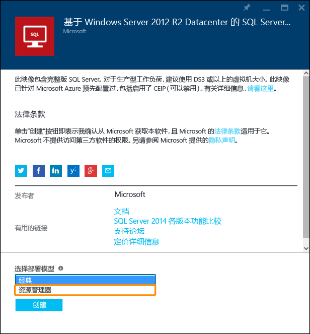
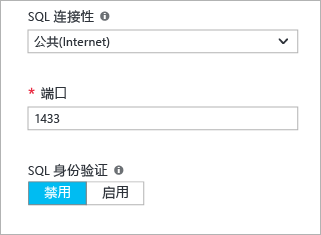
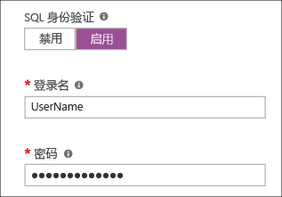
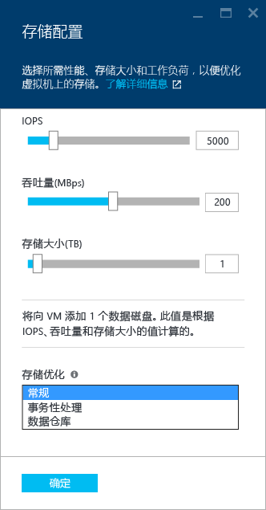
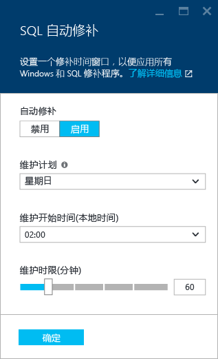
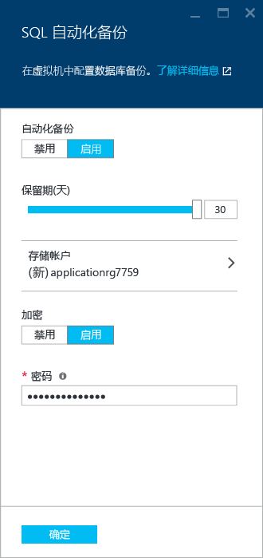
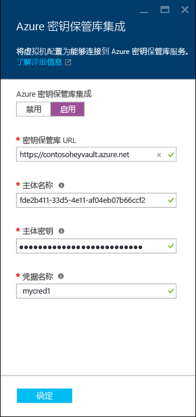

<properties
	pageTitle="在 Azure 门户中预配 SQL Server 虚拟机 | Azure"
	description="在 Azure Resource Manager 模式中创建 SQL Server 虚拟机。本教程主要使用用户界面和工具而不是脚本。"
	services="virtual-machines-windows"
	documentationCenter="na"
	authors="MikeRayMSFT"
    editor=""
	manager="jeffreyg"
	tags="azure-resource-manager" />

<tags
	ms.service="virtual-machines-windows"
	ms.date="05/16/2016"
	wacn.date="06/27/2016"/>

# 在 Azure 门户中预配 SQL Server 虚拟机

## 概述

此端到端教程介绍如何在门户中使用 Azure Resource Manager 模型预配 Azure 虚拟机，以及如何通过 Azure 库中的模板配置 SQL Server。

> [AZURE.NOTE] Azure 具有用于创建和处理资源的两个不同的部署模型：[资源管理器和经典](/documentation/articles/resource-manager-deployment-model)。本文介绍如何使用 Resource Manager 部署模型。Microsoft 建议对大多数新的部署使用该模型，而不是经典部署模型。

Azure 虚拟机 (VM) 库包括几种内含 Microsoft SQL Server 的映像。你可以从库中选择 VM 映像之一，只需要单击几次，即可将 VM 预配到你的 Azure 环境。

在本教程中，您将：

- [连接到 Azure 门户并使用 Resource Manager 部署模型预配库中的 SQL VM 映像](#Provision)

- [配置虚拟机和 SQL Server 设置](#ConfigureVM)

- [使用远程桌面打开虚拟机](#Open)

- [在另一计算机上使用 SQL Server Management Studio 连接到 SQL Server 实例](#Connect)

- [后续步骤](#Next)

本教程假设你已有 Azure 帐户。如果你没有 Azure 帐户，请访问 [Azure 试用](/pricing/1rmb-trial/)。

## 使用资源管理器部署模型预配库中的 SQL VM 映像

1. 使用你的帐户登录到 [Azure 门户](https://portal.azure.cn) 。
1. 在 Azure 门户中，单击“+新建”。该门户将打开“新建”边栏选项卡。SQL Server VM 模板位于应用商店的“计算”组中。

1. 在“新建”边栏选项卡中，单击“计算”。
1. 若要查看“计算”边栏选项卡中的所有类型的资源，请单击“查看全部”。   
1. 在“数据库服务器”下单击“SQL Server”即可查看可供 SQL Server 使用的所有模板。你可能需要向下滚动才能找到“数据库服务器”。
1. 	每个模板均可标识 SQL Server 版本和操作系统。从列表中选择以下映像之一，以便显示包含其详细信息的边栏选项卡。
1.	详细信息边栏选项卡对此虚拟机映像进行了说明，并允许你选择部署模型。在“选择部署模型”下选择“资源管理器”，然后单击“创建”。    

##  配置 VM
在 Azure 门户中有五个用于配置 SQL Server 虚拟机的边栏选项卡。

1.	配置基本设置
1.	选择虚拟机大小
1.	配置虚拟机设置
1.	配置 SQL Server
1.	查看摘要

## 1\.配置基本设置
在“创建虚拟机”边栏选项卡的“基本信息”下提供以下信息：

* 唯一的虚拟机“名称”。
* 在“用户名”框中的计算机本地管理员帐户的唯一用户名。此帐户还将是 SQL Server sysadmin 固定服务器角色的成员。
* 在“密码”框中，键入一个强密码。
* 如果你有多个订阅，请确保该订阅是要构建的 VM 的正确订阅。
* 在“资源组”框中，键入资源组的名称。此外，若要使用现有的资源组，请单击“选择现有项”。资源组是 Azure 中相关服务的集合。有关资源组的详细信息，请参阅 [Azure 资源管理器概述](/documentation/articles/resource-group-overview)。确保“位置”符合要求。
* 单击“确定”对设置进行保存。 

## 2\.选择虚拟机大小
在“创建虚拟机”边栏选项卡的“大小”下选择虚拟机大小。Azure 门户将显示建议的大小。有关虚拟机大小的详细信息，请参阅[虚拟机的大小](/documentation/articles/virtual-machines-windows-sizes)。大小取决于所选模板。可以通过大小来估算每月运行 VM 的费用。针对服务器选择 VM 大小。有关 SQL Server VM 大小的考虑事项，请参阅 [SQL Server 在 Azure 虚拟机中的性能最佳实践](/documentation/articles/virtual-machines-windows-sql-performance)。

## 3\.配置虚拟机设置
在“创建虚拟机”边栏选项卡的“设置”下，为虚拟机配置 Azure 存储空间、网络和监视功能。

- 在“存储”下指定磁盘类型。对于生产型工作负荷，建议使用高级存储。

>[AZURE.NOTE] 默认启用高级存储。该设置会自动调整虚拟机的大小，使之支持高级存储。如果禁用高级存储，则会使用以前选择的虚拟机大小。

- 在“存储帐户”下，你可以接受自动设置的存储帐户名称，或者可以单击“存储帐户”以选择现有的帐户和配置存储帐户类型。默认情况下，Azure 将创建具有本地冗余存储空间的新存储帐户。

- 在“网络”下，你可以接受自动为功能填充的值，也可以单击每项功能，然后配置“虚拟网络”、“子网”、“公共 IP 地址”和“网络安全组”。默认情况下，Azure 会自动配置这些值。

- 默认情况下，Azure 会对为 VM 指定的同一个存储帐户启用“监视”功能。你可以在此处更改这些设置。

- 在“可用性集”下指定可用性集。在本教程中，你可以选择“无”。如果你计划设置 SQL AlwaysOn 可用性组，可以对可用性进行配置，避免重新创建虚拟机。有关详细信息，请参阅[管理虚拟机的可用性](/documentation/articles/virtual-machines-windows-manage-availability)。

## 4\.配置 SQL Server
在“创建虚拟机”边栏选项卡的“配置 SQL Server”下配置 SQL Server 的特定设置和优化措施。你可以为 SQL Server 配置的设置包括：

- 连接
- 身份验证
- 存储优化
- 修补
- 备份
- 密钥保管库集成

### 连接
在“SQL 连接”下指定“公共(Internet)”，以便从 Internet 上的计算机或服务连接到 SQL Server。选择此选项以后，Azure 会自动将防火墙和网络安全组配置为允许在端口 1433 上通信。  
 
 

若要通过 Internet 连接到 SQL Server，还需启用 SQL Server 身份验证。

>[AZURE.NOTE]为了安全起见，可使用网络安全组限制源端口。有关详细信息，请参阅[什么是网络安全组 (NSG)？](/documentation/articles/virtual-networks-nsg)。

如果你不希望启用通过 Internet 自动连接到数据库引擎这一功能，可选择以下选项之一：
- “本地（仅限 VM 内部）”，仅允许从 VM 内部连接到 SQL Server；
- “专用（虚拟网络内）”，允许从同一个虚拟网络中的计算机或服务连接到 SQL Server。

**端口**：默认为 1433。你可以指定其他端口号。有关详细信息，请参阅[连接到 SQL Server 虚拟机（资源管理器）| Azure](/documentation/articles/virtual-machines-windows-sql-connect)。

### 身份验证
如果你需要 SQL Server 身份验证，请在“SQL 身份验证”下单击“启用”。

   

如果启用 SQL Server 身份验证，请指定“登录名”和“密码”。此用户名将会是 SQL Server 身份验证登录名以及 sysadmin 固定服务器角色的成员。请参阅[选择身份验证模式](http://msdn.microsoft.com/zh-cn/library/ms144284.aspx)以获取有关身份验证模式的详细信息。默认情况下，SQL Server 不启用 SQL Server 身份验证。在这种情况下，虚拟机上的本地管理员可以连接到 SQL Server 实例。

>[AZURE.NOTE] 如果你计划通过 Internet 来访问 SQL Server（即“公共”连接选项），则应在此处启用 SQL 身份验证。对 SQL Server 进行公共访问需要使用 SQL 身份验证。

### 存储优化
单击“存储配置”以便指定存储要求。你可以将要求指定为每秒输入/输出操作数 (IOPs)、吞吐量（MB/秒）以及总存储大小。可使用可调缩放性对这些项进行配置。门户将根据这些要求自动计算磁盘数。

默认情况下，Azure 会对存储进行优化，以满足 5000 IOPs、200 MB 吞吐量和 1 TB 存储空间这样的要求。可根据工作负荷更改存储的这些设置。在“存储优化目标”下，选择以下某个选项

- **常规**：默认设置，支持大多数工作负荷。
- **事务处理**：针对传统数据库 OLTP 工作负荷优化存储。
- **数据仓库**：针对分析和报告工作负荷优化存储。

下图显示了存储配置边栏选项卡。
 
 

>[AZURE.NOTE] 存储配置限制取决于虚拟机大小。有关详细信息，请参阅[虚拟机的大小](/documentation/articles/virtual-machines-windows-sizes)

### 修补
**SQL 自动修补**：默认处于启用状态。Azure 可以通过自动修补来自动修补 SQL Server 和操作系统。指定进行维护的具体日期（星期几）、时间和时长。Azure 会在维护时段进行修补。维护时段计划使用 VM 的时间区域设置。如果你不希望 Azure 自动修补 SQL Server 和操作系统，请单击“禁用”。

 
 

有关详细信息，请参阅 [Azure 虚拟机中 SQL Server 的自动修补](/documentation/articles/virtual-machines-windows-classic-sql-automated-patching)。

### 备份
在“SQL 自动备份”下启用针对所有数据库的自动数据库备份。
启用 SQL 自动备份以后，即可进行以下配置：

- 备份保留期（以天为单位）
- 用于备份的具体存储帐户
- 是否对备份加密。若要加密备份，请单击“启用”。如果对自动化备份加密，请指定密码。Azure 创建一个证书来加密备份，并使用指定的密码来保护该证书。

 
 

 有关详细信息，请参阅[针对 Azure 虚拟机中 SQL Server 的自动备份](/documentation/articles/virtual-machines-windows-classic-sql-automated-backup)。

### 密钥保管库集成
若要将安全密码存储在 Azure 中进行加密，请先单击“Azure 密钥保管库集成”，然后单击“启用”。

 
 

下表列出了配置 Azure 密钥保管库集成所需的参数。

|参数|说明|示例|
|----------|----------|-------|
|**密钥保管库 URL** |密钥保管库的位置。|https://contosokeyvault.vault.chinacloudapi.cn/ |
|**主体名称** |Azure Active Directory 服务主体名称。该名称也称为客户端 ID。 |fde2b411-33d5-4e11-af04eb07b669ccf2|
| **主体密码**|Azure Active Directory 服务主体密码。该密码也称为客户端密码。 | 9VTJSQwzlFepD8XODnzy8n2V01Jd8dAjwm/azF1XDKM=|
|**凭据名称**|**凭据名称**：AKV 集成在 SQL Server 内创建一个凭据，使 VM 具有对密钥保管库的访问权限。为此凭据选择一个名称。| mycred1|

有关详细信息，请参阅[为 Azure VM 上的 SQL Server 配置 Azure 密钥保管库集成](/documentation/articles/virtual-machines-windows-classic-ps-sql-keyvault)。

## 5\.查看摘要
查看摘要，然后单击“确定”以创建为此 VM 指定的 SQL Server、资源组和资源。你可以从 Azure 门户监视部署情况。屏幕顶部的“通知”按钮显示部署的基本状态。

## 使用远程桌面和完整安装打开虚拟机
请按下列步骤使用远程桌面以打开虚拟机：

1.	生成 Azure VM 以后，会在 Azure 仪表板上显示 VM 的图标。单击该图标即可查看有关 VM 的信息。
1.	在 VM 边栏选项卡顶部单击“连接”。浏览器将为 VM 下载 .rdp 文件。打开该 .rdp 文件。
1.	远程桌面连接会通知你无法识别此远程连接的发布者的身份，并询问你是否仍要进行连接。单击“连接”。
1.	在“Windows 安全性”对话框中，单击“使用另一帐户”。对于“用户名”，请键入你在配置 VM 时指定的 <machine name><用户名>。

连接到 SQL Server 虚拟机以后，即可启动 SQL Server Management Studio 并使用本地管理员凭据通过 Windows 身份验证进行连接。这样一来，你还可以在预配后根据需要更改防火墙设置或 SQL Server 配置设置。

##通过 Internet 连接到 SQL Server

若要从 Internet 连接到 SQL Server 数据库引擎，需完成多个必要的步骤，例如配置防火墙、启用 SQL Server 身份验证以及配置网络安全组。必须设置网络安全组规则，以便在端口 1433 上进行 TCP 通信。

如果你使用资源管理器通过门户来预配 SQL Server 虚拟机映像，则当你选择“公共”作为 SQL 连接选项并启用 SQL Server 身份验证时，系统已为你完成以下步骤。但是，若要通过 Internet 访问 SQL Server 实例，仍需完成一些步骤。

>[AZURE.NOTE] 如果你没有在预配过程中选择“公共”，则需执行其他步骤才能通过 Internet 访问 SQL Server 实例。有关详细信息，请参阅[连接到 SQL Server 虚拟机 (Resource Manager) | Azure](/documentation/articles/virtual-machines-windows-sql-connect)。

如果你只需在本地或只需在同一虚拟网络中访问虚拟机，则不需执行以下步骤。

> [AZURE.INCLUDE [连接到 VM Resource Manager 中的 SQL Server](../includes/virtual-machines-sql-server-connection-steps-resource-manager.md)]

##后续步骤
有关在 Azure 中使用 SQL Server 的其他信息，请参阅 [Azure 虚拟机上的 SQL Server](/documentation/articles/virtual-machines-windows-sql-server-iaas-overview)。

<!---HONumber=Mooncake_0509_2016-->