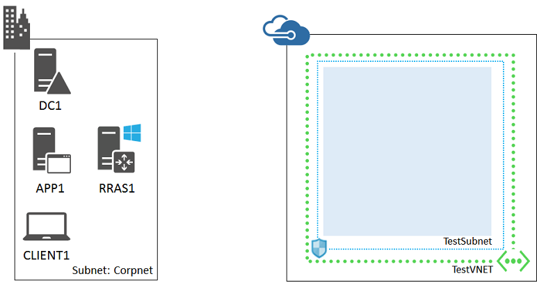
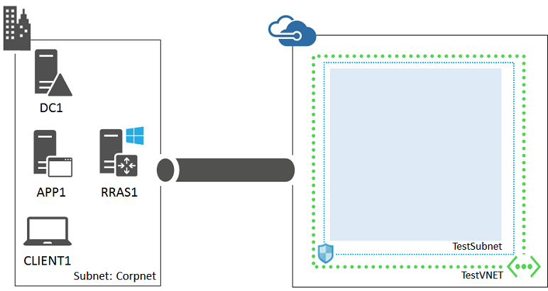

<!-- ARM: tested -->

<properties 
	pageTitle="混合云测试环境 | Azure" 
	description="了解如何创建混合云环境，以便 IT 专业人员或开发人员使用简化的本地网络完成测试。" 
	services="virtual-machines-windows" 
	documentationCenter="" 
	authors="JoeDavies-MSFT" 
	manager="timlt" 
	editor=""
	tags="azure-resource-manager"/>

<tags
	ms.service="virtual-machines-windows"
	ms.date="04/01/2016"
	wacn.date="06/07/2016"/>

# 设置用于测试的混合云环境

> [AZURE.NOTE]Azure 具有用于创建和处理资源的两个不同的部署模型：[资源管理器和经典](/documentation/articles/resource-manager-deployment-model)。这篇文章介绍如何使用资源管理器部署模型，Microsoft 建议大多数新部署使用资源管理器模型替代经典部署模型。

本主题将指导你逐步使用 Azure 创建混合云环境，以便进行测试。这是生成的配置。

这会通过你在 Internet 上的位置模拟真实的混合生产环境。它包括：

-  简化的本地网络（Corpnet 子网）。
-  在 Azure 中托管的跨界虚拟网络 (TestVNET)。
-  站点到站点 VPN 连接。
-  TestVNET 虚拟网络中的辅助域控制器。

此配置提供了基础和通用的起始点，你可以据此执行以下操作：

-  在混合云环境中开发和测试应用程序。
-  针对基于混合云的 IT 工作负载，创建一部分位于 Corpnet 子网上，一部分位于 TestVNET 虚拟网络中的计算机的测试配置。

设置此混合云测试环境需要完成以下五个主要阶段：

1.	在 Corpnet 子网上配置计算机。
2.	配置 RRAS1。
3.	创建跨界 Azure 虚拟网络。
4.	创建站点到站点 VPN 连接。
5.	配置 DC2。 

如果你还没有 Azure 订阅，可以通过[试用 Azure](/pricing/1rmb-trial/) 注册试用帐户。

>[AZURE.NOTE] Azure 中的虚拟机和虚拟网关在运行时会持续产生货币成本。在实施时，Azure VPN 网关将由两台 Azure 虚拟机组成。有关详细信息，请参阅[定价 - 虚拟网络](/home/features/networking/#price)。为了将运行 VPN 网关的费用降到最低，请创建测试环境，并尽可能快地执行所需的测试和演示。

此配置要求使用一个由最多四台计算机组成的测试子网，这些计算机使用公共 IP 地址直接连接到 Internet。如果没有这些资源，你也可以[设置用于测试的模拟混合云环境](/documentation/articles/virtual-machines-windows-ps-hybrid-cloud-test-env-sim)。模拟混合云测试环境只需要 Azure 订阅。

## 阶段 1：在 Corpnet 子网上配置计算机

按照[测试实验室指南：Windows Server 2012 R2 的基本配置](http://www.microsoft.com/download/details.aspx?id=39638)的“配置 Corpnet 子网的步骤”一节中的说明，在名为 Corpnet 的子网上配置 DC1、APP1 和 CLIENT1 计算机。**此子网必须与组织网络隔离，因为它将通过 RRAS1 计算机直接连接到 Internet。**

接下来，使用 CORP\\User1 凭据登录到 DC1。若要配置 CORP 域，以便计算机和用户使用其本地域控制器进行身份验证，请从管理员级 Windows PowerShell 命令提示符运行这些命令。

	New-ADReplicationSite -Name "TestLab" 
	New-ADReplicationSite -Name "TestVNET"
	New-ADReplicationSubnet "Name "10.0.0.0/8" "Site "TestLab"
	New-ADReplicationSubnet "Name "192.168.0.0/16" "Site "TestVNET

这是你当前的配置。

 
## 阶段 2：配置 RRAS1

RRAS1 在 Corpnet 子网和 TestVNET 虚拟网络的计算机之间提供通信路由和 VPN 设备服务。RRAS1 必须安装两个网络适配器。

首先，在 RRAS1 上安装操作系统。

1.	启动 Windows Server 2012 R2 的安装。
2.	按照说明操作以完成安装过程，指定本地管理员帐户的强密码。使用本地管理员帐户登录。
3.	将 RRAS1 连接到具有 Internet 访问权限的网络，并运行 Windows 更新，为 Windows Server 2012 R2 安装最新的更新。
4.	将一个网络适配器连接到 Corpnet 子网，将另一个直接连接到 Internet。RRAS1 可以位于 Internet 防火墙后面，但不能在网络地址转换器 (NAT) 后面。

接下来，配置 RRAS1 的 TCP/IP 属性。你将需要一个公共的 IP 地址配置，包括 Internet 服务提供商 (ISP) 的地址、子网掩码（或前缀长度），以及默认网关和 DNS 服务器。需要使用公共 IP 地址来完成阶段 3。

在 RRAS1 上的管理员级 Windows PowerShell 命令提示符处使用这些命令。在运行这些命令之前，请填写变量值并删除 < and > 字符。你可以从 **Get-NetAdapter** 命令的显示中获取网络适配器的当前名称。

	$corpnetAdapterName="<Name of the adapter attached to the Corpnet subnet>"
	$internetAdapterName="<Name of the adapter attached to the Internet>"
	[Ipaddress]$publicIP="<Your public IP address>"
	$publicIPpreflength=<Prefix length of your public IP address>
	[IPAddress]$publicDG="<Your ISP default gateway>"
	[IPAddress]$publicDNS="<Your ISP DNS server(s)>"
	Rename-NetAdapter -Name $corpnetAdapterName -NewName Corpnet
	Rename-NetAdapter -Name $internetAdapterName -NewName Internet
	New-NetIPAddress -InterfaceAlias "Internet" -IPAddress $publicIP -PrefixLength $publicIPpreflength "DefaultGateway $publicDG
	Set-DnsClientServerAddress -InterfaceAlias Internet -ServerAddresses $publicDNS
	New-NetIPAddress -InterfaceAlias "Corpnet" -IPAddress 10.0.0.2 -AddressFamily IPv4 -PrefixLength 24
	Set-DnsClientServerAddress -InterfaceAlias "Corpnet" -ServerAddresses 10.0.0.1
	Set-DnsClient -InterfaceAlias "Corpnet" -ConnectionSpecificSuffix corp.contoso.com
	New-NetFirewallRule -DisplayName "Allow ICMPv4-Input" -Protocol ICMPv4
	New-NetFirewallRule -DisplayName "Allow ICMPv4-Output" -Protocol ICMPv4 -Direction Outbound
	Disable-NetAdapterBinding -Name "Internet" -ComponentID ms_msclient
	Disable-NetAdapterBinding -Name "Internet" -ComponentID ms_server
	ping dc1.corp.contoso.com

对于最后一个命令，请验证是否有四个响应来自 IP 地址 10.0.0.1。

这是你当前的配置。

## 阶段 3：创建跨界 Azure 虚拟网络

[AZURE.INCLUDE [arm-api-version-powershell](../includes/arm-api-version-powershell.md)]

启动 Azure PowerShell 提示符。

> [AZURE.NOTE] 以下命令集使用 Azure PowerShell 1.0 及更高版本。有关详细信息，请参阅 [Azure PowerShell 1.0](https://azure.microsoft.com/blog/azps-1-0/)。

登录到你的帐户。

	Login-AzureRMAccount

使用以下命令获取你的订阅名称。

	Get-AzureRMSubscription | Sort SubscriptionName | Select SubscriptionName

设置你的 Azure 订阅。使用你在构建基础配置时使用的同一订阅。将引号内的所有内容（包括 < and > 字符）替换为相应的名称。

	$subscr="<subscription name>"
	Get-AzureRmSubscription -SubscriptionName $subscr | Select-AzureRmSubscription

接下来，为混合测试环境创建新的资源组。

若要确定唯一的资源组名称，可使用以下命令列出现有的资源组。

	Get-AzureRMResourceGroup | Sort ResourceGroupName | Select ResourceGroupName

使用以下命令创建新的资源组。

	$rgName="<resource group name>"
	$locName="<an Azure location, such as China North>"
	New-AzureRMResourceGroup -Name $rgName -Location $locName

基于资源管理器的虚拟机需要一个基于资源管理器的存储帐户。必须为每个存储帐户选择只包含小写字母和数字的全局唯一名称。可以使用以下命令列出现有的存储帐户。

	Get-AzureRMStorageAccount | Sort Name | Select Name

使用以下命令创建新的存储帐户。

	$rgName="<your new resource group name>"
	$locName="<the location of your new resource group>"
	$saName="<unique storage account name >"
	New-AzureRMStorageAccount -Name $saName -ResourceGroupName $rgName -Type Standard_LRS -Location $locName

接下来，创建用于托管混合云环境的 Azure 虚拟网络，并使用网络安全组对它进行保护。

	$locShortName="<the location of your new resource group in lowercase with spaces removed, example: chinanorth>"
	$gwSubnet=New-AzureRMVirtualNetworkSubnetConfig -Name "GatewaySubnet" -AddressPrefix "192.168.255.248/29"
	$vmSubnet=New-AzureRMVirtualNetworkSubnetConfig -Name "TestSubnet" -AddressPrefix "192.168.0.0/24"
	New-AzureRMVirtualNetwork -Name "TestVNET" -ResourceGroupName $rgName -Location $locName -AddressPrefix "192.168.0.0/16" -Subnet $gwSubnet,$vmSubnet -DNSServer "10.0.0.1"
	$rule1=New-AzureRMNetworkSecurityRuleConfig -Name "RDPTraffic" -Description "Allow RDP to all VMs on the subnet" -Access Allow -Protocol Tcp -Direction Inbound -Priority 100 -SourceAddressPrefix Internet -SourcePortRange * -DestinationAddressPrefix * -DestinationPortRange 3389
	New-AzureRMNetworkSecurityGroup -Name "TestSubnet" -ResourceGroupName $rgName -Location $locShortName -SecurityRules $rule1
	$vnet=Get-AzureRMVirtualNetwork -ResourceGroupName $rgName -Name "TestVNET"
	$nsg=Get-AzureRMNetworkSecurityGroup -Name "TestSubnet" -ResourceGroupName $rgName
	Set-AzureRMVirtualNetworkSubnetConfig -VirtualNetwork $vnet -Name TestSubnet -AddressPrefix "192.168.0.0/24" -NetworkSecurityGroup $nsg

接下来，使用以下命令创建用于站点到站点 VPN 连接的网关。需要使用在阶段 2 中指定的 RRAS1 的 Internet 接口的公共 IP 地址。

	$localGatewayIP="<the public IP address assigned to the Internet interface of RRAS1>"
	$vnet=Get-AzureRMVirtualNetwork -Name TestVNET -ResourceGroupName $rgName
	
	# Attach a virtual network gateway to a public IP address and the gateway subnet
	$publicGatewayVipName="HybCloudPublicIPAddress"
	$vnetGatewayIpConfigName="HybCloudPublicIPConfig"
	New-AzureRMPublicIpAddress -Name $vnetGatewayIpConfigName -ResourceGroupName $rgName -Location $locName -AllocationMethod Dynamic
	$publicGatewayVip=Get-AzureRMPublicIpAddress -Name $vnetGatewayIpConfigName -ResourceGroupName $rgName
	$vnetGatewayIpConfig=New-AzureRMVirtualNetworkGatewayIpConfig -Name $vnetGatewayIpConfigName -PublicIpAddressId $publicGatewayVip.Id -SubnetId $vnet.Subnets[0].Id
	
	# Create the Azure gateway
	$vnetGatewayName="HybCloudAzureGateway"
	$vnetGateway=New-AzureRMVirtualNetworkGateway -Name $vnetGatewayName -ResourceGroupName $rgName -Location $locName -GatewayType Vpn -VpnType RouteBased -IpConfigurations $vnetGatewayIpConfig
	
	# Create the gateway for the local network
	$localGatewayName="HybCloudLocalNetGateway"
	$localNetworkPrefix="10.0.0.0/8"
	$localGateway=New-AzureRMLocalNetworkGateway -Name $localGatewayName -ResourceGroupName $rgName -Location $locName -GatewayIpAddress $localGatewayIP -AddressPrefix $localNetworkPrefix

请注意，新网关可能需要 20 分钟或更长的时间才能完成。

接下来，使用以下命令来确定虚拟网络的 Azure VPN 网关的公共 IP 地址。

	Get-AzureRMPublicIpAddress -Name $vnetGatewayIpConfigName -ResourceGroupName $rgName

请注意屏幕上 **IPAddress** 字段中的 IP 地址。在阶段 4 将用到该地址。

接下来，从网络或安全管理员处获取随机加密型强 32 字符预共享密钥。或者，使用[创建 IPsec 预共享密钥的随机字符串](http://social.technet.microsoft.com/wiki/contents/articles/32330.create-a-random-string-for-an-ipsec-preshared-key.aspx)中的信息获取预共享密钥。

使用以下命令在 Azure 中创建站点到站点 VPN 连接。

	# Define the Azure virtual network VPN connection
	$vnetConnectionKey="<32-character pre-shared key>"
	$vnetConnectionName="HybCloudS2SConnection"
	$vnetConnection=New-AzureRMVirtualNetworkGatewayConnection -Name $vnetConnectionName -ResourceGroupName $rgName -Location $locName -ConnectionType IPsec -SharedKey $vnetConnectionKey -VirtualNetworkGateway1 $vnetGateway -LocalNetworkGateway2 $localGateway

这是你当前的配置。

 
## 阶段 4：创建站点到站点 VPN 连接

首先，使用路由和远程访问服务配置 RRAS1，让其充当 Corpnet 子网的 VPN 设备。以本地管理员身份登录到 RRAS1，并在 Windows PowerShell 命令提示符下运行这些命令。

	Import-Module ServerManager
	Install-WindowsFeature RemoteAccess -IncludeManagementTools
	Add-WindowsFeature -name Routing -IncludeManagementTools

接下来对 RRAS1 进行配置，以便接收来自 Azure VPN 网关的站点到站点 VPN 连接。重新启动 RRAS1，然后以本地管理员身份登录，并在 Windows PowerShell 命令提示符下运行这些命令。需要提供阶段 3 中指定的 Azure VPN 网关 IP 地址以及预共享的密钥值。

	$PresharedKey="<32-character pre-shared key>"
	Import-Module RemoteAccess
	Install-RemoteAccess -VpnType VpnS2S
	Add-VpnS2SInterface -Protocol IKEv2 -AuthenticationMethod PSKOnly -Persistent -NumberOfTries 3 -ResponderAuthenticationMethod PSKOnly -Name S2StoTestVNET -Destination "<public IP address of the Azure VPN gateway>" -IPv4Subnet @("192.168.0.0/24:100") -SharedSecret $PresharedKey
	Set-VpnServerIPsecConfiguration -EncryptionType MaximumEncryption
	Set-VpnServerIPsecConfiguration -SADataSizeForRenegotiationKilobytes 33553408
	New-ItemProperty -Path HKLM:\System\CurrentControlSet\Services\RemoteAccess\Parameters\IKEV2 -Name SkipConfigPayload -PropertyType DWord -Value 1
	Restart-Service RemoteAccess

等待几分钟，以便在 RRAS1 和 Azure VPN 网关之间建立连接。

接下来，将 RRAS1 配置为支持到各个 Internet 位置的已转换流量。在 RRAS1 上执行以下操作：

1.	在“开始”屏幕中，键入“rras”，然后单击“路由和远程访问”。 
2.	在控制台树中，打开服务器名称，然后单击“IPv4”。
3.	右键单击“常规”，然后单击“新建路由协议”。
4.	单击“NAT”，然后单击“确定”。
5.	在控制台树中，右键单击“NAT”，然后依次单击“新建接口”、“Corpnet”，再单击“确定”两次。
6.	右键单击“NAT”，然后依次单击“新建接口”、“Internet”、“确定”。
7.	在“NAT”选项卡上，单击“连接到 Internet 的公用接口”，选择“在此接口上启用 NAT”，然后单击“确定”。

接下来，将 DC1、APP1 和 CLIENT1 配置为使用 RRAS1 作为其默认网关。
 
在 DC1 的管理员级 Windows PowerShell 命令提示符下运行这些命令。

	New-NetRoute -DestinationPrefix "0.0.0.0/0" -InterfaceAlias "Ethernet" -NextHop 10.0.0.2
	Set-DhcpServerv4OptionValue -Router 10.0.0.2

如果接口名称不是“Ethernet”，请使用 **Get-NetAdapter** 命令确定接口名称。

在 APP1 的管理员级 Windows PowerShell 命令提示符下运行此命令。

	New-NetRoute -DestinationPrefix "0.0.0.0/0" -InterfaceAlias "Ethernet" -NextHop 10.0.0.2

在 CLIENT1 的管理员级 Windows PowerShell 命令提示符下运行此命令。

	ipconfig /renew

这是你当前的配置。
 

## 阶段 5：配置 DC2

首先，在本地计算机的 Azure PowerShell 命令提示符下使用这些命令创建适用于 DC2 的 Azure 虚拟机。

	$rgName="<your resource group name>"
	$locName="<your Azure location, such as China North>"
	$saName="<your storage account name>"
	
	$vnet=Get-AzureRMVirtualNetwork -Name "TestVNET" -ResourceGroupName $rgName
	$subnet=Get-AzureRmVirtualNetworkSubnetConfig -VirtualNetwork $vnet -Name "TestSubnet"
	$pip=New-AzureRMPublicIpAddress -Name DC2-NIC -ResourceGroupName $rgName -Location $locName -AllocationMethod Dynamic
	$nic=New-AzureRMNetworkInterface -Name DC2-NIC -ResourceGroupName $rgName -Location $locName -Subnet $subnet -PublicIpAddress $pip -PrivateIpAddress 192.168.0.4
	$vm=New-AzureRMVMConfig -VMName DC2 -VMSize Standard_A1
	$storageAcc=Get-AzureRMStorageAccount -ResourceGroupName $rgName -Name $saName
	$vhdURI=$storageAcc.PrimaryEndpoints.Blob.ToString() + "vhds/DC2-TestVNET-ADDSDisk.vhd"
	Add-AzureRMVMDataDisk -VM $vm -Name ADDS-Data -DiskSizeInGB 20 -VhdUri $vhdURI  -CreateOption empty
	$cred=Get-Credential -Message "Type the name and password of the local administrator account for DC2."
	$vm=Set-AzureRMVMOperatingSystem -VM $vm -Windows -ComputerName DC2 -Credential $cred -ProvisionVMAgent -EnableAutoUpdate
	$vm=Set-AzureRMVMSourceImage -VM $vm -PublisherName MicrosoftWindowsServer -Offer WindowsServer -Skus 2012-R2-Datacenter -Version "latest"
	$vm=Add-AzureRMVMNetworkInterface -VM $vm -Id $nic.Id
	$osDiskUri=$storageAcc.PrimaryEndpoints.Blob.ToString() + "vhds/DC2-TestLab-OSDisk.vhd"
	$vm=Set-AzureRMVMOSDisk -VM $vm -Name DC2-TestVNET-OSDisk -VhdUri $osDiskUri -CreateOption fromImage
	New-AzureRMVM -ResourceGroupName $rgName -Location $locName -VM $vm

接下来，在 Azure 门户中使用本地管理员帐户的凭据连接到新的 DC2 虚拟机。

接下来，配置 Windows 防火墙规则，以允许进行基本的连接测试所需的流量。在 DC2 上的管理员级 Windows PowerShell 命令提示符下运行以下命令：

	Set-NetFirewallRule -DisplayName "File and Printer Sharing (Echo Request - ICMPv4-In)" -enabled True
	ping dc1.corp.contoso.com

使用 ping 命令时，会从 IP 地址 10.0.0.1 传回四个成功的答复。如果你使用模拟混合云配置，则应会看到来自 IP 地址 10.0.0.4 的四个成功回复。这是对站点到站点 VPN 连接或 VNet 到 VNet 连接的流量测试。

接下来，将额外的数据磁盘添加为驱动器盘符为 F: 的新卷。

1.	在服务器管理器的左窗格中，单击**“文件和存储服务”**，然后单击**“磁盘”**。
2.	在内容窗格的“磁盘”组中，单击“磁盘 2”（其“分区”设置为“未知”）。
3.	单击**“任务”**，然后单击**“新建卷”**。
4.	在新建卷向导的“开始之前”页上，单击**“下一步”**。
5.	在“选择服务器和磁盘”页上，单击“磁盘 2”，然后单击“下一步”。出现提示时，单击“确定”。
6.	在“指定卷的大小”页上，单击**“下一步”**。
7.	在“分配到驱动器号或文件夹”页上，单击**“下一步”**。
8.	在“选择文件系统设置”页上，单击**“下一步”**。
9.	在“确认选择”页上，单击**“创建”**。
10.	完成后，单击**“关闭”**。

接下来，将 DC2 配置为 corp.contoso.com 域的副本域控制器。在 DC2 上的 Windows PowerShell 命令提示符下运行这些命令。

	Install-WindowsFeature AD-Domain-Services -IncludeManagementTools
	Install-ADDSDomainController -Credential (Get-Credential CORP\User1) -DomainName "corp.contoso.com" -InstallDns:$true -DatabasePath "F:\NTDS" -LogPath "F:\Logs" -SysvolPath "F:\SYSVOL"

请注意，系统会提示你输入 CORP\\User1 密码和目录服务还原模式 (DSRM) 密码，然后重新启动 DC2。

由于 TestVNET 虚拟网络有自己的 DNS 服务器 (DC2)，因此必须将 TestVNET 虚拟网络配置为使用此 DNS 服务器。

1.	在 Azure 门户的左窗格中，单击虚拟网络图标，然后单击“TestVNET”。
2.	在“设置”选项卡中，单击“DNS 服务器”。
3.	在“主 DNS 服务器”中，键入 **192.168.0.4** 以替换 10.0.0.4。
4.	单击“保存”。

接下来，在 Azure PowerShell 命令提示符下，使用以下命令重新启动 DC2，以使用新的 DNS 服务器配置。

	Stop-AzureRmVM -ResourceGroupName $rgName -Name DC2
	Start-AzureRmVM -ResourceGroupName $rgName -Name DC2

这是你当前的配置。

现在，你的混合云环境已准备好进行测试。
 
## 后续步骤

- 在此环境中设置 [SharePoint intranet 场](/documentation/articles/virtual-machines-windows-ps-hybrid-cloud-test-env-sp)、[基于 Web 的 LOB 应用程序](/documentation/articles/virtual-machines-windows-ps-hybrid-cloud-test-env-lob)或者 [Office 365 目录同步 (DirSync) 服务器](/documentation/articles/virtual-machines-windows-ps-hybrid-cloud-test-env-dirsync)。

<!---HONumber=Mooncake_0425_2016-->