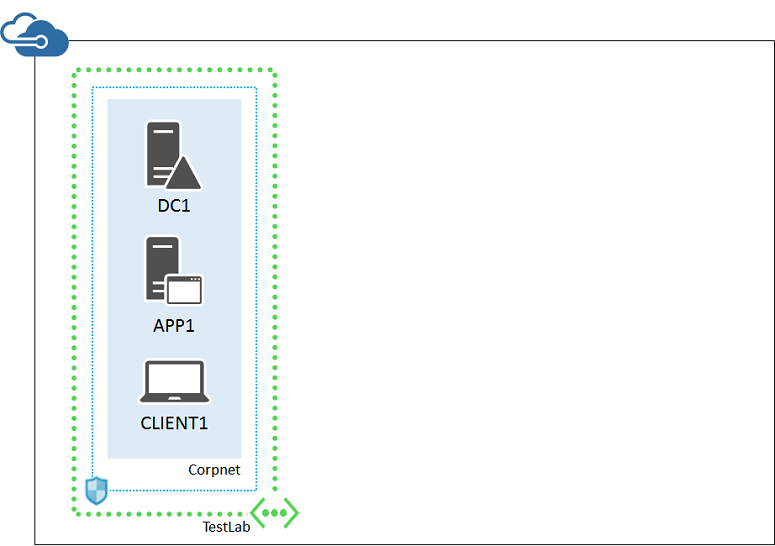
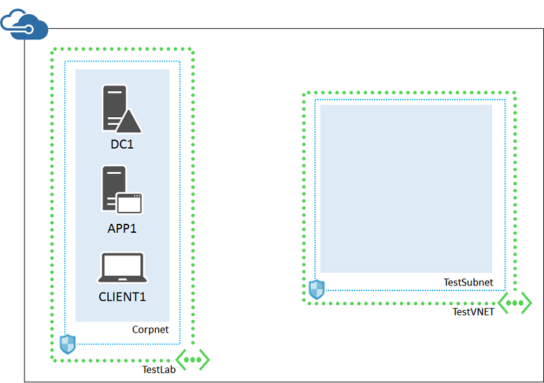

<!-- ARM: tested -->

<properties 
	pageTitle="模拟的混合云测试环境 | Azure" 
	description="使用两个 Azure 虚拟网络和 VNet 到 VNet 连接创建模拟的混合云环境，以便进行 IT 专业人员测试或开发测试。" 
	services="virtual-machines-windows" 
	documentationCenter="" 
	authors="JoeDavies-MSFT" 
	manager="timlt" 
	editor=""
	tags="azure-resource-manager"/>

<tags
	ms.service="virtual-machines-windows"
	ms.date="04/01/2016"
	wacn.date="06/07/2016"/>

# 设置用于测试的模拟混合云环境

本文将指导你逐步使用 Azure 创建模拟混合云环境，以便使用两个独立的 Azure 虚拟网络进行测试。当你没有直接的 Internet 连接和可用的公共 IP 地址时，可使用此配置作为[设置用于测试的混合云环境](/documentation/articles/virtual-machines-windows-ps-hybrid-cloud-test-env-base)的替代方法。这是生成的配置。

该配置模拟混合云生产环境。它包括：

- 在 Azure 虚拟网络（TestLab 虚拟网络）中托管的一种模拟和简化的本地网络。
- 在 Azure 中托管的一种模拟跨界虚拟网络 (TestVNET)。
- 两个虚拟网络之间的 VNet 到 VNet 连接。
- TestVNET 虚拟网络中的辅助域控制器。

这提供了基础和通用的起始点，你可以据此执行以下操作：

- 在模拟混合云环境中开发和测试应用程序。
- 创建一部分位于 TestLab 虚拟网络中，一部分位于 TestVNET 虚拟网络中的计算机的测试配置，以便模拟基于混合云的 IT 工作负载。

设置此混合云测试环境需要完成以下四个主要阶段：

1.	配置 TestLab 虚拟网络。
2.	创建跨界虚拟网络。
3.	创建 VNet 到 VNet 的 VPN 连接。
4.	配置 DC2。 

如果你还没有 Azure 订阅，可以通过[试用 Azure](/pricing/1rmb-trial/) 注册试用版。

>[AZURE.NOTE] Azure 中的虚拟机和虚拟网关在运行时会持续产生货币成本。此成本是针对你的试用、MSDN 订阅或付费订阅进行计费的。在实施时，Azure VPN 网关将由两台 Azure 虚拟机组成。为了将费用降到最低，请创建测试环境，并尽可能快地执行所需的测试和演示。

## 阶段 1：配置 TestLab 虚拟网络

[AZURE.INCLUDE [arm-api-version-powershell](../includes/arm-api-version-powershell.md)]

按照[基本配置测试环境](/documentation/articles/virtual-machines-windows-test-config-env)中的说明，在名为 TestLab 的 Azure 虚拟网络中配置 DC1、APP1 和 CLIENT1 计算机。

接下来，请启动 Azure PowerShell 提示符。

> [AZURE.NOTE] 以下命令集使用 Azure PowerShell 1.0 及更高版本。有关详细信息，请参阅 [Azure PowerShell 1.0](https://azure.microsoft.com/blog/azps-1-0/)。

登录到你的帐户。

	Login-AzureRMAccount

使用以下命令获取你的订阅名称。

	Get-AzureRMSubscription | Sort SubscriptionName | Select SubscriptionName

设置你的 Azure 订阅。使用你在构建基础配置时使用的同一订阅。将引号内的所有内容（包括 < and > 字符）替换为相应的名称。

	$subscr="<subscription name>"
	Get-AzureRmSubscription -SubscriptionName $subscr | Select-AzureRmSubscription

接着，将网关子网添加到使用基础配置的 TestLab 虚拟网络，该网络将用于托管 Azure 网关。

	$rgName="<name of your resource group that you used for your TestLab virtual network>"
	$locName="<Azure location name where you placed the TestLab virtual network, such as China North>"
	$vnet=Get-AzureRmVirtualNetwork -ResourceGroupName $rgName -Name TestLab
	Add-AzureRmVirtualNetworkSubnetConfig -Name "GatewaySubnet" -AddressPrefix 10.255.255.248/29 -VirtualNetwork $vnet
	Set-AzureRmVirtualNetwork -VirtualNetwork $vnet

再接着，请求将一个公共 IP 地址分配到 TestLab 虚拟网络的网关。

	$gwpip=New-AzureRmPublicIpAddress -Name TestLab_pip -ResourceGroupName $rgName -Location $locName -AllocationMethod Dynamic

最后，创建网关。

	$vnet=Get-AzureRmVirtualNetwork -Name TestLab -ResourceGroupName $rgName
	$subnet=Get-AzureRmVirtualNetworkSubnetConfig -Name "GatewaySubnet" -VirtualNetwork $vnet
	$gwipconfig=New-AzureRmVirtualNetworkGatewayIpConfig -Name TestLab_GWConfig -SubnetId $subnet.Id -PublicIpAddressId $gwpip.Id 
	New-AzureRmVirtualNetworkGateway -Name TestLab_GW -ResourceGroupName $rgName -Location $locName -IpConfigurations $gwipconfig -GatewayType Vpn -VpnType RouteBased

请注意，新网关可能需要 20 分钟或更长的时间才能完成。

在本地计算机上的 Azure 门户预览中，使用 CORP\\User1 凭据连接到 DC1。若要配置 CORP 域，以便计算机和用户使用其本地域控制器进行身份验证，请从管理员级 Windows PowerShell 命令提示符运行这些命令。

	New-ADReplicationSite -Name "TestLab" 
	New-ADReplicationSite -Name "TestVNET"
	New-ADReplicationSubnet -Name "10.0.0.0/8" -Site "TestLab"
	New-ADReplicationSubnet -Name "192.168.0.0/16" -Site "TestVNET"

这是你当前的配置。

 
## 阶段 2：创建 TestVNET 虚拟网络

首先，创建 TestVNET 虚拟网络，并通过网络安全组对其进行保护。

	$rgName="<name of your resource group that you used for your TestLab virtual network>"
	$locName="<Azure location name where you placed the TestLab virtual network, such as China North>"
	$locShortName="<Azure location name from $locName in all lowercase letters with spaces removed. Example:  chinanorth>"
	$testSubnet=New-AzureRMVirtualNetworkSubnetConfig -Name "TestSubnet" -AddressPrefix 192.168.0.0/24
	$gatewaySubnet=New-AzureRmVirtualNetworkSubnetConfig -Name "GatewaySubnet" -AddressPrefix 192.168.255.248/29
	New-AzureRMVirtualNetwork -Name "TestVNET" -ResourceGroupName $rgName -Location $locName -AddressPrefix 192.168.0.0/16 -Subnet $testSubnet,$gatewaySubnet -DNSServer 10.0.0.4
	$rule1=New-AzureRMNetworkSecurityRuleConfig -Name "RDPTraffic" -Description "Allow RDP to all VMs on the subnet" -Access Allow -Protocol Tcp -Direction Inbound -Priority 100 -SourceAddressPrefix Internet -SourcePortRange * -DestinationAddressPrefix * -DestinationPortRange 3389
	New-AzureRMNetworkSecurityGroup -Name "TestSubnet" -ResourceGroupName $rgName -Location $locShortName -SecurityRules $rule1
	$vnet=Get-AzureRMVirtualNetwork -ResourceGroupName $rgName -Name TestVNET
	$nsg=Get-AzureRMNetworkSecurityGroup -Name "TestSubnet" -ResourceGroupName $rgName
	Set-AzureRMVirtualNetworkSubnetConfig -VirtualNetwork $vnet -Name "TestSubnet" -AddressPrefix 192.168.0.0/24 -NetworkSecurityGroup $nsg

接下来，请求将一个公共 IP 地址分配给 TestVNET 虚拟网络的网关，然后创建你的网关。

	$gwpip=New-AzureRmPublicIpAddress -Name TestVNET_pip -ResourceGroupName $rgName -Location $locName -AllocationMethod Dynamic
	$vnet=Get-AzureRmVirtualNetwork -Name TestVNET -ResourceGroupName $rgName
	$subnet=Get-AzureRmVirtualNetworkSubnetConfig -Name "GatewaySubnet" -VirtualNetwork $vnet
	$gwipconfig=New-AzureRmVirtualNetworkGatewayIpConfig -Name "TestVNET_GWConfig" -SubnetId $subnet.Id -PublicIpAddressId $gwpip.Id
	New-AzureRmVirtualNetworkGateway -Name "TestVNET_GW" -ResourceGroupName $rgName -Location $locName -IpConfigurations $gwipconfig -GatewayType Vpn -VpnType RouteBased

这是你当前的配置。

 
##阶段 3：创建 VNet 到 VNet 连接

首先，从网络或安全管理员处获取随机加密型强 32 字符预共享密钥。或者，使用[创建 IPsec 预共享密钥的随机字符串](http://social.technet.microsoft.com/wiki/contents/articles/32330.create-a-random-string-for-an-ipsec-preshared-key.aspx)中的信息获取预共享密钥。

接下来，使用以下命令创建站点到站点 VPN 连接，这可能需要一定的时间才能完成。

	$sharedKey="<pre-shared key value>"
	$gwTestLab=Get-AzureRmVirtualNetworkGateway -Name TestLab_GW -ResourceGroupName $rgName
	$gwTestVNET=Get-AzureRmVirtualNetworkGateway -Name TestVNET_GW -ResourceGroupName $rgName
	New-AzureRmVirtualNetworkGatewayConnection -Name TestLab_to_TestVNET -ResourceGroupName $rgName -VirtualNetworkGateway1 $gwTestLab -VirtualNetworkGateway2 $gwTestVNET -Location $locName -ConnectionType Vnet2Vnet -SharedKey $sharedKey
	New-AzureRmVirtualNetworkGatewayConnection -Name TestVNET_to_TestLab -ResourceGroupName $rgName -VirtualNetworkGateway1 $gwTestVNET -VirtualNetworkGateway2 $gwTestLab -Location $locName -ConnectionType Vnet2Vnet -SharedKey $sharedKey

几分钟后，连接应建立完毕。请注意，此时 Azure 门户预览还不会显示使用 Azure Resource Manager 创建的网关和连接。

这是你当前的配置。

 
## 阶段 4：配置 DC2

首先，创建适用于 DC2 的 Azure 虚拟机。在本地计算机的 Azure PowerShell 命令提示符处运行这些命令。

	$rgName="<your resource group name>"
	$locName="<your Azure location, such as China North>"
	$saName="<your storage account name for the base configuration>"
	$vnet=Get-AzureRMVirtualNetwork -Name TestVNET -ResourceGroupName $rgName
	$pip=New-AzureRMPublicIpAddress -Name DC2-NIC -ResourceGroupName $rgName -Location $locName -AllocationMethod Dynamic
	$nic=New-AzureRMNetworkInterface -Name DC2-NIC -ResourceGroupName $rgName -Location $locName -SubnetId $vnet.Subnets[0].Id -PublicIpAddressId $pip.Id -PrivateIpAddress 192.168.0.4
	$vm=New-AzureRMVMConfig -VMName DC2 -VMSize Standard_A1
	$storageAcc=Get-AzureRMStorageAccount -ResourceGroupName $rgName -Name $saName
	$vhdURI=$storageAcc.PrimaryEndpoints.Blob.ToString() + "vhds/DC2-TestVNET-ADDSDisk.vhd"
	Add-AzureRMVMDataDisk -VM $vm -Name ADDS-Data -DiskSizeInGB 20 -VhdUri $vhdURI  -CreateOption empty
	$cred=Get-Credential -Message "Type the name and password of the local administrator account for DC2."
	$vm=Set-AzureRMVMOperatingSystem -VM $vm -Windows -ComputerName DC2 -Credential $cred -ProvisionVMAgent -EnableAutoUpdate
	$vm=Set-AzureRMVMSourceImage -VM $vm -PublisherName MicrosoftWindowsServer -Offer WindowsServer -Skus 2012-R2-Datacenter -Version "latest"
	$vm=Add-AzureRMVMNetworkInterface -VM $vm -Id $nic.Id
	$osDiskUri=$storageAcc.PrimaryEndpoints.Blob.ToString() + "vhds/DC2-TestLab-OSDisk.vhd"
	$vm=Set-AzureRMVMOSDisk -VM $vm -Name DC2-TestVNET-OSDisk -VhdUri $osDiskUri -CreateOption fromImage
	New-AzureRMVM -ResourceGroupName $rgName -Location $locName -VM $vm

接下来，从 Azure 门户预览登录到新的 DC2 虚拟机。

接下来，配置 Windows 防火墙规则，以允许进行基本的连接测试所需的流量。在 DC2 上的管理员级 Windows PowerShell 命令提示符下运行这些命令。

	Set-NetFirewallRule -DisplayName "File and Printer Sharing (Echo Request - ICMPv4-In)" -enabled True
	ping dc1.corp.contoso.com

使用 ping 命令时，会从 IP 地址 10.0.0.4 传回四个成功的答复。这是对 Vnet 到 Vnet 连接的流量测试。

接下来，将额外的数据磁盘添加为驱动器盘符为 F: 的新卷。

1.	在服务器管理器的左窗格中，单击“文件和存储服务”，然后单击“磁盘”。
2.	在内容窗格的“磁盘”组中，单击“磁盘 2”（其“分区”设置为“未知”）。
3.	单击“任务”，然后单击“新建卷”。
4.	在新建卷向导的“开始之前”页上，单击“下一步”。
5.	在“选择服务器和磁盘”页上，单击“磁盘 2”，然后单击“下一步”。出现提示时，单击“确定”。
6.	在“指定卷的大小”页上，单击“下一步”。
7.	在“分配到驱动器号或文件夹”页上，单击“下一步”。
8.	在“选择文件系统设置”页上，单击“下一步”。
9.	在“确认选择”页上，单击“创建”。
10.	完成后，单击“关闭”。

接下来，将 DC2 配置为 corp.contoso.com 域的副本域控制器。在 DC2 上的 Windows PowerShell 命令提示符下运行这些命令。

	Install-WindowsFeature AD-Domain-Services -IncludeManagementTools
	Install-ADDSDomainController -Credential (Get-Credential CORP\User1) -DomainName "corp.contoso.com" -InstallDns:$true -DatabasePath "F:\NTDS" -LogPath "F:\Logs" -SysvolPath "F:\SYSVOL"

请注意，系统会提示你输入 CORP\\User1 密码和目录服务还原模式 (DSRM) 密码，然后重新启动 DC2。

由于 TestVNET 虚拟网络有自己的 DNS 服务器 (DC2)，因此必须将 TestVNET 虚拟网络配置为使用此 DNS 服务器。

1.	在 Azure 门户预览的左窗格中，单击虚拟网络图标，然后单击“TestVNET”。
2.	在“设置”选项卡中，单击“DNS 服务器”。
3.	在“主 DNS 服务器”中，键入 **192.168.0.4** 以替换 10.0.0.4。
4.	单击“保存”。

这是你当前的配置。

 
现在，你的模拟混合云环境已准备好进行测试。

## 后续步骤

- 在此环境中设置 [SharePoint intranet 场](/documentation/articles/virtual-machines-windows-ps-hybrid-cloud-test-env-sp)、[基于 Web 的 LOB 应用程序](/documentation/articles/virtual-machines-windows-ps-hybrid-cloud-test-env-lob)或者 [Office 365 目录同步 (DirSync) 服务器](/documentation/articles/virtual-machines-windows-ps-hybrid-cloud-test-env-dirsync)。

<!---HONumber=Mooncake_0425_2016-->