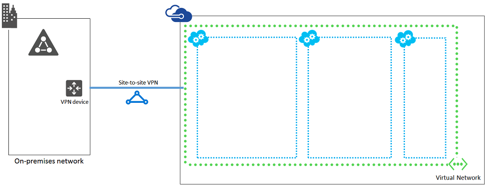

<properties
	pageTitle="SharePoint Server 2013 场（阶段 1）| Microsoft Azure"
	description="在 Azure 的 SharePoint Server 2013 场阶段 1 中创建虚拟网络和其他 Azure 基础结构元素。"
	documentationCenter=""
	services="virtual-machines-windows"
	authors="JoeDavies-MSFT"
	manager="timlt"
	editor=""
	tags="azure-resource-manager"/>

<tags
	ms.service="virtual-machines-windows"
	ms.date="12/11/2015"
	wacn.date="06/07/2016"/>

# SharePoint Intranet 场工作负荷阶段 1：配置 Azure

> [AZURE.NOTE]Azure 具有用于创建和处理资源的两个不同的部署模型：[资源管理器和经典](/documentation/articles/resource-manager-deployment-model)。这篇文章介绍如何使用资源管理器部署模型，Microsoft 建议大多数新部署使用资源管理器模型替代经典部署模型。

在部署仅限 Intranet 的 SharePoint 2013 场（在 Azure 基础结构服务中通过 SQL Server AlwaysOn 可用性组进行）的这个阶段，你将在 Microsoft Azure 服务管理中构建出 Azure 网络和存储基础结构。你必须在转到[阶段 2](/documentation/articles/virtual-machines-workload-intranet-sharepoint-phase2) 之前完成此阶段。请参阅[在 Azure 中通过 SQL Server AlwaysOn 可用性组部署 SharePoint](/documentation/articles/virtual-machines-workload-intranet-sharepoint-overview) 以了解所有阶段的相关信息。

必须使用这些基本网络组件设置 Azure：

- 具有一个用于托管 Azure 虚拟机的子网的跨界虚拟网络
- 一个 Azure 存储帐户，用于存储 VHD 磁盘映像和额外的数据磁盘
- 四个可用性集

## 开始之前

在开始配置 Azure 组件之前，请填写下表。为了帮助你完成配置 Azure 的过程，请打印此部分并记下所需的信息，或者将此部分复制到一个文档并填写它。

对于虚拟网络 (VNet) 的设置，填写表 V。

项目 | 配置元素 | 说明 | 值
--- | --- | --- | ---
1\. | VNet 名称 | 要分配给 Azure 虚拟网络的名称（示例 SPFarmNet）。 | \_\_\_\_\_\_\_\_\_\_\_\_\_\_\_\_\_\_
2\. | VNet 位置 | 将包含虚拟网络的 Azure 数据中心。 | \_\_\_\_\_\_\_\_\_\_\_\_\_\_\_\_\_\_
3\. | 本地网络名称 | 要分配给你的组织网络的名称。 | \_\_\_\_\_\_\_\_\_\_\_\_\_\_\_\_\_\_
4\. | VPN 设备 IP 地址 | 你的 VPN 设备在 Internet 上的接口的公共 IPv4 地址。与你的 IT 部门协作来确定此地址。 | \_\_\_\_\_\_\_\_\_\_\_\_\_\_\_\_\_\_
5\. | VNet 地址空间 | 虚拟网络的地址空间（在单个专用地址前缀中定义）。与你的 IT 部门协作来确定此地址空间。 | \_\_\_\_\_\_\_\_\_\_\_\_\_\_\_\_\_\_
6\. | 第一个最终 DNS 服务器 | 虚拟网络子网的地址空间的第四个可能的 IP 地址（请参阅表 S）。与你的 IT 部门协作来确定这些地址。 | \_\_\_\_\_\_\_\_\_\_\_\_\_\_\_\_\_\_
7\. | 第二个最终 DNS 服务器 | 虚拟网络子网的地址空间的第五个可能的 IP 地址（请参阅表 S）。与你的 IT 部门协作来确定这些地址。 | \_\_\_\_\_\_\_\_\_\_\_\_\_\_\_\_\_\_
8\. | IPsec 共享密钥 | 将用于对站点到站点 VPN 连接的双方进行身份验证的 32 个字符随机字母数字字符串。与你的 IT 或安全部门协作来确定此密钥值。或者，请参阅[为 IPsec 预共享密钥创建随机字符串](http://social.technet.microsoft.com/wiki/contents/articles/32330.create-a-random-string-for-an-ipsec-preshared-key.aspx)。| \_\_\_\_\_\_\_\_\_\_\_\_\_\_\_\_\_\_

**表 V： 跨界虚拟网络配置**

针对此解决方案的子网，填写表 S。

- 对于第一个子网，确定 Azure 网关子网的 29 位地址空间（具有 /29 前缀长度）。
- 对于第二个子网，根据虚拟网络地址空间，指定一个友好名称、单个 IP 地址空间和描述性目的。 

与你的 IT 部门协作，在虚拟网络地址空间中确定这些地址空间。这两个地址空间应采用无类别域际路由选择 (CIDR) 格式，也称为网络前缀格式。例如 10.24.64.0/20。

项目 | 子网名称 | 子网地址空间 | 目的 
--- | --- | --- | --- 
1\. | 网关子网 | \_\_\_\_\_\_\_\_\_\_\_\_\_\_\_\_\_\_\_\_\_\_\_\_\_\_\_\_\_ | Azure 网关虚拟机使用的子网。
2\. | \_\_\_\_\_\_\_\_\_\_\_\_\_\_\_ | \_\_\_\_\_\_\_\_\_\_\_\_\_\_\_\_\_\_\_\_\_\_\_\_\_\_\_\_\_ | \_\_\_\_\_\_\_\_\_\_\_\_\_\_\_\_\_\_\_\_\_\_\_\_\_

**表 S：虚拟网络中的子网**

> [AZURE.NOTE]为简单起见，此预定义的体系结构使用单个子网。如果要覆盖一组流量筛选器来模拟子网隔离，则可以使用 Azure [网络安全组](/documentation/articles/virtual-networks-nsg)。

对于你最初在虚拟网络中设置域控制器时要使用的两个本地 DNS 服务器，填写表 D。请注意，列出了 2 个空白条目，但你可以添加更多。与你的 IT 部门协作来确定此列表。

项目 | DNS 服务器 IP 地址
--- | ---
1\. | \_\_\_\_\_\_\_\_\_\_\_\_\_\_\_\_\_\_\_\_\_\_\_\_\_\_\_
2\. | \_\_\_\_\_\_\_\_\_\_\_\_\_\_\_\_\_\_\_\_\_\_\_\_\_\_\_

**表 D：本地 DNS 服务器**

若要通过站点到站点 VPN 连接将数据包从跨界网络路由到你的组织网络，必须为虚拟网络配置一个本地网络，该网络包含你的组织的本地网络上的所有可访问位置的地址空间（采用 CIDR 表示法）列表。定义本地网络的地址空间列表必须唯一并且不能与用于其他虚拟网络或其他本地网络的地址空间重叠。

对于本地网络地址空间集，填写表 L。请注意，列出了三个空白条目，但通常将需要更多。与你的 IT 部门协作来确定此地址空间列表。

项目 | 本地网络地址空间
--- | ---
1\. | \_\_\_\_\_\_\_\_\_\_\_\_\_\_\_\_\_\_\_\_\_\_\_\_\_\_\_\_\_\_\_\_\_\_\_
2\. | \_\_\_\_\_\_\_\_\_\_\_\_\_\_\_\_\_\_\_\_\_\_\_\_\_\_\_\_\_\_\_\_\_\_\_
3\. | \_\_\_\_\_\_\_\_\_\_\_\_\_\_\_\_\_\_\_\_\_\_\_\_\_\_\_\_\_\_\_\_\_\_\_

**表 L：本地网络的地址前缀**

> [AZURE.NOTE]以下命令集使用 Azure PowerShell 1.0 及更高版本。有关详细信息，请参阅 [Azure PowerShell 1.0](https://azure.microsoft.com/blog/azps-1-0/)。

首先，启动 Azure PowerShell 提示符，并登录到你的帐户。

	Login-AzureRMAccount -Environment $(Get-AzureRmEnvironment -Name AzureChinaCloud)

使用以下命令获取你的订阅名称。

	Get-AzureRMSubscription | Sort SubscriptionName | Select SubscriptionName

设置你的 Azure 订阅。将引号内的所有内容（包括 < and > 字符）替换为相应的名称。

	$subscr="<subscription name>"
	Get-AzureRmSubscription –SubscriptionName $subscr | Select-AzureRmSubscription

接下来，为 Intranet SharePoint 场创建新的资源组。若要确定唯一的资源组名称，可使用以下命令列出现有的资源组。

	Get-AzureRMResourceGroup | Sort ResourceGroupName | Select ResourceGroupName

使用以下命令创建新的资源组。

	$rgName="<resource group name>"
	$locName="<an Azure location, such as China East>"
	New-AzureRMResourceGroup -Name $rgName -Location $locName

基于资源管理器的虚拟机需要一个基于资源管理器的存储帐户。

项目 | 存储帐户名称 | 目的 
--- | --- | ---
1\. | \_\_\_\_\_\_\_\_\_\_\_\_\_\_\_\_\_\_\_\_\_\_\_\_\_\_\_ | 工作负荷中所有虚拟机使用的标准存储帐户。 

**表 ST：存储帐户**

在阶段 2、阶段 3 和阶段 4 中创建虚拟机时将需要此名称。

必须为每个存储帐户选择只包含小写字母和数字的全局唯一名称。可以使用以下命令列出现有的存储帐户。

	Get-AzureRMStorageAccount | Sort StorageAccountName | Select StorageAccountName

若要创建存储帐户，请运行以下命令。

	$rgName="<your new resource group name>"
	$locName="<the location of your new resource group>"
	$saName="<Table ST – Item 1 - Storage account name column>"
	New-AzureRMStorageAccount -Name $saName -ResourceGroupName $rgName –Type Standard_LRS -Location $locName

接下来，你将创建托管 Intranet SharePoint 场的 Azure 虚拟网络。

	$rgName="<name of your new resource group>"
	$locName="<Azure location of the new resource group>"
	$vnetName="<Table V – Item 1 – Value column>"
	$vnetAddrPrefix="<Table V – Item 5 – Value column>"
	$spSubnetName="<Table S – Item 2 – Subnet name column>"
	$spSubnetPrefix="<Table S – Item 2 – Subnet address space column>"
	$gwSubnetPrefix="<Table S – Item 1 – Subnet address space column>"
	$dnsServers=@( "<Table D – Item 1 – DNS server IP address column>", "<Table D – Item 2 – DNS server IP address column>" )
	$gwSubnet=New-AzureRMVirtualNetworkSubnetConfig -Name "GatewaySubnet" -AddressPrefix $gwSubnetPrefix
	$spSubnet=New-AzureRMVirtualNetworkSubnetConfig -Name $spSubnetName -AddressPrefix $spSubnetPrefix
	New-AzureRMVirtualNetwork -Name $vnetName -ResourceGroupName $rgName -Location $locName -AddressPrefix $vnetAddrPrefix -Subnet $gwSubnet,$spSubnet -DNSServer $dnsServers

接下来，使用以下命令创建用于站点到站点 VPN 连接的网关。

	$vnetName="<Table V – Item 1 – Value column>"
	$vnet=Get-AzureRMVirtualNetwork -Name $vnetName -ResourceGroupName $rgName
	
	# Attach a virtual network gateway to a public IP address and the gateway subnet
	$publicGatewayVipName="SPPublicIPAddress"
	$vnetGatewayIpConfigName="SPPublicIPConfig"
	New-AzureRMPublicIpAddress -Name $vnetGatewayIpConfigName -ResourceGroupName $rgName -Location $locName -AllocationMethod Dynamic
	$publicGatewayVip=Get-AzureRMPublicIpAddress -Name $vnetGatewayIpConfigName -ResourceGroupName $rgName
	$vnetGatewayIpConfig=New-AzureRMVirtualNetworkGatewayIpConfig -Name $vnetGatewayIpConfigName -PublicIpAddressId $publicGatewayVip.Id -SubnetId $vnet.Subnets[0].Id

	# Create the Azure gateway
	$vnetGatewayName="SPAzureGateway"
	$vnetGateway=New-AzureRMVirtualNetworkGateway -Name $vnetGatewayName -ResourceGroupName $rgName -Location $locName -GatewayType Vpn -VpnType RouteBased -IpConfigurations $vnetGatewayIpConfig
	
	# Create the gateway for the local network
	$localGatewayName="SPLocalNetGateway"
	$localGatewayIP="<Table V – Item 4 – Value column>"
	$localNetworkPrefix=@( <comma-separated, double-quote enclosed list of the local network address prefixes from Table L, example: "10.1.0.0/24", "10.2.0.0/24"> )
	$localGateway=New-AzureRMLocalNetworkGateway -Name $localGatewayName -ResourceGroupName $rgName -Location $locName -GatewayIpAddress $localGatewayIP -AddressPrefix $localNetworkPrefix
	
	# Define the Azure virtual network VPN connection
	$vnetConnectionName="SPS2SConnection"
	$vnetConnectionKey="<Table V – Item 8 – Value column>"
	$vnetConnection=New-AzureRMVirtualNetworkGatewayConnection -Name $vnetConnectionName -ResourceGroupName $rgName -Location $locName -ConnectionType IPsec -SharedKey $vnetConnectionKey -VirtualNetworkGateway1 $vnetGateway -LocalNetworkGateway2 $localGateway

接下来，配置用于连接到 Azure VPN 网关的本地 VPN 设备。有关详细信息，请参阅[配置 VPN 设备](../virtual-networks/vpn-gateway-configure-vpn-gateway-mp.md#configure-your-vpn-device)。

若要配置本地 VPN 设备，需要以下项：

- 虚拟网络的 Azure VPN 网关的公共 IPv4 地址（从 **Get-AzureRMPublicIpAddress -Name $publicGatewayVipName -ResourceGroupName $rgName** 命令的显示获得）。
- 站点到站点 VPN 连接的 IPsec 预共享密钥（表 V - 项 8 - 值列）。

接下来，请确保可从你的本地网络访问虚拟网络的地址空间。这通常是通过将与虚拟网络地址空间对应的路由添加到你的 VPN 设备，然后将该路由播发到你的组织网络的其余路由基础结构来完成的。与你的 IT 部门协作来确定执行此操作的方法。

接下来，定义四个可用性集的名称。填写表 A。

项目 | 目的 | 可用性集名称 
--- | --- | --- 
1\. | 域控制器 | \_\_\_\_\_\_\_\_\_\_\_\_\_\_\_\_\_\_\_\_\_\_\_\_\_\_\_
2\. | SQL Server | \_\_\_\_\_\_\_\_\_\_\_\_\_\_\_\_\_\_\_\_\_\_\_\_\_\_\_
3\. | 应用服务器 | \_\_\_\_\_\_\_\_\_\_\_\_\_\_\_\_\_\_\_\_\_\_\_\_\_\_\_
4\. | Web 服务器 | \_\_\_\_\_\_\_\_\_\_\_\_\_\_\_\_\_\_\_\_\_\_\_\_\_\_\_

**表 A：可用性集名称**

在阶段 2、阶段 3 和阶段 4 中创建虚拟机时将需要这些名称。

使用以下 Azure PowerShell 命令创建这些新可用性集。

	$rgName="<your new resource group name>"
	$locName="<the Azure location for your new resource group>"
	$avName="<Table A – Item 1 – Availability set name column>"
	New-AzureRMAvailabilitySet –Name $avName –ResourceGroupName $rgName -Location $locName
	$avName="<Table A – Item 2 – Availability set name column>"
	New-AzureRMAvailabilitySet –Name $avName –ResourceGroupName $rgName -Location $locName
	$avName="<Table A – Item 3 – Availability set name column>"
	New-AzureRMAvailabilitySet –Name $avName –ResourceGroupName $rgName -Location $locName
	$avName="<Table A – Item 4 – Availability set name column>"
	New-AzureRMAvailabilitySet –Name $avName –ResourceGroupName $rgName -Location $locName

这是成功完成此阶段后生成的配置。

## 后续步骤

- 若要继续配置此工作负荷，请使用[阶段 2](/documentation/articles/virtual-machines-workload-intranet-sharepoint-phase2)。

<!---HONumber=Mooncake_0104_2016-->