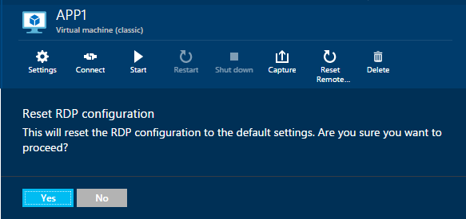
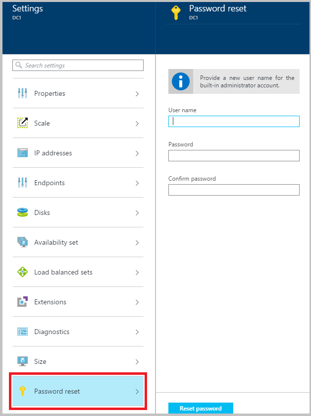

<properties
	pageTitle="在 Windows VM 上重置密码或远程桌面 | Azure"
	description="在使用资源管理器部署模型创建的 Windows VM 上重置管理员密码或远程桌面服务。"
	services="virtual-machines-windows"
	documentationCenter=""
	authors="iainfoulds"
	manager="timlt"
	editor=""
	tags="azure-resource-manager"/>

<tags
	ms.service="virtual-machines-windows"
	ms.date="04/12/2016"
	wacn.date="06/07/2016"/>

# 如何在 Windows VM 中重置远程桌面服务或其登录密码

[AZURE.INCLUDE [了解部署模型](../includes/learn-about-deployment-models-both-include.md)]。

如果你由于忘记了密码或远程桌面服务配置有问题而无法连接到 Windows 虚拟机，你可以重置本地管理员密码或重置远程桌面服务配置。

根据虚拟机的部署模型，可以使用 Azure 门户或 Azure PowerShell 中的 VM Access 扩展。如果使用 PowerShell，请务必在工作计算机上安装最新的 PowerShell 模块，并登录 Azure 订阅。有关详细步骤，请阅读 [How to install and configure Azure PowerShell（如何安装和配置 Azure PowerShell）](/documentation/articles/powershell-install-configure)。

> [AZURE.TIP] 可以使用 `Import-Module Azure; Get-Module Azure | Format-Table Version` 来检查安装的 PowerShell 版本。

## 经典部署模型中的 Windows VM

### Azure 门户

对于使用经典部署模型创建的虚拟机，可以使用 [Azure 门户](https://portal.azure.cn)来重置远程桌面服务。单击“浏览”>“虚拟机(经典)”> 你的 Windows 虚拟机 >“重置远程...”。将显示以下页。

还可以尝试重置本地管理员帐户的名称和密码。单击“浏览”>“虚拟机(经典)”> 你的 Windows 虚拟机 >“所有设置”>“重置密码”。将显示以下页。

输入新用户名和密码，然后单击“保存”。

### VMAccess 扩展和 PowerShell

确保在虚拟机上安装 VM 代理。只要 VM 代理可用，就不需要事先安装 VMAccess 扩展。使用以下命令验证是否已在虚拟机上安装 VM 代理。（分别将“myCloudService”和“myVM”替换为云服务和 VM 的名称。若要了解这些信息，可运行不带任何参数的 `Get-AzureVM`。）

	$vm = Get-AzureVM -ServiceName "myCloudService" -Name "myVM"
	write-host $vm.VM.ProvisionGuestAgent

如果 **write-host** 命令显示 **True**，则已安装 VM 代理。如果该命令显示 **False**，请参阅 Azure 博客文章 [VM 代理和扩展 - 第 2 部分](https://azure.microsoft.com/zh-cn/blog/vm-agent-and-extensions-part-2/)中的说明和下载链接。

如果虚拟机是使用门户创建的，请检查 `$vm.GetInstance().ProvisionGuestAgent` 是否返回 **True**。如果不是，请使用以下命令进行设置：

	$vm.GetInstance().ProvisionGuestAgent = $true

此命令可防止在后续步骤中运行 **Set-AzureVMExtension** 命令时出现以下错误：“在设置 IaaS VM Access 扩展前，必须对 VM 对象启用预配来宾代理”。

#### **重置本地管理员帐户密码**

使用当前的本地管理员帐户名和新密码创建登录凭据，然后运行 `Set-AzureVMAccessExtension`，如下所示。

	$cred=Get-Credential
	Set-AzureVMAccessExtension -vm $vm -UserName $cred.GetNetworkCredential().Username -Password $cred.GetNetworkCredential().Password  | Update-AzureVM

如果你键入不同于当前帐户的名称，VMAccess 扩展将重命名本地管理员帐户，将密码分配给该帐户，并发出远程桌面注销命令。如果本地管理员帐户处于禁用状态，则 VMAccess 扩展将启用它。

这些命令也重置远程桌面服务配置。

#### **重置远程桌面服务配置**

若要重置远程桌面服务配置，请运行以下命令：

	Set-AzureVMAccessExtension -vm $vm | Update-AzureVM

VMAccess 扩展在虚拟机上运行两个命令：

a. `netsh advfirewall firewall set rule group="Remote Desktop" new enable=Yes`

此命令启用允许传入远程桌面流量的内置 Windows 防火墙组，该组使用 TCP 端口 3389。

b. `Set-ItemProperty -Path 'HKLM:\System\CurrentControlSet\Control\Terminal Server' -name "fDenyTSConnections" -Value 0`

此命令将 fDenyTSConnections 注册表值设为 0，以启用远程桌面连接。

## Resource Manager 部署模型中的 Windows VM

Azure 门户目前不支持重置使用 Azure Resource Manager 创建的虚拟机的远程访问或登录凭据。

### VMAccess 扩展和 PowerShell

确保已安装 Azure PowerShell 1.0 或更高版本，并且已使用 `Login-AzureRmAccount` cmdlet 登录到你的帐户。

#### **重置本地管理员帐户密码**

可以使用 [Set-AzureRmVMAccessExtension](https://msdn.microsoft.com/zh-cn/library/mt619447.aspx) PowerShell 命令来重置管理员密码或用户名。

使用以下命令创建本地管理员帐户凭据：

	$cred=Get-Credential

如果你键入不同于当前帐户的名称，以下 VMAccess 扩展命令将重命名本地管理员帐户，将密码分配给该帐户，并发出远程桌面注销命令。如果本地管理员帐户处于禁用状态，则 VMAccess 扩展将启用它。

使用 VM Access 扩展设置新凭据，如下所示：

	Set-AzureRmVMAccessExtension -ResourceGroupName "myRG" -VMName "myVM" -Name "myVMAccess" -Location Westus -UserName $cred.GetNetworkCredential().Username -Password $cred.GetNetworkCredential().Password

将 `myRG`、`myVM`、`myVMAccess` 和位置替换为与你的设置相关的值。

#### **重置远程桌面服务配置**

可以使用 [Set-AzureRmVMExtension](https://msdn.microsoft.com/zh-cn/library/mt603745.aspx) 或 Set-AzureRmVMAccessExtension 来重置对 VM 的远程访问，如下所示。（将 `myRG`、`myVM`、`myVMAccess` 和 location 替换为你自己的值。）

	Set-AzureRmVMExtension -ResourceGroupName "myRG" -VMName "myVM" -Name "myVMAccess" -ExtensionType "VMAccessAgent" -Publisher "Microsoft.Compute" -typeHandlerVersion "2.0" -Location Westus

或者： 

	Set-AzureRmVMAccessExtension -ResourceGroupName "myRG" -VMName "myVM" -Name "myVMAccess" -Location Westus

> [AZURE.TIP] 这两个命令都在虚拟机中添加新的命名 VM 访问代理。无论何时，一个 VM 只能有一个 VM 访问代理。若要成功设置 VM 访问代理属性，请使用 `Remove-AzureRmVMAccessExtension` 或 `Remove-AzureRmVMExtension` 删除以前设置的访问代理。从 Azure PowerShell 版本 1.2.2 开始，如果将 `Set-AzureRmVMExtension` 与 `-ForceRerun` 选项结合使用，则无需执行此步骤。使用 `-ForceRerun` 时，请务必使用与前述命令设置的 VM 访问代理相同的名称。

如果你仍然无法远程连接到虚拟机，请参阅 [Troubleshoot Remote Desktop connections to a Windows-based Azure virtual machine（对与基于 Windows 的 Azure 虚拟机的远程桌面连接进行故障排除）](/documentation/articles/virtual-machines-windows-troubleshoot-rdp-connection)，以了解其他值得一试的步骤。

## 其他资源

[Azure VM 扩展和功能](/documentation/articles/virtual-machines-windows-extensions-features)

[使用 RDP 或 SSH 连接到 Azure 虚拟机](/documentation/articles/virtual-machines-windows-about/)

[对与基于 Windows 的 Azure 虚拟机的远程桌面连接进行故障排除](/documentation/articles/virtual-machines-windows-troubleshoot-rdp-connection)

<!---HONumber=Mooncake_0503_2016-->