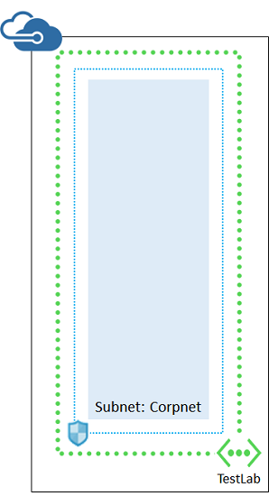
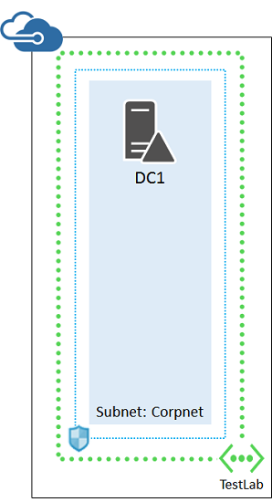

<!-- ARM: tested -->

<properties
	pageTitle="使用 Azure 资源管理器的基本配置测试环境"
	description="了解如何在 Azure 中创建模拟简化 Intranet 的简单开发/测试环境。"
	documentationCenter=""
	services="virtual-machines-windows"
	authors="JoeDavies-MSFT"
	manager="timlt"
	editor=""
	tags="azure-resource-manager"/>

<tags
	ms.service="virtual-machines-windows"
	ms.date="04/25/2016"
	wacn.date="06/20/2016"/>

# 基本配置测试环境

> [AZURE.NOTE] Azure 具有用于创建和处理资源的两个不同的部署模型：[资源管理器和经典](/documentation/articles/resource-manager-deployment-model)。本文介绍如何使用 Resource Manager 部署模型。Microsoft 建议对大多数新的部署使用该模型，而不是[经典部署模型](/documentation/articles/virtual-machines-windows-classic-test-config-env)。

本文为你提供在 Azure 虚拟网络中使用 Resource Manager 中创建的虚拟机创建基本配置测试环境的分步说明。

可以使用生成的测试环境：

- 进行应用程序开发和测试。
- 作为你自己设计的扩展测试环境（包括更多虚拟机和 Azure 服务）的初始配置。

基本配置测试环境由名为 TestLab 的仅限云虚拟网络中的公司网络子网组成，它模拟连接到 Internet 的简化专用 Intranet。

它包含：

- 一个运行 Windows Server 2012 R2 的名为 DC1 的 Azure 虚拟机，它配置为 Intranet 域控制器和域名系统 (DNS) 服务器。
- 一个运行 Windows Server 2012 R2 的名为 APP1 的 Azure 虚拟机，它配置为常规应用程序和 Web 服务器。
- 一个运行 Windows Server 2012 R2 的名为 CLIENT1 的 Azure 虚拟机，它充当 Intranet 客户端。

此配置允许 DC1、APP1、CLIENT1 及其他公司网络子网计算机执行以下操作：

- 连接到 Internet 安装更新、实时访问 Internet 资源，以及参与公有云技术（如 Microsoft Office 365 及其他 Azure 服务）。
- 从连接到 Internet 或组织网络的计算机使用远程桌面连接进行远程管理。

在 Azure 中设置 Windows Server 2012 R2 基本配置测试环境的公司网络子网分为四个阶段。

1.	创建虚拟网络。
2.	配置 DC1。
3.	配置 APP1。
4.	配置 CLIENT1。

如果你还没有 Azure 帐户，可以在[试用 Azure](/pricing/1rmb-trial/) 中注册一个试用版。

> [AZURE.NOTE] Azure 中的虚拟机在运行时会持续产生货币成本。此成本是针对你的试用、MSDN 订阅或付费订阅进行计费的。有关正在运行的 Azure 虚拟机的成本的详细信息，请参阅[虚拟机定价详细信息](/home/features/virtual-machines/#price)和 [Azure 定价计算器](/pricing/calculator/)。若要控制成本，请参阅[将 Azure 中的测试环境虚拟机的成本降至最低](#costs)。

## 阶段 1：创建虚拟网络

[AZURE.INCLUDE [arm-api-version-powershell](../includes/arm-api-version-powershell.md)]

首先，请启动 Azure PowerShell 提示符。

> [AZURE.NOTE] 以下命令集使用 Azure PowerShell 1.0 及更高版本。有关详细信息，请参阅 [Azure PowerShell 1.0](https://azure.microsoft.com/blog/azps-1-0/)。

登录到你的帐户。

	Login-AzureRMAccount

使用以下命令获取你的订阅名称。

	Get-AzureRMSubscription | Sort SubscriptionName | Select SubscriptionName

设置你的 Azure 订阅。将引号内的所有内容（包括 < and > 字符）替换为相应的名称。

	$subscr="<subscription name>"
	Get-AzureRmSubscription -SubscriptionName $subscr | Select-AzureRmSubscription

接下来，为基本配置测试实验室创建新的资源组。若要确定唯一的资源组名称，可使用以下命令列出现有的资源组。

	Get-AzureRMResourceGroup | Sort ResourceGroupName | Select ResourceGroupName

使用以下命令创建新的资源组。将引号内的所有内容（包括 < and > 字符）替换为相应的名称。

	$rgName="<resource group name>"
	$locName="<location name, such as China North>"
	New-AzureRMResourceGroup -Name $rgName -Location $locName

基于资源管理器的虚拟机需要一个基于资源管理器的存储帐户。必须为存储帐户选择只包含小写字母和数字的全局唯一名称。可以使用以下命令列出现有的存储帐户。

	Get-AzureRMStorageAccount | Sort StorageAccountName | Select StorageAccountName

使用以下命令为新测试环境创建一个新存储帐户。

	$rgName="<your new resource group name>"
	$locName="<the location of your new resource group>"
	$saName="<storage account name>"
	New-AzureRMStorageAccount -Name $saName -ResourceGroupName $rgName -Type Standard_LRS -Location $locName

接下来，你可以创建将托管基本配置的公司网络子网的 TestLab Azure 虚拟网络，并使用网络安全组对它进行保护。

	$rgName="<name of your new resource group>"
	$locName="<Azure location name, such as China North>"
	$locShortName="<the location of your new resource group in lowercase with spaces removed, example: chinanorth>"
	$corpnetSubnet=New-AzureRMVirtualNetworkSubnetConfig -Name Corpnet -AddressPrefix 10.0.0.0/24
	New-AzureRMVirtualNetwork -Name TestLab -ResourceGroupName $rgName -Location $locName -AddressPrefix 10.0.0.0/8 -Subnet $corpnetSubnet -DNSServer 10.0.0.4
	$rule1=New-AzureRMNetworkSecurityRuleConfig -Name "RDPTraffic" -Description "Allow RDP to all VMs on the subnet" -Access Allow -Protocol Tcp -Direction Inbound -Priority 100 -SourceAddressPrefix Internet -SourcePortRange * -DestinationAddressPrefix * -DestinationPortRange 3389
	New-AzureRMNetworkSecurityGroup -Name Corpnet -ResourceGroupName $rgName -Location $locShortName -SecurityRules $rule1
	$vnet=Get-AzureRMVirtualNetwork -ResourceGroupName $rgName -Name TestLab
	$nsg=Get-AzureRMNetworkSecurityGroup -Name Corpnet -ResourceGroupName $rgName
	Set-AzureRMVirtualNetworkSubnetConfig -VirtualNetwork $vnet -Name Corpnet -AddressPrefix "10.0.0.0/24" -NetworkSecurityGroup $nsg

这是你当前的配置。

## 阶段 2：配置 DC1

DC1 是 corp.contoso.com Active Directory 域服务 (AD DS) 域的域控制器和 TestLab 虚拟网络虚拟机的 DNS 服务器。

首先，填写资源组的名称、Azure 位置和存储帐户名称，并在本地计算机上的 Azure PowerShell 命令提示符下运行这些命令以为 DC1 创建 Azure 虚拟机。

	$rgName="<resource group name>"
	$locName="<Azure location, such as China North>"
	$saName="<storage account name>"
	$vnet=Get-AzureRMVirtualNetwork -Name TestLab -ResourceGroupName $rgName
	$pip = New-AzureRMPublicIpAddress -Name DC1-NIC -ResourceGroupName $rgName -Location $locName -AllocationMethod Dynamic
	$nic = New-AzureRMNetworkInterface -Name DC1-NIC -ResourceGroupName $rgName -Location $locName -SubnetId $vnet.Subnets[0].Id -PublicIpAddressId $pip.Id -PrivateIpAddress 10.0.0.4
	$vm=New-AzureRMVMConfig -VMName DC1 -VMSize Standard_A1
	$storageAcc=Get-AzureRMStorageAccount -ResourceGroupName $rgName -Name $saName
	$vhdURI=$storageAcc.PrimaryEndpoints.Blob.ToString() + "vhds/DC1-TestLab-ADDSDisk.vhd"
	Add-AzureRMVMDataDisk -VM $vm -Name ADDS-Data -DiskSizeInGB 20 -VhdUri $vhdURI  -CreateOption empty
	$cred=Get-Credential -Message "Type the name and password of the local administrator account for DC1."
	$vm=Set-AzureRMVMOperatingSystem -VM $vm -Windows -ComputerName DC1 -Credential $cred -ProvisionVMAgent -EnableAutoUpdate
	$vm=Set-AzureRMVMSourceImage -VM $vm -PublisherName MicrosoftWindowsServer -Offer WindowsServer -Skus 2012-R2-Datacenter -Version "latest"
	$vm=Add-AzureRMVMNetworkInterface -VM $vm -Id $nic.Id
	$osDiskUri=$storageAcc.PrimaryEndpoints.Blob.ToString() + "vhds/DC1-TestLab-OSDisk.vhd"
	$vm=Set-AzureRMVMOSDisk -VM $vm -Name DC1-TestLab-OSDisk -VhdUri $osDiskUri -CreateOption fromImage
	New-AzureRMVM -ResourceGroupName $rgName -Location $locName -VM $vm

接下来，连接到 DC1 虚拟机。

1.	在 Azure 门户中单击“虚拟机”，然后单击“DC1”虚拟机。  
2.	在“DC1”窗格中，单击“连接”。
3.	出现提示时，打开 DC1.rdp 下载文件。
4.	遇到远程桌面连接消息框提示时，单击**“连接”**。
5.	当系统提示你输入凭据时，请使用以下凭据：
- 名称：**DC1\**[本地管理员帐户名称]
- 密码：[本地管理员帐户密码]
6.	当系统使用引用证书的远程桌面连接消息框提示你时，单击**“是”**。

接下来，将额外的数据磁盘添加为驱动器盘符为 F: 的新卷。

1.	在服务器管理器的左窗格中，单击**“文件和存储服务”**，然后单击**“磁盘”**。
2.	在内容窗格的“磁盘”组中，单击“磁盘 2”（其“分区”设置为“未知”）。
3.	单击**“任务”**，然后单击**“新建卷”**。
4.	在新建卷向导的“开始之前”页上，单击**“下一步”**。
5.	在“选择服务器和磁盘”页上，单击“磁盘 2”，然后单击“下一步”。出现提示时，单击“确定”。
6.	在“指定卷的大小”页上，单击**“下一步”**。
7.	在“分配到驱动器号或文件夹”页上，单击**“下一步”**。
8.	在“选择文件系统设置”页上，单击**“下一步”**。
9.	在“确认选择”页上，单击**“创建”**。
10.	完成后，单击**“关闭”**。

接下来，将 DC1 配置为 corp.contoso.com 域的域控制器和 DNS 服务器。在管理员级 Windows PowerShell 命令提示符下运行这些命令。

	Install-WindowsFeature AD-Domain-Services -IncludeManagementTools
	Install-ADDSForest -DomainName corp.contoso.com -DatabasePath "F:\NTDS" -SysvolPath "F:\SYSVOL" -LogPath "F:\Logs"

请注意，这些命令可能需要几分钟才能完成。

在 DC1 重启后，重新连接到 DC1 虚拟机。

1.	在 Azure 门户中单击“虚拟机”，然后单击“DC1”虚拟机。
2.	在“DC1”窗格中，单击“**连接**”。
3.	当系统提示你打开 DC1.rdp 时，单击**“打开”**。
4.	遇到远程桌面连接消息框提示时，单击**“连接”**。
5.	当系统提示你输入凭据时，请使用以下凭据：
- 名称：**CORP\**[本地管理员帐户名称]
- 密码：[本地管理员帐户密码]
6.	当引用证书的远程桌面连接消息框提示你时，单击**“是”**。

接下来，在 Active Directory 中创建登录到 CORP 域成员计算机时将使用的用户帐户。在管理员级 Windows PowerShell 命令提示符下运行此命令。

	New-ADUser -SamAccountName User1 -AccountPassword (read-host "Set user password" -assecurestring) -name "User1" -enabled $true -PasswordNeverExpires $true -ChangePasswordAtLogon $false

请注意，此命令会提示你提供 User1 帐户密码。由于此帐户将用于所有 CORP 域成员计算机的远程桌面连接，请*选择一个强密码*。记录 User1 帐户密码，并将其存储在安全位置。

接下来，将新的 User1 帐户配置为企业管理员。在管理员级 Windows PowerShell 命令提示符下运行此命令。

	Add-ADPrincipalGroupMembership -Identity "CN=User1,CN=Users,DC=corp,DC=contoso,DC=com" -MemberOf "CN=Enterprise Admins,CN=Users,DC=corp,DC=contoso,DC=com","CN=Domain Admins,CN=Users,DC=corp,DC=contoso,DC=com"

关闭与 DC1 的远程桌面会话，然后使用 CORP\\User1 帐户重新连接。

接下来，若要允许 Ping 工具的流量，请在管理员级别的 Windows PowerShell 命令提示符下运行此命令。

	Set-NetFirewallRule -DisplayName "File and Printer Sharing (Echo Request - ICMPv4-In)" -enabled True

这是你当前的配置。

## 阶段 3：配置 APP1

APP1 提供 Web 服务和文件共享服务。

首先，填写资源组的名称、Azure 位置和存储帐户名称，并在本地计算机上的 Azure PowerShell 命令提示符下运行这些命令以为 APP1 创建 Azure 虚拟机。

	$rgName="<resource group name>"
	$locName="<Azure location, such as China North>"
	$saName="<storage account name>"
	$vnet=Get-AzureRMVirtualNetwork -Name TestLab -ResourceGroupName $rgName
	$pip = New-AzureRMPublicIpAddress -Name APP1-NIC -ResourceGroupName $rgName -Location $locName -AllocationMethod Dynamic
	$nic = New-AzureRMNetworkInterface -Name APP1-NIC -ResourceGroupName $rgName -Location $locName -SubnetId $vnet.Subnets[0].Id -PublicIpAddressId $pip.Id
	$vm=New-AzureRMVMConfig -VMName APP1 -VMSize Standard_A1
	$storageAcc=Get-AzureRMStorageAccount -ResourceGroupName $rgName -Name $saName
	$cred=Get-Credential -Message "Type the name and password of the local administrator account for APP1."
	$vm=Set-AzureRMVMOperatingSystem -VM $vm -Windows -ComputerName APP1 -Credential $cred -ProvisionVMAgent -EnableAutoUpdate
	$vm=Set-AzureRMVMSourceImage -VM $vm -PublisherName MicrosoftWindowsServer -Offer WindowsServer -Skus 2012-R2-Datacenter -Version "latest"
	$vm=Add-AzureRMVMNetworkInterface -VM $vm -Id $nic.Id
	$osDiskUri=$storageAcc.PrimaryEndpoints.Blob.ToString() + "vhds/APP1-TestLab-OSDisk.vhd"
	$vm=Set-AzureRMVMOSDisk -VM $vm -Name APP1-TestLab-OSDisk -VhdUri $osDiskUri -CreateOption fromImage
	New-AzureRMVM -ResourceGroupName $rgName -Location $locName -VM $vm

接下来，使用 APP1 本地管理员帐户名称和密码连接到 APP1 虚拟机，然后打开管理员级别的 Windows PowerShell 命令提示符。

若要检查 APP1 与 DC1 之间的名称解析和网络通信，请运行 **ping dc1.corp.contoso.com** 命令，并验证是否有四条答复。

接下来，在 Windows PowerShell 提示符下使用以下命令将 APP1 虚拟机加入到 CORP 域中。

	Add-Computer -DomainName corp.contoso.com
	Restart-Computer

请注意，必须在输入 Add-Computer 命令后提供 CORP\\User1 域帐户凭据。

在 APP1 重启后，使用 CORP\\User1 帐户名和密码连接到它，然后打开管理员级别的 Windows PowerShell 命令提示符。

接下来，在 Windows PowerShell 命令提示符下使用此命令将 APP1 设为 Web 服务器。

	Install-WindowsFeature Web-WebServer -IncludeManagementTools

接下来，使用以下命令在 APP1 上的文件夹中创建共享文件夹和文本文件。

	New-Item -path c:\files -type directory
	Write-Output "This is a shared file." | out-file c:\files\example.txt
	New-SmbShare -name files -path c:\files -changeaccess CORP\User1

这是你当前的配置。

## 阶段 4：配置 CLIENT1

CLIENT1 在 Contoso Intranet 中充当典型笔记本电脑、平板电脑或台式计算机。

> [AZURE.NOTE] 以下命令集创建运行 Windows Server 2012 R2 Datacenter 的 CLIENT1，所有类型的 Azure 订阅都可以执行此操作。如果你有一个基于 MSDN 的 Azure 订阅，则可使用 [Azure 门户](/documentation/articles/virtual-machines-windows-tutorial-classic-portal)创建运行 Windows 10、Windows 8 或 Windows 7的 CLIENT1。

首先，填写资源组的名称、Azure 位置和存储帐户名称，并在本地计算机上的 Azure PowerShell 命令提示符下运行这些命令以为 CLIENT1 创建 Azure 虚拟机。

	$rgName="<resource group name>"
	$locName="<Azure location, such as China North>"
	$saName="<storage account name>"
	$vnet=Get-AzureRMVirtualNetwork -Name TestLab -ResourceGroupName $rgName
	$pip = New-AzureRMPublicIpAddress -Name CLIENT1-NIC -ResourceGroupName $rgName -Location $locName -AllocationMethod Dynamic
	$nic = New-AzureRMNetworkInterface -Name CLIENT1-NIC -ResourceGroupName $rgName -Location $locName -SubnetId $vnet.Subnets[0].Id -PublicIpAddressId $pip.Id
	$vm=New-AzureRMVMConfig -VMName CLIENT1 -VMSize Standard_A1
	$storageAcc=Get-AzureRMStorageAccount -ResourceGroupName $rgName -Name $saName
	$cred=Get-Credential -Message "Type the name and password of the local administrator account for CLIENT1."
	$vm=Set-AzureRMVMOperatingSystem -VM $vm -Windows -ComputerName CLIENT1 -Credential $cred -ProvisionVMAgent -EnableAutoUpdate
	$vm=Set-AzureRMVMSourceImage -VM $vm -PublisherName MicrosoftWindowsServer -Offer WindowsServer -Skus 2012-R2-Datacenter -Version "latest"
	$vm=Add-AzureRMVMNetworkInterface -VM $vm -Id $nic.Id
	$osDiskUri=$storageAcc.PrimaryEndpoints.Blob.ToString() + "vhds/CLIENT1-TestLab-OSDisk.vhd"
	$vm=Set-AzureRMVMOSDisk -VM $vm -Name CLIENT1-TestLab-OSDisk -VhdUri $osDiskUri -CreateOption fromImage
	New-AzureRMVM -ResourceGroupName $rgName -Location $locName -VM $vm

接下来，使用 CLIENT1 本地管理员帐户名称和密码连接到 CLIENT1 虚拟机，然后打开管理员级别的 Windows PowerShell 命令提示符。

若要检查 CLIENT1 与 DC1 之间的名称解析和网络通信，请在 Windows PowerShell 命令提示符下运行 **ping dc1.corp.contoso.com** 命令，并验证是否有四条答复。

接下来，在 Windows PowerShell 提示符下使用以下命令将 CLIENT1 虚拟机加入到 CORP 域中。

	Add-Computer -DomainName corp.contoso.com
	Restart-Computer

请注意，必须在输入 Add-Computer 命令后提供 CORP\\User1 域帐户凭据。

在 CLIENT1 重启后，使用 CORP\\User1 帐户名和密码连接到它，然后打开管理员级别的 Windows PowerShell 命令提示符。

接下来，验证是否可以从 CLIENT1 访问 APP1 上的 Web 资源和文件共享资源。

1.	在服务器管理器的树窗格中，单击**“本地服务器”**。
2.	在**“CLIENT1 的属性”**中，单击**“IE 增强的安全配置”**旁边的**“启用”**。
3.	在**“Internet Explorer 增强的安全配置”**中，对**“管理员”**和**“用户”**单击**“关闭”**，然后单击**“确定”**。
4.	在“开始”屏幕中，单击**“Internet Explorer”**，然后单击**“确定”**。
5.	在地址栏中，键入 **http://app1.corp.contoso.com/**，然后按 Enter。你应看到 APP1 的默认 Internet 信息服务网页。
6.	在桌面任务栏上，单击“文件资源管理器”图标。
7.	在地址栏中，键入 **\\\app1\\Files**，然后按 Enter。
8.	你应看到显示文件共享文件夹的内容的文件夹窗口。
9.	在**“文件”**共享文件夹窗口中，双击 **Example.txt** 文件。你应看到 Example.txt 文件的内容。
10.	关闭**“example.txt - 记事本”**和**“文件”**共享文件夹窗口。

这是你的最后配置。

Azure 中的基本配置现已可用于应用程序开发和测试或其他测试环境。

## 后续步骤

- 建立[模拟混合云测试环境](/documentation/articles/virtual-machines-windows-ps-hybrid-cloud-test-env-sim).

## 将 Azure 中的测试环境虚拟机的成本降至最低

若要将运行测试环境虚拟机的开销降至最低，可以执行以下操作之一：

- 创建测试环境，并尽可能快地执行所需的测试和演示。完成后，删除测试环境虚拟机。
- 关闭测试环境虚拟机，使其处于释放状态。

若要使用 Azure PowerShell 关闭虚拟机，请填写资源组名称，并运行这些命令。

	$rgName="<your resource group name>"
	Stop-AzureRMVM -ResourceGroupName $rgName -Name "CLIENT1"
	Stop-AzureRMVM -ResourceGroupName $rgName -Name "APP1"
	Stop-AzureRMVM -ResourceGroupName $rgName -Name "DC1" -Force -StayProvisioned

若要确保从已停止（释放）状态启动所有虚拟机时这些虚拟机正常工作，应按以下顺序启动它们：

1.	DC1
2.	APP1
3.	CLIENT1

若要使用 Azure PowerShell 依次启动虚拟机，请填写资源组名称，并运行这些命令。

	$rgName="<your resource group name>"
	Start-AzureRMVM -ResourceGroupName $rgName -Name "DC1"
	Start-AzureRMVM -ResourceGroupName $rgName -Name "APP1"
	Start-AzureRMVM -ResourceGroupName $rgName -Name "CLIENT1"

<!---HONumber=Mooncake_0613_2016-->