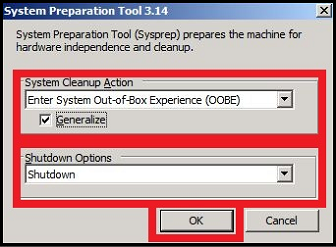

<!-- Ibiza Portal -->

<properties
	pageTitle="上载 Windows VHD 用于资源管理器 | Azure"
	description="了解如何上载 Windows 虚拟机映像以用于资源管理器部署模型。"
	services="virtual-machines-windows"
	documentationCenter=""
	authors="dsk-2015"
	manager="timlt"
	editor="tysonn"
	tags="azure-resource-manager"/>

<tags
	ms.service="virtual-machines-windows"
	ms.date="05/06/2016"
	wacn.date=""/>

# 将 Windows VM 映像上载到 Azure 以进行资源管理器部署

本文介绍如何使用 Windows 操作系统上载虚拟硬盘 (VHD)，因此可以通过它使用 Azure Resource Manager 部署模型创建新的 Windows 虚拟机 (VM)。有关 Azure 中的磁盘和 VHD 的更多详细信息，请参阅 [About disks and VHDs for virtual machines（关于虚拟机的磁盘和 VHD）](/documentation/articles/virtual-machines-linux-about-disks-vhds)。

## 先决条件

本文假设你具备以下条件：

- **Azure 订阅** - 如果你没有 Azure 订阅，请[免费注册 Azure 帐户](/pricing/1rmb-trial/?WT.mc_id=A261C142F)，然后[激活 MSDN 订户权益](/pricing/member-offers/msdn-benefits-details/?WT.mc_id=A261C142F)。

- **Azure PowerShell 1.0 或更高版本** - 如果你还没有安装它，请阅读 [How to install and configure Azure PowerShell（如何安装和配置 Azure PowerShell）](/documentation/articles/powershell-install-configure)。

- **运行 Windows 的虚拟机** - 有许多工具可在本地创建虚拟机。有关示例，请参阅 [Install the Hyper-V Role and configure a virtual machine（安装 Hyper-V 角色和配置虚拟机）](http://technet.microsoft.com/zh-cn/library/hh846766.aspx)。若要了解 Azure 支持哪些 Windows 操作系统，请参阅 [Microsoft server software support for Azure virtual machines（对 Azure 虚拟机的 Microsoft 服务器软件支持）](https://support.microsoft.com/kb/2721672)。

## 请确保 VM 具有正确的文件格式

Azure 只能接受以 VHD 文件格式保存的[第 1 代虚拟机](http://blogs.technet.com/b/ausoemteam/archive/2015/04/21/deciding-when-to-use-generation-1-or-generation-2-virtual-machines-with-hyper-v.aspx)的映像。VHD 大小必须固定且为整数 MB，也就是可被 8 整除。VHD 允许的最大大小为 1,023 GB。

- 如果 Windows VM 映像为 VHDX 格式，请使用以下方法之一将它转换成 VHD：

	- Hyper-V：打开 Hyper-V，在左侧选择本地计算机。然后在它上方的菜单中，单击“操作”>“编辑磁盘...”。通过单击“下一步”在屏幕之间导航并输入以下选项：VHDX 文件的路径 >“转换”>“VHD”>“固定大小”> 新的 VHD 文件的路径。单击“完成”以关闭。

	- [Convert-VHD PowerShell cmdlet](http://technet.microsoft.com/zh-cn/library/hh848454.aspx)：有关详细信息，请阅读博客文章 [Converting Hyper-V .vhdx to .vhd file formats（将 Hyper-V .vhdx 转换为 .vhd 文件格式）](https://blogs.technet.microsoft.com/cbernier/2013/08/29/converting-hyper-v-vhdx-to-vhd-file-formats-for-use-in-windows-azure/)。

- 如果你有 [VMDK 文件格式](https://en.wikipedia.org/wiki/VMDK)的 Windows VM 映像，可以使用 [Microsoft 虚拟机转换器](https://www.microsoft.com/download/details.aspx?id=42497)将其转换为 VHD。有关详细信息，请阅读博客 [How to Convert a VMware VMDK to Hyper-V VHD（如何将 VMware VMDK 转换为 Hyper-V VHD）](http://blogs.msdn.com/b/timomta/archive/2015/06/11/how-to-convert-a-vmware-vmdk-to-hyper-v-vhd.aspx)。

## 准备要上载的 VHD

本部分说明如何使 Windows 虚拟机通用化。在通用化过程中，将删除你在各个位置的所有个人帐户信息。当你要使用此 VM 映像快速部署类似的虚拟机时，通常需要执行此操作。有关 Sysprep 的详细信息，请参阅[如何使用 Sysprep：简介](http://technet.microsoft.com/zh-cn/library/bb457073.aspx)。

1. 登录到 Windows 虚拟机。

2. 以管理员身份打开“命令提示符”窗口。将目录更改为 **%windir%\\system32\\sysprep**，然后运行 `sysprep.exe`。

3. 在“系统准备工具”对话框中，执行以下操作：

	1. 在“系统清理操作”中，选择“进入系统全新体验(OOBE)”，并确保选中“通用化”复选框。

	2. 在**“关机选项”**中选择**“关机”**。

	3. 单击**“确定”**。

	

 

## 创建或查找 Azure 存储帐户

你需要在 Azure 中拥有存储帐户，才能上载 VM 映像。你可以使用现有存储帐户，也可以创建新的存储帐户。可以使用 Azure 门户或 PowerShell 来执行此操作。

### 使用 Azure 门户创建或查找 Azure 存储帐户

1. 登录到[门户](https://portal.azure.cn)。

2. 单击“浏览”>“存储帐户”。

3. 检查要用于上载此映像的存储帐户是否存在。记下此存储帐户的名称。如果你使用的是现有存储帐户，可以转到[上载 VM 映像](#uploadvm)部分。

4. 如果要创建新的存储帐户，请单击“添加”并输入以下信息：

	1. 输入存储帐户的**名称**。它只应包含 3 到 24 个小写字母和数字。此名称将成为 URL 的一部分，你将使用该 URL 从存储帐户访问 Blob、文件和其他资源。
	
	2. 选择 *Resource Manager* 作为**部署模型**。

	3. 选择适当的“帐户类型”、“性能”和“复制”值。将鼠标悬停在信息图标上可详细了解这些值。

	4. 在“资源组”中选择“+ 新建”，或选择现有的资源组。如果想要创建新资源组，请输入资源组的名称。

	5. 选择存储帐户的**位置**，然后单击“创建”。该帐户现在会出现在“存储帐户”面板下。

		

	6. 此步骤和后续步骤演示如何在此存储帐户中创建 Blob 容器。此步骤是可选的，因为你也可以通过用于上载映像的 PowerShell 命令来为映像创建新的 Blob 容器。如果你不想自行创建它，请转到[上载 VM 映像](#uploadvm)部分。否则，请单击“服务”磁贴中的“Blob”。

		

	7. 显示 Blob 面板后，请单击“+ 容器”以创建新的 Blob 存储容器。输入容器的名称和访问类型。

		

  		> [AZURE.NOTE] 默认情况下，该容器是专用容器，只能由帐户所有者访问。若要允许对容器中的 Blob 进行公共读取访问，但不允许对容器属性和元数据进行公共读取访问，请使用“Blob”选项。若要允许对容器和 Blob 进行完全公共读取访问，请使用“容器”选项。

	8. “Blob 服务”面板将列出新的 Blob 容器。请记下此容器的 URL - 在使用 PowerShell 命令上载映像时，将需要此 URL。根据 URL 的长度和屏幕分辨率，可能有一部分 URL 被隐藏起来。如果发生这种情况，请单击右上角的“最大化”图标将面板最大化。

### 使用 PowerShell 创建或查找 Azure 存储帐户

[AZURE.INCLUDE [arm-api-version-powershell](../includes/arm-api-version-powershell.md)]

1. 打开 Azure PowerShell 1.0.x 并登录到你的 Azure 帐户。

		Login-AzureRmAccount

	此命令将打开一个弹出窗口，供你输入 Azure 凭据。

2. 如果默认选择的订阅 ID 不同于你想要使用的订阅 ID，请使用以下任一命令设置正确的订阅。

		Set-AzureRmContext -SubscriptionId "xxxx-xxxx-xxxx-xxxx"

	或

		Select-AzureRmSubscription -SubscriptionId "xxxx-xxxx-xxxx-xxxx"

	你可以使用命令 `Get-AzureRmSubscription` 查找你的 Azure 帐户已拥有的订阅。

3. 找到此订阅下可用的存储帐户。

		Get-AzureRmStorageAccount

	如果你要使用现有存储帐户，请转到[上载 VM 映像](#uploadvm)部分。

4. 如果你要创建新的存储帐户来存储此映像，请执行以下步骤：

	1. 请确保你拥有此存储帐户的资源组。可以使用以下命令列出你的订阅中的所有资源组：

			Get-AzureRmResourceGroup

	2. 如果要创建新的资源组，请使用以下命令：

			New-AzureRmResourceGroup -Name YourResourceGroup -Location "China North"

	3. 使用以下命令在此资源组中创建新的存储帐户：

			New-AzureRmStorageAccount -ResourceGroupName YourResourceGroup -Name YourStorageAccountName -Location "China North" -Type "Standard_GRS"

 

## 将 VM 映像上载到你的存储帐户

在 Azure PowerShell 中使用这些步骤将 VM 映像上载到你的存储帐户。映像将上载到此帐户中的 Blob 存储容器。你可以使用现有容器或创建新容器。

1. 使用 `Login-AzureRmAccount` 登录到 Azure PowerShell 1.0.x。使用 `Set-AzureRmContext -SubscriptionId "xxxx-xxxx-xxxx-xxxx"` 来确保使用正确的订阅（如上一部分中所述）。

2. 使用 [Add-AzureRmVhd](https://msdn.microsoft.com/zh-cn/library/mt603554.aspx) cmdlet 将通用化的 Azure VHD 添加到存储帐户：

		Add-AzureRmVhd -ResourceGroupName YourResourceGroup -Destination "<StorageAccountURL>/<BlobContainer>/<TargetVHDName>.vhd" -LocalFilePath <LocalPathOfVHDFile>

	其中：
	- **StorageAccountURL** 是存储帐户的 URL。它通常采用此格式：`https://YourStorageAccountName.blob.core.chinacloudapi.cn`。请注意，需要使用现有或新的存储帐户的名称来替代 *YourStorageAccountName*。
	- **BlobContainer** 是要存储映像的 Blob 容器。如果该 cmdlet 未找到具有此名称的现有 blob 容器，它将为你创建一个新的。
	- **TargetVHDName** 是你想要将映像保存为的名称。
	- **LocalPathOfVHDFile** 是 .vhd 文件在本地计算机上的完整路径和名称。

	成功执行 `Add-AzureRmVhd` 后，将显示类似于下面的结果：

		C:\> Add-AzureRmVhd -ResourceGroupName testUpldRG -Destination https://testupldstore2.blob.core.chinacloudapi.cn/testblobs/WinServer12.vhd -LocalFilePath "C:\temp\WinServer12.vhd"
		MD5 hash is being calculated for the file C:\temp\WinServer12.vhd.
		MD5 hash calculation is completed.
		Elapsed time for the operation: 00:03:35
		Creating new page blob of size 53687091712...
		Elapsed time for upload: 01:12:49

		LocalFilePath           DestinationUri
		-------------           --------------
		C:\temp\WinServer12.vhd https://testupldstore2.blob.core.chinacloudapi.cn/testblobs/WinServer12.vhd

	此命令将需要一些时间才能完成，具体取决于你的网络连接和 VHD 文件的大小。

 
## 从已上载的映像部署新的 VM

现在，可以使用已上载的映像创建新的 Windows VM。以下步骤演示如何使用 Azure PowerShell 和在前面的步骤中上载的 VM 映像在新的虚拟网络中创建 VM。

>[AZURE.NOTE] VM 映像应与将创建的实际虚拟机存在于同一存储帐户中。

### 创建网络资源

使用以下示例 PowerShell 脚本为新 VM 设置虚拟网络和 NIC。根据应用程序需要使用 **$** 表示的变量的值。

	$pip = New-AzureRmPublicIpAddress -Name $pipName -ResourceGroupName $rgName -Location $location -AllocationMethod Dynamic

	$subnetconfig = New-AzureRmVirtualNetworkSubnetConfig -Name $subnet1Name -AddressPrefix $vnetSubnetAddressPrefix

	$vnet = New-AzureRmVirtualNetwork -Name $vnetName -ResourceGroupName $rgName -Location $location -AddressPrefix $vnetAddressPrefix -Subnet $subnetconfig

	$nic = New-AzureRmNetworkInterface -Name $nicname -ResourceGroupName $rgName -Location $location -SubnetId $vnet.Subnets[0].Id -PublicIpAddressId $pip.Id

### 创建新的 VM

以下 PowerShell 脚本演示如何设置虚拟机配置和使用已上载的 VM 映像作为新安装的源。
 

	#Enter a new user name and password in the pop-up window for the following
	$cred = Get-Credential

	#Get the storage account where the uploaded image is stored
	$storageAcc = Get-AzureRmStorageAccount -ResourceGroupName $rgName -AccountName $storageAccName

	#Set the VM name and size
	#Use "Get-Help New-AzureRmVMConfig" to know the available options for -VMsize
	$vmConfig = New-AzureRmVMConfig -VMName $vmName -VMSize "Standard_A4"

	#Set the Windows operating system configuration and add the NIC
	$vm = Set-AzureRmVMOperatingSystem -VM $vmConfig -Windows -ComputerName $computerName -Credential $cred -ProvisionVMAgent -EnableAutoUpdate

	$vm = Add-AzureRmVMNetworkInterface -VM $vm -Id $nic.Id

	#Create the OS disk URI
	$osDiskUri = '{0}vhds/{1}{2}.vhd' -f $storageAcc.PrimaryEndpoints.Blob.ToString(), $vmName.ToLower(), $osDiskName

	#Configure the OS disk to be created from the image (-CreateOption fromImage), and give the URL of the uploaded image VHD for the -SourceImageUri parameter
	#You can find this URL in the result of the Add-AzureRmVhd cmdlet above
	$vm = Set-AzureRmVMOSDisk -VM $vm -Name $osDiskName -VhdUri $osDiskUri -CreateOption fromImage -SourceImageUri $urlOfUploadedImageVhd -Windows

	#Create the new VM
	New-AzureRmVM -ResourceGroupName $rgName -Location $location -VM $vm

例如，工作流可以如下所示：

		C:\> $pipName = "testpip6"
		C:\> $pip = New-AzureRmPublicIpAddress -Name $pipName -ResourceGroupName $rgName -Location $location -AllocationMethod Dynamic
		C:\> $subnet1Name = "testsub6"
		C:\> $nicname = "testnic6"
		C:\> $vnetName = "testvnet6"
		C:\> $subnetconfig = New-AzureRmVirtualNetworkSubnetConfig -Name $subnet1Name -AddressPrefix $vnetSubnetAddressPrefix
		C:\> $vnet = New-AzureRmVirtualNetwork -Name $vnetName -ResourceGroupName $rgName -Location $location -AddressPrefix $vnetAddressPrefix -Subnet $subnetconfig
		C:\> $nic = New-AzureRmNetworkInterface -Name $nicname -ResourceGroupName $rgName -Location $location -SubnetId $vnet.Subnets[0].Id -PublicIpAddressId $pip.Id
		C:\> $vmName = "testupldvm6"
		C:\> $vmConfig = New-AzureRmVMConfig -VMName $vmName -VMSize "Standard_A4"
		C:\> $computerName = "testupldcomp6"
		C:\> $vm = Set-AzureRmVMOperatingSystem -VM $vmConfig -Windows -ComputerName $computerName -Credential $cred -ProvisionVMAgent -EnableAutoUpdate
		C:\> $vm = Add-AzureRmVMNetworkInterface -VM $vm -Id $nic.Id
		C:\> $osDiskName = "testupos6"
		C:\> $osDiskUri = '{0}vhds/{1}{2}.vhd' -f $storageAcc.PrimaryEndpoints.Blob.ToString(), $vmName.ToLower(), $osDiskName
		C:\> $urlOfUploadedImageVhd = "https://testupldstore2.blob.core.chinacloudapi.cn/testblobs/WinServer12.vhd"
		C:\> $vm = Set-AzureRmVMOSDisk -VM $vm -Name $osDiskName -VhdUri $osDiskUri -CreateOption fromImage -SourceImageUri $urlOfUploadedImageVhd -Windows
		C:\> $result = New-AzureRmVM -ResourceGroupName $rgName -Location $location -VM $vm
		C:\> $result
		RequestId IsSuccessStatusCode StatusCode ReasonPhrase
		--------- ------------------- ---------- ------------
		                         True         OK OK

你应该在 [Azure 门户](https://portal.azure.cn)的“浏览”>“虚拟机”下查看新创建的 VM，或者使用以下 PowerShell 命令进行查看：

	$vmList = Get-AzureRmVM -ResourceGroupName $rgName
	$vmList.Name

## 后续步骤

若要使用 Azure PowerShell 管理新虚拟机，请阅读 [Manage virtual machines using Azure Resource Manager and PowerShell（使用 Azure Resource Manager 与 PowerShell 来管理虚拟机）](/documentation/articles/virtual-machines-windows-ps-manage)。

<!---HONumber=Mooncake_0613_2016-->