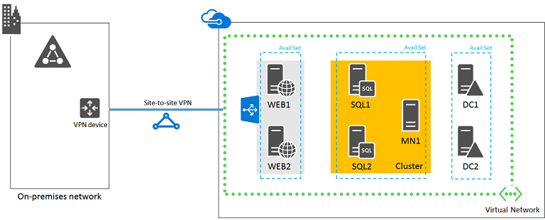

<properties 
	pageTitle="业务线应用程序（阶段 5）| Windows Azure" 
	description="在 Azure 的业务线应用程序阶段 5 中创建可用性组并向其中添加应用程序数据库。" 
	documentationCenter=""
	services="virtual-machines" 
	authors="JoeDavies-MSFT" 
	manager="timlt" 
	editor=""
	tags="azure-resource-manager"/>

<tags 
	ms.service="virtual-machines"
	ms.date="11/09/2015" 
	wacn.date="12/31/2015"/>

# 业务线应用程序工作负荷阶段 5：创建可用性组并添加应用程序数据库

[AZURE.INCLUDE [了解部署模型](../includes/learn-about-deployment-models-rm-include.md)]经典部署模型。

在 Azure 基础结构服务中部署高可用性组业务线应用程序的这个最后阶段，你将创建新的 SQL Server AlwaysOn 可用性组，并添加应用程序数据库。

有关所有阶段，请参阅[在 Azure 中部署高可用性业务线应用程序](/documentation/articles/virtual-machines-workload-high-availability-LOB-application-overview)。

## 创建可用性组并添加数据库

对于业务线应用程序的每个数据库：

1.	在主 SQL Server 虚拟机上对数据库执行完整备份和事务日志备份。
2.	在备份 SQL Server 虚拟机上还原完整备份和日志备份。

对数据库完成备份和还原操作以后，即可将其添加到可用性组中。SQL Server 只允许组中包含已备份（至少一次）且已在其他计算机上还原的数据库。

### 共享备份文件夹

若要启用备份和还原，备份文件 (.bak) 必须能够从辅助数据库服务器访问。请按以下过程操作：

1.	以 **[domain]\\sqladmin** 身份登录到主数据库服务器。 
2.	导航到 F:\\ 磁盘。 
3.	右键单击“Backup”文件夹，然后单击“共享对象”，最后再单击“特定人员”。
4.	在“文件共享”对话框中，键入 **[domain]\\sqlservice**，然后单击“添加”。
5.	单击与 **sqlservice** 帐户名称对应的“权限级别”列，然后单击“读/写”。 
6.	单击“共享”，然后单击“完成”。

在辅助数据库服务器上执行以上过程，在步骤 5 中为 sqlservice 帐户提供针对 F:\\Backup 文件夹的“读取”权限除外。

### 备份和还原数据库

每个需添加到可用性组的数据库都必须重复以下过程。

请使用以下步骤来备份数据库。

1.	在主数据库服务器的“开始”屏幕中，键入 **SQL Studio**，然后单击“SQL Server Management Studio”。
2.	单击“连接”。
3.	在左窗格中，展开“数据库”节点。
4.	右键单击要备份的数据库，指向“任务”，然后单击“备份”。
5.	在“目标”部分中，单击“删除”以删除备份文件的默认文件路径。
6.	单击**“添加”**。在“文件名”中，键入 **\\[machineName]\\backup[databaseName].bak**，其中 **machineName** 是主 **SQL Server 计算机**的名称，**databaseName** 是数据库的名称。单击“确定”，然后在有关备份成功的消息显示后再次单击“确定”。
7.	在左窗格中，右键单击 **[databaseName]**，指向“任务”，然后单击“备份”。
8.	在“备份类型”中，选择“事务日志”，然后单击“确定”两次。
9.	让此远程桌面会话保持打开状态。

请使用以下步骤来还原数据库。

1.	以 [domainName]\\sp\_farm\_db 身份登录到辅助数据库服务器。
2.	在“开始”屏幕中，键入“SQL Studio”，然后单击“SQL Server Management Studio”。
3.	单击“连接”。
4.	在左窗格中，右键单击“数据库”，然后单击“还原数据库”。
5.	在“源”部分中，选择“设备”，然后单击省略号 (...) 按钮
6.	在“选择备份设备”中，单击“添加”。
7.	在“备份文件位置”中，键入 **\\[machineName]\\backup**，按 **Enter** 键，选择 **[databaseName].bak**，然后单击“确定”两次。你现在会在“要还原的备份集”部分看到完整备份和日志备份。
8.	在“选择页”下单击“选项”。在“还原选项”部分的“恢复状态”中，选择“RESTORE WITH NORECOVERY”，然后单击“确定”。 
9.	出现提示时，单击“确定”。

### 创建可用性组

至少准备好一个数据库（使用备份和还原方法）后，你可以创建可用性组。

1.	返回到主数据库服务器的远程桌面会话。
2.	在 **SQL Server Management Studio** 的左窗格中，右键单击“AlwaysOn 高可用性”，然后单击“新建可用性组向导”。
3.	在**“简介”**页上单击**“下一步”**。 
4.	在“指定可用性组名称”页的“可用性组名称”中，键入可用性组的名称（示例：AG1），然后单击“下一步”。
5.	在“选择数据库”页中选择已备份的应用程序数据库，然后单击“下一步”。这些数据库满足可用性组的先决条件，因为你已经对目标主副本进行了至少一次完整备份。
6.	在“指定副本”页上，单击“添加副本”。
7.	在“连接到服务器”中，键入辅助数据库服务器的名称，然后单击“连接”。 
8.	在“指定副本”页上，辅助数据库服务器将在“可用性副本”中列出。对于这两个实例，请设置以下选项值： 

初始角色 | 选项 | 值 
--- | --- | ---
主要 | 自动故障转移(最多 2 个) | 选定
辅助 | 自动故障转移(最多 2 个) | 选定
主要 | 同步提交（最多 3 个） | 选定
辅助 | 同步提交（最多 3 个） | 选定
主要 | 可读辅助 | 是
辅助 | 可读辅助 | 是
		
9.	单击**“下一步”**。
10.	在“选择初始数据同步”页上，单击“仅加入”，然后单击“下一步”。数据同步是手动执行的，方法是：在主服务器上执行完整备份和事务备份，然后在备份的基础上进行还原。你可以改为选择“完整”，让新建可用性组向导为你执行数据同步。但是，对于某些企业中存在的大型数据库，不建议进行同步。
11.	在“验证”页中，单击“下一步”。如果配置中缺少侦听器，则会出现警告，因为未配置可用性组侦听器。 
12.	在**“摘要”**页上，单击**“完成”**。完成向导操作以后，请检查“结果”页，确保可用性组已成功创建。如果已成功创建，则单击“关闭”退出向导。 
13.	在“开始”屏幕中，键入**“故障转移”**，然后单击**“故障转移群集管理器”**。在左窗格中，打开你的群集的名称，然后单击“角色”。此时会显示带可用性组名称的新角色。

你已成功为应用程序数据库配置 SQL Server AlwaysOn 可用性组。

你现在可以开始向 Intranet 用户推出此新应用程序。

## 为 AlwaysOn 可用性组配置侦听器

你可以选择性地为 AlwaysOn 可用性组创建侦听器配置。相关步骤请参阅[教程：AlwaysOn 可用性组的侦听器配置](https://msdn.microsoft.com/zh-cn/library/dn425027.aspx)。这些说明将指导你逐步完成只创建一个侦听器（推荐），并使用内部负载平衡实例的静态 IP 地址。

配置侦听器以后，你需要将所有 web 服务器虚拟机配置为使用侦听器而非群集中第一个 SQL Server 的名称。不是使用映射到内部负载平衡实例的虚拟 IP 地址的新 DNS 名称和记录，而是将 web 服务器虚拟机配置为使用 SQL 别名。有关详细信息和步骤，请参阅 [SharePoint 的 SQL 别名](http://blogs.msdn.com/b/priyo/archive/2013/09/13/sql-alias-for-sharepoint.aspx)。

## 其他资源

[在 Azure 中部署高可用性业务线应用程序](/documentation/articles/virtual-machines-workload-high-availability-LOB-application-overview)

[业务线应用程序体系结构蓝图](http://msdn.microsoft.com/dn630664)

[在混合云中设置用于测试且基于 Web 的 LOB 应用程序](/documentation/articles/virtual-networks-setup-lobapp-hybrid-cloud-testing)

[Azure 基础结构服务实施准则](/documentation/articles/virtual-machines-infrastructure-services-implementation-guidelines)

[Azure 基础结构服务工作负荷：SharePoint Server 2013 场](/documentation/articles/virtual-machines-workload-intranet-sharepoint-farm)

<!---HONumber=Mooncake_1221_2015-->