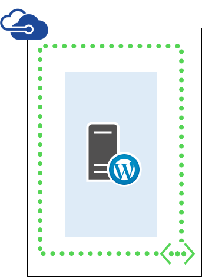

<properties
	pageTitle="Ubuntu 上的 WordPress 与 ARM 模板 | Windows Azure"
	description="使用资源管理器模板和 Azure 预览门户、Azure PowerShell 或 Azure CLI，轻松部署单个运行 Ubuntu 的 WordPress 服务器。"
	services="virtual-machines"
	documentationCenter=""
	authors="davidmu1"
	manager="timlt"
	editor=""
	tags="azure-resource-manager"/>

<tags
	ms.service="virtual-machines"
	ms.date="10/08/2015"
	wacn.date="11/27/2015"/>

# 使用 Azure 资源管理器模板在 Ubuntu 上部署 WordPress 服务器

[AZURE.INCLUDE [了解部署模型](../includes/learn-about-deployment-models-rm-include.md)]经典部署模型。你无法使用经典部署模型创建此资源。

按照本文中的说明，使用资源管理器模板部署在 Ubuntu 上运行的 WordPress 服务器。此模板将在新的虚拟网络上创建单个虚拟机。

可以使用 Azure PowerShell 或 Azure CLI 运行模板。

## Azure PowerShell

在开始之前，请确保安装了正确版本的 Azure PowerShell 且已登录，并切换到新的“资源管理器”模式。有关详细信息，请单击[此处](/documentation/articles/virtual-machines-deploy-rmtemplates-powershell#setting-up-powershell-for-resource-manager-templates)。

在以下命令集中填写 Azure 部署名称、新的资源组名称以及 Azure 数据中心位置。删除引号内的所有内容，包括 < and > 字符。

	$deployName="<deployment name>"
	$RGName="<resource group name>"
	$locName="<Azure location, such as West US>"
	$templateURI="https://raw.githubusercontent.com/azure/azure-quickstart-templates/master/wordpress-single-vm-ubuntu/azuredeploy.json"
	New-AzureRmResourceGroup -Name $RGName -Location $locName
	New-AzureRmResourceGroupDeployment -Name $deployName -ResourceGroupName $RGName -TemplateUri $templateURI

下面是一个示例。

	$deployName="TestDeployment"
	$RGName="TestRG"
	$locname="West US"
	$templateURI="https://raw.githubusercontent.com/azure/azure-quickstart-templates/master/wordpress-single-vm-ubuntu/azuredeploy.json"
	New-AzureRmResourceGroup -Name $RGName -Location $locName
	New-AzureRmResourceGroupDeployment -Name $deployName -ResourceGroupName $RGName -TemplateUri $templateURI

接下来，在 Azure PowerShell 提示符中运行命令块。

当你运行 **New-AzureRmResourceGroupDeployment** 命令时，系统会提示你提供一系列参数的值。指定了所有参数值后，**New-AzureRmResourceGroupDeployment** 将创建和配置虚拟机。

当模板执行完成时，现在你的新资源组中将包含在 Ubuntu 上运行的 WordPress 服务器。

## Azure CLI

在开始之前，请确保安装了正确版本的 Azure CLI 且已登录，并切换到新的“资源管理器”模式。有关详细信息，请单击[此处](/documentation/articles/virtual-machines-deploy-rmtemplates-azure-cli/#getting-ready)。

首先，创建新的资源组。使用以下命令并指定组名称，以及要向其中部署的 Azure 数据中心位置。

	azure group create <group name> <location>

下一步，使用以下命令并指定新资源组的名称以及 Azure 部署的名称。

	azure group deployment create --template-uri https://raw.githubusercontent.com/azure/azure-quickstart-templates/master/wordpress-single-vm-ubuntu/azuredeploy.json <group name> <deployment name>

下面是一个示例。

	azure group create wordpress eastus2
	azure group deployment create --template-uri https://raw.githubusercontent.com/azure/azure-quickstart-templates/master/wordpress-single-vm-ubuntu/azuredeploy.json wordpress wpdevtest

当你运行 **azure group deployment create** 命令时，系统会提示你提供一系列参数的值。指定了所有参数值后，Azure 将创建和配置虚拟机。

当模板执行完成时，现在你的新资源组中将包含在 Ubuntu 上运行的 WordPress 服务器。

## 其他资源

[使用 Azure 资源管理器模板和 Azure PowerShell 部署和管理虚拟机](/documentation/articles/virtual-machines-deploy-rmtemplates-powershell)

[Azure 资源管理器中的 Azure 计算、网络和存储提供程序](/documentation/articles/virtual-machines-azurerm-versus-azuresm)

<!--[-->Azure 资源管理器概述<!--](/documentation/articles/resource-group-overview)-->

[使用 Azure 资源管理器模板和 Azure CLI 部署和管理虚拟机](/documentation/articles/virtual-machines-deploy-rmtemplates-azure-cli)

[虚拟机文档](http://www.windowsazure.cn/documentation/services/virtual-machines/)

[如何安装和配置 Azure PowerShell](/documentation/articles/install-configure-powershell)

<!---HONumber=82-->