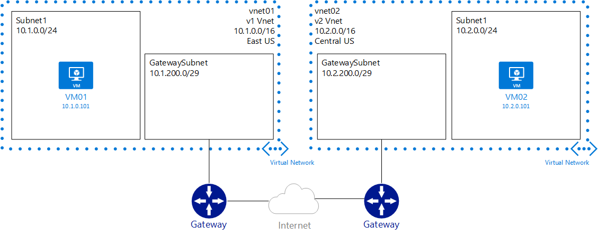
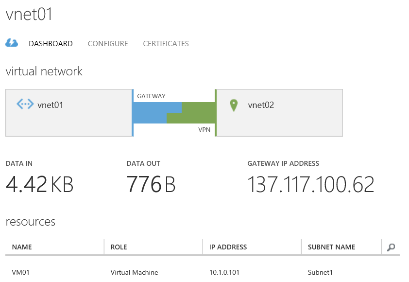
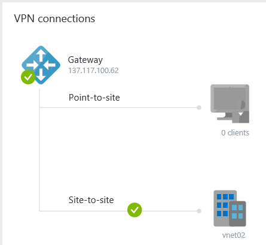

<properties 
   pageTitle="如何在 Azure 中将经典 VNet 连接到 ARM VNet - 解决方案指南"
   description="了解如何在经典 VNet 和新 VNet 之间创建 VPN 连接"
   services="virtual-network"
   documentationCenter="na"
   authors="telmosampaio"
   manager="carolz"
   editor="tysonn" />
<tags 
   ms.service="virtual-network"
   ms.date="07/14/2015"
   wacn.date="08/29/2015" />

# 将经典 VNet 连接到新 VNet

Azure 当前有两种管理模式：Azure 服务管理（称之为经典）和 Azure 资源管理器 (ARM)。如果 Azure 已经使用了一段时间，则你的 Azure VM 和实例角色可能是在经典 VNet 上运行。而较新的 VM 和角色实例可能是在 ARM 中创建的 VNet 上运行。

在此类情况下，你需确保新的基础结构能够与经典资源进行通信。为此，可以在两个 VNet 之间创建一个 VPN 连接。下图显示了包含两个 VNet（经典和 ARM）的示例环境，VNet 之间建立了安全的隧道连接。

>[AZURE.NOTE]本文档将指导你完成一个端到端解决方案，以用于测试目的。如果 VNet 已经设置完毕，并且你已熟悉 VPN 网关和 Azure 中的站点到站点连接，请访问[在 ARM VNet 和经典 VNet 之间配置 S2S VPN](/documentation/articles/virtual-networks-arm-asm-s2s-howto)。

要测试此方案，你将要：

1. [创建一个经典 VNet 环境](#Create-a-classic-VNet-environment)。
2. [创建一个新 VNet 环境](#Create-a-new-VNet-environment)。
3. [连接两个 VNet](#Connect-the-two-VNets)。

你将按顺序执行上述步骤，首先使用经典 Azure 管理工具，包括经典门户、网络配置文件和 Azure 服务管理器 PowerShell cmdlet；然后转为使用新的管理工具，包括新 Azure 门户、ARM 模板和 ARM PowerShell cmdlet。

>[AZURE.IMPORTANT]互相连接的 VNet 之间不能有 CIDR 块冲突。确保每个 VNet 都有独特的 CIDR 块！

## 创建经典 VNet 环境

可使用现有的块 VNet 连接到新 ARM VNet。在本示例中，你将看到如何创建新的包含两个子网、一个网关和一个 VM 的经典 VNet，以用于测试目的。

### 步骤 1：创建经典 VNet

要创建映射到以上图 1 的新 VNet，请遵循以下说明。

1. 从 PowerShell 控制台中，运行以下命令以添加 Azure 帐户。

		Add-AzureAccount

2. 遵循登录对话框中的说明，使用 Azure 帐户登录。

3. 通过运行以下命令，确保你在使用 Azure 服务管理 PowerShell cmdlet。

		Switch-AzureMode AzureServiceManagement

4. 通过运行以下命令，下载 Azure 网络配置文件。

		Get-AzureVNetConfig -ExportToFile c:\Azure\classicvnets.netcfg

		XMLConfiguration                                OperationDescription                            OperationId                                     OperationStatus                                
		----------------                                --------------------                            -----------                                     ---------------                                
		<?xml version="1.0" encoding="utf-8"?>...       Get-AzureVNetConfig                             04ab3224-7e1c-cc1a-8b75-96c6c300ddb8            Succeeded       

5. 打开刚才下载的文件，然后添加名为 *vnet02* 的本地网络站点，其中使用 *10.2.0.0/16* 作为地址前缀，使用任一有效的公有 IP 地址作为 VPN 网关地址。向配置文件中的 **LocalNetworkSites** 元素添加 **LocalNetworkSite** 元素也可以实现这一点。下面的文件代码段显示了 **LocalNetworksSites** 元素示例。

	    <LocalNetworkSites>
	      <LocalNetworkSite name="vnet02">
	        <AddressSpace>
	          <AddressPrefix>10.2.0.0/16</AddressPrefix>
	        </AddressSpace>
	        <VPNGatewayAddress>2.0.0.2</VPNGatewayAddress>
	      </LocalNetworkSite>
	    </LocalNetworkSites>		

6. 在 **VirtualNetworkSites** 元素中，根据以上方案图添加新的虚拟网络，其中包含 *10.1.0.0/16* 地址前缀和两个子网。下面的文件代码段显示了 **VirtualNetworkSites** 元素示例。
	
	    <VirtualNetworkSites>
	      <VirtualNetworkSite name="vnet01" Location="East US">
	        <AddressSpace>
	          <AddressPrefix>10.1.0.0/16</AddressPrefix>
	        </AddressSpace>
	        <Subnets>
	          <Subnet name="Subnet1">
	            <AddressPrefix>10.1.0.0/24</AddressPrefix>
	          </Subnet>
	          <Subnet name="GatewaySubnet">
	            <AddressPrefix>10.1.200.0/29</AddressPrefix>
	          </Subnet>
	        </Subnets>
	      </VirtualNetworkSite>
	    </VirtualNetworkSites>

7. 保存文件，然后运行以下命令以将其上载到 Azure。确保根据环境需要更改文件路径。

		Set-AzureVNetConfig -ConfigurationPath c:\Azure\classicvnets.netcfg

		OperationDescription                                            OperationId                                                     OperationStatus                                                
		--------------------                                            -----------                                                     ---------------                                                
		Set-AzureVNetConfig                                             e0ee6e66-9167-cfa7-a746-7cab93c22013                            Succeeded 

### 步骤 2：在经典 VNet 中创建 VM

若要使用 Azure 服务管理器 PowerShell cmdlet 在经典 VNet 中创建 VM，请遵循以下说明。

1. 从 Azure 中检索 VM 映像。以下 PowerShell 命令可检索最新可用的 Windows Server 2012 R2 映像。

		$WinImage = (Get-AzureVMImage `
		    | ?{$_.ImageFamily -eq "Windows Server 2012 R2 Datacenter"} `
		    | sort PublishedDate -Descending)[0]		

2. 通过运行以下命令，创建存储帐户以存储 VM 的虚拟硬盘 (VHD)。

		$storage1 = New-AzureStorageAccount `
			-StorageAccountName v1v2teststorage1 `
		    -Location "East US"	

3.  运行以下命令以创建 VM。确保替换用户名和密码值。

		$vm1 = New-AzureVMConfig -Name "VM01" -InstanceSize "ExtraLarge" `
		    -Image $WinImage.ImageName –AvailabilitySetName "MyAVSet1" `
		    -MediaLocation "https://v1v2teststorage1.blob.core.windows.net/vhd/vm01.vhd"
		Add-AzureProvisioningConfig –VM $vm1 -Windows `
		    -AdminUserName "user" -Password "P@ssw0rd" 

4.  运行以下命令以将 VM 连接到 *Subnet1*。

		Set-AzureSubnet -SubnetNames "Subnet1" -VM $vm1
		Set-AzureStaticVNetIP  -IPAddress "10.1.0.101" -VM $vm1

5. 通过运行以下命令，创建新的云服务以托管 VM。

		New-AzureService -ServiceName "v1v2svc01" -Location "East US"
 		New-AzureVM -ServiceName "v1v2svc01" –VNetName "vnet01" –VMs $vm1

### 步骤 3：为经典 VNet 创建 VPN 网关 

若要使用经典 Azure 门户为 vnet01 创建 VPN 网关，请遵循以下说明。

1. 在 https://manage.windowsazure.com 处打开经典 Azure 门户。如有必要，可指定你的凭据。
2. 向下滚动“所有项目”列表，并单击“网络”。
3. 在虚拟网络列表上，单击 **vnet01**，然后单击“配置”。
4. 在“站点到站点连接”下，选中“连接到本地网络”复选框。
5. 在“本地网络”列表上，选择 **vnet02** 并单击“保存”，然后单击“是”。
6. 单击“仪表板”，并注意消息指示尚未创建网关，如下图 2 中所示。

	

7. 单击“创建网关”（如下图 3 中所示），为 vnet01 创建 VPN 网关。

	

8. 在网关类型的列表中，单击“动态”，然后单击“是”。请注意，仪表板图像发生变化，正在创建的网关显示为黄色。

	

	>[AZURE.NOTE]此操作可能需要几分钟。

9. 创建完成后，写下该网关的公有 IP 地址（如下所示）。稍后为 ARM VNet 创建本地网络时，将需要此地址。

	

## 创建新 VNet 环境

现在，包含一个 VM 和一个网关的经典 VNet 已开始正常运行，是时候创建 ARM VNet 了。

### 步骤 1：在 ARM 中创建新 VNet

若要使用 ARM 模板为经典 VNet 创建包含两个子网和一个本地网络的 ARM VNet，请遵循以下说明。

1. 从 [git hub](https://github.com/Azure/azure-quickstart-templates/tree/master/arm-asm-s2s) 下载 azuredeploy.json 和 azuredeploy-parameters.json 文件。
2. 在 Visual Studio 中打开 azuredeploy.json 文件，并注意该模板创建了 4 个资源： 

	- **本地网关**：该资源代表了为要连接到的 VNet 创建的网关。在此方案中，是用于 vnet01 的网关。
	- **虚拟网络**：该资源代表了要创建的 ARM VNet。在此方案中，是 vnet02。
	- **网络公有 IP**：该资源代表了要为 ARM VNet 创建的网关的公有 IP 地址。 
	- **网关**：该资源代表了要为 ARM VNet (vnet02) 创建的网关。

3. 请注意该文件中使用的参数。大多数参数都有默认值。你可根据自己的需求更改这些值。

4. 在 Visual Studio 中打开 azuredeploy-parameters.json 文件。该文件中包含了要用于模板文件中的参数的值。必要时，可编辑以下值。

	- **subscriptionId**：编辑和粘贴你的订阅 ID。如果不知道你的订阅 ID，可运行 **Get-AzureSubscription** PowerShell cmdlet 以检索你的 ID。
	- **位置**：指定将在此处创建 VNet 的 Azure 位置。在此方案中，位置将是“美国中部”。
	- **virtualNetworkName**：这是即将创建的 ARM VNet 的名称。在此方案中，是 **vnet02**。
	- **localGatewayName**：这是要从新 ARM VNet 连接到的本地网络。在此方案中，是 **vnet01**。
	- **localGatewayIpAddress**：这是为要连接到的网络创建的网关的公有 IP 地址。在此方案中，这是为 **vnet01** 创建 VPN 网关时，在上述步骤 9 中写下的 IP 地址。
	- **localGatewayAddressPrefix**：这是你的 VNet 将连接到的本地网络的 CIDR 块。在此方案中，你将连接到的 VNet 是 **vnet01**，其 CIDR 块是 **10.1.0.0/16**。
	- **gatewayPublicIPName**：这是即将为网关（为 ARM VNet 创建的网关）的公有 IP 创建的 IP 对象的名称。
	- **gatewayName**：这是将为 ARM VNet 创建的网关对象的名称。
	- **addressPrefix**：这是 ARM VNet 的 CIDR 块。在此方案中，是 **10.2.0.0/16**。
	- **subnet1Prefix**：这是 ARM VNet 中的子网的 CIDR 块。在此方案中，是 **10.2.0.0/24**。
	- **gatewaySubnetPrefix**：这是 ARM VNet 中的网关子网的 CIDR 块。在此方案中，是 **10.2.200.0/29**。
	- **connectionName**：这是即将创建的连接对象的名称。
	- **sharedKey**：这是连接的 IPSec 共享密钥。在此方案中，是 **abc123**。

5. 若要在名为 **RG1** 的新资源组中创建 ARM VNet 及其相关对象，请运行以下 PowerShell 命令。请确保更改模板文件和参数文件的路径。

		Switch-AzureMode AzureResourceManager
		New-AzureResourceGroup -Name RG1 -Location "Central US" `
		    -TemplateFile C:\Azure\azuredeploy.json `
		    -TemplateParameterFile C:\Azure\azuredeploy-parameters.json		

	>[AZURE.NOTE]此操作可能需要几分钟。

7. 从浏览器中导航到 https://ms.portal.azure.com/，必要时输入你的凭据。
8. 单击 Azure 门户中的 **RG1** 资源组磁铁，如下所示。

	

9. 请注意通过使用 ARM 模板添加到组中的资源。

### 步骤 2：在 ARM 中创建新 VM

若要通过 Azure 门户在新 VNet 中创建 VM，请遵循以下说明。

1. 从门户中，单击“新建”按钮，然后单击“计算”，再单击“Windows Server 2012 R2 Datacenter”。
2. 在右窗格底部的“选择计算堆栈”中，选择“使用资源管理器堆栈”以在 ARM 中创建 VM（如下所述），然后单击“创建”。

	

3. 在“基本”边栏选项卡中，输入 VM 名称、用户名、密码、订阅、资源组和 VM 位置，然后单击“确定”。下图显示了此方案的设置。

	

4. 在“选择大小”边栏选项卡中，选择一个大小，然后单击“选择”。对于此方案，请选择 **D2**。
5. 在“设置”边栏选项卡中，单击“虚拟网络”，然后单击 **vnet02**。
6. 单击“子网”，然后单击 **Subnet1**，再单击“确定”。“摘要”边栏选项卡应如下所示。

	

7. 单击“确定”，然后单击“创建”以创建 VM。你将发现门户中出现一个新的磁贴，显示了正在设置的 VM，如下所示。

	

	>[AZURE.NOTE]此操作可能需要几分钟。你可继续移动到本文档中的下一部分。

## 连接两个 VNet

现在，你的两个 VNet 都连接了 VM，是时候通过之前创建的网关连接 VNet 并测试连接了。

### 步骤 1：为经典 VNet 配置网关

需要配置经典 VNet 以使用为 ARM VNet (vnet02) 创建的网关的 IP 地址，然后从每个 VNet 建立连接。若要执行此操作，请遵循以下说明。

1. 若要检索用于 ARM VNet 中网关的 IP 地址，请运行以下命令，并注意输出。写下地址，稍后修改经典 VNet 的本地网络设置时将需要用到该地址。

		Get-AzurePublicIpAddress | ?{$_.Name -eq "ArmAsmS2sGatewayIp"}

		Name                     : ArmAsmS2sGatewayIp
		ResourceGroupName        : RG1
		Location                 : centralus
		Id                       : /subscriptions/628dad04-b5d1-4f10-b3a4-dc61d88cf97c/resourceGroups/RG1/providers/Microsoft.Network/publicIPAddresses/ArmAsmS2sGatewayIp
		Etag                     : W/"1ee6c1bd-8be1-488e-a571-77b05b49e33a"
		ProvisioningState        : Succeeded
		Tags                     : 
		PublicIpAllocationMethod : Dynamic
		IpAddress                : 23.99.213.28
		IdleTimeoutInMinutes     : 4
		IpConfiguration          : {
		                             "Id": "/subscriptions/628dad04-b5d1-4f10-b3a4-dc61d88cf97c/resourceGroups/RG1/providers/Microsoft.Network/virtualNetworkGateways/ArmAsmGateway/ipConfigurations/vn
		                           etGatewayConfig"
		                           }
		DnsSettings              : null

2. 通过运行以下命令，确保对 PowerShell 命令使用了 Azure 服务管理 API。

		Switch-AzureMode AzureServiceManagement

3. 通过运行以下命令，下载 Azure 网络配置文件。

		Get-AzureVNetConfig -ExportToFile c:\Azure\classicvnets.netcfg

4. 打开刚才下载的文件，并编辑 **vnet02** 的 **LocalNetworkSite** 元素，以便为上述步骤 1 中获得的新 VNet 添加网关的 IP 地址。该元素应与以下示例相似。

	      <LocalNetworkSite name="vnet03">
	        <AddressSpace>
	          <AddressPrefix>10.3.0.0/16</AddressPrefix>
	        </AddressSpace>
	        <VPNGatewayAddress>23.99.213.28</VPNGatewayAddress>
	      </LocalNetworkSite>

5. 保存文件，然后运行以下命令以配置经典 vnet。确保更改路径，以指向你在上述步骤 4 中保存的文件。

		Set-AzureVNetConfig -ConfigurationPath c:\Azure\classicvnets.netcfg

6. 通过运行以下命令，为经典 VNet 网关设置 IPSec 共享密钥。你应该会看到与下面类似的输出。如果使用自己的预先存在的 VNet，请确保更改 VNet 名称。

		Set-AzureVNetGatewayKey -VNetName vnet01 -LocalNetworkSiteName vnet02 -SharedKey abc123 

		Error          : 
		HttpStatusCode : OK
		Id             : b2154475-bf00-480e-ad1e-aed893014979
		Status         : Successful
		RequestId      : 08257a09d723cb8982c47b85edb0e08a
		StatusCode     : OK

### 步骤 2：为 ARM VNet 配置网关

现在，经典 VNet 网关配置完成后，是时候建立连接了。若要执行此操作，请遵循以下说明。

1. 从 PowerShell 控制台中，运行以下命令以切换到 ARM 模式。 

		Switch-AzureMode AzureResourceManager

2. 通过运行以下命令，在网关之间创建连接。

		$vnet01gateway = Get-AzureLocalNetworkGateway -Name vnet01 -ResourceGroupName RG1
		$vnet02gateway = Get-AzureVirtualNetworkGateway -Name ArmAsmGateway -ResourceGroupName RG1
		
		New-AzureVirtualNetworkGatewayConnection -Name arm-asm-s2s-connection `
			-ResourceGroupName RG1 -Location "Central US" -VirtualNetworkGateway1 $vnet02gateway `
			-LocalNetworkGateway2 $vnet01gateway -ConnectionType IPsec `
			-RoutingWeight 10 -SharedKey 'abc123'

3. 在 https://manage.windowsazure.com 处打开 Azure 门户，必要时输入你的凭据。
4. 在“所有项目”下，向下滚动并单击“网络”，然后单击 **vnet01**，再单击“仪表板”。请注意 **vnet01** 与 **vnet02** 之间的连接现已建立，如下所示。

	

5. 尽管你可以管理经典 VNet 及其来自经典门户的连接，但还是建议使用新的 Azure 门户。要打开新门户，请导航到 https://ms.portal.azure.com。
6. 在新门户中，单击“浏览全部”，然后单击“虚拟网络(经典)”，再单击 **vnet01**。请注意以下所示的“VPN 连接”窗格。

	

### 步骤 3：测试连接

现在已经连接了两个 VNet，是时候从一个 VM 对另一个 VM 发起 ping 操作，以测试连接了。你将需要更改其中一个 VM 的防火墙设置以允许 ICMP，然后从另一个 VM 对该 VM 发起 ping 操作。若要执行此操作，请遵循以下说明。

1. 从 Azure 门户中，单击“浏览全部”，然后单击“虚拟机”，再单击 **VM02**。
2. 从 **VM02** 边栏选项卡中，单击“连接”。如有需要，可单击浏览器安全性横幅上的“打开”以打开 RDP 文件。
3. 在“远程桌面连接”对话框中，单击“连接”。
4. 在“Windows 安全性”对话框中，输入你的 VM 用户名和密码。 
5. 在“远程桌面连接”对话框中，单击“是”。
6. 连接到 VM 后，从“服务器管理器”中单击“工具”，然后单击“具有高级安全性的 Windows 防火墙”。
7. 在“具有高级安全性的 Windows 防火墙”窗口中，单击“入站规则”。
8. 在“入站规则”列表中，单击“文件和打印机共享(回应请求 - ICMPv4-In)”，然后单击“启用规则”。
9. 在任务栏中，单击“Windows PowerShell”按钮，然后运行以下命令。

		ipconfig

		Connection-specific DNS Suffix  . : 4oxp4ce0c5rulb1iey4cdqhasg.gx.internal.cloudapp.net
		Link-local IPv6 Address . . . . . : fe80::8cea:a98a:5c48:4c58%12
		IPv4 Address. . . . . . . . . . . : 10.2.0.101
		Subnet Mask . . . . . . . . . . . : 255.255.255.0
		Default Gateway . . . . . . . . . : 10.2.0.101

10. 写下 VM 的 IP 地址。在此方案中，是 **10.2.0.101**。你将从另一个 VM 对该地址发起 ping 操作，以测试 VNet 之间的连接。
11. 从 Azure 门户的左窗格中，单击“虚拟机(经典)”并单击 **VM01**，然后单击“连接”。如有需要，可单击浏览器安全性横幅上的“打开”以打开 RDP 文件。
12. 在“远程桌面连接”对话框中，单击“连接”。
13. 在“Windows 安全性”对话框中，输入你的 VM 用户名和密码。 
14. 在“远程桌面连接”对话框中，单击“是”。
15. 在远程 VM 的任务栏中，单击“Windows PowerShell”按钮，然后运行以下命令。

		ping 10.2.0.101

		Reply from 10.2.0.101: bytes=32 time=32ms TTL=126
		Reply from 10.2.0.101: bytes=32 time=32ms TTL=126
		Reply from 10.2.0.101: bytes=32 time=32ms TTL=126
		Reply from 10.2.0.101: bytes=32 time=32ms TTL=126

## 后续步骤

- 了解有关[适用于 ARM 的网络资源提供程序 (NRP)](/documentation/articles/resource-groups-networking) 的详细信息。
- 查看有关如何[在经典 VNet 和 ARM VNet 之间创建 S2S VPN 连接](/documentation/articles/virtual-networks-arm-asm-s2s-howto)的通用准则。

<!---HONumber=67-->