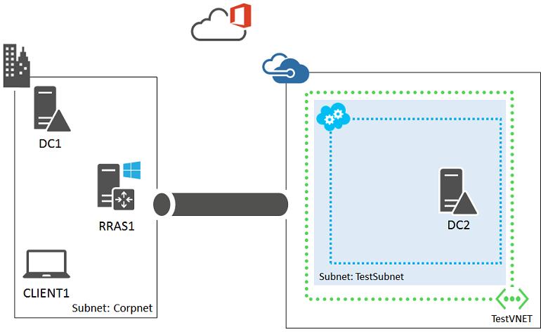

<properties 
	pageTitle="Office 365 DirSync 测试环境 | Azure" 
	description="了解如何在混合云中配置 Office 365 目录同步 (DirSync) 服务器，以便进行 IT 专业人员测试或开发测试。" 
	services="virtual-network" 
	documentationCenter="" 
	authors="JoeDavies-MSFT" 
	manager="timlt" 
	editor=""
	tags="azure-service-management"/>

<tags
	ms.service="virtual-network"
	ms.date="03/28/2016"
	wacn.date="05/24/2016"/>

# 在混合云中设置 Office 365 目录同步 (DirSync) 以便进行测试

> [AZURE.IMPORTANT]Azure 具有用于创建和处理资源的两个不同的部署模型：[资源管理器和经典](/documentation/articles/resource-manager-deployment-model)。本文介绍使用经典部署模型。Azure 建议大多数新部署使用资源管理器模型。
 

本主题将指导你逐步创建混合云环境，以便测试在 Azure 中托管的带密码同步的 Office 365 目录同步 (DirSync)。这是生成的配置。

 
该配置通过你在 Internet 上的位置模拟 Azure 生产环境中的 DirSync 服务器。它包括：

- 简化的本地网络（Corpnet 子网）。
- 在 Azure 中托管的跨界虚拟网络 (TestVNET)。
- 站点到站点 VPN 连接。
- Office 365 FastTrack 试用订阅。
- TestVNET 虚拟网络中运行 Azure AD Connect 工具的 DirSync 服务器和辅助域控制器。

此配置提供了基础和通用的起始点，你可以据此执行以下操作：

- 开发和测试适用于 Office 365 且依赖于与本地 Active Directory 域的同步（使用密码同步）的应用程序。
- 对这个基于云的 IT 工作负载进行测试。

设置此混合云测试环境需要完成以下三个主要阶段：

1.	设置用于测试的混合云环境。
2.	配置 Office 365 FastTrack 试用版。
3.	配置 DirSync 服务器 (DS1)。

如果你还没有 Azure 订阅，可以通过[试用 Azure](/pricing/1rmb-trial/) 注册试用版。

## 阶段 1：设置混合云环境

使用[设置用于测试的混合云环境](/documentation/articles/virtual-networks-setup-hybrid-cloud-environment-testing)主题中的说明。由于此测试环境不需要 Corpnet 子网上存在 APP1 服务器，因此现在即可将其关闭。

这是你当前的配置。

> [AZURE.NOTE]就阶段 1 来说，你也可以设置模拟混合云测试环境。有关说明，请参阅[设置用于测试的模拟混合云环境](/documentation/articles/virtual-networks-setup-simulated-hybrid-cloud-environment-testing)。

## 阶段 2：配置 Office 365 FastTrack 试用版

若要启动 Office 365 FastTrack 试用版，你需要一个虚构的公司名称以及一个 Microsoft 帐户。我们建议你将 Contoso 这个在 Microsoft 示例内容中使用的虚构的公司名称变一下，将其用作你的公司名称，不过这不是必需的。

接下来，注册新的 Microsoft 帐户。转到 **http://outlook.com**，使用 user123@outlook.com 这样的电子邮件地址创建一个帐户。你将使用此帐户注册 Office 365 FastTrack 试用版。

接下来，注册新的 Office 365 Enterprise E3 试用版。

1.	使用 CORP\\User1 帐户凭据登录 CLIENT1。
2.	打开 Internet Explorer 并转到 **https://go.microsoft.com/fwlink/p/?LinkID=403802**。
3.	逐步完成注册 Office 365 Enterprise E3 试用版的过程。

当系统提示输入**业务电子邮件地址**时，指定新的 Microsoft 帐户。

当系统提示创建 ID 时，键入初始 Office 365 帐户的名称，然后键入虚构的公司名称和密码。在安全的位置记录生成的电子邮件地址（例如 user123@contoso123.partner.onmschina.cn）和密码。你将需要此信息才能完成阶段 3 中的 Azure AD Connect 配置。

完成后，你应该会看到 Office 365 门户主页。在顶部功能区中，单击“管理”，然后单击“Office 365”。此时会出现 Office 365 管理中心页。让此页在 CLIENT1 上保持打开状态。

这是你当前的配置。

## 阶段 3：配置目录同步服务器 (DS1)

首先，在本地计算机上的 Azure PowerShell 命令提示符下使用这些命令创建适用于 DS1 的 Azure 虚拟机。在运行这些命令之前，请填写变量值并删除 < and > 字符。

	$ServiceName="<The cloud service name for your TestVNET virtual network>"
	$cred1=Get-Credential -Message "Type the name and password of the local administrator account for DS1."
	$cred2=Get-Credential -UserName "CORP\User1" -Message "Now type the password for the CORP\User1 account."
	$image= Get-AzureVMImage | where { $_.ImageFamily -eq "Windows Server 2012 R2 Datacenter" } | sort PublishedDate -Descending | select -ExpandProperty ImageName -First 1
	$vm1=New-AzureVMConfig -Name DS1 -InstanceSize Medium -ImageName $image
	$vm1 | Add-AzureProvisioningConfig -AdminUsername $cred1.GetNetworkCredential().Username -Password $cred1.GetNetworkCredential().Password -WindowsDomain -Domain "CORP" -DomainUserName "User1" -DomainPassword $cred2.GetNetworkCredential().Password -JoinDomain "corp.contoso.com"
	$vm1 | Set-AzureSubnet -SubnetNames TestSubnet
	New-AzureVM -ServiceName $ServiceName -VMs $vm1 -VNetName TestVNET

接下来，连接到 DS1 虚拟机。

1.	在 Azure 经典管理门户的虚拟机页上，单击 DS1 虚拟机“状态”列中的“正在运行”。
2.	在任务栏中，单击“连接”。 
3.	当系统提示你打开 DS1.rdp 时，单击“打开”。
4.	遇到远程桌面连接消息框提示时，单击“连接”。
5.	当系统提示你输入凭据时，请使用以下凭据：
	- 名称：**CORP\\User1**
	- 密码：[User1 帐户密码]
6.	当系统使用引用证书的远程桌面连接消息框提示你时，单击“是”。

接下来，配置 Windows 防火墙规则，以允许进行基本的连接测试所需的流量。在 DS1 上的管理员级 Windows PowerShell 命令提示符下，运行这些命令。

	Set-NetFirewallRule -DisplayName "File and Printer Sharing (Echo Request - ICMPv4-In)" -enabled True
	ping dc1.corp.contoso.com

使用 ping 命令时，会从 IP 地址 10.0.0.1 传回四个成功的答复。

接下来，在 Windows PowerShell 命令提示符处使用此命令在 DS1 上安装 .NET 3.5。

	Add-WindowsFeature NET-Framework-Core

接下来，为你的 Office 365 FastTrack 试用版启用目录同步。

1.	在 CLIENT1 的“Office 365 管理中心”页的左窗格中，单击“用户”，然后单击“活动用户”。
2.	对于 **Active Directory 同步**，请单击“设置”。
3.	在“设置和管理 Active Directory 同步”页的步骤 3 中，单击“激活”。
4.	遇到提示“是否要激活 Active Directory 同步?”时，单击“激活”。执行此操作之后，“Active Directory 同步已激活”会出现在步骤 3 中。
5.	让“设置和管理 Active Directory 同步”页在 CLIENT1 上处于打开状态。

接下来，使用 CORP\\User1 帐户登录到 DC1，并打开管理员级的 Windows PowerShell 命令提示符。逐个运行这些命令，以便创建新的名为 contoso\_users 的组织单元，然后为 Marci Kaufman 和 Lynda Meyer 添加两个新的用户帐户。

	New-ADOrganizationalUnit -Name contoso_users -Path "DC=corp,DC=contoso,DC=com"
	New-ADUser -SamAccountName marcik -AccountPassword (Read-Host "Set user password" -AsSecureString) -name "Marci Kaufman" -enabled $true -PasswordNeverExpires $true -ChangePasswordAtLogon $false -Path "OU=contoso_users,DC=corp,DC=contoso,DC=com"
	New-ADUser -SamAccountName lyndam -AccountPassword (Read-Host "Set user password" -AsSecureString) -name "Lynda Meyer" -enabled $true -PasswordNeverExpires $true -ChangePasswordAtLogon $false -Path "OU=contoso_users,DC=corp,DC=contoso,DC=com"

当你运行每个 Windows PowerShell 命令时，系统会提示你输入新用户的密码。记录这些密码并将其存储在安全的位置。稍后你将需要它们。

接下来，在 DS1 上安装并配置 Azure AD Connect 工具。

1.	运行 Internet Explorer，在**地址**栏中键入 **https://www.microsoft.com/download/details.aspx?id=47594**，然后按 Enter。
2.	运行 Azure AD Connect 安装程序。
3.	从桌面上双击“Azure AD Connect”。
4.	在“欢迎使用”页上，选择“我同意许可条款和隐私声明”，然后单击“继续”。
5.	在“快速设置”页上，单击“使用快速设置”。
6.	在“连接到 Azure AD”页上，键入你在阶段 2 设置 Office 365 FastTrack 试用版时创建的初始帐户的电子邮件地址和密码。单击**“下一步”**。
7.	在“连接到 AD DS”页上，在“用户名”中键入“CORP\\User1”，在“密码”中键入 User1 帐户密码。单击“下一步”。
8.	在“准备配置”页上，复查设置，然后单击“安装”。
9.	在“配置完成”页上，单击“退出”。

接下来，验证 CORP 域中的用户帐户是否同步到 Office 365。请注意，可能需要等待几分钟才会进行同步。

在 CLIENT1 的“设置和管理 Active Directory 同步”页上，单击该页步骤 6 中的“用户”链接。如果目录同步已成功，你会看到类似于下面这样的内容。

“状态”列指示该帐户是通过与 Active Directory 域同步而获得的。

接下来，使用 Lynda Myer Active Directory 帐户演示 Office 365 密码同步。

1.	在 CLIENT1 的“活动用户”页上，选择 **Lynda Meyer** 帐户。
2.	在 Lynda Meyer 帐户的属性中的“已分配许可证”下，单击“编辑”。
3.	在“分配许可证”选项卡的“设置用户位置”中选择一个位置（如美国）。
4.	选择“Microsoft Office 365 计划 E3”，然后单击“保存”。
5.	关闭 Internet Explorer。
6.	运行 Internet Explorer 并转到 **http://portal.partner.microsoftonline.cn**。
7.	使用 Lynda Meyer 的 Office 365 凭据登录。她的用户名将是 lyndam@<*Your Fictional Name*>.partner.onmschina.cn。该密码是 Lynda Meyer Active Directory 用户帐户密码。
8.	成功登录后，你会看到 Office 365 门户主页，其中显示“让我们今天有所作为”。

这是你当前的配置。

 
现在，此环境已准备就绪，你可以对依赖于 Office 365 DirSync 功能的 Office 365 应用程序执行测试，也可以通过 DS1 测试 DirSync 功能和性能。

## 其他资源

[在 Azure 中部署 Office 365 目录同步 (DirSync)](http://technet.microsoft.com/zh-cn/library/dn635310.aspx)

[使用 Office 服务器和云的解决方案](http://technet.microsoft.com/zh-cn/library/dn262744.aspx)

[设置用于测试的混合云环境](/documentation/articles/virtual-networks-setup-hybrid-cloud-environment-testing)

[在混合云中设置 SharePoint Intranet 场用于测试](/documentation/articles/virtual-networks-setup-sharepoint-hybrid-cloud-testing)

[在混合云中设置用于测试且基于 Web 的 LOB 应用程序](/documentation/articles/virtual-networks-setup-lobapp-hybrid-cloud-testing)

[设置用于测试的模拟混合云环境](/documentation/articles/virtual-networks-setup-simulated-hybrid-cloud-environment-testing)

[Azure 混合云测试环境](/documentation/articles/virtual-machines-windows-classic-hybrid-test-env)

[Azure 基础结构服务实施准则](/documentation/articles/virtual-machines-linux-infrastructure-service-guidelines)

<!---HONumber=Mooncake_1221_2015-->