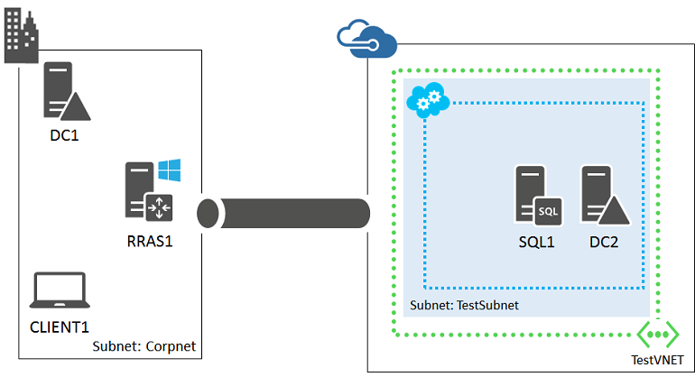

<properties 
	pageTitle="SharePoint 2013 场测试环境 |Azure" 
	description="学习如何在混合云环境中创建两层 SharePoint Server 2013 Intranet 场，以便进行开发或 IT 专业人员测试。" 
	services="virtual-network" 
	documentationCenter="" 
	authors="JoeDavies-MSFT" 
	manager="timlt" 
	editor=""
	tags="azure-service-management"/>

<tags
	ms.service="virtual-network"
	ms.date="03/28/2016"
	wacn.date="05/24/2016"/>

# 在混合云中设置用于测试的 SharePoint Intranet 场

> [AZURE.IMPORTANT]Azure 具有用于创建和处理资源的两个不同的部署模型：[资源管理器和经典](/documentation/articles/resource-manager-deployment-model)。本文介绍使用经典部署模型。Azure 建议大多数新部署使用资源管理器模型。
 

本主题将指导你逐步创建混合云环境，以便测试在 Azure 中托管的 Intranet SharePoint 场。这是生成的配置。

 
此配置将通过你在 Internet 上的位置模拟 Azure 生产环境中的 SharePoint。它包括：

- 简化的本地网络（Corpnet 子网）。
- 在 Azure 中托管的跨界虚拟网络 (TestVNET)。
- 站点到站点 VPN 连接。
- 两层 SharePoint 场和 TestVNET 虚拟网络中的辅助域控制器。

此配置提供了基础和通用的起始点，你可以据此执行以下操作：

- 开发和测试混合云环境中 SharePoint Intranet 场上的应用程序。
- 对这个基于混合云的 IT 工作负载进行测试。

设置此混合云测试环境需要完成以下三个主要阶段：

1.	设置用于测试的混合云环境。
2.	配置 SQL Server 计算机 (SQL1)。
3.	配置 SharePoint Server (SP1)。

如果你还没有 Azure 订阅，可以通过[试用 Azure](/pricing/1rmb-trial/) 注册试用版。

## 阶段 1：设置混合云环境

使用[设置用于测试的混合云环境](/documentation/articles/virtual-networks-setup-hybrid-cloud-environment-testing)主题中的说明。由于此测试环境不需要 Corpnet 子网上存在 APP1 服务器，因此现在即可将其关闭。

这是你当前的配置。

> [AZURE.NOTE] 就阶段 1 来说，你也可以设置模拟混合云测试环境。有关说明，请参阅[设置用于测试的模拟混合云环境](/documentation/articles/virtual-networks-setup-simulated-hybrid-cloud-environment-testing)。
 
## 阶段 2：配置 SQL Server 计算机 (SQL1)

从 Azure 管理门户中，启动 DC2 计算机（如果需要）。

首先，使用 CORP\\User1 凭据创建到 DC2 的远程桌面连接。

接下来，创建一个 SharePoint 场管理员帐户。打开 DC2 上的管理员级 Windows PowerShell 提示符，然后运行此命令。

	New-ADUser -SamAccountName SPFarmAdmin -AccountPassword (read-host "Set user password" -assecurestring) -name "SPFarmAdmin" -enabled $true -ChangePasswordAtLogon $false

当系统提示你提供 SPFarmAdmin 帐户密码时，键入一个强密码，并将其记录在安全位置。

接下来，在本地计算机上的 Azure PowerShell 命令提示符下使用以下命令创建适用于 SQL1 的 Azure 虚拟机。

	$storageacct="<Name of the storage account for your TestVNET virtual network>"
	$ServiceName="<The cloud service name for your TestVNET virtual network>"
	$cred1=Get-Credential -Message "Type the name and password of the local administrator account for SQL1."
	$cred2=Get-Credential -UserName "CORP\User1" -Message "Now type the password for the CORP\User1 account."
	Set-AzureStorageAccount -StorageAccountName $storageacct
	$image= Get-AzureVMImage | where { $_.ImageFamily -eq "SQL Server 2014 RTM Standard on Windows Server 2012 R2" } | sort PublishedDate -Descending | select -ExpandProperty ImageName -First 1
	$vm1=New-AzureVMConfig -Name SQL1 -InstanceSize Large -ImageName $image
	$vm1 | Add-AzureProvisioningConfig -AdminUsername $cred1.GetNetworkCredential().Username -Password $cred1.GetNetworkCredential().Password -WindowsDomain -Domain "CORP" -DomainUserName "User1" -DomainPassword $cred2.GetNetworkCredential().Password -JoinDomain "corp.contoso.com"
	$vm1 | Set-AzureSubnet -SubnetNames TestSubnet
	$vm1 | Add-AzureDataDisk -CreateNew -DiskSizeInGB 100 -DiskLabel SQLFiles -LUN 0 -HostCaching None
	New-AzureVM -ServiceName $ServiceName -VMs $vm1 -VNetName TestVNET

接下来，*使用本地管理员帐户*连接到新的 SQL1 虚拟机。

1.	在 Azure 管理门户的左窗格中，单击“虚拟机”，然后单击 SQL1 的“状态”列中的“正在运行”。
2.	在任务栏中，单击“连接”。 
3.	当系统提示你打开 SQL1.rdp 时，单击“打开”。
4.	遇到远程桌面连接消息框提示时，单击“连接”。
5.	当系统提示你输入凭据时，请使用以下凭据：
	- 名称：**SQL1\**[本地管理员帐户名称]
	- 密码：[本地管理员帐户密码]
6.	当系统使用引用证书的远程桌面连接消息框提示你时，单击“是”。

接下来，请配置 Windows 防火墙规则，允许进行基本的连接测试所需的以及 SQL Server 所需的通信。在 SQL1 上管理员级 Windows PowerShell 命令提示符下运行这些命令。

	New-NetFirewallRule -DisplayName "SQL Server" -Direction Inbound -Protocol TCP -LocalPort 1433,1434,5022 -Action allow 
	Set-NetFirewallRule -DisplayName "File and Printer Sharing (Echo Request - ICMPv4-In)" -enabled True
	ping dc1.corp.contoso.com

使用 ping 命令时，会从 IP 地址 10.0.0.1 传回四个成功的答复。

接下来，将额外的数据磁盘添加为驱动器盘符为 F: 的新卷。

1.	在服务器管理器的左窗格中，单击**“文件和存储服务”**，然后单击**“磁盘”**。
2.	在内容窗格的“磁盘”组中，单击“磁盘 2”（其“分区”设置为“未知”）。
3.	单击**“任务”**，然后单击**“新建卷”**。
4.	在新建卷向导的“开始之前”页上，单击**“下一步”**。
5.	在“选择服务器和磁盘”页上，单击“磁盘 2”，然后单击“下一步”。出现提示时，单击“确定”。
6.	在“指定卷的大小”页上，单击**“下一步”**。
7.	在“分配到驱动器号或文件夹”页上，单击**“下一步”**。
8.	在“选择文件系统设置”页上，单击**“下一步”**。
9.	在“确认选择”页上，单击**“创建”**。
10.	完成后，单击**“关闭”**。

在 SQL1 上的 Windows PowerShell 命令提示符处运行以下命令：

	md f:\Data
	md f:\Log
	md f:\Backup

接下来对 SQL Server 2014 进行配置，以便将 F: 驱动器用于新的数据库和用户帐户权限。

1.	在“开始”屏幕中，键入“SQL Server 管理”，然后单击“SQL Server 2014 Management Studio”。
2.	在**“连接到服务器”**中，单击**“连接”**。
3.	在“对象资源管理器”树窗格中，右键单击“SQL1”，然后单击“属性”。
4.	在“服务器属性”窗口中，单击“数据库设置”。
5.	找到“数据库默认位置”，然后设置以下值： 
	- 对于“数据”，请键入路径 **f:\\Data**。
	- 对于“日志”，请键入路径 **f:\\Log**。
	- 对于“备份”，请键入路径 **f:\\Backup**。
	- 请注意，只有新数据库使用这些位置。
6.	单击“确定”以关闭该窗口。
7.	在“对象资源管理器”树窗格中，打开“安全性”。
8.	右键单击“登录名”，然后单击“新建登录名”。
9.	在“登录名”中，键入“CORP\\User1”。
10.	在“服务器角色”页上，单击“sysadmin”，然后单击“确定”。
11.	在“对象资源管理器”树窗格中，右键单击“登录名”，然后单击“新建登录名”。
12.	在“常规”页的“登录名”中，键入“CORP\\SPFarmAdmin”。
13.	在“服务器角色”页上，选择“dbcreator”，然后单击“确定”。
14.	关闭 Microsoft SQL Server Management Studio。

这是你当前的配置。

 
## 阶段 3：配置 SharePoint Server (SP1)

首先，在本地计算机上的 Azure PowerShell 命令提示符处使用以下命令创建适用于 SP1 的 Azure 虚拟机。

	$ServiceName="<The cloud service name for your TestVNET virtual network>"
	$cred1=Get-Credential -Message "Type the name and password of the local administrator account for SP1."
	$cred2=Get-Credential -UserName "CORP\User1" -Message "Now type the password for the CORP\User1 account."
	$image= Get-AzureVMImage | where { $_.Label -eq "SharePoint Server 2013 Trial" } | sort PublishedDate -Descending | select -ExpandProperty ImageName -First 1
	$vm1=New-AzureVMConfig -Name SP1 -InstanceSize Large -ImageName $image
	$vm1 | Add-AzureProvisioningConfig -AdminUsername $cred1.GetNetworkCredential().Username -Password $cred1.GetNetworkCredential().Password -WindowsDomain -Domain "CORP" -DomainUserName "User1" -DomainPassword $cred2.GetNetworkCredential().Password -JoinDomain "corp.contoso.com"
	$vm1 | Set-AzureSubnet -SubnetNames TestSubnet
	New-AzureVM -ServiceName $ServiceName -VMs $vm1 -VNetName TestVNET

接下来，使用 CORP\\User1 凭据连接到 SP1 虚拟机。

接下来，配置 Windows 防火墙规则，以允许进行基本的连接测试所需的流量。从 SP1 上的管理员级 Windows PowerShell 命令提示符处运行这些命令。

	Set-NetFirewallRule -DisplayName "File and Printer Sharing (Echo Request - ICMPv4-In)" -enabled True
	ping dc1.corp.contoso.com

使用 ping 命令时，会从 IP 地址 10.0.0.1 传回四个成功的答复。

接下来，为新的 SharePoint 场和默认工作站网站配置 SP1。

1.	在“开始”屏幕中，键入“SharePoint 2013 产品”，然后单击“SharePoint 2013 产品配置向导”。当系统询问你是否允许程序对计算机进行更改时，请单击**“是”**。
2.	在“欢迎使用 SharePoint 产品”页上，单击**“下一步”**。 
3.	在通知你某些服务可能需要在配置期间重新启动的对话框中，单击“是”。
4.	在“连接到服务器场”页上，单击“创建新的服务器场”，然后单击“下一步”。
5.	在“指定配置数据库设置”页上，在“数据库服务器”中键入 **sql1.corp.contoso.com**，在“用户名”中键入 **CORP\\SPFarmAdmin**，在“密码”中键入 SPFarmAdmin 帐户密码，然后单击“下一步”。
6.	在“指定场安全设置”页的“密码”和“确认密码”中都键入 **P@ssphrase**，然后单击“下一步”。
7.	在“配置 SharePoint 管理中心 Web 应用程序”页上，单击**“下一步”**。
8.	在“完成 SharePoint 产品配置向导”页上，单击“下一步”。SharePoint 产品配置向导可能需要几分钟才能完成。
9.	在“配置成功”页上，单击**“完成”**。完成操作后，Internet Explorer 在启动时会带有名为“初始场配置向导”的选项卡。
10.	在“帮助改进 SharePoint”对话框中，单击“否，我不想参加”，然后单击“确定”。
11.	遇到提示“你要如何配置你的 SharePoint 场?”时，单击“启动向导”。
12.	在“配置你的 SharePoint 场”页的“服务帐户”中，单击“使用现有托管帐户”。
13.	在“服务”中，清除除“状态服务”旁边的框以外的所有复选框，然后单击“下一步”。“正在处理”页可能会显示一段时间，然后才会完成相关操作。
14.	在“创建站点集”页的“标题和说明”的“标题”中键入“Contoso Corporation”，指定 URL **http://sp1**/，然后单击“确定”。“正在处理”页可能会显示一段时间，然后才会完成相关操作。此步骤将在 URL http://sp1 上创建工作组网站。
15.	在“这将完成场配置向导”页上，单击“完成”。Internet Explorer 选项卡将显示 SharePoint 2013 管理中心站点。
16.	使用 CORP\\User1 帐户凭据登录到 CLIENT1 计算机上，然后启动 Internet Explorer。
17.	在地址栏中，键入 **http://sp1/**，然后按 Enter。此时你会看到 Contoso Corporation 的 SharePoint 工作组网站。该站点可能需要一段时间才能呈现。

这是你当前的配置。

 
你在混合云环境中的 SharePoint Intranet 场现已准备好进行测试。

<!---HONumber=Mooncake_0307_2016-->