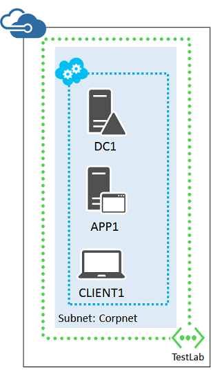
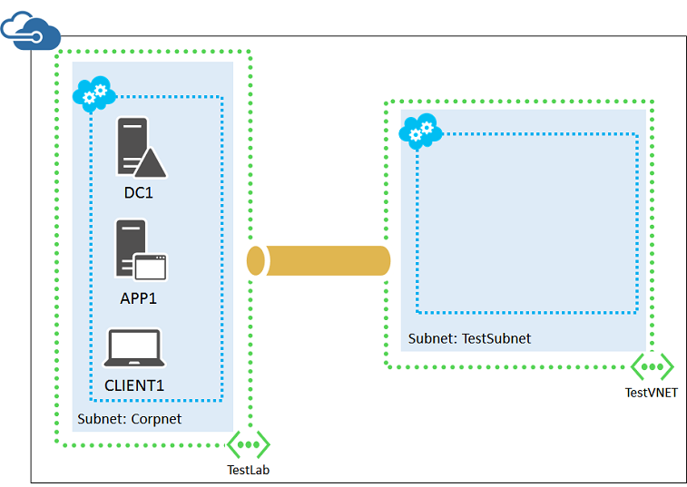

<properties 
	pageTitle="设置用于测试的模拟混合云环境" 
	description="了解如何使用两个 Azure 虚拟网络和 VNet 到 VNet 连接创建模拟的混合云环境，以便进行 IT 专业人员测试或开发测试。" 
	services="virtual-network" 
	documentationCenter="" 
	authors="JoeDavies-MSFT" 
	manager="timlt" 
	editor=""
	tags="azure-service-management"/>

<tags 
	ms.service="virtual-network" 
	ms.date="09/10/2015" 
	wacn.date="11/02/2015"/>

# 设置用于测试的模拟混合云环境

本主题将指导你逐步使用 Windows Azure 创建模拟混合云环境，以便使用两个独立的 Azure 虚拟网络进行测试。当你没有直接的 Internet 连接和可用的公共 IP 地址时，可使用此配置作为[设置用于测试的混合云环境](/documentation/articles/virtual-networks-setup-hybrid-cloud-environment-testing)的替代方法。这是生成的配置。

该配置模拟混合云生产环境。它包括：

- 在 Azure 虚拟网络（TestLab 虚拟网络）中托管的一种模拟和简化的本地网络。
- 在 Azure 中托管的一种模拟跨界虚拟网络 (TestVNET)。
- 两个虚拟网络之间的 VNet 到 VNet 连接。
- TestVNET 虚拟网络中的辅助域控制器。

这提供了基础和通用的起始点，你可以据此执行以下操作：

- 在模拟混合云环境中开发和测试应用程序。
- 创建一部分位于 TestLab 虚拟网络中，一部分位于 TestVNET 虚拟网络中的计算机的测试配置，以便模拟基于混合云的 IT 工作负载。

设置此混合云测试环境需要完成以下四个主要阶段：

1.	配置 TestLab 虚拟网络。
2.	创建跨界虚拟网络。
3.	创建 VNet 到 VNet 的 VPN 连接。
4.	配置 DC2。 

如果你还没有 Azure 订阅，可以在[试用 Azure](/pricing/1rmb-trial/) 中注册一个免费试用版。

>[AZURE.NOTE] Azure 中的虚拟机和虚拟网关在运行时会持续产生货币成本。此成本是针对你的免费试用版本、MSDN 订阅或付费订阅的。若要在不使用的情况下降低运行此测试环境的成本，请参阅本主题中的[最大程度地降低此环境的持续使用成本](#costs)，了解详细信息。

## 阶段 1：配置 TestLab 虚拟网络

按照[基本配置测试环境](/documentation/articles/virtual-machines-base-configuration-test-environment)中的说明，在名为 TestLab 的 Azure 虚拟网络中配置 DC1、APP1 和 CLIENT1 计算机。

在本地计算机上的 Azure 管理门户中，使用 CORP\\User1 凭据连接到 DC1。若要配置 CORP 域，以便计算机和用户使用其本地域控制器进行身份验证，请从管理员级 Windows PowerShell 命令提示符运行这些命令。

	New-ADReplicationSite -Name "TestLab" 
	New-ADReplicationSite -Name "TestVNET"
	New-ADReplicationSubnet -Name "10.0.0.0/8" -Site "TestLab"
	New-ADReplicationSubnet -Name "192.168.0.0/16" -Site "TestVNET"

这是你当前的配置。

 
## 阶段 2：创建 TestVNET 虚拟网络

首先，创建名为 TestVNET 的全新虚拟网络。

1.	在 Azure 管理门户的任务栏中，单击“新建”>“网络服务”>“虚拟网络”>“自定义创建”。
2.	在“虚拟网络详细信息”页的“名称”中键入“TestVNET”。
3.	在“位置”中，选择相应的位置。
4.	单击“下一步”箭头。
5.	在“DNS 服务器和 VPN 连接”页的“DNS 服务器”的“选择或输入名称”中键入“DC1”，然后单击“下一步”箭头。
6.	在“虚拟网络地址空间”页上执行以下操作：
	- 在“地址空间”的“起始 IP”中，选择或键入“192.168.0.0”。
	- 在“子网”中单击“子网 1”，然后将名称替换为“TestSubnet”。 
	- 在 TestSubnet 的“CIDR (地址计数)”列中，单击“/24 (256)”。
7.	单击“完成”图标。请等到虚拟网络创建完以后再继续。

接下来，请按[如何安装和配置 Azure PowerShell](/documentation/articles/powershell-install-configure) 中的说明在本地计算机上安装 Azure PowerShell。

接下来，请为 TestVNET 虚拟网络创建新的云服务。你必须选取一个唯一的名称。例如，你可将其命名为 **TestVNET-***UniqueSequence*，其中 *UniqueSequence* 是你组织的缩写。例如，如果你组织的名称为 Tailspin Toys，则可以将云服务命名为 **TestVNET-Tailspin**。

在本地计算机上，你可以使用此 Azure PowerShell 命令测试该名称的唯一性。

	Test-AzureName -Service <Proposed cloud service name>

如果此命令返回“False”，则你建议的名称是唯一的。使用此命令创建云服务。

	New-AzureService -Service <Unique cloud service name> -Location "<Same location name as your virtual network>"

这是你当前的配置。

 
##阶段 3：创建 VNet 到 VNet 连接

首先，你将创建表示每个虚拟网络的地址空间的本地网络。

1.	从本地计算机上的 Azure 管理门户中，单击“新建”>“网络服务”>“虚拟网络”>“添加本地网络”。
2.	在“指定你的本地网络详细信息”页上，在“名称”中键入“TestLabLNet”，在“VPN 设备 IP 地址”中键入“131.107.0.1”，然后单击右箭头。
3.	在“指定地址空间”页的“起始 IP”中，键入“10.0.0.0”。
4.	在“CIDR (地址计数)”中，选择“/24 (256)”，然后单击复选标记。
5.	单击“新建”>“网络服务”>“虚拟网络”>“添加本地网络”。
6.	在“指定你的本地网络详细信息”页上，在“名称”中键入“TestVNETLNet”，在“VPN 设备 IP 地址”中键入“131.107.0.2”，然后单击右箭头。
7.	在“指定地址空间”页的“起始 IP”中，键入“192.168.0.0”。
8.	在“CIDR (地址计数)”中，选择“/24 (256)”，然后单击复选标记。

请注意，在你为两个虚拟网络配置网关之前，VPN 设备 IP 地址 131.107.0.1 和 131.107.0.2 只是临时占位符值。

接下来，你需要将每个虚拟网络配置为使用站点到站点 VPN 连接，并配置与其他虚拟网络对应的本地网络。

1.	在本地计算机上的 Azure 管理门户中，单击左窗格中的“网络”，然后验证 TestLab 的“状态”列是否已设置为“已创建”。
2.	单击“TestLab”，然后单击“配置”。在“TestLab”页的“站点到站点连接”部分中，单击“连接到本地网络”。 
3.	在“本地网络”中，选择“TestVNETLNet”。
4.	在任务栏中单击“保存”。在某些情况下，你可能需要单击“添加网关子网”来创建 Azure VPN 网关所用的子网。
5.	单击左窗格中的“网络”，然后验证 TestVNET 的“状态”列是否已设置为“已创建”。
6.	单击“TestVNET”，然后单击“配置”。在“TestVNET”页的“站点到站点连接”部分中，单击“连接到本地网络”。 
7.	在“本地网络”中，选择“TestLabLNet”。
8.	在任务栏中单击“保存”。在某些情况下，你可能需要单击“添加网关子网”来创建 Azure VPN 网关所用的子网。

接下来，你将创建两个虚拟网络的虚拟网络网关。

1.	在 Azure 管理门户的“网络”页上，单击“TestLab”。在“仪表板”页上，你会看到状态“未创建网关”。
2.	在任务栏中，单击“创建网关”，然后单击“动态路由”。出现提示时单击“是”。请一直等到网关完成且其状态更改为“正在连接”。这可能需要几分钟的时间。
3.	记下“仪表板”页中的“网关 IP 地址”。这是 TestLab 虚拟网络的 Azure VPN 网关的公共 IP 地址。记录此 IP 地址，因为你将需要此地址来配置 VNet 到 VNet 连接。
4.	在任务栏中，单击“管理密钥”，然后单击密钥旁边的复制图标，将密钥复制到剪贴板中。将此密钥粘贴到文档中并进行保存。你需要此密钥值来配置 VNet 到 VNet 连接。
5.	在“网络”页上，单击“TestVNET”。在“仪表板”页上，你会看到状态“未创建网关”。
6.	在任务栏中，单击“创建网关”，然后单击“动态路由”。出现提示时单击“是”。请一直等到网关完成且其状态更改为“正在连接”。这可能需要几分钟的时间。
7.	记下“仪表板”页中的“网关 IP 地址”。这是 TestVNET 虚拟网络的 Azure VPN 网关的公共 IP 地址。记录此 IP 地址，因为你将需要此地址来配置 VNet 到 VNet 连接。

接下来，你将使用在创建虚拟网络网关的过程中获得的公共 IP 地址配置 TestLabLNet 和 TestVNETLNet 本地网络。

1.	在 Azure 管理门户的“网络”页上，单击“本地网络”。 
2.	在任务栏中单击“TestLabLNet”，然后单击“编辑”。
3.	在“指定你的本地网络详细信息”页的“VPN 设备 IP 地址(可选)”中键入 TestLab 虚拟网络的虚拟网络网关的 IP 地址（来自前述过程中的步骤 3），然后单击右箭头。
4.	在“指定地址空间”页上，单击复选标记。
5.	在“本地网络”页的任务栏中，单击“TestVNETLNet”，然后单击“编辑”。
6.	在“指定你的本地网络详细信息”页的“VPN 设备 IP 地址(可选)”中键入 TestVNET 虚拟网络的虚拟网络网关的 IP 地址（来自前述过程中的步骤 7），然后单击右箭头。
7.	在“指定地址空间”页上，单击复选标记。

接下来你将配置预共享的密钥，以便两个网关使用同一值，即 Azure 管理门户为 TestLab 虚拟网络确定的密钥值。在本地计算机上的 Azure PowerShell 命令提示符处运行这些命令，填充 TestLab 预共享密钥的值。

	$preSharedKey="<The preshared key for the TestLab virtual network>"
	Set-AzureVNetGatewayKey -VNetName TestVNET -LocalNetworkSiteName TestLabLNet -SharedKey $preSharedKey

接下来，在本地计算机的 Azure 管理门户的“网络”页上，依次单击任务栏中的“TestLab”虚拟网络、“仪表板”、“连接”。等待，直到 TestLab 虚拟网络显示状态为“已连接”。

这是你当前的配置。

 
## 阶段 4：配置 DC2

首先，创建适用于 DC2 的 Azure 虚拟机。在本地计算机的 Azure PowerShell 命令提示符处运行这些命令。

	$ServiceName="<Your cloud service name from Phase 2>"
	$cred=Get-Credential -Message "Type the name and password of the local administrator account for DC2."
	$image = Get-AzureVMImage | where { $_.ImageFamily -eq "Windows Server 2012 R2 Datacenter" } | sort PublishedDate -Descending | select -ExpandProperty ImageName -First 1
	$vm1=New-AzureVMConfig -Name DC2 -InstanceSize Medium -ImageName $image
	$vm1 | Add-AzureProvisioningConfig -Windows -AdminUsername $cred.GetNetworkCredential().Username -Password $cred.GetNetworkCredential().Password
	$vm1 | Set-AzureSubnet -SubnetNames TestSubnet
	$vm1 | Set-AzureStaticVNetIP -IPAddress 192.168.0.4
	$vm1 | Add-AzureDataDisk -CreateNew -DiskSizeInGB 20 -DiskLabel ADFiles -LUN 0 -HostCaching None
	New-AzureVM -ServiceName $ServiceName -VMs $vm1 -VNetName TestVNET

接下来，登录到新的 DC2 虚拟机上。

1.	在 Azure 管理门户的左窗格中，单击“虚拟机”，然后单击 DC2 的“状态”列中的“正在运行”。
2.	在任务栏中，单击“连接”。 
3.	当系统提示你打开 DC2.rdp 时，单击“打开”。
4.	遇到远程桌面连接消息框提示时，单击“连接”。
5.	当系统提示你输入凭据时，请使用以下凭据：
- 名称：**DC2\**[本地管理员帐户名称]
- 密码：[本地管理员帐户密码]
6.	当系统使用引用证书的远程桌面连接消息框提示你时，单击“是”。

接下来，配置 Windows 防火墙规则，以允许进行基本的连接测试所需的流量。在 DC2 上的管理员级 Windows PowerShell 命令提示符下运行这些命令。

	Set-NetFirewallRule -DisplayName "File and Printer Sharing (Echo Request - ICMPv4-In)" -enabled True
	ping dc1.corp.contoso.com

使用 ping 命令时，会从 IP 地址 10.0.0.4 传回四个成功的答复。这是对 Vnet 到 Vnet 连接的流量测试。

接下来，将额外的数据磁盘添加为驱动器盘符为 F: 的新卷。

1.	在服务器管理器的左窗格中，单击**“文件和存储服务”**，然后单击**“磁盘”**。
2.	在内容窗格的“磁盘”组中，单击“磁盘 2”（其“分区”设置为“未知”）。
3.	单击**“任务”**，然后单击**“新建卷”**。
4.	在新建卷向导的“开始之前”页上，单击**“下一步”**。
5.	在“选择服务器和磁盘”页上，单击“磁盘 2”，然后单击“下一步”。出现提示时，单击“确定”。
6.	在“指定卷的大小”页上，单击**“下一步”**。
7.	在“分配到驱动器号或文件夹”页上，单击**“下一步”**。
8.	在“选择文件系统设置”页上，单击**“下一步”**。
9.	在“确认选择”页上，单击**“创建”**。
10.	完成后，单击**“关闭”**。

接下来，将 DC2 配置为 corp.contoso.com 域的副本域控制器。在 DC2 上的 Windows PowerShell 命令提示符下运行这些命令。

	Install-WindowsFeature AD-Domain-Services -IncludeManagementTools
	Install-ADDSDomainController -Credential (Get-Credential CORP\User1) -DomainName "corp.contoso.com" -InstallDns:$true -DatabasePath "F:\NTDS" -LogPath "F:\Logs" -SysvolPath "F:\SYSVOL"

请注意，系统会提示你输入 CORP\\User1 密码和目录服务还原模式 (DSRM) 密码，然后重新启动 DC2。

由于 TestVNET 虚拟网络有自己的 DNS 服务器 (DC2)，因此必须将 TestVNET 虚拟网络配置为使用此 DNS 服务器。

1.	在 Azure 管理门户的左窗格中，单击“网络”，然后单击“TestVNET”。
2.	单击**“配置”**。
3.	在“DNS 服务器”中，删除“10.0.0.4”条目。
4.	在“DNS 服务器”中添加一个条目，该条目使用“DC2”作为名称，使用“192.168.0.4”作为 IP 地址。 
5.	在底部的命令栏中，单击“保存”，然后在出现提示时单击“是”。等待，直到已完成对 TestVNet 网络的更新。

这是你当前的配置。

 
现在，你的模拟混合云环境已准备好进行测试。

你还可以在此测试环境中生成以下配置：

- [SharePoint Intranet 场](/documentation/articles/virtual-networks-setup-sharepoint-hybrid-cloud-testing)
- [基于 Web 的 LOB 应用程序](/documentation/articles/virtual-networks-setup-lobapp-hybrid-cloud-testing)
- [Office 365 目录同步 (DirSync) 服务器](/documentation/articles/virtual-networks-setup-dirsync-hybrid-cloud-testing)

## 其他资源

[设置用于测试的混合云环境](/documentation/articles/virtual-networks-setup-hybrid-cloud-environment-testing)

[配置 VNet 到 VNet 连接](/documentation/articles/virtual-networks-configure-vnet-to-vnet-connection)

[基本配置测试环境](/documentation/articles/virtual-machines-base-configuration-test-environment)

[Azure 混合云测试环境](/documentation/articles/virtual-machines-hybrid-cloud-test-environments)

[Azure 基础结构服务实施准则](/documentation/articles/virtual-machines-infrastructure-services-implementation-guidelines)

## 最大程度地降低此环境的持续使用成本

若要将在此环境中运行虚拟机的成本降到最低，请尽快执行所需的测试和演示，然后删除它们或关闭虚拟机（在不使用时进行）。例如，你可以在每个营业日结束时使用 Azure 自动化和 Runbook 来自动关闭 TestLab 和 Test\_VNET 虚拟网络中的虚拟机。有关详细信息，请参阅 [Azure 自动化入门](/documentation/articles/automation-create-runbook-from-samples)。当你在 Corpnet 子网上再次启动虚拟机时，请先启动 DC1。

在实施时，Azure VPN 网关将由两台 Azure 虚拟机组成，因此会产生持续的货币成本。有关详细信息，请参阅[定价 - 虚拟网络](/home/features/networking/#home_net_pri)。若要将这两个 VPN 网关（一个用于 TestLab，一个用于 TestVNET）的成本降到最低，请创建测试环境并尽快执行所需测试和演示，或者通过这些步骤删除该网关。
 
1.	在本地计算机上的 Azure 管理门户中，依次单击左窗格中的“网络”、“TestLab”、“仪表板”。
2.	在任务栏中，单击“删除网关”。出现提示时单击“是”。等待，直到网关删除完毕且其状态更改为“未创建网关”。
3.	依次单击左窗格中的“网络”、“TestVNET”、“仪表板”。
4.	在任务栏中，单击“删除网关”。出现提示时单击“是”。等待，直到网关删除完毕且其状态更改为“未创建网关”。

如果你删除网关后又想要还原此测试环境，则必须先创建新的网关。

1.	在本地计算机上的 Azure 管理门户中，单击左窗格中的“网络”，然后单击“TestLab”。在“仪表板”页上，你会看到状态“未创建网关”。
2.	在任务栏中，单击“创建网关”，然后单击“动态路由”。出现提示时单击“是”。请一直等到网关完成且其状态更改为“正在连接”。这可能需要几分钟的时间。
3.	记下“仪表板”页中的“网关 IP 地址”。这是 TestLab 虚拟网络的 Azure VPN 网关的全新公共 IP 地址。你需要此 IP 地址来重新配置 TestLabLNet 本地网络。
4.	在任务栏中，单击“管理密钥”，然后单击密钥旁边的复制图标，将密钥复制到剪贴板中。将此密钥值粘贴到文档中并进行保存。你需要此密钥值来重新配置 TestVNET 虚拟网络的 VPN 网关。
5.	从本地计算机上的 Azure 管理门户中，单击左窗格中的“网络”，然后单击“TestVNET”。在“仪表板”页上，你会看到状态“未创建网关”。
6.	在任务栏中，单击“创建网关”，然后单击“动态路由”。出现提示时单击“是”。请一直等到网关完成且其状态更改为“正在连接”。这可能需要几分钟的时间。
7.	记下“仪表板”页中的“网关 IP 地址”。这是 TestVNET 虚拟网络的 Azure VPN 网关的全新公共 IP 地址。你需要此 IP 地址来重新配置 TestVNETLNet 本地网络。

接下来，你将使用在创建虚拟网络网关的过程中获得的全新公共 IP 地址配置 TestLabLNet 和 TestVNETLNet 本地网络。

1.	在 Azure 管理门户的“网络”页上，单击“本地网络”。 
2.	在任务栏中单击“TestLabLNet”，然后单击“编辑”。
3.	在“指定你的本地网络详细信息”页的“VPN 设备 IP 地址(可选)”中键入 TestLab 虚拟网络的虚拟网络网关的 IP 地址（来自前述过程中的步骤 3），然后单击右箭头。
4.	在“指定地址空间”页上，单击复选标记。
5.	在“本地网络”页的任务栏中，单击“TestVNETLNet”，然后单击“编辑”。
6.	在“指定你的本地网络详细信息”页的“VPN 设备 IP 地址(可选)”中键入 TestVNET 虚拟网络的虚拟网络网关的 IP 地址（来自前述过程中的步骤 7），然后单击右箭头。
7.	在“指定地址空间”页上，单击复选标记。

接下来你将配置预共享的密钥，以便两个网关使用同一值，即 Azure 管理门户为 TestLab 虚拟网络确定的密钥值。在本地计算机上的 Azure PowerShell 命令提示符处运行这些命令，填充 TestLab 预共享密钥的值。

	$preSharedKey="<The preshared key for the TestLab virtual network>"
	Set-AzureVNetGatewayKey -VNetName TestVNET -LocalNetworkSiteName TestLabLNet -SharedKey $preSharedKey

接下来，在 Azure 管理门户的“网络”页上，单击任务栏中的“TestLab”虚拟网络，然后单击“连接”。等待，直到 TestLab 虚拟网络显示状态为“已连接”，即已连接到 TestVNET 本地网络。

<!---HONumber=76-->