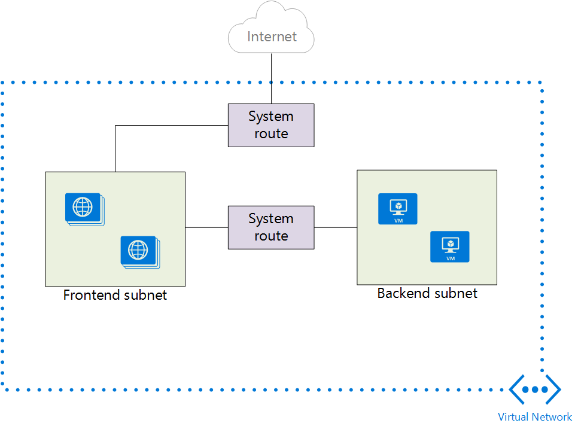
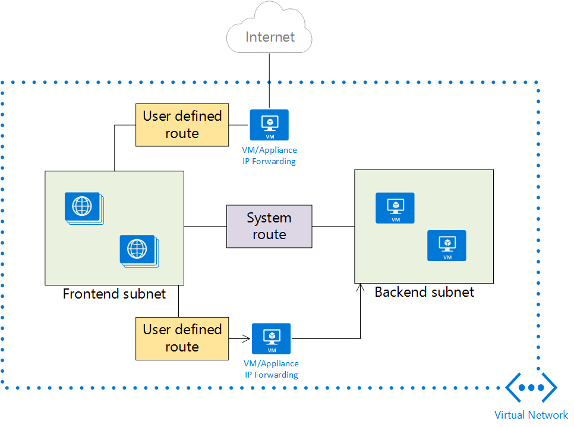

<properties 
   pageTitle="用户定义的路由和 IP 转发概述"
   description="了解 UDR 和 IP 转发"
   services="virtual-network"
   documentationCenter="na"
   authors="telmosampaio"
   manager="carmonm"
   editor="tysonn" />
<tags
	ms.service="virtual-network"
	ms.date="12/11/2015"
	wacn.date=""/>

# 用户定义的路由和 IP 转发
将虚拟机 (VM) 添加到 Azure 中的虚拟网络 (VNet) 时，你会注意到，VM 可以与其他 VM 通过网络自动通信。你不需要指定网关，即使这些 VM 位于不同子网中。存在从 Azure 到你自己的数据中心的混合连接时，这同样适用于从 VM 到公共 Internet 甚至到本地网络的通信。

之所以允许这种通信流，是因为 Azure 使用一系列系统路由来定义 IP 流量的流动方式。系统路由通过以下方案来控制通信流：

- 从同一子网内。
- 在 VNet 中从一个子网到另一个子网。
- 从 VM 到 Internet。
- 通过 VPN 网关从一个 VNet 到另一个 VNet。
- 通过 VPN 网关从 VNet 到本地网络。

下图显示了通过一个 VNet、两个子网、数个 VM 以及允许 IP 通信流动的系统路由完成的简单设置。

尽管使用系统路由可以自动加快通信以方便部署，但在某些情况下，你需要通过虚拟设备来控制数据包的路由。为此，你可以创建用户定义的路由来指定下一跃点，方便数据包流向特定的子网并转到你的虚拟设备，并可为作为虚拟设备运行的 VM 启用 IP 转发。

下图显示用户定义的路由，以及用于强制将数据包发送到一个子网从另一个用于遍历虚拟设备上的第三个的子网 IP 转发的示例。

>[AZURE.IMPORTANT]用户定义的路由将仅应用于保留一个子网的流量。例如，无法创建路由以指定如何流量来自子网到 Internet。此外，你都将通信转发到该设备不能为流量出自的同一子网。始终为你的设备单独创建子网。

## 路由
数据包将根据在物理网络的每个节点上定义的路由表经 TCP/IP 网络进行路由。路由表是各个路由的集合，用于确定如何根据目标 IP 地址来转发数据包。路由由以下项组成：

- **地址前缀**。将路由应用到的目标 CIDR，例如 10.1.0.0/16。
- **下一跃点类型**。数据包应发送到的 Azure 跃点的类型。可能的值包括：
	- **本地**。表示本地虚拟网络。例如，如果你在同一虚拟网络中有两个子网 10.1.0.0/16 和 10.2.0.0/16，则路由表中每个子网的路由的下一跃点值将为 *Local*。
	- **VPN 网关**。表示 Azure S2S VPN 网关。 
	- **Internet**。表示由 Azure 基础结构提供的默认 Internet 网关 
	- **虚拟设备**。表示已添加到 Azure 虚拟网络的虚拟设备。
	- **NULL**。表示黑洞。转发到黑洞的数据包根本就不会进行转发。
- **下一跃点值**。下一跃点值包含应将数据包转发到的 IP 地址。下一跃点值只允许在下一跃点类型为*虚拟设备* 的路由中使用。

## 系统路由
在虚拟网络中创建的每个子网都会自动与其中包含以下系统路由规则的路由表关联：

- **本地 VNet 规则**：将为虚拟网络中的每个子网自动创建此规则。它指定在 VNet 中的 VM 之间存在直接链接，其间没有下一跃点。
- **本地规则**：此规则适用于要发送到本地地址范围的所有流量，并使用 VPN 网关作为下一跃点目标。
- **Internet 规则**：此规则处理要发送到公共 Internet 的所有流量，并使用基础结构 Internet 网关作为要发送到 Internet 的所有流量的下一跃点。

## 用户定义路由
对于大多数环境，将仅需要已由 Azure 定义的系统路由。不过，你可能需要创建路由表并在特定情况下创建一个或多个路由，例如：

- 强制通过本地网络以隧道方式连接到 Internet。
- 在 Azure 环境中使用虚拟设备。

在上面的方案中，你将需要创建一个路由表并向其添加用户定义的路由。你可以有多个路由表，而同一个路由表则可与一个或多个子网相关联。每个子网只能与一个路由表相关联。子网中的所有 VM 和云服务都使用与该子网关联的路由表。

在将路由表关联到子网之前，子网依赖于系统路由。建立关联以后，将根据最长前缀匹配 （LPM） 在用户定义的路由和系统路由之间进行路由。如果有多个路由的 LPM 匹配情况相同，则按以下顺序根据路由源来选择路由：

1. 用户定义路由
1. BGP 路由（当使用 ExpressRoute 时）
1. 系统路由

若要了解如何创建用户定义路由，请参阅[如何在 Azure 中创建路由和启用 IP 转发](/documentation/articles/virtual-networks-udr-how-to#How-to-manage-routes)。

>[AZURE.IMPORTANT]用户定义路由仅适用于 Azure VM 和云服务。例如，如果你想要在本地网络和 Azure 之间添加防火墙虚拟设备，则需为 Azure 路由表创建用户定义路由，以便将目标为本地地址空间的所有流量转发到虚拟设备。但是，来自本地地址空间的传入流量将流经你的 VPN 网关或 ExpressRoute 线路，绕过虚拟设备直接进入 Azure 环境中。

## BGP 路由
如果在本地网络和 Azure 之间存在 ExpressRoute 连接，则可通过 BGP 将路由从本地网络传播到 Azure。在每个 Azure 子网中，这些 BGP 路由的使用方式与系统路由和用户定义路由相同。有关详细信息，请参阅 [ExpressRoute 简介](/documentation/articles/expressroute-introduction)。

>[AZURE.IMPORTANT]你可以将 Azure 环境配置为使用强制方式通过隧道来连接你的本地网络，即为子网 0.0.0.0/0 创建一个用户定义路由，而该子网则使用 VPN 网关作为下一跃点。但是，仅在使用 VPN 网关而非 ExpressRoute 的情况下，此方法才起作用。对于 ExpressRoute，强制隧道是通过 BGP 配置的。

## IP 转发
如上所述，之所以要创建用户定义路由，其中一个主要原因是为了将流量转发到虚拟设备。虚拟设备只是一个 VM，该 VM 所运行的应用程序用于通过某种方式（例如防火墙或 NAT 设备）处理网络流量。

此虚拟设备 VM 必须能够接收不发送给自身的传入流量。若要允许 VM 接收发送到其他目标的流量，必须为该 VM 启用 IP 转发。这是 Azure 设置，不是来宾操作系统中的设置。

## 后续步骤

- 了解如何[在资源管理器部署模型中创建路由](/documentation/articles/virtual-network-create-udr-arm-template)并将路由关联到子网。 
- 了解如何[在经典部署模型中创建路由](/documentation/articles/virtual-network-create-udr-classic-ps)并将路由关联到子网。

<!---HONumber=82-->