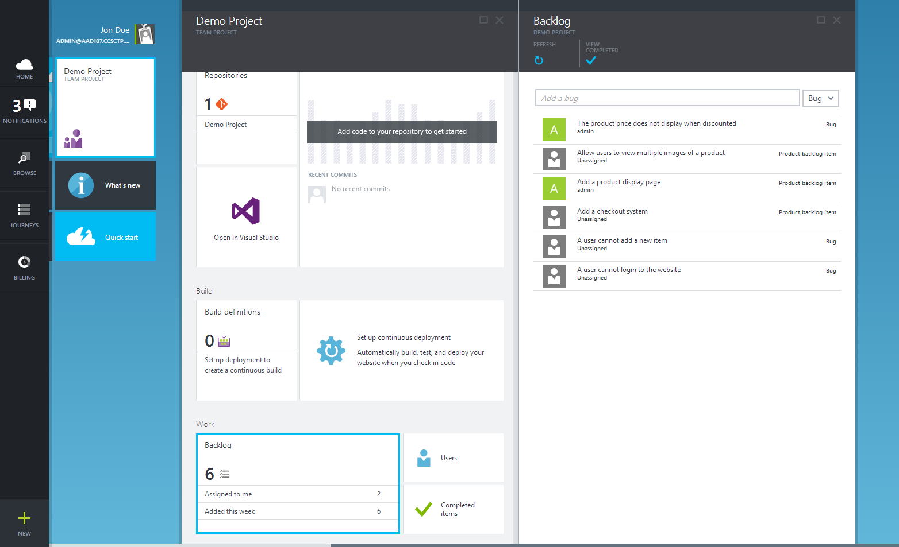
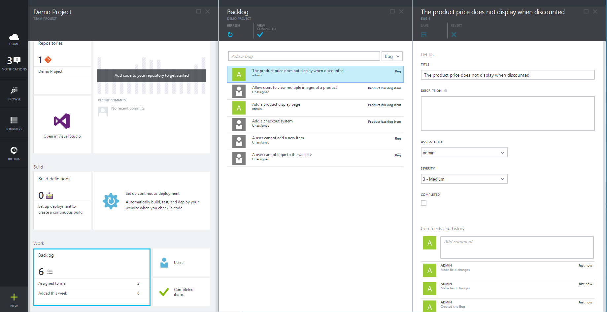
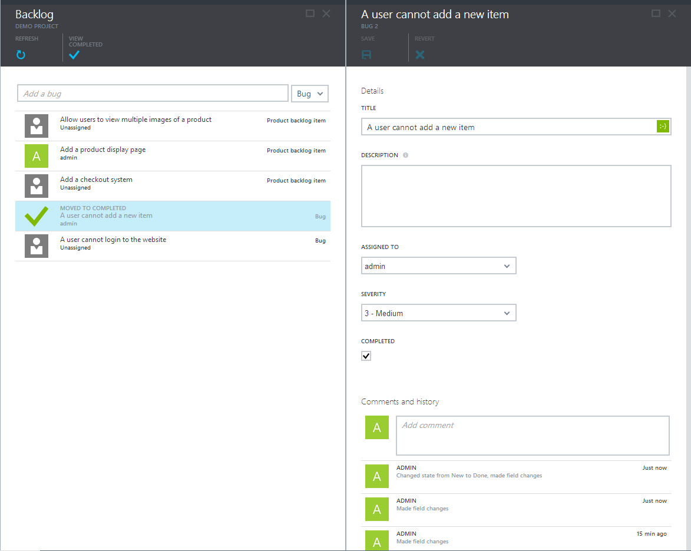
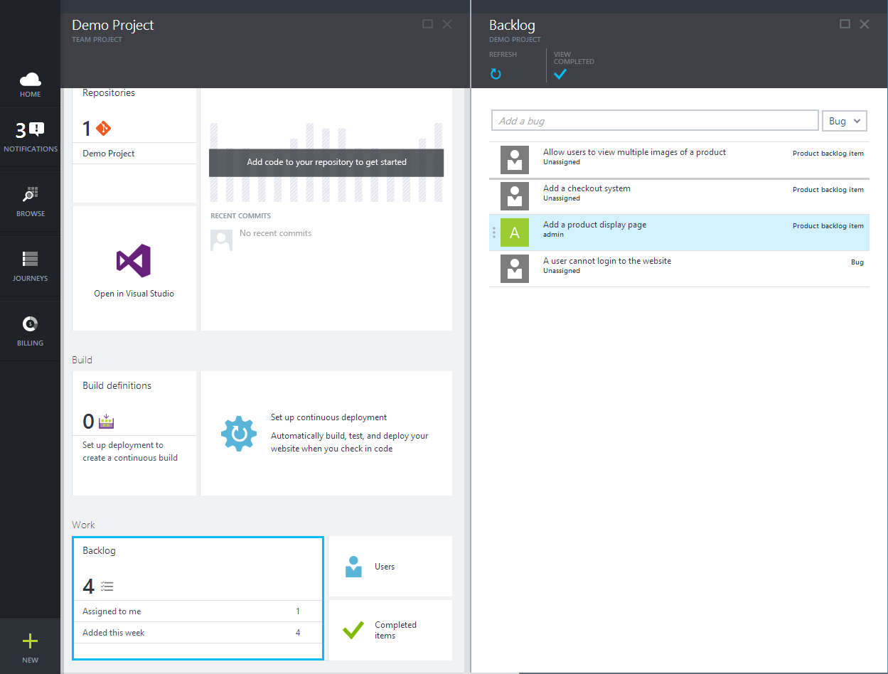
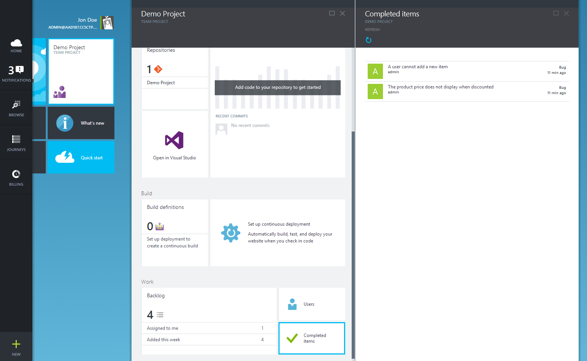

<properties linkid="" urlDisplayName="Tracking work for your website" pageTitle="Tracking work for your website | Azure" metaKeywords="Visual Studio Online, VSO, work, items, backlog" description="Learn how to track and manage work for your website." metaCanonical="" services="visual-studio-online" documentationCenter="" title="Tracking work for your website" authors="rmarron" solutions="" manager="" editor="" />
<tags ms.service="visual-studio-online"
    ms.date=""
    wacn.date="04/11/2015"
    />

# 跟踪你的网站的工作。
在本主题中，你将学习如何使用工作项跟踪工具来管理你的网站的工作。

## 目录
* <a href="#how-to-add-work-items-to-your-backlog">如何：将工作项添加到积压工作</a>
* <a href="#how-to-manage-your-backlog">如何：管理积压工作</a>
* <a href="#how-to-view-recently-completed-work">如何：查看最近完成的工作</a>

## 如何：将工作项添加到积压工作
1.  导航到团队项目叶片。

2.  在底部的&ldquo;工作&rdquo;小视窗内，单击积压工作部分。

	积压工作叶片将启动。你的积压工作包含用于网站的设置过优先级顺序的工作列表。

	

3.  通过在顶部的文本框中键入标题并按 Enter 键来添加项目。如果你使用的是 Scrum 处理模板，可选择添加一个 Bug 或是产品积压工作项，只需从右侧下拉列表中进行选择即可。

4.  单击该工作项以将其打开并添加其他详细信息。
	
	

5.  在工作项窗体中，你可以编辑标题、添加说明、给用户分配该工作项，以及将它标记为模板。
6.  在工作项窗体的底部，可以给该工作项添加备注并查看其历史记录。若要深入了解该工作项的历史记录，可以单击一项更改，然后就会打开一个叶片，显示已发生情况的其他详细信息。

## 如何：管理积压工作。
使积压工作的优先级顺序保持合理是成功管理网站工作的关键。做到这一点有两大注意事项：

### 工作项完成时将它移除
1.  打开要标记为完成的工作项。
2.  选中标为&ldquo;已完成&rdquo;的复选框。
3.  保存该工作项。
4.  此项的存根将保持在积压工作上，直至你刷新该积压工作，或者关闭并再次打开它。

	

### 使你的积压工作按优先级顺序排列
1.  让鼠标指针悬停于要更改其优先级的工作项上。
2.  单击该工作项左边的控制手柄栏。
3.  将该工作项拖放到其在积压工作中的新位置。

	

## 如何：查看最近完成的工作
1.  在团队项目叶片上，单击已完成项叶片。
2.  查看最近完成的工作的列表。

	