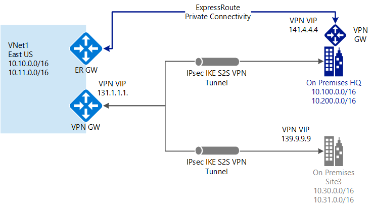

<properties 
   pageTitle="VPN 网关连接拓扑 | Azure"
   description="查看 VPN 网关连接拓扑，以及可用的配置工具和部署模型。"
   services="vpn-gateway"
   documentationCenter="na"
   authors="cherylmc"
   manager="carmonm"
   editor=""
   tags="azure-resource-manager,azure-service-management"/>
<tags 
   ms.service="vpn-gateway"
   ms.date="03/18/2016"
   wacn.date="05/09/2016" />

# Azure VPN 网关连接拓扑

本文介绍基准 VPN 网关连接拓扑。你可以使用图形和描述来帮助选择符合要求的配置拓扑。尽管本文旨在逐步说明主要基准拓扑，但你也可以使用这些示意图作为指导原则来构建更复杂的拓扑。

每个拓扑都包含一个表格，其中列出了拓扑适用的部署模型、可用于配置每个拓扑的部署工具，以及直接指向可用文章的链接。随着可用的新文章与部署工具的发布，我们会经常更新表格。

如需有关 VPN 网关的详细信息，请参阅 [About VPN Gateways（关于 VPN 网关）](/documentation/articles/vpn-gateway-about-vpngateways)。

## 站点到站点和多站点

站点到站点连接是通过 IPsec/IKE（IKEv1 或 IKEv2）VPN 隧道建立的连接。这种类型的连接需要 VPN 设备或本地 Windows Server RRAS。站点到站点连接可以用于跨界和混合配置。

**S2S 示意图**

如果你使用 Azure 基于路由的 VPN，可为本地网络创建并配置多个 S2S VPN 连接。这种配置通常称为“多站点”连接。
 

**多站点示意图**

**可用的部署模型和方法**

[AZURE.INCLUDE [vpn-gateway-table-site-to-site](../includes/vpn-gateway-table-site-to-site-include.md)]

## VNet 到 VNet

将虚拟网络连接到虚拟网络（VNet 到 VNet）非常类似于将 VNet 连接到本地站点位置。这两种连接类型都使用 Azure VPN 网关来提供使用 IPsec/IKE 的安全隧道。连接的 VNet 可位于不同的区域和不同的订阅中。你甚至可以将 VNet 到 VNet 通信与多站点配置组合使用。这样，便可以建立将跨界连接与虚拟网络间连接相结合的网络拓扑。

Azure 当前有两种部署模式：Azure 服务管理（称为经典）和 Azure Resource Manager。如果你已使用 Azure 一段时间，可能已拥有在经典 VNet 上运行的 Azure VM 和实例角色，但较新的 VM 和角色实例可能在以 ARM 创建的 VNet 上运行。即使虚拟网络位于不同的部署模型中，也可以在它们之间创建连接。

**VNet2VNet 示意图**

**可用的部署模型和方法**

[AZURE.INCLUDE [vpn-gateway-table-vnet-to-vnet](../includes/vpn-gateway-table-vnet-to-vnet-include.md)]

## 站点到站点和 ExpressRoute 的共存连接

ExpressRoute 可以从你的 WAN 与 Microsoft 服务（包括 Azure）直接建立专用连接，不需要通过公共 Internet。站点到站点 VPN 流量以加密方式通过公共 Internet 传输。能够为同一个虚拟网络配置站点到站点 VPN 和 ExpressRoute 连接具有诸多好处。你可以将站点到站点 VPN 配置为 ExpressRoute 的安全故障转移路径，或者使用站点到站点 VPN 连接到不属于你网络的一部分但却已通过 ExpressRoute 进行连接的站点。

**共存连接示意图**

**可用的部署模型和方法**

[AZURE.INCLUDE [vpn-gateway-table-coexist](../includes/vpn-gateway-table-coexist-include.md)]

## 点到站点

点到站点设置可让你从客户端计算机单独创建与虚拟网络的安全连接。可通过从客户端计算机启动连接来建立 VPN 连接。如果你要从远程位置（例如从家里或会议室）连接到 VNet，或者只有少数几个需要连接到虚拟网络的客户端，则点到站点连接是很有用的解决方案。

点到站点连接是基于 SSTP（安全套接字隧道协议）的 VPN 连接。点到站点连接不需要 VPN 设备或面向公众的 IP 地址即可运行。

**P2S 示意图**

**可用的部署模型和方法**

[AZURE.INCLUDE [vpn-gateway-table-point-to-site](../includes/vpn-gateway-table-point-to-site-include.md)]

## 后续步骤

在继续进行连接规划和设计之前，请先熟悉 [About VPN Gateways（关于 VPN 网关）](/documentation/articles/vpn-gateway-about-vpngateways)和 [VPN Gateway FAQ（VPN 网关常见问题）](/documentation/articles/vpn-gateway-vpn-faq)文章中的事项，以更好地了解 VPN 网关。

 

<!---HONumber=Mooncake_0425_2016-->
