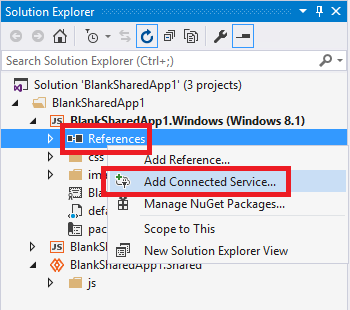

<properties 
   pageTitle="在 Visual Studio 中使用连接服务添加移动服务"
   description="使用 Visual Studio 的“添加连接服务”对话框添加移动服务"
   services="visual-studio-online"
   documentationCenter="na"
   authors="patshea123"
   manager="douge"
   editor="tlee" />
<tags 
   ms.service="visual-studio-online"
   ms.date="08/12/2015"
   wacn.date="10/3/2015"/>

# 使用 Visual Studio 连接服务添加移动服务

借助 Visual Studio 2015，您可以使用“添加连接服务”对话框连接到 Azure 移动服务。您可以从任何 C# 客户端应用、任何 JavaScript 应用或跨平台 Cordova 应用进行连接。连接后，您就可以创建并访问数据、创建自定义 API 和计划作业，或添加对推送通知的支持。连接服务操作将添加所有适当的引用和连接代码。您还可以利用内置支持，以便使用各种常用身份标识方案（例如，Azure AD、Facebook、Twitter 和 Microsoft 帐户）进行身份验证。

## 支持的项目类型

>[AZURE.NOTE]在 Visual Studio 2015 中，不支持使用“添加连接服务”对话框将 Azure 移动服务添加到 Windows 通用 (Windows 10) 项目。您可以通过使用 NuGet 程序包管理器为您的项目安装适当的程序包来添加 Azure 移动服务。

您可以在以下项目类型中使用“连接服务”对话框连接到 Azure 移动服务。

- .NET Windows 8.1 应用商店、手机和跨平台应用项目

- JavaScript Windows 8.1 应用商店、手机和跨平台应用项目

- 使用 Visual Studio Tools for Apache Cordova 创建的项目

## 使用“添加连接服务”对话框连接到 Azure 移动服务

1. 确保您具有 Azure 帐户。如果您没有 Azure 帐户，可以注册[免费试用版](http://go.microsoft.com/fwlink/?LinkId=518146)。

1. 打开“添加连接服务”对话框。
 - 对于 .NET 应用，在 Visual Studio 中打开您的项目、在解决方案资源管理器中打开“引用”节点的上下文菜单，然后选择“添加连接服务”。
 
        

 - 对于 Apache Cordova 应用项目，在 Visual Studio 中打开您的项目、在解决方案资源管理器中打开项目节点的上下文菜单，然后选择“添加连接服务”。

1. 在**“添加连接服务”**对话框中，选择“Azure 移动服务”，然后选择“配置”按钮。如果尚未登录到 Azure，系统可能会提示您登录。

    

1. 在“Azure 移动服务”对话框中，如果您现在拥有移动服务，请选择一个。如果您需要创建新的 Azure 移动服务，请按照下面的过程进行创建。否则，跳至下一步。

    若要创建新的移动服务帐户：1. 选择对话框底部的**“创建服务”**链接。

    2. 在“创建移动服务”对话框中，您可以选择 JavaScript 后端移动服务或从“运行时”下拉列表中选择 .NET 后端移动服务。 
  
        

        JavaScript 后端服务简单而且功能强大。如果您创建 JavaScript 后端移动服务，服务器端 JavaScript 代码存储在云中，但您可以使用服务器资源管理器或 Azure 管理门户编辑服务器脚本。

        .NET 后端移动服务为您提供 Web API 和实体框架的完整功能和灵活性。如果您创建 .NET 后端移动服务，会为您创建项目并将其添加到您的解决方案中。

    1. 选择您需要移动服务的“区域”，然后输入服务器的用户名和密码。
 
    1. 输入所需的所有信息后，选择“创建”按钮创建移动服务。
    2. 新的移动服务应出现在“Azure 移动服务”对话框上的服务列表中。在列表中选择新的移动服务，然后选择“添加”按钮将该服务添加到您的项目。
    

1. 查看显示的入门页，了解您的项目的修改情况。每次您添加连接服务时，浏览器中都会显示“入门”页。您可以查看建议的后续步骤和代码示例，或切换到“完成的操作”页以查看您的项目添加了哪些引用，以及代码和配置文件的修改情况。

1. 使用代码示例作为指导，开始编写代码来访问您的移动服务！

## 您的项目的修改情况

Visual Studio 如何修改您的项目取决于项目类型。对于 C# 客户端应用，请参阅[完成的操作 – C# 项目](http://go.microsoft.com/fwlink/p/?LinkId=513119)。对于 JavaScript 客户端应用，请参阅[完成的操作 – JavaScript 项目](http://go.microsoft.com/fwlink/p/?LinkId=513120)。对于 Cordova 应用，请参阅[完成的操作 – Cordova 项目](http://go.microsoft.com/fwlink/p/?LinkId=513116)。

##后续步骤

提出问题并获得帮助：

 - [MSDN 论坛：Azure 移动服务](https://social.msdn.microsoft.com/forums/azure/home?forum=azuremobile)

 - [Microsoft Azure 团队博客上的 Azure 移动服务](http://azure.microsoft.com/blog/topics/mobile/)

 - [azure.microsoft.com 上的 Azure 移动服务](http://azure.microsoft.com/services/mobile-services/)

 - [azure.microsoft.com 上的 Azure 移动服务文档](http://azure.microsoft.com/documentation/services/mobile-services/)

<!---HONumber=71-->