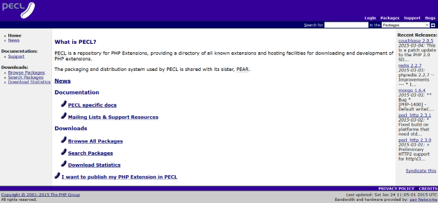
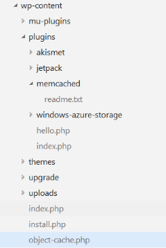

<properties
   pageTitle="通过 Memcache 协议将 Azure 网站中的 Web 应用连接到 Redis 缓存"
   description="使用 Memcache 协议将 Azure App Service 中的 Web 应用连接到 Redis 缓存"
   services="app-service\web"
   documentationCenter="php"
   authors="SyntaxC4"
   manager="wpickett"
   editor="riande"/>

<tags
   ms.service="app-service-web"
   ms.date="06/30/2015"
   wacn.date=""/>

# 通过 Memcache 协议将 Azure 网站中的 Web 应用连接到 Redis 缓存

在本文中，你将学习如何使用 [Memcache][13] 协议将 [Azure 网站](/documentation/services/web-sites/)中的 WordPress Web 应用连接到 [Azure Redis 缓存][12]。如果你的现有 Web 应用使用 Memcached 服务器作为内存中缓存，则你可以将其迁移到 Azure 网站，并使用 Microsoft Azure 中的第一方缓存解决方案，其中对你的应用程序代码进行少量更改或无更改。此外，你可以利用现有的 Memcache 专业知识，在使用 Azure Redis 缓存作为内存中缓存的 Azure 网站中创建高度可缩放的分布式应用，同时使用常用的应用程序框架，例如 .NET、PHP、Node.js、Java 和 Python。

Azure 网站使用 Web Apps Memcache 填充码启用该应用程序方案，这是充当 Memcache 代理服务器的本地 Memcached 服务器，用于缓存对 Azure Redis 缓存的调用。这使得使用 Memcache 协议通信的任何应用可以使用 Redis 缓存缓存数据。此 Memcache 填充码在协议级别运行，因此只要它使用 Memcached 协议通信，就可以供任何应用程序或应用程序框架使用。

## 先决条件

Web Apps Memcache 填充码可以与任何应用程序一起使用，前提是使用 Memcached 协议通信。就此特定示例来说，引用应用程序是一个可缩放的 WordPress 站点，它可以从 Azure 应用商店设置。

请按照以下文章中所述的步骤操作：

* [在 Azure 中部署可缩放的 WordPress 站点][0]
* [设置 Azure Redis Cache Service 的实例][1]
* [在 Azure 中部署可缩放的 WordPress 站点][0]

部署可缩放的 WordPress 站点并设置 Redis 缓存实例后，你随时可以启用 Azure 网站中的 Memcache 填充程序。

## 启用 Web Apps Memcache 填充码

Windows Azure 中国目前只支持 PowerShell 或者 Azure CLI 对 Redis 缓存进行管理。然而，你可以通过以下教程获得所以必须的信息。

[AZURE.INCLUDE [automation-azurechinacloud-environment-parameter](../includes/automation-azurechinacloud-environment-parameter.md)]

### 添加 REDIS\_HOST 应用设置

你需要创建的第一个应用设置是 **REDIS\_HOST** 应用设置。此设置将对该填充码将缓存信息转发到的目的地进行设置。REDIS\_HOST 应用设置所需的值可以通过以下的 PowerShell 命令行获得：

	$myRedisCache = Get-AzureRedisCache -Name "<your cache name>" -ResourceGroupName "<your resource group name>"; $myRedisCache.HostName

将应用设置的密钥设置为 **REDIS\_HOST**，将应用设置的值设置为 Redis 缓存实例的**主机名**。


### 添加 REDIS\_KEY 应用设置

你需要创建的第二个应用设置是 **REDIS\_KEY** 应用设置。此设置提供了安全访问 Redis 缓存实例所需的身份验证令牌。REDIS\_KEY 应用设置所需的值可以通过以下的 PowerShell 命令行获得：

	Get-AzureRedisCacheKey -Name "<your cache name>" -ResourceGroupName "<your resource group name>"

将应用设置的密钥设置为 **REDIS\_KEY**，将应用设置的值设置为 Redis 缓存实例的**主密钥**。


### 添加 MEMCACHESHIM\_REDIS\_ENABLE 应用设置

最后一个应用设置用于启用 Web Apps 中的 Memcache 填充码，以便使用 REDIS\_HOST 和 REDIS\_KEY 来连接到 Azure Redis 缓存并转发缓存调用。将应用设置的密钥设置为 **MEMCACHESHIM\_REDIS\_ENABLE**，并将其值设置为 **true**。


添加完这三 (3) 个应用设置以后，单击“保存”。

## 启用针对 PHP 的 Memcache 扩展

若要让应用程序使用 Memcache 协议进行沟通，必须将 Memcache 扩展安装到 PHP（用于 WordPress 站点的语言框架）。

### 下载 php\_memcache 扩展

浏览到“PECL”，在缓存类别下单击“memcache”。[][6][][7]在下载列中，单击 DLL 链接。



下载 Web Apps 中启用的 PHP 版本的非线性安全 (NTS) x86 链接。（默认为 PHP 5.4）


### 启用 php\_memcache 扩展

下载文件之后，将 **php\_memcache.dll** 解压缩并上载到 **d:\\home\\site\\wwwroot\\bin\\ext\** 目录。php\_memcache.dll 上载到 Web 应用之后，需要启用扩展，使之成为 PHP Runtime 的扩展。若要启用 Memcache 扩展，请使用以下的 PowerShell 命令行设置 `PHP_EXTENSIONS`：

	Set-AzureRmRedisCache -Name "<your cache name>" -ResourceGroupName "<your resource group name>" -RedisConfiguration @{"PHP_EXTENSIONS" = "bin\ext\php_memcache.dll"}


> 如果 Web 应用需要加载多个 PHP 扩展，则 PHP\_EXTENSIONS 的值应为由逗号分隔的 DLL 文件相对路径的列表。


完成后，单击“保存”。

## 安装 Memcache WordPress 插件

> 你也可以从 WordPress.org 下载 [Memcached 对象缓存插件](https://wordpress.org/plugins/memcached/)。

在 WordPress 插件页上，单击“添加新项”按钮。


在搜索框中，键入 **memcached**，然后按 **Enter** 键。


在列表中查找“Memcached 对象缓存”，然后单击“立即安装”按钮。


### 启用 Memcache WordPress 插件

>[AZURE.NOTE]按照此博客中关于[如何启用 Web Apps 中的站点扩展][8]的说明，安装 Visual Studio Online。

在 `wp-config.php` 文件中，将以下代码段添加到该文件末尾附近停止编辑备注的上方。

```php
$memcached_servers = array(
	'default' => array('localhost:' . getenv("MEMCACHESHIM_PORT"))
);
```

粘贴此代码段后，monaco 会自动保存该文档。

下一步是启用对象缓存插件。这可通过以下操作实现：将 **object-cache.php** 从 **wp-content/memcached** 文件夹拖放到 **wp-content** 文件夹，以启用 Memcache 对象缓存功能。


现在，**object-cache.php** 文件位于 **wp-content** 文件夹中，Memcached 对象缓存已启用。



## 验证 Memcache 对象缓存插件是否正常运行

启用 Web Apps Memcache 填充码的所有步骤现已完成。剩下的唯一一件事是，验证 Redis 缓存实例是否正在填充数据。

### 启用 Azure Redis 缓存中的非 SSL 端口支持

你可以使用以下的 PowerShell 命令行启用非 SSL 终结点

	Set-AzureRedisCache -Name "<your cache name>" -ResourceGroupName "<your resource group name>" -EnableNonSslPort $true

### 从 redis-cli 连接到 Azure Redis Cache

>[AZURE.NOTE]此步骤假定 redis 已通过本地方式安装在你的开发计算机上。[按以下说明在本地安装 Redis][9]。

打开你选择的命令行控制台并键入以下命令：

```shell
redis-cli –h <hostname-for-redis-cache> –a <primary-key-for-redis-cache> –p 6379
```

将 **<hostname-for-redis-cache>** 替换为实际的 xxxxx.redis.cache.chinacloudapi.cn 主机名，将 **<primary-key-for-redis-cache>** 替换为缓存的访问密钥，然后按 **Enter**。CLI 连接到 Redis 缓存实例之后，发出任何 Redis 命令。在下面的屏幕截图中，我已选择列出密钥。


列出密钥的调用应返回一个值。如果没有，请尝试导航到 Web 应用，然后再重试。

## 结束语

祝贺你！ WordPress 应用现在有了集中式的内存中缓存，这将有助于提高吞吐量。请记住，Web Apps Memcache 填充码可以与任何 Memcache 客户端结合使用，无需考虑编程语言或应用程序框架。若要提供反馈或者提问有关 Web Apps Memcache 填充码的问题，请在 [MSDN 论坛][10]或 [Stackoverflow][11] 上发布相关文章。

>[AZURE.NOTE]若想要在注册 Azure 帐户前开始使用 Azure 网站，请转至[试用 Azure 网站](http://go.microsoft.com/fwlink/?LinkId=523751)，在此处，可立即在 Azure 网站中创建临时初学者 Web 应用。你不需要使用信用卡，也不需要做出承诺。

[0]: http://bit.ly/1F0m3tw
[1]: http://bit.ly/1t0KxBQ
[2]: https://manage.windowsazure.cn
[3]: https://manage.windowsazure.cn
[4]: /documentation/articles/powershell-install-configure
[5]: #
[6]: http://pecl.php.net
[7]: http://pecl.php.net/package/memcache
[8]: http://blog.syntaxc4.net/post/2015/02/05/how-to-enable-a-site-extension-in-azure-websites.aspx
[9]: http://redis.io/download#installation
[10]: https://social.msdn.microsoft.com/Forums/home?forum=windowsazurewebsitespreview
[11]: http://stackoverflow.com/questions/tagged/azure-web-sites
[12]: /documentation/services/cache
[13]: http://memcached.org
 

<!---HONumber=79-->