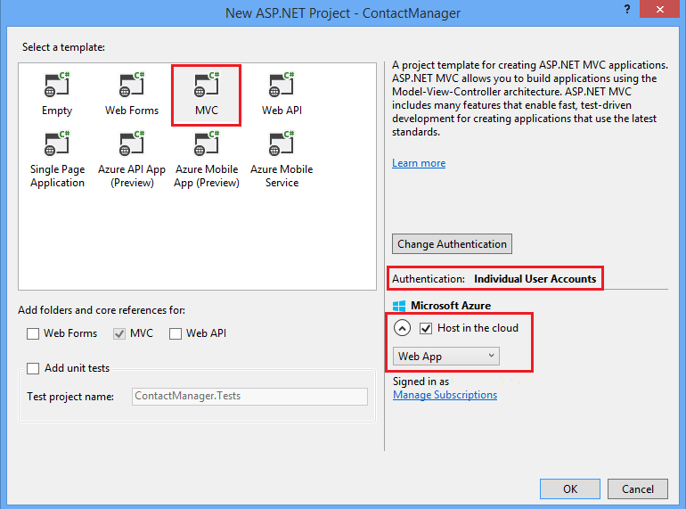
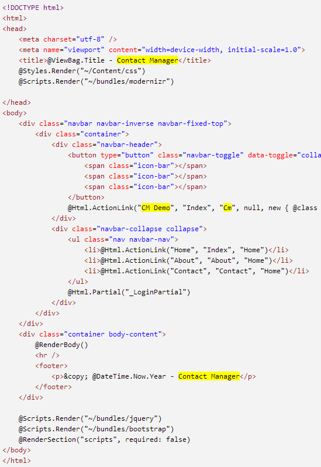
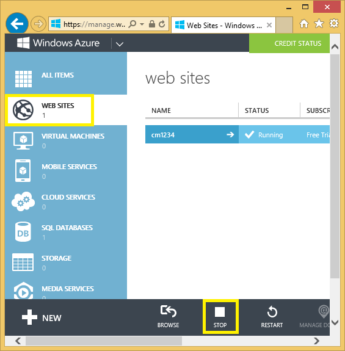

<properties 
	pageTitle="创建具有身份验证和 SQL 数据库的 ASP.NET MVC 应用程序并将其部署到 Azure 网站" 
	description="了解如何开发具有 SQL 数据库后端的 ASP.NET MVC 5 应用程序，添加身份验证和授权，并将其部署到 Azure。" 
	services="app-service\web" 
	documentationCenter=".net" 
	authors="Rick-Anderson" 
	writer="Rick-Anderson" 
	manager="wpickett" 
	editor=""/>

<tags 
	ms.service="app-service-web" 
	ms.date="08/07/2015" 
	wacn.date="10/03/2015"/>

# 创建具有身份验证和 SQL 数据库的 ASP.NET MVC 应用程序并将其部署到 Azure 网站

本教程演示如何构建安全的 ASP.NET MVC 5 Web 应用程序，以便用户能够使用 Facebook 或 Google 凭据进行登录。你还会将应用程序部署到 Azure。

你可以免费注册一个 Azure 帐户，而且，如果你还没有 Visual Studio 2013，则此 SDK 会自动安装 Visual Studio 2013 for Web Express。你可以免费开始针对 Azure 进行开发。

本教程假定你之前未使用过 Azure。完成本教程之后，你将能够在云中启动并运行安全的数据驱动的 Web 应用程序，以及使用云数据库。

学习内容：

* 如何创建安全的 ASP.NET MVC 5 项目并将其发布到 Azure 网站。
* 如何使用 [OAuth](http://oauth.net/ "http://oauth.net/") 和 ASP.NET 成员资格数据库保护你的应用程序。
* 如何使用 SQL 数据库在 Azure 中存储数据。

你将生成一个简单的联系人列表 Web 应用程序，该应用程序基于 ASP.NET MVC 5 构建并使用 ADO.NET Entity Framework 进行数据库访问。下图演示了完整应用程序的登录页面：

![登录页面][rxb] <!--
>[WACOM.NOTE] 若要完成本教程，你需要一个 Windows Azure 帐户。 如果你没有帐户，可以 <a href="/zh-cn/pricing/member-offers/msdn-benefits-details/?WT.mc_id=A261C142F" target="_blank">激活 MSDN 订户权益</a> or <a href="/zh-cn/pricing/1rmb-trial/?WT.mc_id=A261C142F" target="_blank">注册免费试用帐户</a>
-->

在本教程中：

- [设置开发环境](#setupdevenv)
- [创建 ASP.NET MVC 5 应用程序][createapplication]
- [将应用程序部署到 Azure][deployapp1]
- [向应用程序添加数据库][adddb]
- [添加 OAuth 提供程序][]
- [将应用部署到 Azure][deployapp11]
- [后续步骤][]

### 创建项目

1. 在“文件”菜单中，单击“新建项目”。

	

1. 在“新建项目”对话框中，展开“C#”并在“已安装的模板”下选择“Web”，然后选择“ASP.NET Web 应用程序”。

1. 将该应用程序命名为“ContactManager”，然后单击“确定”。

	
 
	**注意：**请确保输入了"ContactManager"。您稍后将复制的代码块假定项目名称为 ContactManager。

1. 在“新建 ASP.NET 项目”对话框中，选择“MVC”模板。确认已将“身份验证”设置为“单个用户帐户”，并且已选中“在云中托管”和“Web 应用”。

	

1. 配置向导将根据 *ContactManager* 建议唯一名称（参阅下图）。选择你附近的区域。可以使用 [azurespeed.com](http://www.azurespeed.com/ "AzureSpeed.com") 查找延迟最低的数据中心。
2. 如果你以前未创建过数据库服务器，请选择“新建服务器”，并输入数据库用户名和密码。

	

如果你有数据库服务器，请使用它来创建新的数据库。数据库服务器是非常宝贵的资源，而且你通常会想要在同一台服务器上创建多个数据库来进行测试和开发，而不是在每个数据库中各创建一个数据库服务器。请确保你的网站和数据库位于相同区域中。

### 设置页眉和页脚

1. 在“解决方案资源管理器”中，打开 *Views\\Shared* 文件夹中的 *Layout.cshtml* 文件。

	![_Layout.cshtml in Solution Explorer][newapp004]

1. 将 *Layout.cshtml* 文件的内容替换为以下代码。下面突出显示了所做的更改。

<pre>
			&lt;!DOCTYPE html>
			&lt;html>
			&lt;head>
			    &lt;meta charset="utf-8" />
			    &lt;meta name="viewport" content="width=device-width, initial-scale=1.0">
			    &lt;title>@ViewBag.Title - <mark>Contact Manager</mark>&lt;/title>
			    @Styles.Render("~/Content/css")
			    @Scripts.Render("~/bundles/modernizr")
			
			&lt;/head>
			&lt;body>
			    &lt;div class="navbar navbar-inverse navbar-fixed-top">
			        &lt;div class="container">
			            &lt;div class="navbar-header">
			                &lt;button type="button" class="navbar-toggle" data-toggle="collapse" data-target=".navbar-collapse">
			                    &lt;span class="icon-bar">&lt;/span>
			                    &lt;span class="icon-bar">&lt;/span>
			                    &lt;span class="icon-bar">&lt;/span>
			                &lt;/button>
			                @Html.ActionLink("<mark>CM Demo</mark>", "Index", "<mark>Cm</mark>", new { area = "" }, new { @class = "navbar-brand" })
			            &lt;/div>
			            &lt;div class="navbar-collapse collapse">
			                &lt;ul class="nav navbar-nav">
			                    &lt;li>@Html.ActionLink("Home", "Index", "Home")&lt;/li>
			                    &lt;li>@Html.ActionLink("About", "About", "Home")&lt;/li>
			                    &lt;li>@Html.ActionLink("Contact", "Contact", "Home")&lt;/li>
			                &lt;/ul>
			                @Html.Partial("_LoginPartial")
			            &lt;/div>
			        &lt;/div>
			    &lt;/div>
			    &lt;div class="container body-content">
			        @RenderBody()
			        &lt;hr />
			        &lt;footer>
			            &lt;p>&amp;copy; @DateTime.Now.Year - <mark>Contact Manager</mark>&lt;/p>
			        &lt;/footer>
			    &lt;/div>
			
			    @Scripts.Render("~/bundles/jquery")
			    @Scripts.Render("~/bundles/bootstrap")
			    @RenderSection("scripts", required: false)
			&lt;/body>
			&lt;/html>
</pre>

### 在本地运行应用程序

1. 按 Ctrl+F5 运行应用程序。

	随后在默认浏览器中显示该应用程序主页。

	

这就是你创建将要部署到 Azure 的应用程序目前所需的全部操作。

## 为项目启用 SSL ##

1. 启用 SSL。在“解决方案资源管理器”中，单击“ContactManager”项目，然后单击 F4 以显示属性对话框。将 **SSL Enabled** 更改为 true。复制 **SSL URL**。SSL URL 将为 https://localhost:44300/，除非你之前已创建 SSL Web 应用。

	![启用 SSL][rxSSL]
 
1. 在“解决方案资源管理器”中，右键单击“Contact Manager”项目，然后单击“属性”。
1. 在左侧选项卡中，单击“Web”。
1. 将“项目 URL”更改为使用 **SSL URL** 并保存页面 (Ctrl+S)。

	
 
1. 验证 Internet Explorer 是否为 Visual Studio 所启动的浏览器，如下图所示：

	

	浏览器选择器可让你指定 Visual Studio 启动的浏览器。

 	

	你可以选择多个浏览器，并让 Visual Studio 在你进行更改时更新每个浏览器。有关详细信息，请参阅[在 Visual Studio 2013 中使用浏览器链接](http://www.asp.net/visual-studio/overview/2013/using-browser-link)。

1. 按 Ctrl+F5 运行应用程序。遵照说明信任 IIS Express 生成的自我签署证书。

	 

1. 阅读“安全警告”对话框，如果你要安装代表“localhost”的证书，请单击“是”。

 	

1. IE 会显示*主页*页面，而且不会出现 SSL 警告。

	 

	Google Chrome 也会接受证书，并且不出现警告便显示 HTTPS 内容。Firefox 会使用自己的证书存储区，因此会显示警告。

	 

## 将应用程序部署到 Azure

1. 在 Visual Studio 中，在“解决方案资源管理器”中右键单击该项目，从上下文菜单中选择“发布”。

	
	
	将打开“发布 Web”向导。

1. 在“发布 Web”对话框中，单击“发布”。

	

	你创建的应用程序现在在云中运行。下次部署该应用程序时，仅会部署已更改（或新的）文件。

	

## 向应用程序添加数据库

接下来，你将更新应用程序以添加显示和更新联系人以及在数据库中存储数据的功能。应用程序将使用 Entity Framework (EF) 创建数据库并读取和更新数据。

### 为联系人添加数据模型类

首先，使用代码创建一个简单的数据模型。

1. 在“解决方案资源管理器”中，右键单击 Models 文件夹，单击“添加”，然后单击“类”。

	

2. 在“添加新项”对话框中，将新的类文件命名为 *Contact.cs*，然后单击“添加”。

	![“添加新项”对话框][adddb002]

3. 将 Contacts.cs 文件的内容替换为以下代码。

        using System.ComponentModel.DataAnnotations;
        using System.Globalization;
        namespace ContactManager.Models
        {
            public class Contact
            {
                public int ContactId { get; set; }
                public string Name { get; set; }
                public string Address { get; set; }
                public string City { get; set; }
                public string State { get; set; }
                public string Zip { get; set; }
                [DataType(DataType.EmailAddress)]
                public string Email { get; set; }
            }
        }
**Contacts** 类将为每个联系人存储的数据以及数据库需要的主键 (*ContactID*)。

### 创建使应用程序用户可以使用联系人的网页

ASP.NET MVC 基架功能可以自动生成用于执行创建、读取、更新和删除 (CRUD) 操作的代码。

## 为数据添加控制器和视图

1. 生成项目（“Ctrl+Shift+B”）。（在使用基架机制前必须生成项目。） 
1. 在“解决方案资源管理器”中，右键单击 Controllers 文件夹，然后单击“添加”，再单击“控制器”。

	![Controllers 文件夹上下文菜单中的“添加控制器”][addcode001]

5. 在“添加基架”对话框中，选择“带视图的 MVC 5 控制器，使用 EF”，然后单击“添加”。
	
	

1. 在“模型类”下拉框中，选择“Contact (ContactManager.Models)”。（参阅下图。）
1. 在“数据上下文类”中，选择“ApplicationDbContext (ContactManager.Models)”。**ApplicationDbContext** 将用于成员资格数据库和联系人数据。
1. 在“添加控制器”文本输入框中，输入“CmController”作为控制器名称。 

	

1. 单击**“添加”**。

   Visual Studio 将创建一个控制器方法并为“Contact”对象的 CRUD 数据库操作创建视图。

## 启用迁移、创建数据库、添加示例数据和数据初始值设定项 ##

接下来的任务是启用 [Code First 迁移](http://msdn.microsoft.com/library/hh770484.aspx)功能以便基于你创建的数据模型创建数据库。

1. 在“工具”菜单中，依次选择“NuGet Package Manager”和“Package Manager Console”。

2. 在“Package Manager Console”窗口中，输入以下命令：

		enable-migrations
	**enable-migrations** 命令将创建一个 *Migrations* 文件夹，并在该文件夹中放入一个可编辑以对数据库进行种子设定并配置迁移的 *Configuration.cs* 文件。

2. 在“Package Manager Console”窗口中，输入以下命令：

		add-migration Initial

	**add-migration Initial** 命令将在创建数据库的 *Migrations* 文件夹中生成一个名为 **&lt;date_stamp&gt;Initial** 的文件。第一个参数 (**Initial**) 是任意参数并将用于创建文件名称。你可以在“解决方案资源管理器”中查看新的类文件。在“Initial”类中，“Up”方法用于创建 Contacts 表，而“Down”方法（在你想要返回到以前的状态时使用）用于删除该表。
3. 打开 *Migrations\\Configuration.cs* 文件。 
4. 添加以下命名空间。 

    	 using ContactManager.Models;

5. 将 *Seed* 方法替换为以下代码：

        protected override void Seed(ContactManager.Models.ApplicationDbContext context)
        {
            context.Contacts.AddOrUpdate(p => p.Name,
               new Contact
               {
                   Name = "Debra Garcia",
                   Address = "1234 Main St",
                   City = "Redmond",
                   State = "WA",
                   Zip = "10999",
                   Email = "debra@example.com",
               },
                new Contact
                {
                    Name = "Thorsten Weinrich",
                    Address = "5678 1st Ave W",
                    City = "Redmond",
                    State = "WA",
                    Zip = "10999",
                    Email = "thorsten@example.com",
                },
                new Contact
                {
                    Name = "Yuhong Li",
                    Address = "9012 State st",
                    City = "Redmond",
                    State = "WA",
                    Zip = "10999",
                    Email = "yuhong@example.com",
                },
                new Contact
                {
                    Name = "Jon Orton",
                    Address = "3456 Maple St",
                    City = "Redmond",
                    State = "WA",
                    Zip = "10999",
                    Email = "jon@example.com",
                },
                new Contact
                {
                    Name = "Diliana Alexieva-Bosseva",
                    Address = "7890 2nd Ave E",
                    City = "Redmond",
                    State = "WA",
                    Zip = "10999",
                    Email = "diliana@example.com",
                }
                );
        }

	此代码将用联系信息初始化数据库或对其进行种子设定。有关对数据库进行种子设定的更多信息，请参阅[对 Entity Framework (EF) 数据库进行种子设定和调试](http://blogs.msdn.com/b/rickandy/archive/2013/02/12/seeding-and-debugging-entity-framework-ef-dbs.aspx)。

6. 在“Package Manager Console”中输入以下命令：

		update-database

	![“程序包管理器控制台”命令][addcode009]

	**update-database** 用于运行将创建数据库的初始迁移。默认情况下，将以 SQL Server Express LocalDB 数据库的形式创建数据库。

7. 按 Ctrl+F5 运行应用程序，然后单击“CM Demo”链接；或者导航到 https://localhost:(port#)/Cm。

	应用程序将显示种子数据并提供编辑、详细信息和删除链接。你可以创建、编辑、删除和查看数据。

	![数据的 MVC 视图][rx2]

## 添加 OAuth2 提供程序

[OAuth](http://oauth.net/ "http://oauth.net/") 是一种开放协议，允许以一种简单而标准的方法从 Web、移动和桌面应用程序进行安全授权。ASP.NET MVC Internet 模板使用 OAuth 公开将 Facebook、Twitter、Google 和 Microsoft 作为身份验证提供程序。虽然本教程仅使用 Google 作为身份验证提供程序，但你可轻松修改代码以使用其中任一提供程序。实施其他提供程序的步骤与你将在本教程中看到的步骤非常类似。若要将 Facebook 用作身份验证提供程序，请参阅我的教程[使用 Facebook、Twitter、LinkedIn 和 Google OAuth2 登录名创建 MVC 5 应用程序](http://www.asp.net/mvc/tutorials/mvc-5/create-an-aspnet-mvc-5-app-with-facebook-and-google-oauth2-and-openid-sign-on)。

除了身份验证外，本教程还将使用角色实施授权。只有你添加到 *canEdit* 角色中的用户将能更改数据（即，创建、编辑或删除联系人）。

遵循我的教程**创建 OAuth2 的 Google 应用程序以设置 OAuth2 的 Google 应用程序**中[使用 Facebook、Twitter、LinkedIn 和 Google OAuth2 登录名创建 MVC 5 应用程序](http://www.asp.net/mvc/tutorials/mvc-5/create-an-aspnet-mvc-5-app-with-facebook-and-google-oauth2-and-openid-sign-on#goog)的说明。运行并测试应用程序，以确认你可以使用 Google 身份验证登录。

## 使用成员资格 API
在本节中，你会将本地用户和 *canEdit* 角色添加到成员资格数据库。只有具有 *canEdit* 角色的用户才能编辑数据。最佳做法是按照角色可以执行的操作命名这些角色，因此 *canEdit* 优于名为 *admin* 的角色。在你的应用程序升级后，你可以添加新角色，例如 *canDeleteMembers*，而不是描述性较差的 *superAdmin*。

1. 打开 *migrations\\ configuration.cs* 文件并添加以下 `using` 语句：

        using Microsoft.AspNet.Identity;
        using Microsoft.AspNet.Identity.EntityFramework;

1. 将以下 **AddUserAndRole** 方法添加到类：

    
         bool AddUserAndRole(ContactManager.Models.ApplicationDbContext context)
         {
            IdentityResult ir;
            var rm = new RoleManager<IdentityRole>
                (new RoleStore<IdentityRole>(context));
            ir = rm.Create(new IdentityRole("canEdit"));
            var um = new UserManager<ApplicationUser>(
                new UserStore<ApplicationUser>(context));
            var user = new ApplicationUser()
            {
               UserName = "user1@contoso.com",
            };
            ir = um.Create(user, "P_assw0rd1");
            if (ir.Succeeded == false)
               return ir.Succeeded;
            ir = um.AddToRole(user.Id, "canEdit");
            return ir.Succeeded;
         }

1. 从 **Seed** 方法调用新类：
	<pre>
    protected override void Seed(ContactManager.Models.ApplicationDbContext context)
    {
        <mark>AddUserAndRole(context);</mark>
        context.Contacts.AddOrUpdate(p => p.Name,
            // Code removed for brevity
    }
</pre>
 下图显示了对 *Seed* 方法所做的更改：

	

	此代码会创建名为 *canEdit* 的新角色，创建新的本地用户 **user1@contoso.com*，并将 **user1@contoso.com* 添加到 *canEdit* 角色。有关详细信息，请参阅 [ASP.NET 标识教程](http://www.asp.net/identity/overview/features-api)。

## 使用临时代码将新的社交登录用户添加到 canEdit 角色  ##
在本部分中，你将临时修改帐户控制器中的 **ExternalLoginConfirmation** 方法以将使用 OAuth 提供程序注册的新用户添加到 *canEdit* 角色。我们将临时修改 **ExternalLoginConfirmation** 方法以自动将新用户添加到管理角色。在我们提供添加和管理角色的工具前，我们将使用下面的临时自动注册代码。我们希望在将来提供与 [WSAT](http://msdn.microsoft.com/zh-cn/library/ms228053.aspx) 类似的工具，该工具支持你创建和编辑用户帐户和角色。

1. 打开 **Controllers\\AccountController.cs** 文件并导航到 **ExternalLoginConfirmation** 方法。
1. 在 **SignInAsync** 调用之前将以下调用添加到 **AddToRoleAsync**。

                await UserManager.AddToRoleAsync(user.Id, "canEdit");

   上面的代码会将新注册的用户添加到“canEdit”角色，这为他们提供了对更改（编辑）数据的操作方法的访问权限。

		  // POST: /Account/ExternalLoginConfirmation
		  [HttpPost]
		  [AllowAnonymous]
		  [ValidateAntiForgeryToken]
		  public async Task ExternalLoginConfirmation(ExternalLoginConfirmationViewModel model, string returnUrl)
		  {
		     if (User.Identity.IsAuthenticated)
		     {
		        return RedirectToAction("Index", "Manage");
		     }
		     if (ModelState.IsValid)
		     {
		        // Get the information about the user from the external login provider
		        var info = await AuthenticationManager.GetExternalLoginInfoAsync();
		        if (info == null)
		        {
		           return View("ExternalLoginFailure");
		        }
		        var user = new ApplicationUser { UserName = model.Email, Email = model.Email };
		        var result = await UserManager.CreateAsync(user);
		        if (result.Succeeded)
		        {
		           result = await UserManager.AddLoginAsync(user.Id, info.Login);
		           if (result.Succeeded)
		           {
		              await UserManager.AddToRoleAsync(user.Id, "canEdit");
		              await SignInManager.SignInAsync(user, isPersistent: false, rememberBrowser: false);
		              return RedirectToLocal(returnUrl);
		           }
		        }
		        AddErrors(result);
		     }
		     ViewBag.ReturnUrl = returnUrl;
		     return View(model);
		  }

在本教程的后面，你会将应用程序部署到 Azure，在其中，你将使用 Google 或其他第三方身份验证提供程序进行登录。这会将你新注册的帐户添加到 *canEdit* 角色。发现 Web 应用的 URL 并且具有 Google ID 的任何人都能注册并更新你的数据库。若要阻止其他人这样做，你可以停止该网站。你可以通过检查数据库来验证具有 *canEdit* 角色的人员。

在“包装管理器控制台”中，点击向上键以显示以下命令：

		Update-Database

运行 **Update-Database** 命令以运行 **Seed** 方法，该方法将运行你刚刚添加的 **AddUserAndRole**。**AddUserAndRole** 将创建用户 **user1@contoso.com* 并将其添加到 *canEdit* 角色。

## 通过 SSL 和 Authorize 属性保护应用程序 ##

在本节中，你将应用 [Authorize](http://msdn.microsoft.com/zh-cn/library/system.web.mvc.authorizeattribute.aspx) 特性限制对操作方法的访问。匿名用户将只能查看主控制器的 **Index** 操作方法。注册用户将能够查看联系人数据（Cm 控制器的“索引”和“详细信息”页）、“关于”和“联系人”页。只有具有 *canEdit* 角色的用户才能访问可更改数据的操作方法。

1. 向应用程序中添加 [Authorize](http://msdn.microsoft.com/zh-cn/library/system.web.mvc.authorizeattribute.aspx) 筛选器和 [RequireHttps](http://msdn.microsoft.com/zh-cn/library/system.web.mvc.requirehttpsattribute.aspx) 筛选器。或者，向每个控制器中添加 [Authorize](http://msdn.microsoft.com/zh-cn/library/system.web.mvc.authorizeattribute.aspx) 和 [RequireHttps](http://msdn.microsoft.com/zh-cn/library/system.web.mvc.requirehttpsattribute.aspx) 属性，但最安全的做法是将这些属性应用于整个应用程序。通过全局添加这两个属性，你添加的每个新控制器和操作方法都将自动受到保护，你将无需记住应用它们。有关更多信息，请参阅保护 [ASP.NET MVC 应用程序和新 AllowAnonymous 特性](http://blogs.msdn.com/b/rickandy/archive/2012/03/23/securing-your-asp-net-mvc-4-app-and-the-new-allowanonymous-attribute.aspx)。打开 *app_start\\ filterconfig.cs* 文件并将 *RegisterGlobalFilters* 方法替换为以下内容（其中添加了两个筛选器）：<pre> public static void RegisterGlobalFilters(GlobalFilterCollection filters) { filters.Add(new HandleErrorAttribute())；<mark>filters.Add(new System.Web.Mvc.AuthorizeAttribute())；filters.Add(new RequireHttpsAttribute());</mark> } </pre>

	上面代码中应用的 [Authorize](http://msdn.microsoft.com/zh-cn/library/system.web.mvc.authorizeattribute.aspx) 筛选器将阻止匿名用户访问应用程序中的任何方法。你将使用 [AllowAnonymous](http://blogs.msdn.com/b/rickandy/archive/2012/03/23/securing-your-asp-net-mvc-4-app-and-the-new-allowanonymous-attribute.aspx) 特性选择取消几个方法中的授权要求，因此匿名用户可以登录和查看主页。[RequireHttps](http://msdn.microsoft.com/zh-cn/library/system.web.mvc.requirehttpsattribute.aspx) 将要求对 Web 应用的所有访问都必须通过 HTTPS。

1. 将 [AllowAnonymous](http://blogs.msdn.com/b/rickandy/archive/2012/03/23/securing-your-asp-net-mvc-4-app-and-the-new-allowanonymous-attribute.aspx) 特性添加到主控制器的 **Index** 方法。[AllowAnonymous](http://blogs.msdn.com/b/rickandy/archive/2012/03/23/securing-your-asp-net-mvc-4-app-and-the-new-allowanonymous-attribute.aspx) 特性使你能够将你要选择取消授权的方法加入白名单。

		public class HomeController : Controller
		{
		  [AllowAnonymous]
		  public ActionResult Index()
		  {
		     return View();
		  }

2. 对 *AllowAnonymous* 执行全局搜索，然后你可以看到它在 Account 控制器的登录和注册方法中使用。
1. 在 *CmController.cs* 中，将 `[Authorize(Roles = "canEdit")]` 添加到 *Cm* 控制器中用于更改数据的 HttpGet 和 HttpPost 方法（Create、Edit、Delete，即除 Index 和 Details 外的每个操作方法）。下面显示了一部分已完成代码： 

		// GET: Cm/Create
		[Authorize(Roles = "canEdit")]
		public ActionResult Create()
		{
		   return View(new Contact { Address = "123 N 456 W",
		    City="Great Falls", Email = "ab@cd.com", Name="Joe Smith", State="MT",
		   Zip = "59405"});
		}
		// POST: Cm/Create
		// To protect from overposting attacks, please enable the specific properties you want to bind to, for 
		// more details see http://go.microsoft.com/fwlink/?LinkId=317598.
		[HttpPost]
		[ValidateAntiForgeryToken]
		 [Authorize(Roles = "canEdit")]
		public ActionResult Create([Bind(Include = "ContactId,Name,Address,City,State,Zip,Email")] Contact contact)
		{
		    if (ModelState.IsValid)
		    {
		        db.Contacts.Add(contact);
		        db.SaveChanges();
		        return RedirectToAction("Index");
		    }
		    return View(contact);
		}
		// GET: Cm/Edit/5
		[Authorize(Roles = "canEdit")]
		public ActionResult Edit(int? id)
		{
		    if (id == null)
		    {
		        return new HttpStatusCodeResult(HttpStatusCode.BadRequest);
		    }
		    Contact contact = db.Contacts.Find(id);
		    if (contact == null)
		    {
		        return HttpNotFound();
		    }
		    return View(contact);
		}
		
1. 如果你仍是从前一个会话登录的，请点击“注销”链接。
1. 单击“关于”或“联系人”链接。你将重定向到登录页，因为匿名用户无法查看这些页面。 
1. 单击“注册为新用户”链接并添加电子邮件为 **joe@contoso.com* 的本地用户。验证 *Joe* 是否能查看主页、“关于”页和“联系人”页。

	

1. 单击 *CM 演示* 链接并验证你是否能看到数据。
1. 单击页面上的编辑链接，你将被重定向到登录页（因为新的本地用户未添加到 *canEdit* 角色）。
1. 使用帐户 **user1@contoso.com* 和密码“P_assw0rd1”（“word”中的“0”是零）登录。你将重定向到之前选择的编辑页。  如果你无法使用该帐户和密码登录，请尝试从源代码中复制密码并粘贴它。如果你仍然无法登录，请检查 **AspNetUsers** 表的 **UserName** 列，以验证是否已添加 **user1@contoso.com*。

1. 验证你是否能执行数据更改。

## 将应用部署到 Azure

1. 在 Visual Studio 中，在“解决方案资源管理器”中右键单击该项目，从上下文菜单中选择“发布”。

	![项目上下文菜单中的“发布”][firsdeploy003]

	将打开“发布 Web”向导。

1. 单击“发布 Web”对话框左侧的“设置”选项卡。单击“v”图标为“ApplicationDbContext”选择“远程连接字符串”并选择“ContactManagerNN_db”。

   
	

1. 在“ContactManagerContext”下，选择“执行 Code First 迁移”。

	

1. 单击“发布”。
1. 以 **user1@contoso.com* 身份登录（使用密码“P_assw0rd1”），并验证是否可以编辑数据。
1. 注销。
1. 转至 [Google 开发人员控制台](https://console.developers.google.com/)，并在“凭据”选项卡上更新重定向 URI 和 JavaScript 来源，以使用 Azure URL。
1. 使用 Google 或 Facebook 登录。这会将 Google 或 Facebook 帐户添加到 **canEdit** 角色。如果收到 HTTP 400 错误消息*“https://contactmanager{my version}.chinacloudsites.cn/signin-google 请求中的重定向 URI 与注册的重定向 URI 不匹配。”*，则必须等待所做更改传播完成。如果在一分钟以后收到此错误，请验证 URI 是否正确。

### 停止 Web 应用以阻止其他人注册  

1. 在“服务器资源管理器”中，导航到“Web Apps”。
4. 在 Web 应用上右键单击并选择“停止”。 

	

	也可以从 Azure 管理门户中选择网站，然后单击页面底部的“停止”图标。

	

### 删除 AddToRoleAsync、发布和测试

1. 从 Account 控制器中的 **ExternalLoginConfirmation** 方法中注释掉或删除以下代码：`await UserManager.AddToRoleAsync(user.Id, "canEdit");`
1. 生成项目（该操作将保存文件更改并确认没有任何编译错误）。
5. 在“解决方案资源管理器”中，右键单击该项目并选择“发布”。

	   
	
4. 单击“开始预览”按钮。只会部署需要更新的文件。
5. 从 Visual Studio 或门户启动 Web 应用。“Web 应用停止时无法发布”。

	

5. 返回到 Visual Studio 并单击“发布”。
3. Azure 应用程序将在默认浏览器中打开。如果你已登录，请注销，以便能够以匿名用户身份查看主页。  
4. 单击“关于”链接。你将重定向到登录页。
5. 单击登录页上的“注册”链接并创建本地帐户。我们将使用此本地帐户验证你是否能访问只读页，而无法访问更改数据的页面（受 *canEdit* 角色的保护）。在本教程的后面，你将删除本地帐户访问权限。 

	

1. 验证你是否能导航到“关于”和“联系人”页。

	

1. 单击“CM 演示”链接以导航到“Cm”控制器。或者，也可以将 *Cm* 附加到 URL。

	
 
1. 单击“编辑”链接。你将重定向到登录页。在“使用其他服务进行登录”下，单击“Google”或“Facebook”并使用你之前注册的帐户进行登录。（如果你的动作够快，同时会话 Cookie 未超时，将使用你先前所用的 Google 或 Facebook 帐户为你自动登录。）
2. 验证你是否能在登录到该帐户时编辑数据。**注意：**你无法从此应用程序注销 Google 并使用同一浏览器登录到其他 Google 帐户。如果您使用的是一个浏览器，则必须导航到 Google 并注销。您可以借助其他浏览器，使用来自同一第三方身份验证器（如 Google）的其他帐户登录。

如果你未填写 Google 帐户信息中的姓名，则会发生 NullReferenceException。

## 检查 SQL Azure 数据库 ##

1. 在“服务器资源管理器”中，导航到“ContactDB”
2. 右键单击“ContactDB”并选择“在 SQL Server 对象资源管理器中打开”。
 
	
 
3. 如果以前没有连接到此数据库，可能将提示你添加一个防火墙规则以启用对你当前的 IP 地址的访问。将预先填充 IP 地址。只需单击“添加防火墙规则”即可启用访问。

	
        
	然后，使用创建数据库时指定的用户名和密码登录到数据库。
 
1. 右键单击“AspNetUsers”表，然后选择“查看数据”。

	
 
1. 记下你注册要成为 **canEdit** 角色的 Google 帐户中的 ID，并记下 **user1@contoso.com* 的 ID。这些 ID 只应是具有 **canEdit** 角色的用户。（你将在下一步中对此进行验证。）

	
 
2. 在“SQL Server 对象资源管理器”中，右键单击“AspNetUserRoles”，然后选择“查看数据”。

	
 
验证 **UserId** 是否来自 **user1@contoso.com* 和你注册的 Google 帐户。

## 后续步骤

请遵循我基于以下示例制作的教程：

1.	[创建具有登录、电子邮件确认及密码重置功能的安全 ASP.NET MVC 5 Web 应用程序](http://www.asp.net/mvc/overview/getting-started/create-an-aspnet-mvc-5-web-app-with-email-confirmation-and-password-reset)
2.	[使用 SMS 和电子邮件双因素身份验证的 ASP.NET MVC 5 应用程序](http://www.asp.net/mvc/overview/getting-started/aspnet-mvc-5-app-with-sms-and-email-two-factor-authentication)
3.	[将密码和其他敏感数据部署到　ASP.NET 和 Azure 的最佳做法](http://www.asp.net/identity/overview/features-api/best-practices-for-deploying-passwords-and-other-sensitive-data-to-aspnet-and-azure) 
4.	[使用 Facebook 和 Google OAuth2 创建 ASP.NET MVC 5 应用程序](http://www.asp.net/mvc/tutorials/mvc-5/create-an-aspnet-mvc-5-app-with-facebook-and-google-oauth2-and-openid-sign-on)包含有关如何将配置文件数据添加到用户注册数据库的说明以及有关将 Facebook 用作身份验证提供程序的说明。
5.	[ASP.NET MVC 5 入门](http://www.asp.net/mvc/tutorials/mvc-5/introduction/getting-started)

若要启用此教程顶部显示的社交登录按钮，请参阅 [ASP.NET MVC 5 的美观社交登录按钮](http://www.beabigrockstar.com/pretty-social-login-buttons-for-asp-net-mvc-5/)。

Tom Dykstra 绝佳的 [EF 和 MVC 入门](http://www.asp.net/mvc/tutorials/getting-started-with-ef-using-mvc/creating-an-entity-framework-data-model-for-an-asp-net-mvc-application)将更详细地说明高级 MVC 和 EF 编程。

本教程和示例应用程序由 [Rick Anderson](http://blogs.msdn.com/b/rickandy/) (Twitter [@RickAndMSFT](https://twitter.com/RickAndMSFT)) 在 Tom Dykstra 和 Barry Dorrans (Twitter [@blowdart](https://twitter.com/blowdart)) 的帮助下编写完成。

***请提供有关你喜欢的内容或者你希望看到改善的内容的反馈***，不仅关于教程本身，也关于它所演示的产品。你的反馈将帮助我们确定优先改进哪些方面。你还可以在[教我编写代码](http://aspnet.uservoice.com/forums/228522-show-me-how-with-code)上请求帮助以及对新主题投票。

<!-- bookmarks -->
[添加 OAuth 提供程序]: #addOauth
[Using the Membership API]: #mbrDB
[Create a Data Deployment Script]: #ppd
[Update the Membership Database]: #ppd2

[setupwindowsazureenv]: #bkmk_setupwindowsazure
[createapplication]: #bkmk_createmvc4app
[deployapp1]: #bkmk_deploytowindowsazure1
[deployapp11]: #bkmk_deploytowindowsazure11
[adddb]: #bkmk_addadatabase

<!-- images-->
[rx2]: ./media/web-sites-dotnet-deploy-aspnet-mvc-app-membership-oauth-sql-database/rx2.png

[rx5]: ./media/web-sites-dotnet-deploy-aspnet-mvc-app-membership-oauth-sql-database-vs2013/rx5.png
[rx6]: ./media/web-sites-dotnet-deploy-aspnet-mvc-app-membership-oauth-sql-database-vs2013/rx6.png
[rx7]: ./media/web-sites-dotnet-deploy-aspnet-mvc-app-membership-oauth-sql-database-vs2013/rx7.png
[rx8]: ./media/web-sites-dotnet-deploy-aspnet-mvc-app-membership-oauth-sql-database-vs2013/rx8.png
[rx9]: ./media/web-sites-dotnet-deploy-aspnet-mvc-app-membership-oauth-sql-database-vs2013/rx9.png

[rxb]: ./media/web-sites-dotnet-deploy-aspnet-mvc-app-membership-oauth-sql-database/rxb.png

[rxSSL]: ./media/web-sites-dotnet-deploy-aspnet-mvc-app-membership-oauth-sql-database/rxSSL.png

[rxNOT]: ./media/web-sites-dotnet-deploy-aspnet-mvc-app-membership-oauth-sql-database-vs2013/rxNOT.png
[rxNOT2]: ./media/web-sites-dotnet-deploy-aspnet-mvc-app-membership-oauth-sql-database-vs2013/rxNOT2.png

[rxNOT]: ./media/web-sites-dotnet-deploy-aspnet-mvc-app-membership-oauth-sql-database-vs2013/rxNOT.png
[rxNOT]: ./media/web-sites-dotnet-deploy-aspnet-mvc-app-membership-oauth-sql-database-vs2013/rxNOT.png
[rxNOT]: ./media/web-sites-dotnet-deploy-aspnet-mvc-app-membership-oauth-sql-database-vs2013/rxNOT.png
[rr1]: ./media/web-sites-dotnet-deploy-aspnet-mvc-app-membership-oauth-sql-database-vs2013/rr1.png

[rxPrevDB]: ./media/web-sites-dotnet-deploy-aspnet-mvc-app-membership-oauth-sql-database-vs2013/rxPrevDB.png

[rxWSnew]: ./media/web-sites-dotnet-deploy-aspnet-mvc-app-membership-oauth-sql-database-vs2013/rxWSnew2.png
[rxCreateWSwithDB]: ./media/web-sites-dotnet-deploy-aspnet-mvc-app-membership-oauth-sql-database-vs2013/rxCreateWSwithDB.png

[setup007]: ./media/web-sites-dotnet-deploy-aspnet-mvc-app-membership-oauth-sql-database-vs2013/dntutmobile-setup-azure-site-004.png

[newapp004]: ./media/web-sites-dotnet-deploy-aspnet-mvc-app-membership-oauth-sql-database/dntutmobile-createapp-004.png

[firsdeploy003]: ./media/web-sites-dotnet-deploy-aspnet-mvc-app-membership-oauth-sql-database/dntutmobile-deploy1-publish-001.png

[adddb002]: ./media/web-sites-dotnet-deploy-aspnet-mvc-app-membership-oauth-sql-database/dntutmobile-adddatabase-002.png
[addcode001]: ./media/web-sites-dotnet-deploy-aspnet-mvc-app-membership-oauth-sql-database/dntutmobile-controller-add-context-menu.png

[addcode008]: ./media/web-sites-dotnet-deploy-aspnet-mvc-app-membership-oauth-sql-database-vs2013/dntutmobile-migrations-package-manager-menu.png
[addcode009]: ./media/web-sites-dotnet-deploy-aspnet-mvc-app-membership-oauth-sql-database/dntutmobile-migrations-package-manager-console.png

[Important information about ASP.NET in Azure Web Sites]: #aspnetwindowsazureinfo
[后续步骤]: #nextsteps

[ImportPublishSettings]: ./media/web-sites-dotnet-deploy-aspnet-mvc-app-membership-oauth-sql-database-vs2013/ImportPublishSettings.png

<!---HONumber=71-->