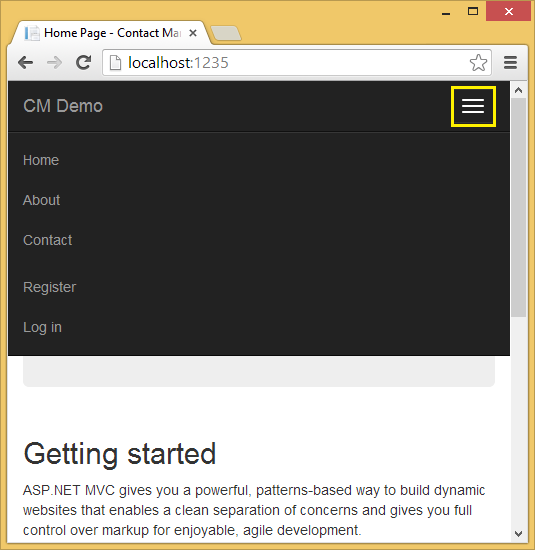
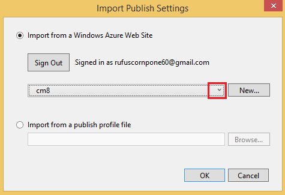
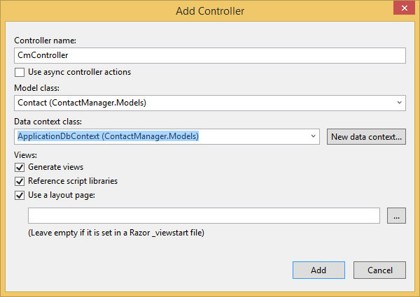
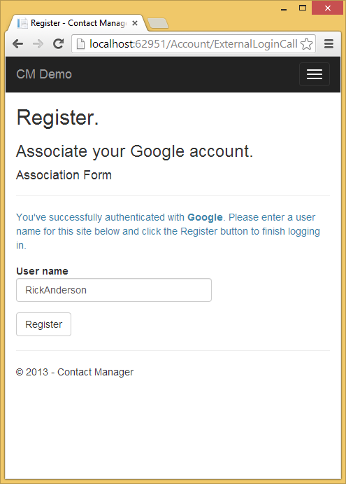
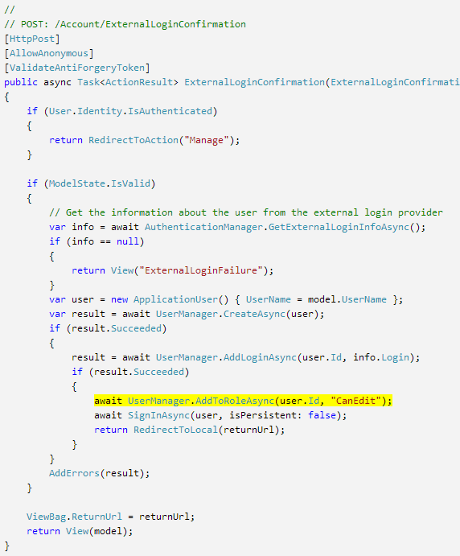
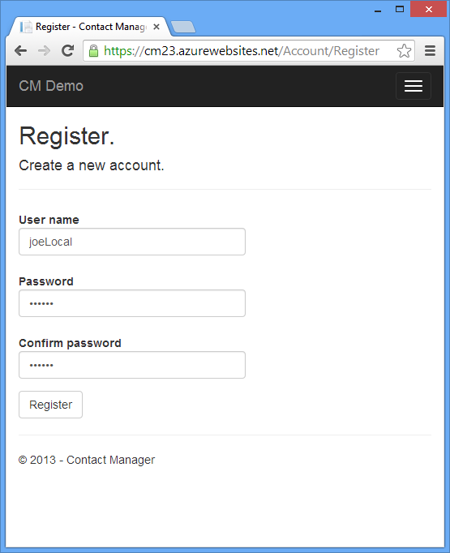
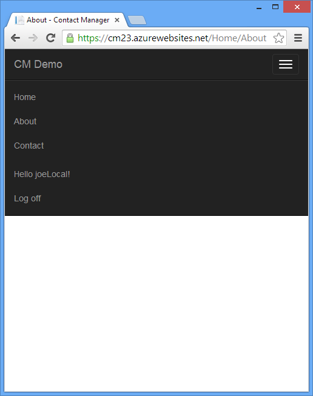
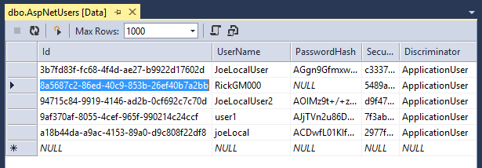
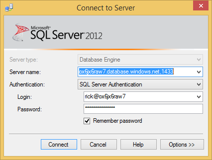

<properties linkid="dev-net-tutorials-web-app-with-sql-azure-vs2013" urlDisplayName="使用 SQL数据库 创建网站" pageTitle="使用成员资格、OAuth 和 SQL数据库 将安全的 ASP.NET MVC 应用程序部署到 Windows Azure 网站" metaKeywords="Azure Hello World 教程, Azure 入门教程, SQL数据库 教程, Azure .NET Hello World 教程, Azure C# Hello World 教程, SQL Azure C# 教程" description="了解如何开发带有 SQL数据库 后端的 ASP.NET MVC 5 网站并将其部署到 Windows Azure。" metaCanonical="" services="web-sites,sql-database" documentationCenter=".NET" title="OAuth" authors=""  solutions="" writer="riande" manager="wpickett" editor="mollybos"  />
<tags ms.service="web-sites,sql-database"
    ms.date="03/24/2015"
    wacn.date="04/11/2015"
    />

# 使用成员资格、OAuth 和 SQL数据库 将安全的 ASP.NET MVC 5 应用程序部署到 Windows Azure 网站

***由 [Rick Anderson](https://twitter.com/RickAndMSFT) 和 Tom Dykstra 撰写。上次更新时间：2013 年 10 月 18 日。***

<a href="/zh-cn/develop/net/tutorials/web-site-with-sql-database/" title="Visual Studio 2013" class="current">Visual Studio 2013</a><a href="/zh-cn/develop/net/tutorials/web-site-with-sql-database-vs2012/" title="Visual Studio 2012">Visual Studio 2012</a>

本教程演示如何构建安全的 ASP.NET MVC 5 Web 应用程序，以便用户能够使用 Facebook 或 Google 凭据进行登录。您还会将应用程序部署到 Windows Azure。

您可以免费注册一个 Windows Azure 帐户，而且，如果您还没有 Visual Studio 2013，则此 SDK 会自动安装 Visual Studio 2013 for Web Express。您可以免费开始针对 Windows Azure 进行开发。如果您要使用 Visual Studio 2012，请参见 [上一个教程](/zh-cn/develop/net/tutorials/web-site-with-sql-database-vs2012/)。此版本的教程比上一个版本简单得多。

本教程假定您之前未使用过 Windows Azure。完成本教程之后，您将能够在云中启动并运行安全的数据驱动的 Web 应用程序，以及使用云数据库。

您将了解到以下内容：

* 如何创建安全的 ASP.NET MVC 5 项目并将其发布到 Windows Azure 网站。
* 如何使用 [OAuth](http://oauth.net/ "http://oauth.net/")、[OpenID](http://openid.net/) 和 ASP.NET 成员资格数据库保护您的应用程序。
* 如何使用新成员资格 API 添加用户和角色。
* 如何使用 SQL数据库 在 Windows Azure 中存储数据。

您将生成一个简单的联系人列表 Web 应用程序，该应用程序基于 ASP.NET MVC 5 构建并使用 ADO.NET Entity Framework 进行数据库访问。下图演示了完整应用程序的登录页面：

![登录页面][rxb]

<strong>注意</strong> 若要完成本教程，您需要一个 Windows Azure 帐户。如果您没有帐户，则可以创建一个免费的试用帐户，只需几分钟即可完成。有关更多信息，请参见 <a href="http://www.windowsazure.cn/zh-cn/pricing/free-trial/?WT.mc_id=A261C142F" target="_blank">Windows Azure 免费试用</a>。

在本教程中：

- [设置开发环境](#setupdevenv)
- [设置 Windows Azure 环境][setupwindowsazureenv]
- [创建 ASP.NET MVC 5 应用程序][createapplication]
- [将应用程序部署到 Windows Azure][deployapp1]
- [向应用程序添加数据库][adddb]
- [添加 OAuth 提供程序][]
- [使用成员资格 API][]
- [将应用程序部署到 Windows Azure][deployapp11]
- [后续步骤][]

[WACOM.INCLUDE [install-sdk-2013-only](../includes/install-sdk-2013-only.md)]

<h2>设置 Windows Azure 环境</h2>

接下来，通过创建 Windows Azure 网站和 SQL数据库 来设置 Windows Azure 环境。

### 在 Windows Azure 中创建网站和 SQL 数据库

您的 Windows Azure 网站将在共享宿主环境中运行，这意味着它将在与其他 Windows Azure 客户端共享的虚拟机 (VM) 上运行。共享宿主环境是一种在云中开始工作的低成本方式。稍后，如果您的 Web 流量增加，则应用程序可进行扩展，通过在专用 VM 上运行来满足需要。如果您需要一个更复杂的体系结构，则可迁移到 Windows Azure 云服务。云服务在您可根据自己的需求进行配置的专用 VM 上运行。

Windows Azure SQL数据库 是根据 SQL Server 技术构建的基于云的关系数据库服务。可以与 SQL Server 一起使用的工具和应用程序也可用于 SQL数据库。

1. 在 [Windows Azure 管理门户](https://manage.windowsazure.cn) 中，单击左侧选项卡中的“网站”，然后单击“新建”。

	![管理门户中的“新建”按钮][rxWSnew]

1. 单击“网站”，然后单击“自定义创建”。

	![管理门户中的“与数据库一起创建”链接][rxCreateWSwithDB]

	“新网站 - 自定义创建”向导将打开。

1. 在该向导的“创建网站”步骤中，在“URL”框中输入将用作您的应用程序的唯一 URL 的字符串。完整的 URL 将包含您在此处输入的内容和您在文本框旁边看到的后缀。图中显示一个 URL，但可能已有人使用了该 URL，因此必须另外选择一个。

	![管理门户中的“与数据库一起创建”链接][rr1]

1. 在“数据库”下拉列表中，选择“创建免费的 20 MB SQL 数据库”。

1. 在“区域”下拉列表中，选择您为网站所选的同一区域。
此设置指定将在哪个数据中心内运行您的 VM。
1. 在“数据库连接字符串名称”框中，保留默认值 *DefaultConnection*。
1. 单击对话框底部的向右箭头。
该向导将前进到“指定数据库设置”步骤。

1. 在“名称”框中，输入 *ContactDB*。（参见下图）。
1. 在“服务器”框中，选择“新建 SQL数据库 服务器”。（参见下图）。或者，如果您之前创建了 SQL Server 数据库，则可从下拉列表控件中选择 SQL Server。
1. 将“区域”设置为创建网站的同一区域。
1. 输入管理员“登录名”和“密码”。如果您选择了“新建 SQL数据库 服务器”，则在此处不要输入现有名称和密码。您应输入新的名称和密码，您现在定义的名称和密码将在您以后访问数据库时使用。如果您选择了之前创建的 SQL Server，系统将提示您输入之前创建的 SQL Server 帐户名称的密码。在本教程中，我们不选中“高级”框。对于免费数据库，只能设置排序规则。
1. 单击对话框右下角的复选标记以指示您已完成操作。

	![“新建网站 - 与数据库一起创建”向导的“数据库设置”步骤][setup007]
	
	下图显示了使用现有 SQL Server 和登录名。

	![“新建网站 - 与数据库一起创建”向导的“数据库设置”步骤][rxPrevDB]

	管理门户返回到“网站”页面，“状态”列显示正在创建网站。稍后（通常不到一分钟），“状态”列会显示已成功创建网站。在左侧的导航栏中，您的帐户中拥有的网站的数量将会显示在“网站”图标旁边，而数据库的数量将会显示在“SQL数据库”图标旁边。

<h2>创建 ASP.NET MVC 5 应用程序</h2>

您已经创建了一个 Windows Azure 网站，但其中还没有内容。下一步将创建要发布到 Windows Azure 的 Visual Studio Web 应用程序。

### 创建项目

2. 从“文件”菜单，单击“新建项目”。

   

3. 在“新建项目”对话框中，展开 C# 并在“已安装的模板”下选择 Web，然后选择“ASP.NET Web 应用程序”。

4. 将该应用程序命名为 ContactManager，然后单击“确定”。

   
 
   **注意**：该图像显示“MyExample”作为名称，但请确保您输入了“ContactManager”。您稍后将复制的代码块假定项目名称为 ContactManager。

5. 在“新建 ASP.NET 项目”对话框中，选择 MVC 模板，然后单击“更改身份验证”。

   

6. 在“更改身份验证”对话框中保留默认的“单个用户帐户”。

   该对话框说明“单个用户帐户”针对将用户配置文件存储在 SQL 数据库中的应用程序，在该数据库中，用户可使用其现有的 Facebook、Twitter 和 Google 帐户进行注册。有关其他身份验证选项的信息，请参见[在 Visual Studio 2013 中创建 ASP.NET Web 项目 - 身份验证方法](http://www.asp.net/visual-studio/overview/2013/creating-web-projects-in-visual-studio#auth)。

7. 单击“确定”。

5. 在“新建 ASP.NET 项目”对话框中，单击“确定”。

     

### 设置页眉和页脚

1. 在“解决方案资源管理器”中，打开 *Views\Shared* 文件夹中的 *Layout.cshtml* 文件。
	![解决方案资源管理器中的 _Layout.cshtml][newapp004]
1. 将两处“我的 ASP.NET MVC 应用程序”替换为“Contact Manager”。
1. 将“应用程序名称”替换为“CM 演示”。
2. 更新第一个“操作”链接，并将 *Home* 替换为 *Cm* 以使用 *Cm* 控制器。

### 在本地运行应用程序

1. 按 Ctrl+F5 运行应用程序。

	随后在默认浏览器中显示该应用程序主页。

这就是您创建将要部署到 Windows Azure 的应用程序目前所需的全部操作。稍后您将添加数据库功能。

<h2>将应用程序部署到 Windows Azure</h2>

5. 在 Visual Studio 中，在“解决方案资源管理器”中右键单击该项目，从上下文菜单中选择“发布”。

   
	
   “发布 Web”向导将打开。

6. 在“发布 Web”向导的“配置文件”选项卡中，单击“导入”。

   ![导入发布设置][ImportPublishSettings]

   “导入发布配置文件”对话框随即出现。

5. 使用以下方法之一使 Visual Studio 能够连接到您的 Windows Azure 帐户。

   
	* 单击“登录”，然后输入您的 Windows Azure 帐户的凭据。

		此方法虽然又快又简单，但如果您使用此方法，将无法在“服务器资源管理器”窗口中看到 Windows Azure SQL数据库 或移动服务。

	* 单击“管理订阅”以便安装允许访问您帐户的管理证书。

		在“管理 Windows Azure 订阅”对话框中，单击“证书”选项卡，然后单击“导入”。按照说明为您的 Windows Azure 帐户下载并导入一个订阅文件（也称为 *.publishsettings* 文件）。

		> [WACOM.NOTE]
		> 将此订阅文件下载到源代码目录之外的文件夹中（例如，在 Downloads 文件夹中），然后在导入完成后将其删除。获得了此订阅文件访问权的恶意用户可以编辑、创建和删除您的 Windows Azure 服务。

		有关更多信息，请参见[如何通过 Visual Studio 连接到 Windows Azure](http://go.microsoft.com/fwlink/?LinkId=324796)。

7. 在“导入发布配置文件”对话框中，从下拉列表中选择网站，然后单击“确定”。

1. 在“发布网站”对话框中，单击“发布”。

	

	您创建的应用程序现在在云中运行。下次部署该应用程序时，仅会部署已更改（或新的）文件。

<h2>向应用程序添加数据库</h2>

接下来，您将更新 MVC 应用程序以添加显示和更新联系人以及在数据库中存储数据的功能。应用程序将使用 Entity Framework 创建数据库并读取和更新数据库中的数据。

### 为联系人添加数据模型类

首先，使用代码创建一个简单的数据模型。

1. 在“解决方案资源管理器”中，右键单击 Models 文件夹，单击“添加”，然后单击“类”。

2. 在“添加新项”对话框中，将新的类文件命名为 *Contact.cs*，然后单击“添加”。

![“添加新项”对话框][adddb002]

3. 将 Contacts.cs 文件的内容替换为以下代码。

        using System.ComponentModel.DataAnnotations;
        using System.Globalization;
        namespace ContactManager.Models
        {
            public class Contact
            {
                public int ContactId { get; set; }
                public string Name { get; set; }
                public string Address { get; set; }
                public string City { get; set; }
                public string State { get; set; }
                public string Zip { get; set; }
                [DataType(DataType.EmailAddress)]
                public string Email { get; set; }
            }
        }
Contacts 类定义您将为每个联系人存储的数据以及数据库需要的主键 *ContactID*。

### 创建使应用程序用户可以使用联系人的网页

ASP.NET MVC 基架功能可以自动生成用于执行创建、读取、更新和删除 (CRUD) 操作的代码。

<h2>为数据添加控制器和视图</h2>

1. 生成项目 (Ctrl+Shift+B)。（在使用基架机制前必须生成项目。）
1. 在“解决方案资源管理器”中，右键单击 Controllers 文件夹，然后单击“添加”，再单击“控制器”。

	![Controllers 文件夹上下文菜单中的“添加控制器”][addcode001]

5. 在“添加基架”对话框中，选择“带视图的 MVC 5 控制器，使用 EF”，然后单击“添加”。
	

5. 在“添加控制器”对话框中，输入“CmController”作为控制器名称。（参见下图。）
1. 在“模型类”下拉框中，选择 Contact (ContactManager.Models)。
1. 在“数据上下文类”中，选择 ApplicationDbContext (ContactManager.Models)。ApplicationDbContext 将用于成员资格数据库和我们的联系人数据。

1. 单击“添加”。

   Visual Studio 将创建一个控制器方法并为 Contact 对象的 CRUD 数据库操作创建视图。

## 启用迁移、创建数据库、添加示例数据和数据初始值设定项 ##

接下来的任务是启用[代码优先迁移](http://msdn.microsoft.com/library/hh770484.aspx) 功能以便基于您创建的数据模型创建数据库。

1. 在“工具”菜单中，依次选择“库程序包管理器”和“程序包管理器控制台”。
	![“工具”菜单中的“程序包管理器控制台”][addcode008]
2. 在“程序包管理器控制台”窗口中，输入以下命令：

		enable-migrations
	enable-migrations 命令将创建一个 *Migrations* 文件夹，并在该文件夹中放入一个可编辑以对数据库进行种子设定和配置迁移的 *Configuration.cs* 文件。

2. 在“程序包管理器控制台”窗口中，输入以下命令：

		add-migration Initial

	 add-migration Initial 命令将在创建数据库的 *Migrations* 文件夹中生成一个名为 &lt;date_stamp&gt;Initial 的文件。第一个参数 (Initial) 是任意参数并将用于创建文件名称。您可以在“解决方案资源管理器”中查看新的类文件。
	在 Initial 类中，Up 方法用于创建 Contacts 表，而 Down 方法（在您想要返回到以前的状态时使用）用于删除该表。
3. 打开 *Migrations\Configuration.cs* 文件。
4. 添加以下命名空间。

    	 using ContactManager.Models;

5. 将 *Seed* 方法替换为以下代码：

        protected override void Seed(ContactManager.Models.ApplicationDbContext context)
        {
            context.Contacts.AddOrUpdate(p => p.Name,
               new Contact
               {
                   Name = "Debra Garcia",
                   Address = "1234 Main St",
                   City = "Redmond",
                   State = "WA",
                   Zip = "10999",
                   Email = "debra@example.com",
               },
                new Contact
                {
                    Name = "Thorsten Weinrich",
                    Address = "5678 1st Ave W",
                    City = "Redmond",
                    State = "WA",
                    Zip = "10999",
                    Email = "thorsten@example.com",
                },
                new Contact
                {
                    Name = "Yuhong Li",
                    Address = "9012 State st",
                    City = "Redmond",
                    State = "WA",
                    Zip = "10999",
                    Email = "yuhong@example.com",
                },
                new Contact
                {
                    Name = "Jon Orton",
                    Address = "3456 Maple St",
                    City = "Redmond",
                    State = "WA",
                    Zip = "10999",
                    Email = "jon@example.com",
                },
                new Contact
                {
                    Name = "Diliana Alexieva-Bosseva",
                    Address = "7890 2nd Ave E",
                    City = "Redmond",
                    State = "WA",
                    Zip = "10999",
                    Email = "diliana@example.com",
                }
                );
        }

	此代码将用联系信息初始化数据库或对其进行种子设定。有关对数据库进行种子设定的更多信息，请参见[对 Entity Framework (EF) 数据库进行种子设定和调试](http://blogs.msdn.com/b/rickandy/archive/2013/02/12/seeding-and-debugging-entity-framework-ef-dbs.aspx)。

6. 在“程序包管理器控制台”中输入以下命令：

		update-database

	![“程序包管理器控制台”命令][addcode009]

	update-database 用于运行将创建数据库的初始迁移。默认情况下，将以 SQL Server Express LocalDB 数据库的形式创建数据库。

7. 按 Ctrl+F5 运行应用程序，然后单击 CM Demo 链接；或者导航到 http://localhost:(port#)/Cm。

应用程序将显示种子数据并提供编辑、详细信息和删除链接。您可以创建、编辑、删除和查看数据。

![数据的 MVC 视图][rx2]

<h2>OAuth添加 OAuth2 和 OpenID 提供程序</h2>

[OAuth](http://oauth.net/ "http://oauth.net/") 是一种开放协议，允许以一种简单而标准的方法从 Web、移动和桌面应用程序进行安全授权。ASP.NET MVC Internet 模板使用 OAuth 和 [OpenID](http://openid.net/) 公开 Facebook、Twitter、Google 和 Microsoft 以作为身份验证提供程序。虽然本教程仅使用 Google 作为身份验证提供程序，但您可轻松修改代码以使用任何提供程序。实施其他提供程序的步骤与您将在本教程中看到的步骤非常类似。若要将 Facebook 用作身份验证提供程序，请参见我的教程[使用 Facebook 和 Google 的 OAuth2 和 OpenID 登录名创建 ASP.NET MVC 5 应用程序](http://www.asp.net/mvc/tutorials/mvc-5/create-an-aspnet-mvc-5-app-with-facebook-and-google-oauth2-and-openid-sign-on)。

除了身份验证外，本教程还将使用角色实施授权。只有您添加到 *canEdit* 角色中的用户将能更改数据（即，创建、编辑或删除联系人）。

1. 打开 *App_Start\Startup.Auth.cs* 文件。从 *app.UseGoogleAuthentication()* 方法中删除注释字符。

1. 运行应用程序并单击“登录”链接。
1. 在“使用其他服务进行登录”下，单击 Google 按钮。
1. 输入凭据。
1. 单击“接受”以允许应用程序访问您的电子邮件和基本信息。
1. 您将重定向到“注册”页。您可以根据需要更改“用户名”。单击“注册”。

<h2>成员资格数据库使用成员资格 API</h2>
在本节中，您会将本地用户和 *canEdit* 角色添加到成员资格数据库。只有具有 *canEdit* 角色的用户才能编辑数据。最佳做法是按照角色可以执行的操作命名这些角色，因此 *canEdit* 优于名为 *admin* 的角色。在您的应用程序升级后，您可以添加新角色，例如 *canDeleteMembers*，而不是描述性较差的 *superAdmin*。

1. 打开 *migrations\configuration.cs* 文件并添加以下 using 语句：

        using Microsoft.AspNet.Identity;
        using Microsoft.AspNet.Identity.EntityFramework;

1. 将以下 AddUserAndRole 方法添加到类：

    
         bool AddUserAndRole(ContactManager.Models.ApplicationDbContext context)
         {
            IdentityResult ir;
            var rm = new RoleManager<IdentityRole>
                (new RoleStore<IdentityRole>(context));
            ir = rm.Create(new IdentityRole("canEdit"));
            var um = new UserManager<ApplicationUser>(
                new UserStore<ApplicationUser>(context));
            var user = new ApplicationUser()
            {
               UserName = "user1",
            };
            ir = um.Create(user, "Passw0rd1");
            if (ir.Succeeded == false)
               return ir.Succeeded;
            ir = um.AddToRole(user.Id, "canEdit");
            return ir.Succeeded;
         }

2. 从 Seed 方法中调用新类：

        protected override void Seed(ContactManager.Models.ApplicationDbContext context)
        {
            AddUserAndRole(context);
            context.Contacts.AddOrUpdate(p => p.Name,
                // Code removed for brevity
        }

   此代码会创建名为 *canEdit* 的新角色，创建新的本地用户 *user1*，并将 *user1* 添加到 *canEdit* 角色。

## 使用临时代码将新的社交登录用户添加到 canEdit 角色##
在本节中，您将临时修改帐户控制器中的 ExternalLoginConfirmation 方法以将使用 OAuth 或 OpenID 提供程序注册的新用户添加到 *canEdit* 角色。我们将临时修改 ExternalLoginConfirmation 方法以自动将新用户添加到管理角色。在我们提供添加和管理角色的工具前，我们将使用下面的临时自动注册代码。我们希望在将来提供与 [WSAT](http://msdn.microsoft.com/zh-cn/library/ms228053(v=vs.90).aspx) 类似的工具，该工具支持您创建和编辑用户帐户和角色。在本教程的后面，我将向您说明如何使用“服务器资源管理器”将用户添加到角色。

1. 打开 Controllers\AccountController.cs 文件并导航到 ExternalLoginConfirmation 方法。
1. 在 SignInAsync 调用之前将以下调用添加到 AddToRoleAsync。

                await UserManager.AddToRoleAsync(user.Id, "CanEdit");

   上面的代码会将新注册的用户添加到“CanEdit”角色，这为他们提供了对更改（编辑）数据的操作方法的访问权限。代码更改的图像如下所示：

   

在本教程的后面，您会将应用程序部署到 Windows Azure，在其中，您将使用 Google 或其他第三方身份验证提供程序进行登录。这会将您新注册的帐户添加到 *canEdit* 角色。发现您网站的 URL 并且具有 Google ID 的任何人都能注册并更新您的数据库。若要阻止其他人这样做，您可以停止该网站。您可以通过检查数据库来验证具有 *canEdit* 角色的人员。

在“程序包管理器控制台”中，点击向上键以显示以下命令：

		Update-Database

运行 Update-Database 命令以运行 Seed 方法，该方法将运行您刚刚添加的 AddUserAndRole。AddUserAndRole 将创建用户 *user1* 并将其添加到 *canEdit* 角色。

## 通过 SSL 和 Authorize 特性保护应用程序##

在本节中，您将应用 [Authorize](http://msdn.microsoft.com/zh-cn/library/system.web.mvc.authorizeattribute(v=vs.100).aspx) 特性限制对操作方法的访问。匿名用户将只能查看主控制器的 Index 操作方法。注册用户将能查看联系人数据（Cm 控制器的“索引”和“详细信息”页）、“关于”和“联系人”页。只有具有 *canEdit* 角色的用户才能访问可更改数据的操作方法。

1. 向应用程序中添加 [Authorize](http://msdn.microsoft.com/zh-cn/library/system.web.mvc.authorizeattribute(v=vs.100).aspx) 筛选器和 [RequireHttps](http://msdn.microsoft.com/zh-cn/library/system.web.mvc.requirehttpsattribute(v=vs.108).aspx) 筛选器。替代方法是向每个控制器中添加 [Authorize](http://msdn.microsoft.com/zh-cn/library/system.web.mvc.authorizeattribute(v=vs.100).aspx) 和 [RequireHttps](http://msdn.microsoft.com/zh-cn/library/system.web.mvc.requirehttpsattribute(v=vs.108).aspx) 属性，但最安全的做法是将这些属性应用于整个应用程序。通过全局添加这两个属性，您添加的每个新控制器和操作方法都将自动受到保护，您将无需记住应用它们。有关更多信息，请参见[保护 ASP.NET MVC 应用程序和新 AllowAnonymous 特性](http://blogs.msdn.com/b/rickandy/archive/2012/03/23/securing-your-asp-net-mvc-4-app-and-the-new-allowanonymous-attribute.aspx)。打开 *App_Start\FilterConfig.cs* 文件并将 *RegisterGlobalFilters* 方法替换为以下内容（其中添加了两个筛选器）：

        public static void
        RegisterGlobalFilters(GlobalFilterCollection filters)
        {
            filters.Add(new HandleErrorAttribute());
            filters.Add(new System.Web.Mvc.AuthorizeAttribute());
            filters.Add(new RequireHttpsAttribute());
        }

   上面的代码中应用的 [Authorize](http://msdn.microsoft.com/zh-cn/library/system.web.mvc.authorizeattribute(v=vs.100).aspx) 筛选器将阻止匿名用户访问应用程序中的任何方法。您将使用 [AllowAnonymous](http://blogs.msdn.com/b/rickandy/archive/2012/03/23/securing-your-asp-net-mvc-4-app-and-the-new-allowanonymous-attribute.aspx) 特性选择取消几个方法中的授权要求，因此匿名用户可以登录和查看主页。[RequireHttps](http://msdn.microsoft.com/zh-cn/library/system.web.mvc.requirehttpsattribute(v=vs.108).aspx) 将要求对 Web 应用程序的所有访问都必须通过 HTTPS。

1. 将 [AllowAnonymous](http://blogs.msdn.com/b/rickandy/archive/2012/03/23/securing-your-asp-net-mvc-4-app-and-the-new-allowanonymous-attribute.aspx) 特性添加到 Home 控制器的 Index 方法。[AllowAnonymous](http://blogs.msdn.com/b/rickandy/archive/2012/03/23/securing-your-asp-net-mvc-4-app-and-the-new-allowanonymous-attribute.aspx) 特性使您能够将您要选择取消授权的方法加入白名单。下面显示了一部分 HomeController：	

         namespace ContactManager.Controllers
         {
            public class HomeController : Controller
            {
               [AllowAnonymous]
               public ActionResult Index()
               {
                  return View();
               }

2. 对 *AllowAnonymous* 执行全局搜索，然后您可以看到它在 Account 控制器的登录和注册方法中使用。
1. 在 *CmController.cs* 中，将 [Authorize(Roles = "canEdit")]` 添加到 *Cm* 控制器中可更改数据的 HttpGet 和 HttpPost 方法（Create、Edit、Delete，除 Index 和 Details 之外的所有操作方法）。下面显示了一部分已完成代码：

   

## 为项目启用 SSL##

1. 启用 SSL。在“解决方案资源管理器”中，单击 ContactManager 项目，然后单击 F4 以显示属性对话框。将“已启用 SSL”更改为 true。复制 SSL URL。SSL URL 将为 https://localhost:44300/，除非您之前已创建 SSL 网站。

	![启用 SSL][rxSSL]
 
1. 在“解决方案资源管理器”中，右键单击 Contact Manager 项目，然后单击“属性”。
1. 在左侧选项卡中，单击 Web。
1. 将“项目 URL”更改为使用 SSL URL 并保存页面 (Ctrl+S)。

	
 
1. 按 Ctrl+F5 运行应用程序。浏览器将显示一个证书警告。对于我们的应用程序，您可以安全地单击链接“继续浏览此网站”。
 
	![认证警告][rxNOT]

	![认证警告][rxNOT2]
 
   默认浏览器显示了主控制器的“索引”页。

1. 如果您仍是从前一个会话登录的，请点击“注销”链接。
1. 单击“关于”或“联系人”链接。您将重定向到登录页，因为匿名用户无法查看这些页面。
1. 单击“注册”链接添加名为 *Joe* 的本地用户。验证 *Joe* 是否能查看主页、“关于”页和“联系人”页。
1. 单击“CM 演示”链接并验证您是否能看到数据。
1. 单击页面上的编辑链接，您将重定向到登录页（因为新的本地用户未添加到 *canEdit* 角色）。
1. 使用帐户 *user1* 和密码“Passw0rd1”（“word”中的“0”是零）登录。您将重定向到之前选择的编辑页。

   如果您无法使用该帐户和密码登录，请尝试从源代码中复制密码并粘贴它。如果您仍然无法登录，请检查 AspNetUsers 表以验证是否已添加 *user1*。在本教程的后面，我将演示如何检查 AspNetUsers 表。
1. 验证您是否能执行数据更改。

<h2>将应用程序部署到 Windows Azure</h2>

1. 构建应用程序。
1. 在 Visual Studio 中，在“解决方案资源管理器”中右键单击该项目，从上下文菜单中选择“发布”。

	![项目上下文菜单中的“发布”][firsdeploy003]

“发布 Web”向导将打开。

1. 单击“设置”选项卡。单击 v 图标为 ApplicationDbContext 选择“远程连接字符串”并选择 ContactDB。

   （如果您在创建发布配置文件后关闭并重新打开了 Visual Studio，您可能不会在下拉列表中看到连接字符串。在这种情况下，不要编辑您之前创建的发布配置文件，而是按与之前相同的方式创建新的发布配置文件，然后在“设置”选项卡上执行这些步骤。）

	

1. 在 ContactManagerContext 下，选择“执行 Code First 迁移”。

1. 单击“发布”。

1. 以 *user1* 身份登录并验证您是否能编辑数据。

1. 注销。

2. 使用 Google 或 Facebook 登录。这会将 Google 或 Facebook 帐户添加到 canEdit 角色。

### 停止网站以阻止其他人注册

1. 在“服务器资源管理器”中，导航到“网站”。
4. 右键单击每个网站实例并选择“停止网站”。

	

或者，也可以在 Windows Azure 管理门户中选择网站，然后单击页面底部的“停止”图标。

### 删除 AddToRoleAsync、发布和测试

1. 从 Account 控制器中的 ExternalLoginConfirmation 方法中删除以下代码：
                `await UserManager.AddToRoleAsync(user.Id, "CanEdit");`
1. 生成项目（该操作将保存文件更改并确认没有任何编译错误）。
5. 在“解决方案资源管理器”中，右键单击该项目并选择“发布”。

	   
	
4. 单击“开始预览”按钮。只会部署需要更新的文件。
5. 启动网站。执行此操作最简单的方法是通过门户。网站停止时无法发布。
5. 返回到 Visual Studio 并单击“发布”。
3. Windows Azure 应用程序将在默认浏览器中打开。您将以匿名用户的身份查看主页。
4. 单击“关于”链接。您将重定向到登录页。
5. 单击登录页上的“注册”链接并创建本地帐户。我们将使用此本地帐户验证您是否能访问只读页，而无法访问更改数据的页面（受 *canEdit* 角色的保护）。在本教程的后面，您将删除本地帐户访问权限。
<!--
1. Log out of the local user account and log in with the Google account you previously registered with. Verify you can edit data. 
-->

1. 验证您是否能导航到“关于”和“联系人”页。

1. 单击“CM 演示”链接以导航到 Cm 控制器。或者，也可以将 *Cm* 附加到 URL。

 
1. 单击“编辑”链接。您将重定向到登录页。在“使用其他服务进行登录”下，单击“Google”或“Facebook”并使用您之前注册的帐户进行登录。
2. 验证您是否能在登录到该帐户时编辑数据。
 	注意：您无法从此应用程序注销 Google 并使用同一浏览器登录到其他 Google 帐户。如果您使用的是一个浏览器，则必须导航到 Google 并注销。您可以借助其他浏览器，使用来自同一第三方身份验证器（如 Google）的其他帐户登录。

## 检查 SQL Azure 数据库##

1. 在“服务器资源管理器”中，导航到 ContactDB
2. 右键单击 ContactDB 并选择“在 SQL Server 对象资源管理器中打开”。
 

 
**注意**：如果无法从 Visual Studio 展开 SQL数据库s 并且无法看到 ContactDB，则必须按照下面的说明来打开防火墙端口或一系列端口。按照“添加一系列允许的 IP 地址”和“从 SSOX 连接到 SQL Azure 数据库”下面的说明操作。在添加防火墙规则后，您可能必须等待几分钟才能访问数据库。
 
1. 右键单击 AspNetUsers 表，然后选择“查看数据”。

 
1. 请记下您注册的要具有 canEdit 角色的 Google 帐户中的 ID，并记下 *user1* 的 ID。这些 ID 只应是具有 canEdit 角色的用户。（您将在下一步中对此进行验证。）

 
2. 在“SQL Server 对象资源管理器”中，右键单击 AspNetUserRoles，然后选择“查看数据”。

 
验证 UserId 是否来自 *user1* 和您注册的 Google 帐户。

## 无法打开服务器登录错误##

仅当遇到指示“无法打开服务器”的错误对话时才执行本节中的步骤。
	![防火墙错误][rx5]

您需要将 IP 地址添加到允许的 IP。

1. 在 Windows Azure 门户中的左侧选项卡中选择 SQL数据库s。
	![选择 SQL][rx6]

1. 选择您要打开的数据库。
1. 单击“为此 IP 地址设置 Windows Azure 防火墙规则”链接。

	![防火墙规则][rx7]

1. 当系统提示您“现有防火墙规则中不包括当前 IP 地址 xxx.xxx.xxx.xxx。是否要更新防火墙规则？”，请单击“是”。在某些企业防火墙后，添加此地址通常还不够，您将需要添加一系列 IP 地址。

下一步是添加一系列允许的 IP 地址。

1. 在 Windows Azure 门户中，单击 SQL数据库s。
1. 单击承载您的数据库的“服务器”。

	![数据库服务器][rx8]

1. 单击页面顶部的“配置”链接。
1. 添加规则名称、起始和结束 IP 地址。

	![IP 范围][rx9]

1. 在页面底部，单击“保存”。
1. 请留下反馈，告诉我们您是否需要添加一系列 IP 地址以进行连接。

最后，您可以从 SSOX 连接到 SQL数据库 实例

1. 在“视图”菜单中，单击“SQL Server 对象资源管理器”。
1. 右键单击“SQL Server”并选择“添加 SQL Server”。
1. 在“连接到服务器”对话框中，将“身份验证”设置为“SQL Server 身份验证”。您将从 Windows Azure 门户中获取“服务器名称”和“登录名”。
1. 在您的浏览器中，导航到门户并选择“SQL数据库”。
1. 选择 ContactDB，然后单击“查看 SQL数据库 连接字符串”。
1. 在“连接字符串”页中，复制“服务器”和“用户 ID”。
1. 将“服务器”和“用户 ID”值传入 Visual Studio 中的“连接到服务器”对话框。“用户 ID”值将进入“登录名”条目。输入用于创建 SQL 数据库的密码。

您现在可以使用之前提供的说明导航到联系人数据库。

## 通过编辑数据库角色将用户添加到 canEdit 角色

在本教程的前面部分，您使用代码将用户添加到了 canEdit 角色。一种替代方法是直接操作成员资格表中的数据。以下步骤说明如何使用此替代方法将用户添加到角色。

2. 在“SQL Server 对象资源管理器”中，右键单击 AspNetUserRoles，然后选择“查看数据”。

1. 复制 *RoleId* 并将其粘贴到空（新）行中。
	

	
2. 在 AspNetUsers 表中，查找要添加到角色的用户，复制用户的 *Id*，然后将其粘贴到 AspNetUserRoles 表的 UserId 列。

我们正在开发可显著简化用户和角色管理的工具。

## 本地注册注意事项##

项目中当前的 ASP.NET 成员身份注册不提供密码重置支持，并且不会验证用户是否正在注册（例如，使用 [CAPTCHA](http://www.asp.net/web-pages/tutorials/security/16-adding-security-and-membership)）。在使用某个第三方提供程序验证用户身份后，该用户即可进行注册。如果您选择禁用本地注册，请执行以下步骤：

1. 在 AccountController 中，从 GET 和 POST 注册方法中删除 *[AllowAnonymous]* 特性。这将防止机器人和匿名用户进行注册。
1. 在 *Views\Shared* 文件夹的 *_LoginPartial.cshtml* 文件中，删除“注册”操作链接。
2. 在 *Views\Account\Login.cshtml* 文件中，删除“注册”操作链接。
2. 部署应用程序。

<h2>后续步骤后续步骤</h2>

请遵循我的教程[使用 Facebook 和 Google 的 OAuth2 和 OpenID 登录名创建 ASP.NET MVC 5 应用程序](http://www.asp.net/mvc/tutorials/mvc-5/create-an-aspnet-mvc-5-app-with-facebook-and-google-oauth2-and-openid-sign-on )中有关如何将配置文件数据添加到用户注册数据库的说明以及有关将 Facebook 用作身份验证提供程序的详细说明。

若要了解有关 ASP.NET MVC 的更多信息，可以阅读我的 [ASP.NET MVC 5 入门](http://www.asp.net/mvc/tutorials/mvc-5/introduction/getting-started)教程。Tom Dykstra 的绝佳的 [EF 和 MVC 入门](http://www.asp.net/mvc/tutorials/getting-started-with-ef-using-mvc/creating-an-entity-framework-data-model-for-an-asp-net-mvc-application)将更详细地说明高级 EF 编程。

本教程和示例应用程序由 [Rick Anderson](http://blogs.msdn.com/b/rickandy/) (Twitter [@RickAndMSFT](https://twitter.com/RickAndMSFT)) 在 Tom Dykstra 和 Barry Dorrans (Twitter [@blowdart](https://twitter.com/blowdart)) 的帮助下编写。

请提供有关您喜欢的内容或者您希望看到改善的内容的反馈，不仅关于教程本身，也关于它所演示的产品。您的反馈将帮助我们确定优先改进哪些方面。

<!--
To get the colorful Facebook, Google and Yahoo log on buttons, see the blog post [Customizing External Login Buttons in ASP.NET MVC 5](http://www.beabigrockstar.com/customizing-external-login-buttons-in-asp-net-mvc-4/). 
 -->
<!-- bookmarks -->
[添加 OAuth 提供程序]: #addOauth
[使用成员资格 API]:#mbrDB
[创建数据部署脚本]:#ppd
[更新成员资格数据库]:#ppd2

[setupwindowsazureenv]: #bkmk_setupwindowsazure
[createapplication]: #bkmk_createmvc4app
[deployapp1]: #bkmk_deploytowindowsazure1
[deployapp11]: #bkmk_deploytowindowsazure11
[adddb]: #bkmk_addadatabase

<!-- links -->

<!-- links from Tom's hopefully no collisions -->

<!-- images-->

[rx2]: ./media/web-sites-dotnet-deploy-aspnet-mvc-app-membership-oauth-sql-database-vs2013/rx2.png

[rx5]: ./media/web-sites-dotnet-deploy-aspnet-mvc-app-membership-oauth-sql-database-vs2013/rx5.png
[rx6]: ./media/web-sites-dotnet-deploy-aspnet-mvc-app-membership-oauth-sql-database-vs2013/rx6.png
[rx7]: ./media/web-sites-dotnet-deploy-aspnet-mvc-app-membership-oauth-sql-database-vs2013/rx7.png
[rx8]: ./media/web-sites-dotnet-deploy-aspnet-mvc-app-membership-oauth-sql-database-vs2013/rx8.png
[rx9]: ./media/web-sites-dotnet-deploy-aspnet-mvc-app-membership-oauth-sql-database-vs2013/rx9.png

[rxb]: ./media/web-sites-dotnet-deploy-aspnet-mvc-app-membership-oauth-sql-database-vs2013/rxb.png

[rxSSL]: ./media/web-sites-dotnet-deploy-aspnet-mvc-app-membership-oauth-sql-database-vs2013/rxSSL.png

[rxNOT]: ./media/web-sites-dotnet-deploy-aspnet-mvc-app-membership-oauth-sql-database-vs2013/rxNOT.png
[rxNOT2]: ./media/web-sites-dotnet-deploy-aspnet-mvc-app-membership-oauth-sql-database-vs2013/rxNOT2.png

[rxNOT]: ./media/web-sites-dotnet-deploy-aspnet-mvc-app-membership-oauth-sql-database-vs2013/rxNOT.png
[rxNOT]: ./media/web-sites-dotnet-deploy-aspnet-mvc-app-membership-oauth-sql-database-vs2013/rxNOT.png
[rxNOT]: ./media/web-sites-dotnet-deploy-aspnet-mvc-app-membership-oauth-sql-database-vs2013/rxNOT.png
[rr1]: ./media/web-sites-dotnet-deploy-aspnet-mvc-app-membership-oauth-sql-database-vs2013/rr1.png

[rxPrevDB]: ./media/web-sites-dotnet-deploy-aspnet-mvc-app-membership-oauth-sql-database-vs2013/rxPrevDB.png

[rxWSnew]: ./media/web-sites-dotnet-deploy-aspnet-mvc-app-membership-oauth-sql-database-vs2013/rxWSnew2.png
[rxCreateWSwithDB]: ./media/web-sites-dotnet-deploy-aspnet-mvc-app-membership-oauth-sql-database-vs2013/rxCreateWSwithDB.png

[setup007]: ./media/web-sites-dotnet-deploy-aspnet-mvc-app-membership-oauth-sql-database-vs2013/dntutmobile-setup-azure-site-004.png

[newapp004]: ./media/web-sites-dotnet-deploy-aspnet-mvc-app-membership-oauth-sql-database-vs2013/dntutmobile-createapp-004.png

[firsdeploy003]: ./media/web-sites-dotnet-deploy-aspnet-mvc-app-membership-oauth-sql-database-vs2013/dntutmobile-deploy1-publish-001.png

[adddb002]: ./media/web-sites-dotnet-deploy-aspnet-mvc-app-membership-oauth-sql-database-vs2013/dntutmobile-adddatabase-002.png
[addcode001]: ./media/web-sites-dotnet-deploy-aspnet-mvc-app-membership-oauth-sql-database-vs2013/dntutmobile-controller-add-context-menu.png

[addcode008]: ./media/web-sites-dotnet-deploy-aspnet-mvc-app-membership-oauth-sql-database-vs2013/dntutmobile-migrations-package-manager-menu.png
[addcode009]: ./media/web-sites-dotnet-deploy-aspnet-mvc-app-membership-oauth-sql-database-vs2013/dntutmobile-migrations-package-manager-console.png

[有关 Windows Azure 网站中的 ASP.NET 的重要信息]: #aspnetwindowsazureinfo
[后续步骤]: #nextsteps

[ImportPublishSettings]: ./media/web-sites-dotnet-deploy-aspnet-mvc-app-membership-oauth-sql-database-vs2013/ImportPublishSettings.png

