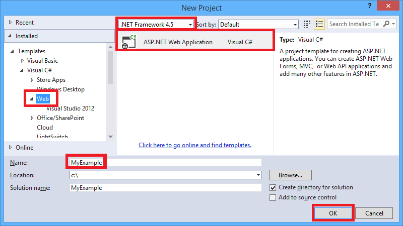
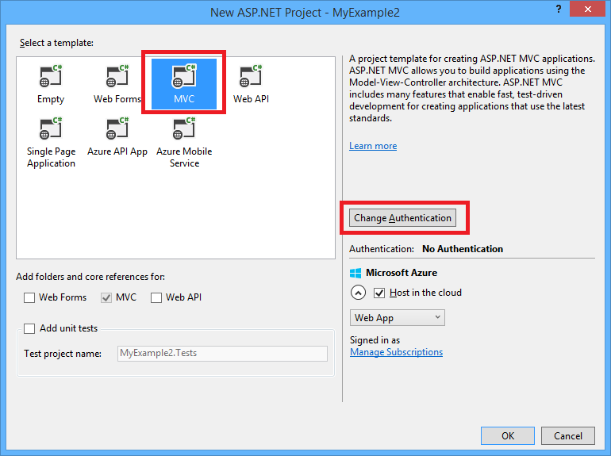
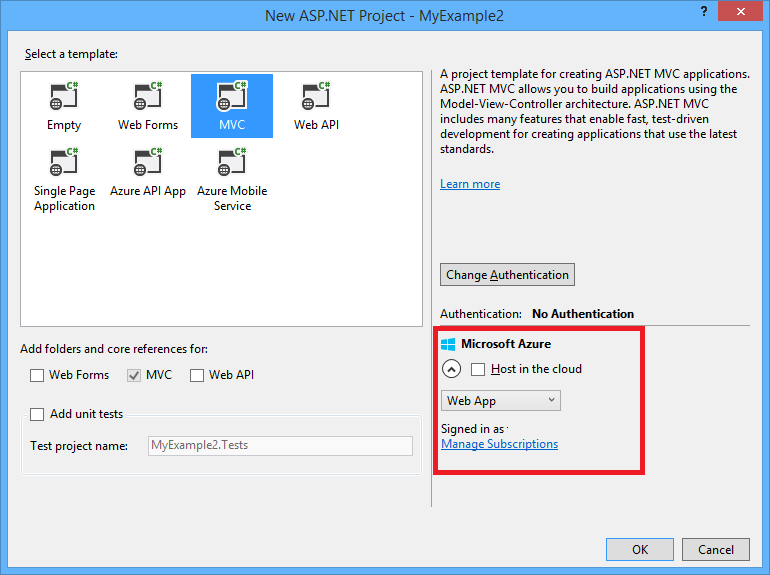
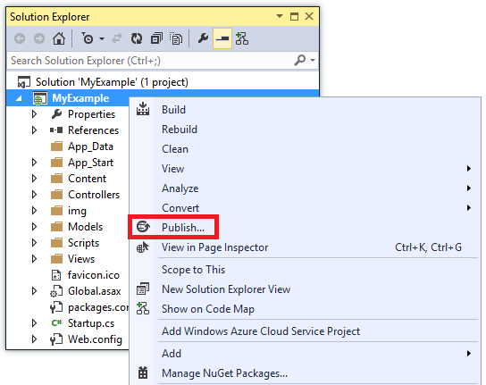
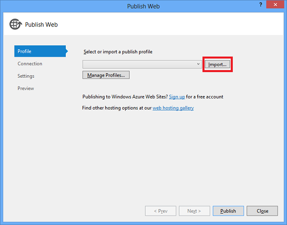
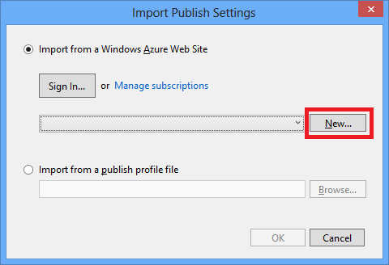
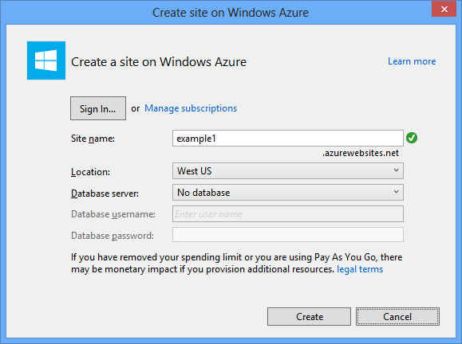
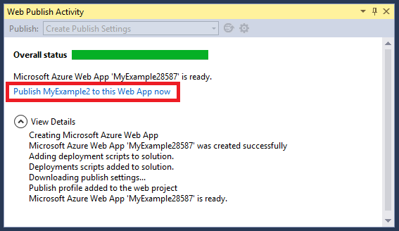
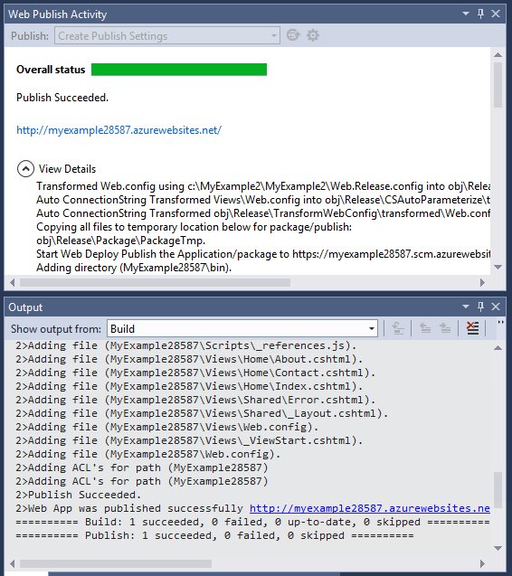
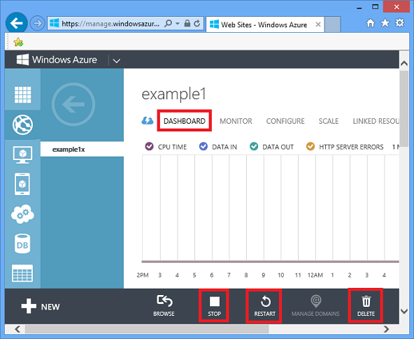

<properties linkid="develop-net-tutorials-get-started-vs2013" urlDisplayName="Windows Azure 入门" pageTitle="Windows Azure for .NET 入门" metaKeywords="" description="本教程说明如何使用 Visual Studio 2013 将 ASP.NET 网站部署到 Windows Azure。在不到 15 分钟内，您将有了在云中运行的应用程序。" metaCanonical="" services="web-sites" documentationCenter=".NET" title="Windows Azure 和 ASP.NET 入门" authors=""  solutions="" writer="tdykstra" manager="wpickett" editor="mollybos"  />

# Windows Azure 和 ASP.NET 入门

<a href="/zh-cn/develop/net/tutorials/get-started/" title="Visual Studio 2013" class="current">Visual Studio 2013</a><a href="/zh-cn/develop/net/tutorials/get-started-vs2012/" title="Visual Studio 2012">Visual Studio 2012</a>

本教程说明如何使用 Visual Studio 2013 或 Visual Studio 2013 for Web Express 中的“发布 Web”向导将 ASP.NET Web 应用程序部署到 Windows Azure 网站。（如果您喜欢使用 Visual Studio 2012，请参见[本教程的上一版本](/zh-cn/develop/net/tutorials/get-started-vs2012/)。）

您可以免费注册一个 Windows Azure 帐户，而且，如果您还没有 Visual Studio 2013，则此 SDK 会自动安装 Visual Studio 2013 for Web Express。这样您就能够完全免费地开始针对 Windows Azure 进行开发。

本教程假定您之前未使用过 Windows Azure。完成本教程之后，您将能够在云中启动并运行简单的 Web 应用程序。
 
您将了解到以下内容：

* 如何通过安装 Windows Azure SDK 来让您的计算机可以进行 Windows Azure 开发。
* 如何创建 Visual Studio ASP.NET MVC 5 项目并将其发布到 Windows Azure 网站。

下图演示了完整的应用程序：

<strong>注意</strong>
若要完成本教程，您需要一个 Windows Azure 帐户。如果您没有帐户，可以<!--a href="/zh-cn/pricing/member-offers/msdn-benefits-details/?WT.mc_id=A261C142F" target="_blank">激活 MSDN 订户权益</a--><a href="/pricing/1rmb-trial/" target="_blank">注册以获取试用版</a>。

 
### 教程章节

1. [设置开发环境](#setupdevenv)
3. [创建 ASP.NET MVC 5 应用程序](#createapp)
4. [将应用程序部署到 Windows Azure](#deploytowindowsazure)
5. [后续步骤](#nextsteps)

[WACOM.INCLUDE [install-sdk-2013-only](../includes/install-sdk-2013-only.md)]

<h2>创建应用程序创建 ASP.NET MVC 5 应用程序</h2>

第一步是创建要发布到 Windows Azure 的 Visual Studio Web 应用程序项目。

### 创建项目

1. 打开 Visual Studio 2013 或 Visual Studio 2013 Express for Web。

2. 从“文件”菜单，单击“新建项目”。

	

3. 在“新建项目”对话框中，展开 C# 并在“已安装的模板”下选择 Web，然后选择“ASP.NET Web 应用程序”。

3. 确保选择 .NET Framework 4.5 作为目标框架。

4. 将该应用程序命名为 MyExample，然后单击“确定”。

	

5. 在“新建 ASP.NET 项目”对话框中，选择 MVC 模板，然后单击“更改身份验证”。

	

6. 在“更改身份验证”对话框中，单击“无身份验证”，然后单击“确定”。

	

	您要创建的示例应用程序将没有需要用户登录的功能。有关如何实现身份验证和授权功能的信息，请参见本教程末尾的[后续步骤](#nextsteps)一节。

5. 在“新建 ASP.NET 项目”对话框中，单击“确定”。

	

### 在本地运行应用程序

1. 按 Ctrl+F5 运行应用程序。

	随后在默认浏览器中显示该应用程序主页。

	

	“http://localhost”URL 显示了应用程序正在您的本地计算机上运行。默认情况下，应用程序在 IIS Express 中运行。IIS Express 是 IIS 的轻型版本，专为在 Web 应用程序部署过程中使用而设计。

	以上是创建可部署到 Windows Azure 的简单应用程序所需执行的全部步骤。

<h2>部署应用程序将应用程序部署到 Windows Azure</h2>

1. 关闭浏览器。

5. 在 Visual Studio 中，在“解决方案资源管理器”中右键单击该项目，从上下文菜单中选择“发布”。

	

	“发布 Web”向导将打开。

6. 在“发布 Web”向导的“配置文件”选项卡中，单击“导入”。

	

	“导入发布配置文件”对话框随即出现。

5. 使用以下方法之一使 Visual Studio 能够连接到您的 Windows Azure 帐户。

	* 单击“登录”，然后输入您的 Windows Azure 帐户的凭据。

		此方法虽然又快又简单，但如果您使用此方法，将无法在“服务器资源管理器”窗口中看到 Windows Azure SQL数据库 或移动服务。

	* 单击“管理订阅”以便安装允许访问您帐户的管理证书。

		在“管理 Windows Azure 订阅”对话框中，单击“证书”选项卡，然后单击“导入”。按照说明为您的 Windows Azure 帐户下载并导入一个订阅文件（也称为 *.publishsettings* 文件）。

		> [WACOM.NOTE] 将此订阅文件下载到源代码目录之外的文件夹中（例如，在 Downloads 文件夹中），然后在导入完成后将其删除。获得了此订阅文件访问权的恶意用户可以编辑、创建和删除您的 Windows Azure 服务。

		有关更多信息，请参见[管理帐户、订阅和管理角色](http://go.microsoft.com/fwlink/?LinkId=324796#BKMK_AccountVCert)。

2. 在“导入发布设置”对话框中，选择“从 Windows Azure 网站导入”单选按钮，然后单击“新建”。

	

3. 在“在 Windows Azure 上创建网站”对话框中，在“网站名称”框中输入一个字符串作为您的应用程序的唯一 URL。

	完整的 URL 将包含您在此处输入的内容和您在文本框旁边看到的后缀。如果其他人已经使用您输入的 URL，您将看到右边是一个红色感叹号而不是绿色复选标记，您需要输入其他值。

4. 在“位置”下拉列表中，选择离您最近的位置。

	此设置指定您的网站将在哪个数据中心运行。

5. 让数据库字段保持不变。

	在本教程中，您将不使用数据库。本教程末尾的[后续步骤](#nextsteps)一节包含说明如何使用数据库的教程的链接。

6. 单击“创建”。 

	

	网站只需几秒就创建完成。当您返回到“导入发布设置”对话框时，将在下拉列表中选定新网站。

6. 单击“确定”。

	

8. 在“发布 Web”向导的“连接”选项卡中，单击“验证连接”以确保设置正确。

	

	在连接通过验证后，“验证连接”按钮旁边会出现一个绿色复选标记。

9. 单击“下一步”。

	

10. 在“设置”选项卡中，单击“下一步”。

	

	您可以接受此选项卡上的默认设置。您将要部署“发布”生成配置，因此不需要在目标服务器上删除文件、预编译应用程序或排除 App_Data 文件夹中的文件。

11. 在“预览”选项卡中，单击“开始预览”。

	

	该选项卡会显示将复制到服务器的文件的列表。显示预览并不是发布应用程序所必需的，但它是一个需要了解的很有用的功能。

12. 单击“发布”。

	

	Visual Studio 开始执行将文件复制到 Windows Azure 服务器的过程。

13. “输出”窗口将显示已执行的部署操作并报告已成功完成部署。

	

14. 成功完成部署后，默认浏览器会自动打开并指向已部署网站的 URL。

	您创建的应用程序现在在云中运行。

	

<h2>后续步骤后续步骤</h2>

在本教程中，您已了解如何将简单的 Web 应用程序部署到 Windows Azure 网站。还提供了其他资源，旨在向您说明如何管理和缩放网站并对网站进行故障排除，如何添加数据库、身份验证和授权功能以及如何决定是否应在 Windows Azure 云服务中而不是 Windows Azure 网站中运行您的应用程序。

<h3>如何管理网站</h3>
[Windows Azure 管理门户][Portal]是可用于管理和监视所有 Windows Azure 服务的 Web 界面。

您可以创建新网站、云服务、虚拟机和数据库等，可以从库中创建开放源应用程序。还可以管理已创建的服务。例如，以下屏幕快照显示了管理门户的“仪表板”选项卡中的 Windows Azure 网站的“停止”、“重新启动”和“删除”按钮。“仪表板”还显示了性能统计信息，如使用的 CPU 时间、请求数、传入和传出的数据以及可能已发生的任何错误。

可以在“配置”选项卡上更改很多其他网站设置。有关更多信息，请参见[如何管理网站](/documentation/articles/web-sites-manage/)。

您还可以从 Visual Studio 中的“服务器资源管理器”中执行一些网站管理功能。有关可在“服务器资源管理器”中执行的操作的信息，请参见[在 Visual Studio 中对 Windows Azure 网站进行故障排除](/zh-cn/develop/net/tutorials/troubleshoot-web-sites-in-visual-studio/)。

<h3>如何缩放网站</h3>
随着您的网站公开并开始获得更多流量，响应时间可能会增加。若要改善此情况，您可以轻松地在管理门户的“缩放”选项卡中添加服务器资源。有关更多信息，请参见[如何缩放网站](/documentation/articles/web-sites-scale/)。（通过添加服务器资源来缩放网站不是免费的。）

<h3>如何对网站进行故障排除</h3>
您可能需要查看跟踪或日志输出来寻求帮助以进行故障排除。Visual Studio 提供了内置工具，使您能够在 Windows Azure 日志生成时轻松实时查看这些日志。您还可以在 Windows Azure 中采用调试模式远程运行。有关更多信息，请参见[在 Visual Studio 中对 Windows Azure 网站进行故障排除](/zh-cn/develop/net/tutorials/troubleshoot-web-sites-in-visual-studio/)。

<h3>如何添加数据库和授权功能</h3>
大多数生产网站使用数据库并且只允许特定授权用户访问某些网站功能。有关说明如何开始使用数据库访问、身份验证和授权的教程，请参见[使用成员资格、OAuth 和 SQL数据库 将安全 ASP.NET MVC 应用程序部署到 Windows Azure 网站](/zh-cn/develop/net/tutorials/web-site-with-sql-database/)。

<h3>如何决定应用程序是否应在云服务中运行</h3>
在某些方案中，您可能需要在 Windows Azure 云服务中而不是 Windows Azure 网站中运行应用程序。有关更多信息，请参见 [Windows Azure 执行模型](/zh-cn/documentation/articles/fundamentals-application-models/)以及 [Windows Azure 网站、云服务和 VM：何时使用何种产品？](/zh-cn/documentation/articles/choose-web-site-cloud-service-vm/)。有关说明如何创建多层 ASP.NET Web 应用程序并将其部署到云服务的系列教程，请参见[使用存储表、队列和 Blob 的 .NET 多层应用程序](https://code.msdn.microsoft.com/Windows-Azure-Multi-Tier-eadceb36)。

[门户]: http://manage.windowsazure.cn

