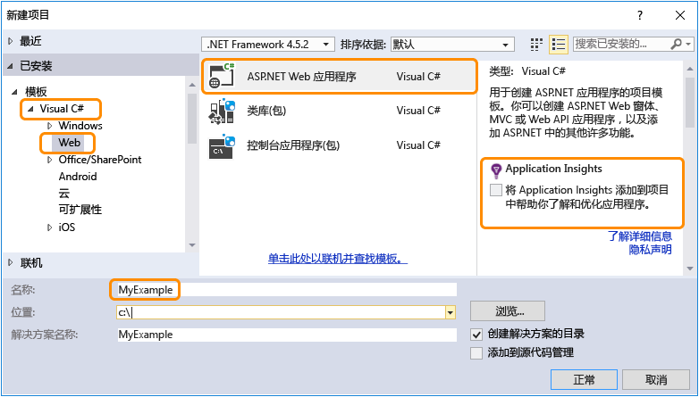
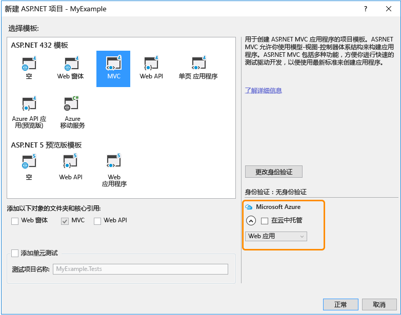
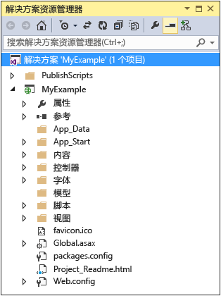
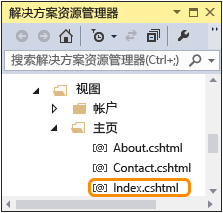
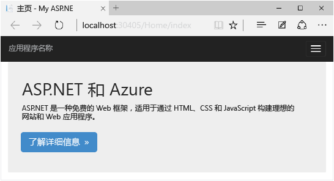
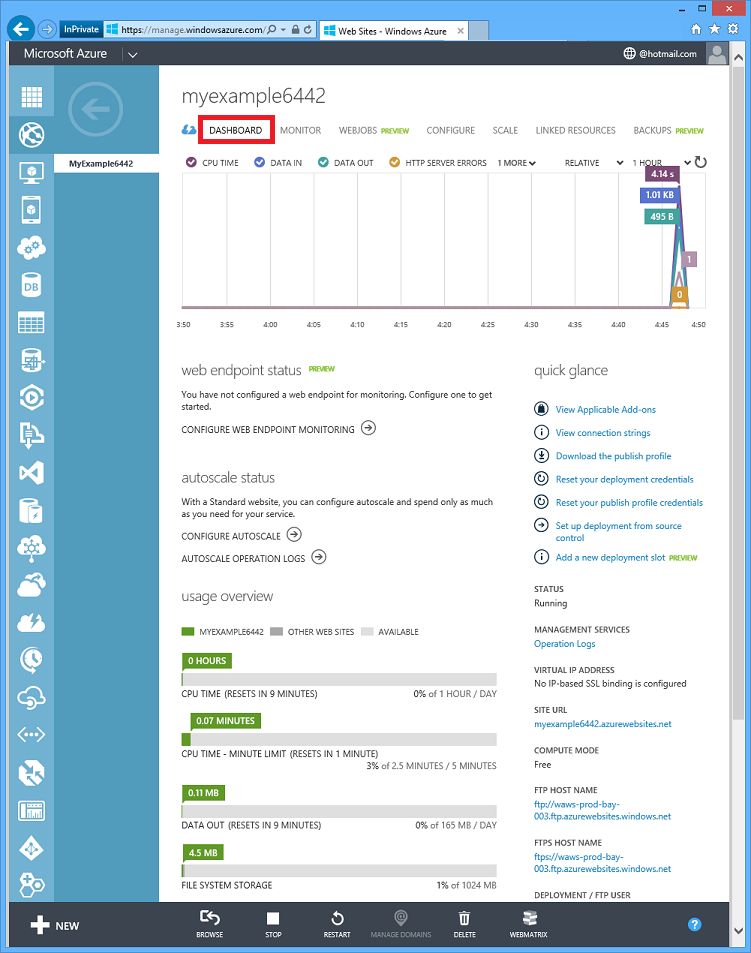
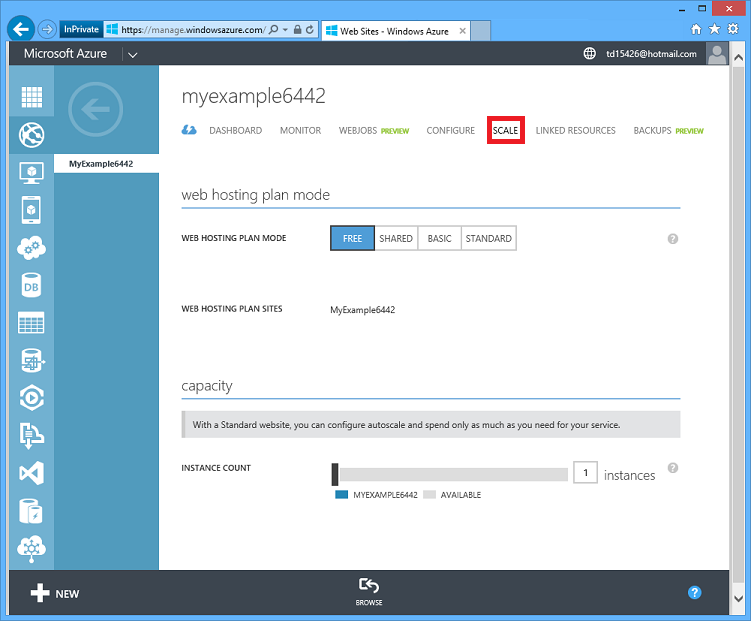

<properties
	pageTitle="在 Azure 中创建 ASP.NET Web 应用 | Microsoft Azure"
	description="本教程说明如何在 Visual Studio 2013 中创建一个 ASP.NET Web 项目，并将其部署到 Azure 中的 Web 应用。"
	services="app-service\web"
	documentationCenter=".net"
	authors="tdykstra"
	manager="wpickett"
	editor="jimbe"/>

<tags
	ms.service="web-sites"
	ms.date="12/07/2015"
	wacn.date="01/21/2016"/>

# 在 Azure 中创建 ASP.NET Web 应用

> [AZURE.SELECTOR]
- [.Net](/documentation/articles/web-sites-dotnet-get-started)
- [Node.js](/documentation/articles/web-sites-nodejs-develop-deploy-mac)
- [Java](/documentation/articles/web-sites-java-get-started)
- [PHP - Git](/documentation/articles/web-sites-php-mysql-deploy-use-git)
- [PHP - FTP](/documentation/articles/web-sites-php-mysql-deploy-use-ftp)
- [Python](/documentation/articles/web-sites-python-ptvs-django-mysql)

## 概述

本教程将向你介绍如何使用 Visual Studio 2015 或 Visual Studio 2013 将 ASP.NET Web 应用部署到 [Azure 中](/home/features/web-site/)。本教程假定你是此前没有 Azure 使用经验的 ASP.NET 开发人员。完成本教程之后，你将能够在云中启动并运行简单的 Web 应用。

下图演示了完整的应用程序：

学习内容：

* 如何通过安装 [Azure SDK for .NET](/documentation/articles/dotnet-sdk) 对你的计算机进行 Azure 开发准备。
* 如何设置 Visual Studio，以便在其创建 ASP.NET MVC 5 Web 项目时创建新的 Azure Web 应用。
* 如何使用 Visual Studio 将 Web 项目部署到 Azure Web 应用。
* 如何使用 Visual Studio **服务器资源管理器**来打开远程文件和启动远程调试会话。 
* 如何使用 [Azure 管理门户](https://manage.windowsazure.cn)监视和管理 Web 应用。

> [AZURE.NOTE]本教程是关于如何将 ASP.NET 用于 Azure Web 应用的，不讲述如何开发 ASP.NET Web 应用。如需 ASP.NET MVC 5 简介，请参阅 [ASP.NET](http://asp.net/) 站点上的 [ASP.NET MVC 5 入门](http://www.asp.net/mvc/overview/getting-started/introduction/getting-started)。如需更详细讲述如何使用 Azure Web 应用的其他文章的链接，请参阅[后续步骤](#next-steps)部分。

##注册 Microsoft Azure

完成本教程需要有一个 Azure 帐户。你可以：

* [一元注册 Azure 帐户](/pricing/1rmb-trial/?WT.mc_id=A261C142F)。获取可用来尝试付费版 Azure 服务的信用额度。即使在信用额度用完之后，你也可以保留该帐户，使用那些免费的 Azure 服务和功能，例如 Azure 中的 Web 应用功能。

[AZURE.INCLUDE [install-sdk-2015-2013](../includes/install-sdk-2015-2013.md)]

## 创建项目和 Web 应用

第一步是在 Visual Studio 中创建一个 Web 项目，并在 Azure 中创建一个 Web 应用。完成时，将项目部署到 Web 应用，以使其在 Internet 上可用。

下图演示了在创建和部署步骤中要执行的操作。

1. 打开 Visual Studio 2015 或 Visual Studio 2013。

	如果你使用 Visual Studio 2013，屏幕与屏幕截图稍有不同，但过程基本上相同。

2. 在“文件”菜单中，单击“新建”>“项目”。

3. 在“新建项目”对话框中，单击“C#”>“Web”>“ASP.NET Web 应用”。如果需要，可以选择“Visual Basic”。

3. 确保选择 **.NET Framework 4.5.2** 作为目标框架。

4. 将应用程序命名为 **MyExample**。

5. 单击**“确定”**。

	

5. 在“新建 ASP.NET 项目”对话框中，选择“MVC”模板。

	[MVC](http://www.asp.net/mvc) 是用于开发 Web 应用的 ASP.NET 框架。

5. 在“新建 ASP.NET 项目”对话框中，确保不要勾选“在云中的托管”，然后单击“确定”。

	

	Microsoft Azure 中国暂时还不支持在 Visual Studio 中直接创建云中的 Web 应用，所以用户需要在“[管理门户](https://manage.windowsazure.cn/)”中新建 Azure Web 应用。

	“解决方案资源管理器”窗口将显示新项目中的文件和文件夹。

	

## 将应用程序部署到 Azure

1. 在“[管理门户](https://manage.windowsazure.cn/)”中新建 Azure Web 应用。

2. 点击新建 Web 应用的“仪表盘”，在“速览”里下载发布配置文件

7. 在 Visual Studio 中右键点击你的项目，点击“发布”。

	

	几秒钟后，将显示“发布 Web”向导。

4. 在“配置文件”，点击“导入”，并选择刚刚下载的发布配置文件。

8. 在“发布 Web”向导的“连接”选项卡中，单击“验证连接”，以确保 Visual Studio 可以连接到 Azure 来部署 Web 项目。

	

	在连接通过验证后，“验证连接”按钮旁边会出现一个绿色复选标记。

9. 单击**“下一步”**。

	

10. 在“设置”选项卡中，单击“下一步”。

	你可以接受“配置”和“文件发布选项”的默认值。

	你可以通过“配置”下拉列表部署用于远程调试的调试版本。[后续步骤](#next-steps)部分链接到了说明如何在调试模式下远程运行 Visual Studio 的教程。

	

11. 在“预览”选项卡中，单击“发布”。

	如果你想要查看哪些文件将复制到 Azure，可以单击“开始预览”，然后单击“发布”。

	

	单击“发布”后，Visual Studio 开始执行将文件复制到 Azure 服务器的过程。

	“输出”和“Azure Web 应用活动”窗口将显示已执行的部署操作并报告已成功完成部署。

	

	成功完成部署后，默认浏览器将自动打开指向已部署 Web 应用的 URL。你创建的应用程序现在运行于云中。浏览器地址栏中的 URL 显示正在从 Internet 加载该 Web 应用。

	

13. 让此浏览器窗口保持打开状态，以便在下一部分使用。

## 更改和重新部署

本教程的此部分是可选的。要执行的操作包括更改主页的 **h1** 标题，在开发计算机上本地运行项目以验证更改，然后将更改部署到 Azure。

2. 在“解决方案资源管理器”中打开 *Views/Home/Index.cshtml* 或 *.vbhtml* 文件，将 **h1** 标题从“ASP.NET”更改为“ASP.NET 和 Azure”，然后保存该文件。

	

	

1. 按 CTRL+F5，通过在本地计算机上运行 Web 应用来查看更新的标题。

	

	`localhost` URL 显示站点正在本地计算机上运行。默认情况下，应用程序在 IIS Express 中运行。IIS Express 是 IIS 的轻型版本，专为在 Web 应用部署过程中使用而设计。

1. 关闭浏览器。

1. 在“解决方案资源管理器”中，右键单击该项目并选择“发布”。

	

	此时将显示“发布 Web”向导的“预览”选项卡。如果需要更改任何发布设置，你可以选择其他选项卡，但现在你要做的无非就是重新部署相同的设置。

2. 在“发布 Web”向导中，单击“发布”。

	

	Visual Studio 将项目部署到 Azure，并在默认浏览器中打开该 Web 应用。

	

**提示**：可以启用“Web 单键发布”工具栏以更快地完成部署。单击“视图”\>“工具栏”，然后选择“Web 单键发布”。在工具栏上，你可以选择一个配置文件，单击一个按钮以发布，或单击一个按钮打开“发布 Web”向导。

## 在 Azure 管理门户中监视和管理 Web 应用

[Azure 管理门户](http://manage.windowsazure.cn)是一个 Web 界面，可用于管理和监视 Azure 服务，例如刚刚创建的 Web 应用。在本教程的本部分，你将了解可在该门户中执行的某些操作。

1. 在浏览器中，转到 [https://manage.windowsazure.cn](https://manage.windowsazure.cn)，然后使用你的 Azure 凭据登录。

	门户将显示你的 Azure 服务的列表。

2. 单击你的 Web 应用的名称。

	
  
3. 单击“仪表板”选项卡。

	“仪表板”选项卡显示使用统计信息的概述，以及许多常用站点管理功能的链接。在“速览”下，还可以找到应用程序主页的链接。

	
  
	此时，站点没有过多的通信，因此可能不会在图形中显示任何内容。如果浏览到应用程序，刷新页面几次，然后刷新门户“仪表板”页的话，你将会看到显示了一些统计信息。单击“监视”选项卡可查看更多详细信息。

4. 单击“配置”选项卡。

	“配置”选项卡可让你控制用于站点的 .NET 版本、启用 [WebSockets](/blog/2013/11/14/introduction-to-websockets-on-windows-azure-web-sites/) 和[诊断日志记录](/documentation/articles/web-sites-enable-diagnostic-log)等功能、设置[连接字符串值](http://azure.microsoft.com/zh-cn/blog/2013/07/17/windows-azure-web-sites-how-application-strings-and-connection-strings-work/)，等等。

	
  
5. 单击“缩放”选项卡。

	对于 Web 应用服务的付费层，“缩放”选项卡允许你控制为 Web 应用提供服务的计算机的大小和数量，以处理流量的变化。

	你可以手动缩放或配置条件或计划以进行自动缩放。

	

这只是门户的一部分功能。你还可以创建新 Web 应用、删除现有 Web 应用、停止和重新启动 Web 应用，以及管理其他类型的 Azure 服务，如数据库和虚拟机。

## 后续步骤

在本教程中，你已了解如何创建简单的 Web 应用并将其部署到 Azure Web 应用。你可以通过以下相关主题和资源来了解有关 Azure 中 Web 应用的详细信息。

* 如何添加数据库和授权功能

	有关说明如何访问数据库以及将某些应用程序功能限制给已授权用户的教程，请参阅[将包含成员资格、OAuth 和 SQL 数据库的安全 ASP.NET MVC 应用程序部署到 Azure Web 应用](/documentation/articles/web-sites-dotnet-deploy-aspnet-mvc-app-membership-oauth-sql-database/)。该教程假定你对 MVC 5 有一定程度的了解；如果你一点都不了解 MVC 5，请参阅 [ASP.NET MVC 5 入门](http://www.asp.net/mvc/overview/getting-started/introduction/getting-started)。

* 部署 Web 项目的其他方法

	有关通过 Visual Studio 或通过[源代码管理系统](http://www.asp.net/aspnet/overview/developing-apps-with-windows-azure/building-real-world-cloud-apps-with-windows-azure/source-control)的[自动部署](http://www.asp.net/aspnet/overview/developing-apps-with-windows-azure/building-real-world-cloud-apps-with-windows-azure/continuous-integration-and-continuous-delivery)功能以其他方式将 Web 项目部署到 Web 应用的信息，请参阅[如何部署 Azure Web 应用](/documentation/articles/web-sites-deploy)。

	Visual Studio 还可以生成适用于自动完成部署的 Windows PowerShell 脚本。有关详细信息，请参阅[使一切自动化（使用 Azure 生成真实的云应用）](http://www.asp.net/aspnet/overview/developing-apps-with-windows-azure/building-real-world-cloud-apps-with-windows-azure/automate-everything)。

* 如何对 Web 应用进行故障排除

	Visual Studio 提供了相应的功能使你能够在 Azure 日志生成时轻松实时地对其进行查看。你还可以在 Azure 中采用调试模式远程运行。有关详细信息，请参阅[在 Visual Studio 中对 Azure Web 应用进行故障排除](/documentation/articles/web-sites-dotnet-troubleshoot-visual-studio)。

* 如何添加自定义域名和 SSL

	有关如何使用 SSL 和你自己的域（例如 www.contoso.com 而不是 contoso.chinacloudsites.cn）的信息，请参阅以下资源：

	* [在 Azure 中配置自定义域名](/documentation/articles/web-sites-custom-domain-name)
	* [为 Azure Web 应用启用 HTTPS](/documentation/articles/web-sites-configure-ssl-certificate)

* 如何添加聊天之类的实时功能

	如果要在 Web 应用中包含实时功能（如聊天服务、游戏或股票行情），你可以使用 [ASP.NET SignalR](http://www.asp.net/signalr) 和 [WebSockets](/blog/2013/11/14/introduction-to-websockets-on-windows-azure-web-sites/) 传输方法来获得最佳性能。有关详细信息，请参阅[将 SignalR 与 Azure Web 应用配合使用](http://www.asp.net/signalr/overview/signalr-20/getting-started-with-signalr-20/using-signalr-with-windows-azure-web-sites)。

* 如何针对网站在 Azure 网站、Azure 云服务和 Azure 虚拟机之间做出选择

* 如何针对 Web 应用在 Azure Web 应用、Azure 云服务和 Azure 虚拟机之间做出选择

	在 Azure 中，你可以根据本教程中所述在 Azure 中运行 Web 应用，也可以在云服务或虚拟机中运行 Web 应用。有关详细信息，请参阅 [Azure Web 应用、云服务和 VM：何时使用何种产品？](/documentation/articles/choose-web-site-cloud-service-vm/)。

<!---HONumber=Mooncake_1207_2015-->